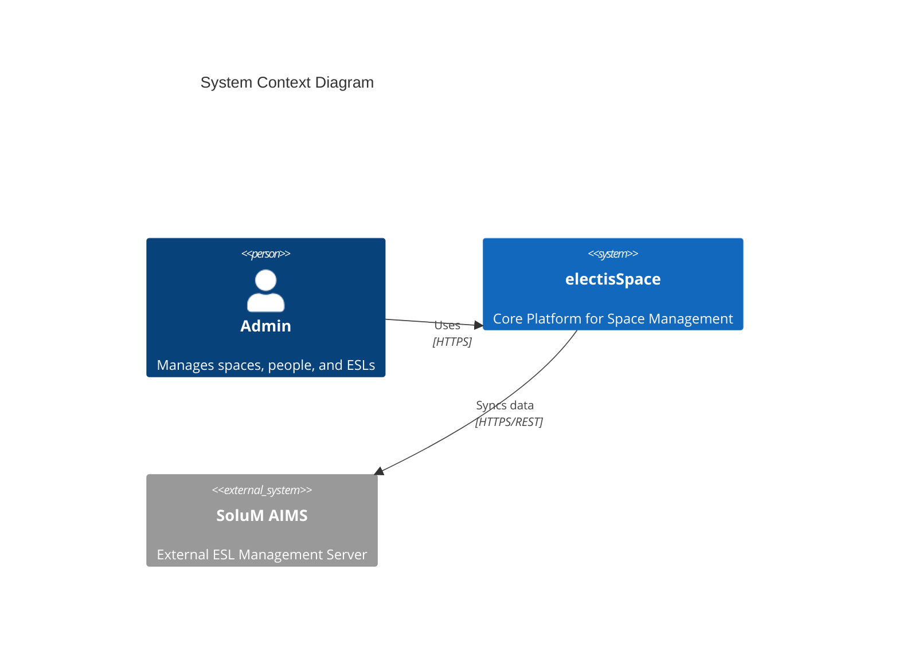

# System Architecture

## 1. System Context

ElectisSpace is a management platform for electis that integrates with SoluM AIMS (Electronic Shelf Labels) to manage Spaces, People, and Conference Rooms.



## 2. Container Architecture

The system consists of a Frontend SPA (Single Page Application) and a Backend API Server.

```mermaid
graph TD
    Client[Browser (React SPA)]
    Server[Node.js / Express Server]
    DB[(PostgreSQL)]
    Redis[(Redis Cache/Queue)]
    SoluM[SoluM AIMS API]

    Client -- HTTPS/JSON --> Server
    Server -- Prisma --> DB
    Server -- IORedis --> Redis
    Server -- HTTPS --> SoluM
```

### 2.1. Frontend (Client)
- **Tech**: React, TypeScript, Vite, TailwindCSS, Zustand.
- **Responsibility**: UI rendering, User interaction, Local state management.
- **Key Features**: 
    - **Space Management**: Visual layout of spaces.
    - **People**: Directory and assignment.
    - **Conference**: Meeting room status control.
    - **Settings**: Configuration of SoluM credentials.

### 2.2. Backend (Server)
- **Tech**: Node.js, Express, TypeScript, Prisma.
- **Responsibility**: API, Auth, Data persistence, Sync coordination.
- **Key Modules**:
    - **Auth**: JWT based authentication.
    - **Sync**: Coordination of data between Local DB and SoluM.
    - **SoluM Service**: Encapsulated logic for AIMS communication.
    - **Health**: Probes for system availability.

## 3. Server Component Design

The server is organized by "Features".

| Feature | Description | Key Files |
|---------|-------------|-----------|
| **Sync** | Orchestrates synchronization jobs. | `features/sync/routes.ts` |
| **Health** | Observability probes. | `features/health/routes.ts` |
| **SoluM** | Shared infrastructure service. | `shared/infrastructure/services/solumService.ts` |
| **Auth** | User authentication. | `features/auth/` |

### 3.1. SoluM Integration
The `SolumService` class (`server/src/shared/infrastructure/services/solumService.ts`) is the gateway to AIMS.
- **Authentication**: Handles Login and Token Refresh.
- **CRUD**: Fetches and Pushes articles (ESLs).
- **Health**: Verifies connectivity.

## 4. Workflows

### 4.1. Sync Workflow
1. User triggers Sync via `/api/sync/trigger` (or scheduled).
2. Server fetches Organization Config (decrypted).
3. Server logs into SoluM AIMS.
4. Server fetches Articles.
5. Server updates PostgreSQL database.
6. Server updates Sync Queue status.

### 4.2. Health Check
- `/health/ready` -> Checks:
    - DB connection (Select 1).
    - Redis (Ping).
    - SoluM (Config check / Ping).
