# electisSpace Architecture Book

> **Version:** 2.3.0
> **Last updated:** 2026-02-22
> **Audience:** Senior engineers, DevOps, technical onboarding
> **Maintainer:** Aviv Ben Waiss &lt;aviv@electis.co.il&gt;

---

## Table of Contents

1. [Chapter 1 -- System Overview & Philosophy](#chapter-1----system-overview--philosophy)
2. [Chapter 2 -- Data Architecture](#chapter-2----data-architecture)
3. [Chapter 3 -- Server Architecture](#chapter-3----server-architecture)
4. [Chapter 4 -- Client Architecture](#chapter-4----client-architecture)
5. [Chapter 5 -- Integration & Synchronization](#chapter-5----integration--synchronization)
6. [Chapter 6 -- Infrastructure & Deployment](#chapter-6----infrastructure--deployment)
7. [Chapter 7 -- Security, Auth & Access Control](#chapter-7----security-auth--access-control)

---

## Chapter 1 -- System Overview & Philosophy

### 1.1 Business Context

electisSpace is a B2B SaaS platform for Electronic Shelf Label (ESL) management via the SoluM AIMS platform. It serves organizations that manage physical spaces (rooms, desks, chairs), people assignments, and conference rooms, all synchronized to physical e-ink labels through the SoluM AIMS API.

The platform supports two primary working modes:

- **Spaces Mode** -- Manages physical spaces (desks, rooms, chairs) with labels displaying space-related data.
- **People Manager Mode** -- Manages people assignments to numbered slots, with labels displaying person-related data.

### 1.2 Core Tech Stack

| Layer | Technology | Version |
|-------|-----------|---------|
| Frontend Framework | React | 19.2 |
| Language | TypeScript | 5.9 |
| Build Tool | Vite (rolldown-vite) | 7.2 |
| UI Library | MUI (Material UI) | 7.3 |
| State Management | Zustand | 5.0 |
| Routing | React Router | 7.10 |
| Backend Runtime | Node.js | >= 20.0 |
| Backend Framework | Express | 4.21 |
| ORM | Prisma | 7.0 |
| Database | PostgreSQL | -- |
| Cache | Redis | 7 (Alpine) |
| Job Queue | Custom (Prisma-backed) | -- |
| Mobile | Capacitor (Android) | 7.4 |
| Desktop | Electron | 39.x |
| Containerization | Docker (multi-stage) | -- |
| Reverse Proxy | Nginx | Alpine |

### 1.3 High-Level Architecture

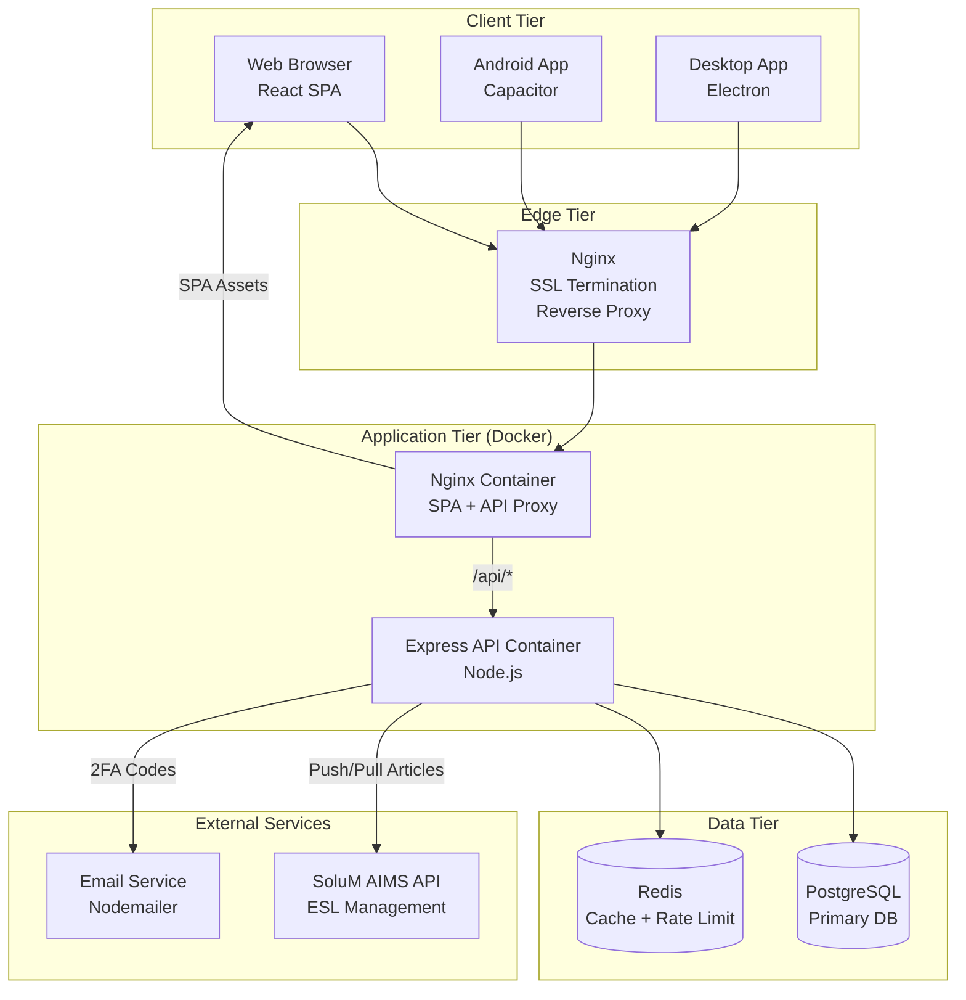

### 1.4 Design Principles

1. **Server-as-Source-of-Truth** -- The server database is authoritative. AIMS is kept in sync, not the other way around.
2. **Feature-Based Architecture** -- Both client and server are organized by business domain (spaces, people, conference, auth, sync, etc.), not by technical layer.
3. **Clean Architecture Layers** (client) -- Each feature follows `domain/ -> application/ -> infrastructure/ -> presentation/`.
4. **Multi-Tenant by Design** -- Company -> Store hierarchy with fine-grained role-based access control.
5. **Graceful Degradation** -- Redis failures are non-fatal (cache misses, no-op writes). AIMS sync failures are retried with exponential backoff.
6. **Singleton Services** -- Key server services (SSE Manager, AIMS Gateway, Sync Queue) use the singleton pattern for consistent state.

### 1.5 Repository Structure

```
electisSpace/
  ├── src/                      # Frontend (React SPA)
  │   ├── features/             # Feature modules (auth, space, people, conference, ...)
  │   ├── shared/               # Shared code (services, stores, components, hooks)
  │   ├── locales/              # i18n translations (en, he)
  │   ├── i18n/                 # i18n configuration
  │   ├── App.tsx               # Root component
  │   ├── AppRoutes.tsx         # Route definitions
  │   └── theme.ts              # MUI theme configuration
  ├── server/                   # Backend (Express API)
  │   ├── src/
  │   │   ├── features/         # Feature modules (same domain split)
  │   │   ├── shared/           # Middleware, services, infrastructure
  │   │   ├── config/           # Environment, database, Redis config
  │   │   ├── app.ts            # Express app setup
  │   │   └── server.ts         # Entry point, lifecycle, background jobs
  │   ├── prisma/               # Prisma schema and migrations
  │   └── Dockerfile            # Server container build
  ├── client/                   # Client container config
  │   ├── Dockerfile            # SPA + Nginx build
  │   └── nginx.conf            # Internal Nginx config
  ├── electron/                 # Electron desktop wrapper
  ├── android/                  # Capacitor Android project
  ├── deploy/                   # Deployment configs and env files
  ├── docker-compose.app.yml    # Application containers
  ├── docker-compose.infra.yml  # Infrastructure containers (Redis)
  ├── e2e/                      # Playwright E2E tests
  └── docs/                     # Documentation
```

---

## Chapter 2 -- Data Architecture

### 2.1 Entity-Relationship Model

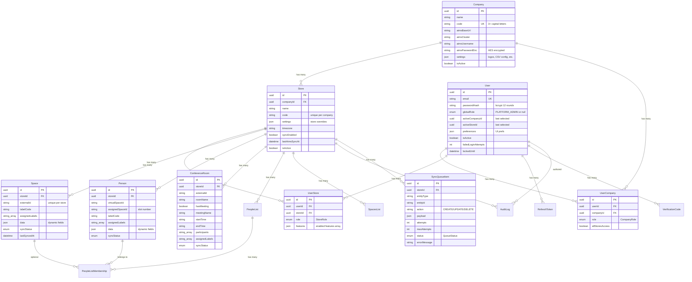

### 2.2 Multi-Tenancy Model

The system implements a two-level multi-tenancy hierarchy:

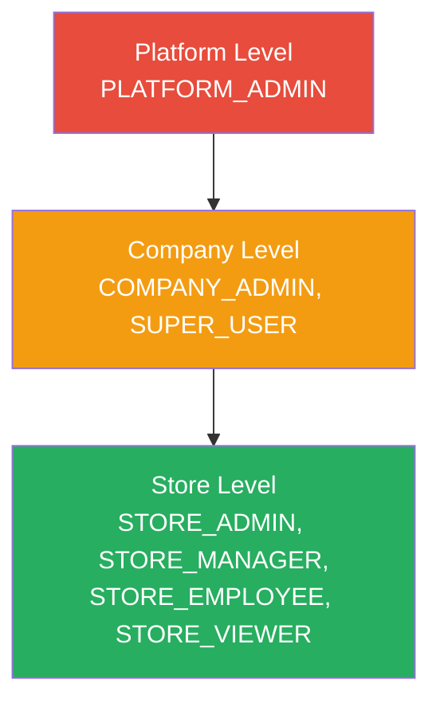

**Company** is the top-level tenant. Each company:
- Has its own AIMS API credentials (base URL, cluster, username, encrypted password).
- Stores company-wide settings as JSON (logos, CSV import config, SoluM field mappings, people manager config).
- Can have multiple Stores.

**Store** is the operational unit within a company:
- Maps to a SoluM AIMS store number.
- Has store-specific settings that can override company defaults.
- All domain entities (spaces, people, conference rooms) are scoped to a store.
- Has its own sync queue and sync state.

**User access** is managed through two junction tables:
- `UserCompany` -- grants company-level access with a `CompanyRole` and an `allStoresAccess` flag.
- `UserStore` -- grants store-level access with a `StoreRole` and a feature-permissions JSON array.

### 2.3 Dynamic Data Pattern

Spaces, People, and Conference Rooms use a **dynamic data** pattern via a `data Json` column. This allows each company to define its own custom fields (e.g., department, floor, extension) without schema changes. The field definitions and display mappings are stored in the company's `settings` JSON.

When syncing to AIMS, the `data` JSON fields are mapped to AIMS article data fields using the company's `solumArticleFormat` (fetched from AIMS) and `solumMappingConfig` (user-configured).

### 2.4 Sync Status State Machine

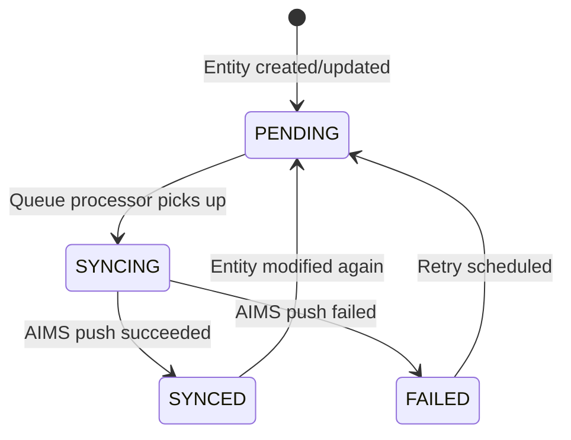

### 2.5 Queue Status State Machine

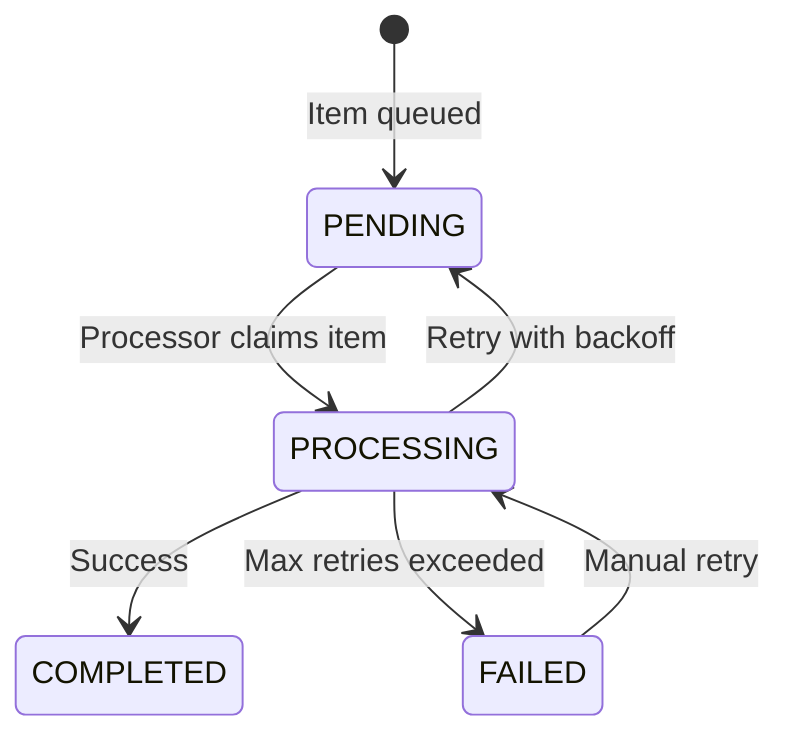

### 2.6 Key Database Indexes

| Table | Index | Purpose |
|-------|-------|---------|
| `stores` | `(companyId)` | Fast store lookup by company |
| `stores` | `(companyId, code)` UNIQUE | Unique store code per company |
| `spaces` | `(storeId, externalId)` UNIQUE | Unique space per store |
| `spaces` | `(storeId)`, `(labelCode)` | Query performance |
| `people` | `(storeId)`, `(assignedSpaceId)`, `(externalId)`, `(virtualSpaceId)` | Multi-path lookup |
| `sync_queue` | `(status, scheduledAt)` | Efficient pending item fetch |
| `audit_logs` | `(entityType, entityId)`, `(createdAt)` | Audit trail queries |
| `refresh_tokens` | `(tokenHash)`, `(userId)` | Fast token validation |
| `verification_codes` | `(userId, type, used)`, `(code)` | 2FA lookup |

---

## Chapter 3 -- Server Architecture

### 3.1 Server Entry Point & Lifecycle

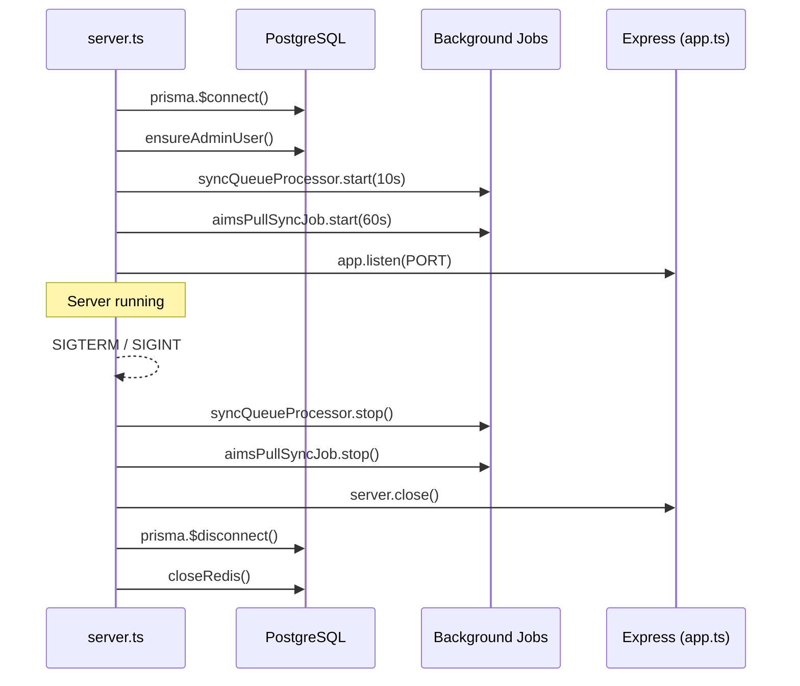

The server starts by connecting to PostgreSQL, ensuring the admin user exists (from env vars), starting two background jobs, and then listening for HTTP connections. Graceful shutdown reverses this order with a 10-second force-kill timeout.

### 3.2 Express Middleware Pipeline

```mermaid
graph LR
    REQ[Incoming Request] --> TRUSTPROXY[Trust Proxy]
    TRUSTPROXY --> REQID[Request ID]
    REQID --> HELMET[Helmet<br/>CSP + Security]
    HELMET --> CORS[CORS]
    CORS --> BODYPARSE[Body Parser<br/>JSON 10MB limit]
    BODYPARSE --> COOKIE[Cookie Parser]
    COOKIE --> COMPRESS[Compression<br/>SSE excluded]
    COMPRESS --> MORGAN[Morgan Logger]
    MORGAN --> RATELIMIT[Rate Limiter<br/>100/min]
    RATELIMIT --> ROUTES[API Routes]
    ROUTES --> NOTFOUND[404 Handler]
    NOTFOUND --> ERROR[Error Handler]
```

Key middleware decisions:
- **Compression** explicitly excludes `text/event-stream` responses to avoid SSE buffering.
- **Rate limiting** applies globally at 100 requests per minute per IP, with additional per-endpoint limiters on auth routes.
- **Request IDs** are generated and logged for cross-service correlation.

### 3.3 Feature Module Pattern (Server)

Each server feature follows a consistent five-file pattern:

```
server/src/features/{feature}/
  ├── routes.ts       # Route definitions with middleware
  ├── controller.ts   # HTTP request/response handling
  ├── service.ts      # Business logic
  ├── repository.ts   # Data access (Prisma queries)
  ├── types.ts        # TypeScript interfaces
  └── index.ts        # Barrel exports
```

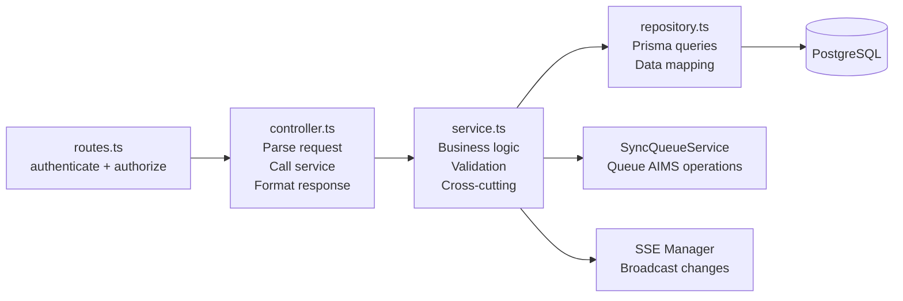

### 3.4 API Route Map

All routes are versioned under `/api/v1/`:

| Prefix | Feature | Auth | Key Endpoints |
|--------|---------|------|--------------|
| `/auth` | Authentication | Partial | `POST /login`, `POST /verify-2fa`, `POST /refresh`, `GET /me` |
| `/users` | User Management | Yes | CRUD, role assignment |
| `/companies` | Company Management | Yes | CRUD, AIMS credential config |
| `/` (root) | Store Management | Yes | CRUD on stores, context switching |
| `/spaces` | Space Management | Yes | CRUD, label assignment, force sync |
| `/people` | People Management | Yes | CRUD, import, assignment |
| `/conference` | Conference Rooms | Yes | CRUD, meeting toggle |
| `/settings` | Settings | Yes | Read/update company & store settings |
| `/labels` | Label Management | Yes | List, link/unlink, blink, image push |
| `/sync` | Synchronization | Yes | Pull, push, full sync, queue management |
| `/people-lists` | People Lists | Yes | CRUD, membership management |
| `/spaces-lists` | Spaces Lists | Yes | CRUD, snapshot content |
| `/admin` | Platform Admin | PLATFORM_ADMIN | User management, system operations |
| `/health` | Health Check | No | Server status |
| `/stores/:storeId/events` | SSE | Yes | Real-time event stream |

### 3.5 Shared Infrastructure Services

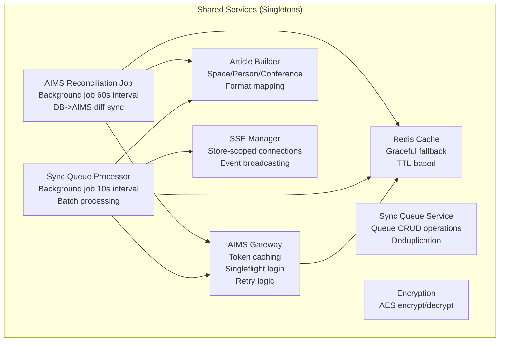

#### AIMS Gateway (`aimsGateway.ts`)

The gateway manages all communication with the SoluM AIMS API:

- **Credential Management** -- Retrieves and decrypts AIMS credentials from the Company record.
- **Token Caching** -- In-memory token cache per company with 5-minute expiry buffer.
- **Singleflight Pattern** -- Prevents concurrent duplicate login requests for the same company.
- **Retry Logic** -- Exponential backoff with jitter for transient failures (429, 5xx).
- **Article Format Caching** -- Three-tier cache: in-memory (30min) -> DB (Company.settings) -> AIMS live fetch.
- **Batch Operations** -- Handles batching (max 500 articles per AIMS POST request).
- **Auto-retry on Auth Errors** -- Invalidates cached token and retries once on 401/403.

#### Sync Queue Processor (`SyncQueueProcessor.ts`)

Runs every 10 seconds as a background job:

1. Atomically claims pending items older than 5 seconds (prevents double-processing).
2. Groups items by store for batch efficiency.
3. Builds AIMS articles using the Article Builder.
4. Pushes/deletes articles via the AIMS Gateway.
5. Updates entity sync status (PENDING -> SYNCED or FAILED).
6. Retries failed items with exponential backoff (1s base, 60s max, 5 max attempts).
7. Broadcasts SSE events to notify connected clients.

#### AIMS Reconciliation Job (`AimsPullSyncJob.ts`)

Runs every 60 seconds as a background job (15-second initial delay):

1. Identifies all active stores with configured AIMS credentials.
2. Builds the expected article set from the database (mode-aware: spaces vs. people).
3. Fetches current articles from AIMS.
4. Diffs expected vs. actual: pushes missing/changed, deletes extras.
5. Syncs `assignedLabels` from AIMS article info endpoint back to the DB.
6. Performs post-sync validation (informational logging only).

#### SSE Manager (`SseManager.ts`)

Manages Server-Sent Events connections per store:

- **Connection Limits** -- 500 total, 50 per store.
- **Store-Scoped Broadcasting** -- Events are sent only to clients connected to the affected store.
- **Originator Exclusion** -- The client that triggered a change can be excluded from the broadcast.
- **Keep-Alive** -- 30-second ping to prevent connection timeout.
- **Event Types**: `people:changed`, `list:loaded`, `list:freed`, `list:updated`, `conference:changed`.

### 3.6 Configuration & Environment

Environment variables are validated at startup using Zod schemas (`config/env.ts`). The server fails fast on invalid configuration.

Key configuration categories:

| Category | Variables | Notes |
|----------|----------|-------|
| Server | `NODE_ENV`, `PORT`, `API_VERSION` | Defaults: development, 3000, v1 |
| Database | `DATABASE_URL`, `DB_POOL_MAX` | PostgreSQL connection string |
| Redis | `REDIS_URL` | Default: localhost:6379 |
| JWT | `JWT_ACCESS_SECRET`, `JWT_REFRESH_SECRET`, expiry times | 32+ char secrets |
| Encryption | `ENCRYPTION_KEY` | 32+ chars, for AIMS password encryption |
| CORS | `CORS_ORIGINS` | Comma-separated origins |
| Rate Limiting | Global + auth-specific configs | Separate limits for login, 2FA, password reset |
| Admin | `ADMIN_EMAIL`, `ADMIN_PASSWORD` | Auto-created on startup |

Docker-aware loading: if `DATABASE_URL` is already set as an OS env var (Docker), `.env` files are loaded without overriding Docker-injected variables.

---

## Chapter 4 -- Client Architecture

### 4.1 Application Bootstrap

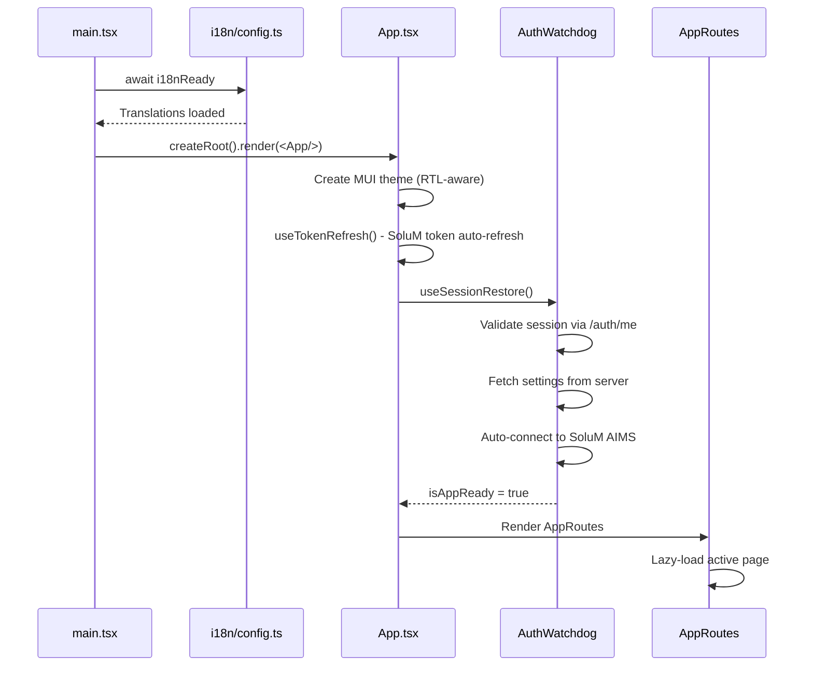

### 4.2 Feature Module Pattern (Client)

Each client feature follows a Clean Architecture layering:

```
src/features/{feature}/
  ├── domain/              # Types, interfaces, business rules
  │   └── types.ts
  ├── application/         # Hooks, business logic orchestration
  │   ├── useFeatureHook.ts
  │   └── utils/
  ├── infrastructure/      # API clients, stores, external services
  │   ├── featureStore.ts  # Zustand store
  │   └── featureApi.ts    # API client functions
  ├── presentation/        # React components
  │   ├── FeaturePage.tsx
  │   └── components/
  └── __tests__/           # Unit tests
```

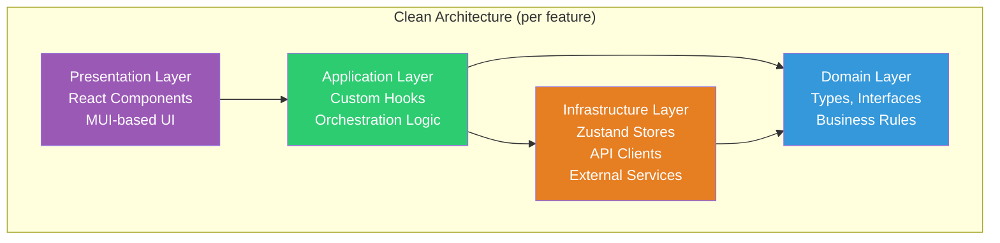

### 4.3 Feature Modules

| Feature | Path | Store | Key Responsibilities |
|---------|------|-------|---------------------|
| **auth** | `/features/auth` | `authStore` | Login, 2FA, session, company/store switching |
| **space** | `/features/space` | `spacesStore` | Space CRUD, label assignment, bulk operations |
| **people** | `/features/people` | `peopleStore` | People CRUD, slot assignment, import/export |
| **conference** | `/features/conference` | `conferenceStore` | Room CRUD, meeting toggle |
| **labels** | `/features/labels` | `labelsStore` | Label listing, linking, image push, blink |
| **settings** | `/features/settings` | `settingsStore` | Company/store settings, SoluM config, user management |
| **sync** | `/features/sync` | `syncStore` | Sync status, manual trigger, queue monitoring |
| **lists** | `/features/lists` | `listsStore` | People & spaces lists management |
| **dashboard** | `/features/dashboard` | -- | Overview cards, status widgets |
| **import-export** | `/features/import-export` | -- | CSV import/export for spaces and people |
| **update** | `/features/update` | `updateStore` | Electron auto-update management |
| **configuration** | `/features/configuration` | -- | App configuration wizard |
| **manual** | `/features/manual` | -- | In-app user manual |
| **systemLogs** | `/features/systemLogs` | -- | Client-side log viewer |

### 4.4 State Management Architecture

```mermaid
graph TB
    subgraph "Zustand Stores"
        AUTH[authStore<br/>User, tokens,<br/>company/store context]
        SETTINGS[settingsStore<br/>App settings,<br/>SoluM config]
        SPACES[spacesStore<br/>Spaces data,<br/>selection state]
        PEOPLE[peopleStore<br/>People data,<br/>assignment state]
        CONF[conferenceStore<br/>Conference rooms,<br/>meeting state]
        LABELS[labelsStore<br/>Label data,<br/>filter state]
        SYNC[syncStore<br/>Sync status,<br/>working mode]
        LISTS[listsStore<br/>People/spaces lists]
        NOTIF[notificationStore<br/>Toast notifications]
        LOGS[logsStore<br/>Client-side logs]
    end

    subgraph "Persistence"
        LS[localStorage<br/>via Zustand persist]
    end

    AUTH -->|persist| LS
    SETTINGS -->|persist| LS
    SPACES -->|persist| LS
    SYNC -->|persist| LS

    subgraph "Root Store"
        ROOT[rootStore.ts<br/>Re-exports +<br/>useRootStore() hook]
    end

    ROOT --> SETTINGS
    ROOT --> SPACES
    ROOT --> SYNC
    ROOT --> CONF
    ROOT --> NOTIF
```

Key Zustand patterns used:

- **`persist` middleware** -- Selective state persistence to localStorage (e.g., auth user, settings, spaces).
- **`devtools` middleware** -- Named actions for Redux DevTools debugging.
- **`partialize`** -- Only persists specific state slices (e.g., authStore persists `user` but not `isAuthenticated`).
- **Store isolation** -- Each feature has its own store; no global monolithic store.
- **Cross-store communication** -- Stores import each other directly (e.g., `authStore` calls `settingsStore.fetchSettingsFromServer()` on login).

### 4.5 API Client & Token Management

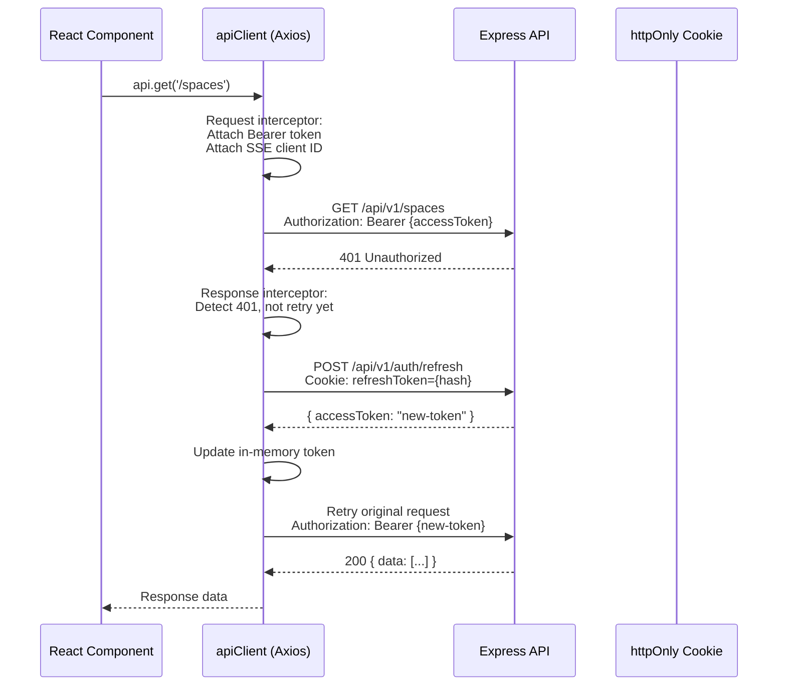

Security design:
- **Access token** -- Stored in memory only (not localStorage), protecting against XSS.
- **Refresh token** -- Stored in httpOnly cookie by the server, inaccessible to JavaScript.
- **Automatic refresh** -- The Axios response interceptor detects 401 errors, refreshes the token, and queues/retries concurrent failed requests.
- **SSE Client ID** -- Attached as `x-sse-client-id` header so the server can exclude the originator from broadcast events.

### 4.6 Routing & Code Splitting

```mermaid
graph TB
    HR[HashRouter]

    subgraph "Public"
        LOGIN[/login<br/>LoginPage]
    end

    subgraph "Protected (ProtectedRoute)"
        DASH[/<br/>DashboardPage]
        SPACES[/spaces<br/>ProtectedFeature: spaces<br/>SpacesPage]
        CONF[/conference<br/>ProtectedFeature: conference<br/>ConferencePage]
        PEOPLE[/people<br/>ProtectedFeature: people<br/>PeopleManagerView]
        LAB[/labels<br/>ProtectedFeature: labels<br/>LabelsPage]
    end

    HR --> LOGIN
    HR --> DASH
    HR --> SPACES
    HR --> CONF
    HR --> PEOPLE
    HR --> LAB

    style LOGIN fill:#e74c3c,color:#fff
    style DASH fill:#27ae60,color:#fff
    style SPACES fill:#27ae60,color:#fff
    style CONF fill:#27ae60,color:#fff
    style PEOPLE fill:#27ae60,color:#fff
    style LAB fill:#27ae60,color:#fff
```

- **HashRouter** -- Used for Capacitor/Electron compatibility (no server-side routing needed).
- **Lazy Loading** -- All page components are lazy-loaded with `React.lazy()` for code splitting.
- **Suspense Boundaries** -- Each route has its own `<Suspense>` boundary for immediate loader display.
- **ProtectedRoute** -- Redirects unauthenticated users to `/login`.
- **ProtectedFeature** -- Checks the user's `features` JSON from `UserStore` to conditionally render feature pages.

### 4.7 Bundle Optimization

Vite is configured with manual chunk splitting:

| Chunk | Contents |
|-------|----------|
| `react-vendor` | react, react-dom, react-router |
| `mui-vendor` | @mui/*, @emotion/* |
| `form-vendor` | react-hook-form, zod |
| `i18n-vendor` | i18next, react-i18next |
| `utils-vendor` | axios, papaparse, date-fns |

Additional optimizations:
- **Gzip + Brotli** pre-compression via `vite-plugin-compression`.
- **Terser** removes `console.log`, `console.debug`, `console.info` in production (keeps `error` and `warn`).
- **Bundle analyzer** generates `dist/stats.html` for size inspection.
- **Chunk size warning** set to 600KB to detect unexpected growth.

### 4.8 Internationalization (i18n)

```mermaid
graph LR
    DETECT[Language Detection<br/>localStorage -> navigator] --> LOAD[Lazy Load Locale<br/>Only active language]
    LOAD --> INIT[i18next Init<br/>fallback: en]
    INIT --> RENDER[App Renders<br/>useTranslation()]

    SWITCH[Language Switch] --> LAZY[Lazy Load<br/>Other Language Bundle]
    LAZY --> ADD[addResourceBundle]
    ADD --> RERENDER[Re-render with<br/>new translations]

    INIT --> RTL{Language = he?}
    RTL -->|Yes| RTLDIR[document.dir = 'rtl'<br/>RTL MUI Theme]
    RTL -->|No| LTRDIR[document.dir = 'ltr'<br/>LTR MUI Theme]
```

- Supports **English** and **Hebrew** (with full RTL support via `stylis-plugin-rtl`).
- Locale bundles are **lazy-loaded** -- only the active language is loaded at startup.
- The MUI theme is **recreated** when the direction changes (via `useMemo`).

### 4.9 Real-Time Updates (Client)

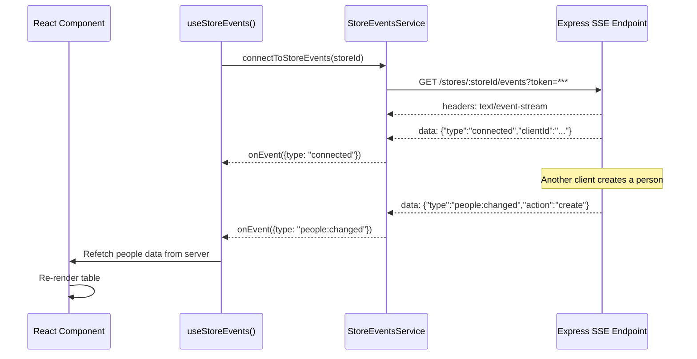

The SSE connection is per-store and authenticated via query parameter (since `EventSource` does not support custom headers). In development, the SSE client connects directly to the backend (port 3001) to bypass Vite's proxy, which buffers streaming responses.

---

## Chapter 5 -- Integration & Synchronization

### 5.1 SoluM AIMS Integration Overview

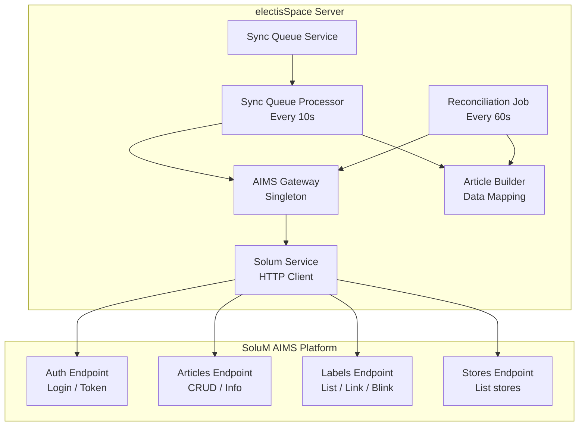

### 5.2 Push Sync Flow (Entity Changed)

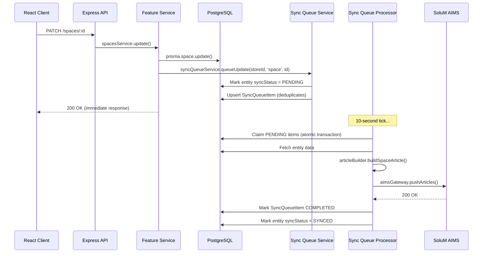

Key design decisions:
- **Asynchronous push** -- Entity updates return immediately; AIMS sync happens in the background.
- **Deduplication** -- If a pending/processing queue item already exists for the same entity, it is updated in-place rather than creating a duplicate.
- **5-second delay** -- Items must be at least 5 seconds old before processing, allowing rapid edits to coalesce into a single AIMS push.

### 5.3 Reconciliation Sync Flow (Periodic)

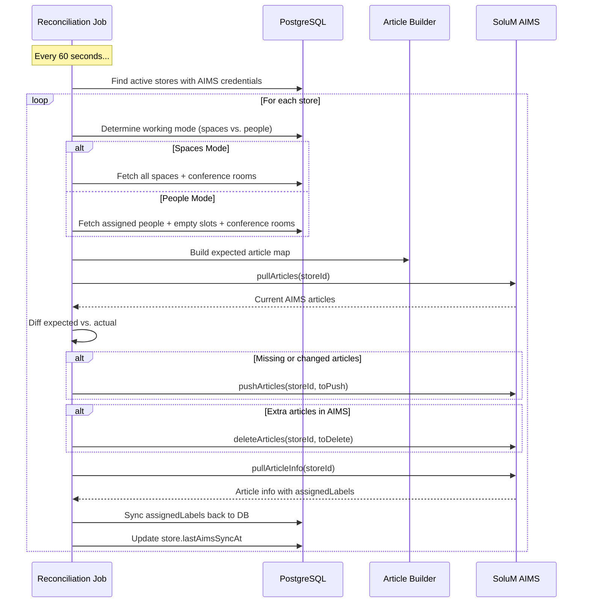

The reconciliation job ensures eventual consistency even if individual push sync items fail. It is mode-aware:

- **Spaces mode**: Expected articles = all spaces + conference rooms.
- **People mode**: Expected articles = assigned people (keyed by `assignedSpaceId`) + empty slot articles for unoccupied spaces + conference rooms.

### 5.4 Article Building Pipeline

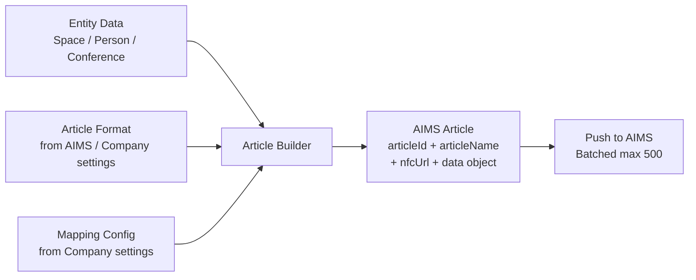

The Article Builder maps entity data to the AIMS article format:

1. **Top-level fields** (`articleId`, `articleName`, `nfcUrl`) use generic AIMS keys.
2. **Data object** contains the company's custom column names from `mappingInfo`.
3. **Global field assignments** (from company settings) inject static values across all articles.
4. **Conference mapping** maps `meetingName`, `meetingTime`, and `participants` to configurable AIMS fields.

### 5.5 Label Operations

Labels are the physical e-ink devices managed through AIMS:

| Operation | Flow |
|-----------|------|
| **Fetch Labels** | Server -> AIMS `/labels` endpoint -> Return to client |
| **Link Label** | Client sends `labelCode` + `articleId` -> Server -> AIMS link endpoint |
| **Unlink Label** | Client sends `labelCode` -> Server -> AIMS unlink endpoint |
| **Blink Label** | Client sends `labelCode` -> Server -> AIMS blink endpoint (flashes LED) |
| **Push Image** | Client sends base64 image -> Server -> AIMS image push endpoint |
| **Dither Preview** | Client sends image params -> Server -> AIMS dither endpoint -> Return preview |

Label-to-entity binding (`assignedLabels` arrays) is synced back from AIMS during the reconciliation job's `syncAssignedLabels` step.

---

## Chapter 6 -- Infrastructure & Deployment

### 6.1 Container Architecture

```mermaid
graph TB
    subgraph "global-network (Docker external network)"
        subgraph "docker-compose.infra.yml"
            REDIS[electisspace-redis<br/>Redis 7 Alpine<br/>Port: 6381->6379<br/>AOF persistence]
        end

        subgraph "docker-compose.app.yml"
            CLIENT[electisspace-server<br/>Nginx Alpine<br/>Port: 3071->3000]
            SERVER[electisspace-api<br/>Node.js 20 Alpine<br/>Internal port 3000]
        end

        PG[global-postgres<br/>PostgreSQL<br/>External service]
        GRAFANA[Grafana<br/>Monitoring<br/>External service]
    end

    CLIENT -->|/api/*| SERVER
    CLIENT -->|/health| SERVER
    CLIENT -->|SSE /stores/*/events| SERVER
    SERVER --> PG
    SERVER --> REDIS
    GRAFANA --> PG
```

### 6.2 Container Build Strategy

Both containers use multi-stage Docker builds for minimal production images:

**Client Container (Nginx)**:
```
Stage 1: node:20-alpine
  - npm ci (install dependencies)
  - npm run build (Vite build with VITE_BASE_PATH arg)

Stage 2: nginx:alpine
  - Copy custom nginx.conf
  - Copy built SPA from Stage 1
  - Serve on port 3000
```

**Server Container (Node.js)**:
```
Stage 1: node:20-alpine (builder)
  - npm ci (all dependencies)
  - npx prisma generate
  - npm run build (TypeScript compilation)

Stage 2: node:20-alpine (production)
  - npm ci --only=production
  - Copy Prisma client from Stage 1
  - Copy compiled JS from Stage 1
  - Run as non-root 'nodejs' user (UID 1001)
  - dumb-init for proper signal handling
```

### 6.3 Nginx Configuration (Internal)

The internal Nginx container (`client/nginx.conf`) serves dual roles:

```mermaid
graph LR
    REQ[Incoming Request] --> NGINX[Nginx Container<br/>Port 3000]

    NGINX -->|"GET /assets/*"| STATIC[Static Files<br/>1-year cache<br/>immutable]
    NGINX -->|"GET /api/v1/stores/*/events"| SSE[SSE Proxy<br/>buffering OFF<br/>86400s timeout]
    NGINX -->|"* /api/*"| API[API Proxy<br/>60s timeout]
    NGINX -->|"GET /health"| HEALTH[Health Proxy<br/>to Express]
    NGINX -->|"GET /*"| SPA[SPA Fallback<br/>index.html<br/>no-cache]
```

Critical SSE configuration:
- Regex location `~ ^/api/v1/stores/.+/events$` matches SSE endpoints **before** the generic `/api/` block.
- `proxy_buffering off` and `chunked_transfer_encoding off` prevent Nginx from buffering the event stream.
- `proxy_read_timeout 86400s` (24 hours) allows long-lived SSE connections.
- `Connection ''` header (empty) ensures HTTP/1.1 keep-alive without `Connection: upgrade`.

### 6.4 Nginx Configuration (External / SSL)

The external Nginx (host-level) provides SSL termination:

```mermaid
graph LR
    INTERNET[Internet] -->|Port 80| REDIRECT[301 -> HTTPS]
    INTERNET -->|Port 443 SSL| NGINX_EXT[External Nginx<br/>solum.co.il]

    NGINX_EXT -->|"/app/*"| SPA[Static SPA<br/>or Docker Container]
    NGINX_EXT -->|"/app/api/*"| API[API Proxy<br/>to port 3071/4000]
    NGINX_EXT -->|"/"| LEGACY[Legacy App<br/>Port 3000]
```

Key SSL/proxy settings:
- HTTP/2 enabled.
- `proxy_buffering off` for SSE endpoints.
- `proxy_read_timeout 86400s` for SSE.
- `client_max_body_size 10m` for file uploads.

### 6.5 Deployment Topology

```mermaid
graph TB
    subgraph "Ubuntu Production Server"
        subgraph "Docker Engine"
            REDIS_C[Redis Container]
            CLIENT_C[Nginx+SPA Container]
            API_C[Express API Container]
        end

        NGINX_H[Nginx Host Service<br/>SSL Termination]
        PG_H[PostgreSQL<br/>Global Service]

        NGINX_H -->|:3071| CLIENT_C
        CLIENT_C --> API_C
        API_C --> PG_H
        API_C --> REDIS_C
    end

    subgraph "Windows Deployment (Alternative)"
        PM2[PM2 Process Manager]
        NGINX_W[Nginx (Windows)]
        PG_W[PostgreSQL (Local)]

        NGINX_W -->|:4000| PM2
        PM2 --> PG_W
    end
```

Two deployment modes are supported:

1. **Docker (Ubuntu)** -- Production deployment using `docker-compose.infra.yml` + `docker-compose.app.yml` on an external `global-network`.
2. **PM2 (Windows)** -- Alternative deployment using PM2 (`ecosystem.config.cjs`) for the Node.js server with a host-level Nginx for the SPA.

### 6.6 Build & Deployment Commands

```bash
# Infrastructure (one-time setup)
docker compose -f docker-compose.infra.yml up -d

# Application build and deploy
docker compose -f docker-compose.infra.yml -f docker-compose.app.yml build
docker compose -f docker-compose.infra.yml -f docker-compose.app.yml up -d

# Database migrations
docker exec electisspace-api npx prisma migrate deploy

# View logs
docker logs electisspace-api --tail=100 -f
docker logs electisspace-server --tail=100 -f
```

### 6.7 Health Checks

| Service | Endpoint | Interval | Start Period |
|---------|---------|----------|-------------|
| Redis | `redis-cli ping` | 10s | -- |
| Express API | `GET /health` | 30s | 40s |
| Nginx Client | `GET /` | 30s | 10s |

### 6.8 Multi-Platform Support

```mermaid
graph TB
    SRC[Single React Codebase<br/>src/]

    SRC -->|"vite build"| WEB[Web SPA<br/>Nginx / Static]
    SRC -->|"npm run electron:build"| ELECTRON[Electron Desktop<br/>Windows NSIS Installer]
    SRC -->|"npm run android:build"| CAPACITOR[Capacitor Android<br/>APK / AAB]

    ELECTRON --> AUTOUPDATE[Auto-Update<br/>GitHub Releases]
    CAPACITOR --> PLAYSTORE[Play Store]
```

- **Web**: Standard SPA served by Nginx.
- **Electron**: Wraps the SPA in a Chromium window with native features (file system, auto-update via GitHub releases, custom title bar).
- **Capacitor**: Wraps the SPA in a WebView for Android with native plugins (file system, network, preferences).

---

## Chapter 7 -- Security, Auth & Access Control

### 7.1 Authentication Flow

```mermaid
sequenceDiagram
    participant User as User
    participant Client as React SPA
    participant Server as Express API
    participant DB as PostgreSQL
    participant Email as Email Service

    User->>Client: Enter email + password
    Client->>Server: POST /auth/login
    Server->>DB: Verify credentials (bcrypt)
    Server->>DB: Check account status (active, locked)
    Server->>DB: Create VerificationCode (6-digit, 5-min expiry)
    Server->>Email: Send 2FA code via email
    Server-->>Client: { email, message: "Code sent" }

    User->>Client: Enter 6-digit code
    Client->>Server: POST /auth/verify-2fa
    Server->>DB: Validate code (unused, not expired)
    Server->>DB: Mark code as used
    Server->>DB: Create RefreshToken
    Server->>Server: Generate JWT access token (15min)
    Server-->>Client: Set-Cookie: refreshToken (httpOnly)<br/>{ accessToken, user }

    Client->>Client: Store accessToken in memory
    Client->>Client: Fetch settings, auto-connect AIMS
```

### 7.2 Token Architecture

```mermaid
graph TB
    subgraph "Access Token (JWT)"
        AT_STORE[Stored in: Memory only]
        AT_LIFE[Lifetime: 15 minutes]
        AT_USE[Used for: API authorization]
        AT_PAYLOAD[Payload: sub, globalRole,<br/>stores[], companies[]]
    end

    subgraph "Refresh Token"
        RT_STORE[Stored in: httpOnly cookie<br/>+ hashed in DB]
        RT_LIFE[Lifetime: 180 days]
        RT_USE[Used for: Access token renewal]
    end

    subgraph "Verification Code"
        VC_STORE[Stored in: DB]
        VC_LIFE[Lifetime: 5 minutes]
        VC_USE[Used for: 2FA + Password Reset]
        VC_TYPE[Types: LOGIN_2FA, PASSWORD_RESET]
    end
```

Security properties:
- **Access tokens** never touch persistent storage (memory-only), eliminating XSS token theft.
- **Refresh tokens** use httpOnly cookies (invisible to JavaScript) with hashed storage in the database.
- **Verification codes** are single-use, time-limited, and rate-limited per IP+email combination.

### 7.3 Role-Based Access Control (RBAC)

```mermaid
graph TB
    subgraph "Global Level"
        PA[PLATFORM_ADMIN<br/>Full system access]
    end

    subgraph "Company Level (CompanyRole)"
        SU[SUPER_USER<br/>Full access, no restrictions]
        CA[COMPANY_ADMIN<br/>Manage settings, users, stores]
        CSA[STORE_ADMIN<br/>Per-store admin access]
        CSV[STORE_VIEWER<br/>Per-store view only]
        CV[VIEWER<br/>Read-only access]
    end

    subgraph "Store Level (StoreRole)"
        SA[STORE_ADMIN<br/>Full store operations]
        SM[STORE_MANAGER<br/>CRUD + sync, no user mgmt]
        SE[STORE_EMPLOYEE<br/>Read + update only]
        SV[STORE_VIEWER<br/>Read only]
    end

    PA --> SU
    SU --> CA
    CA --> CSA
    CSA --> CSV
    CSV --> CV
    SA --> SM
    SM --> SE
    SE --> SV

    style PA fill:#e74c3c,color:#fff
    style SU fill:#c0392b,color:#fff
    style CA fill:#e67e22,color:#fff
    style SA fill:#27ae60,color:#fff
    style SM fill:#2ecc71,color:#fff
    style SE fill:#3498db,color:#fff
    style SV fill:#95a5a6,color:#fff
```

### 7.4 Permission Matrix

The `requirePermission(resource, action)` middleware enforces fine-grained permissions:

| Resource | STORE_ADMIN | STORE_MANAGER | STORE_EMPLOYEE | STORE_VIEWER |
|----------|:-----------:|:-------------:|:--------------:|:------------:|
| spaces: create | X | X | | |
| spaces: read | X | X | X | X |
| spaces: update | X | X | X | |
| spaces: delete | X | X | | |
| people: create | X | X | | |
| people: read | X | X | X | X |
| people: update | X | X | X | |
| people: delete | X | X | | |
| people: import | X | X | | |
| people: assign | X | X | | |
| conference: create | X | X | | |
| conference: read | X | X | X | X |
| conference: update | X | X | X | |
| conference: delete | X | X | | |
| conference: toggle | X | X | | |
| settings: read | X | X | | |
| settings: update | X | | | |
| users: CRUD | X | | | |
| audit: read | X | | | |
| sync: trigger | X | X | | |
| sync: view | X | X | X | X |
| labels: view | X | X | X | X |
| labels: manage | X | X | | |

**PLATFORM_ADMIN** bypasses all permission checks.

Users with `allStoresAccess` on their `UserCompany` record receive `STORE_ADMIN`-level permissions across all stores in that company.

### 7.5 Feature-Level Access Control

Beyond role-based permissions, the `UserStore.features` JSON array controls which frontend pages a user can access:

```json
["dashboard", "spaces", "conference", "people"]
```

The `<ProtectedFeature feature="spaces">` component checks this array and renders a redirect if the user lacks the feature permission.

### 7.6 Auth Middleware Pipeline

```mermaid
graph LR
    REQ[Request] --> AUTH[authenticate<br/>JWT verify<br/>User context build]
    AUTH --> CACHE{User cached?}
    CACHE -->|Yes| ATTACH[Attach req.user]
    CACHE -->|No| DBFETCH[Fetch from DB<br/>with stores + companies]
    DBFETCH --> EXPAND[Expand allStoresAccess<br/>to store entries]
    EXPAND --> SETCACHE[Cache for 60s<br/>max 500 entries]
    SETCACHE --> ATTACH
    ATTACH --> PERM[requirePermission<br/>resource + action check]
    PERM --> HANDLER[Route Handler]
```

The auth middleware uses a 60-second in-memory cache (max 500 entries) to reduce database queries. The cache is invalidated when user roles or store assignments change.

SSE endpoints accept the token as a query parameter (`?token=...`) since `EventSource` does not support custom headers.

### 7.7 Rate Limiting Strategy

| Endpoint | Window | Max Requests | Key |
|----------|--------|-------------|-----|
| Global API (`/api/*`) | 60s | 100 | IP |
| Login (`/auth/login`) | 15min | 10 | IP + email |
| 2FA Verify (`/auth/verify-2fa`) | 5min | 5 | IP + email |
| Password Reset | 1hr | 3 | IP + email |

All rate limits are configurable via environment variables.

### 7.8 Security Middleware Stack

| Middleware | Purpose |
|-----------|---------|
| **Helmet** | Sets security headers (CSP, HSTS, X-Frame-Options, etc.) |
| **CORS** | Restricts origins to configured whitelist with credentials |
| **Rate Limiting** | Prevents brute force and DDoS |
| **Request ID** | Unique ID per request for log correlation |
| **bcrypt (12 rounds)** | Password hashing |
| **AES Encryption** | AIMS credentials at rest |
| **httpOnly Cookies** | Refresh token storage (no JS access) |
| **Account Lockout** | `failedLoginAttempts` counter with `lockedUntil` timestamp |
| **Non-root Container** | Server runs as UID 1001 inside Docker |
| **dumb-init** | Proper signal forwarding in containers |

### 7.9 AIMS Credential Security

AIMS API passwords are encrypted at rest using AES encryption:

```
User provides AIMS password (plaintext)
  -> Server encrypts with ENCRYPTION_KEY (AES)
    -> Stored as aimsPasswordEnc in Company record
      -> Decrypted only when making AIMS API calls
```

The `ENCRYPTION_KEY` (32+ characters) is provided via environment variable and never stored in the database.

### 7.10 Audit Logging

All significant operations are recorded in the `audit_logs` table:

| Field | Description |
|-------|------------|
| `action` | Operation type (CREATE, UPDATE, DELETE, etc.) |
| `entityType` | Target entity (space, person, conference, user, etc.) |
| `entityId` | Target entity ID |
| `oldData` | Previous state (JSON) |
| `newData` | New state (JSON) |
| `ipAddress` | Client IP address |
| `userAgent` | Client user agent string |
| `permissionChecked` | Which permission was validated |
| `wasAuthorized` | Whether the operation was authorized |

Audit logs are store-scoped and indexed by `(entityType, entityId)` and `(createdAt)` for efficient querying.

---

## Appendix A -- Glossary

| Term | Definition |
|------|-----------|
| **AIMS** | SoluM's Article Information Management System -- the platform that manages ESL labels |
| **Article** | An AIMS concept: a data record linked to one or more physical labels |
| **ESL** | Electronic Shelf Label -- e-ink displays managed via AIMS |
| **Label Code** | Unique identifier for a physical ESL device |
| **External ID** | The identifier used as the AIMS `articleId` for a space or conference room |
| **Virtual Space ID** | A person's logical identifier (before slot assignment) |
| **Assigned Space ID** | The physical slot number a person is assigned to (used as AIMS `articleId` in people mode) |
| **Reconciliation** | The periodic process of diffing DB state against AIMS state and correcting discrepancies |
| **Singleflight** | A concurrency pattern that deduplicates in-flight requests for the same resource |
| **Store** | An operational unit within a company, mapped to an AIMS store number |

## Appendix B -- Environment Variable Reference

| Variable | Required | Default | Description |
|----------|:--------:|---------|-------------|
| `NODE_ENV` | No | `development` | Environment mode |
| `PORT` | No | `3000` | HTTP listen port |
| `API_VERSION` | No | `v1` | API version prefix |
| `DATABASE_URL` | Yes | -- | PostgreSQL connection string |
| `DB_POOL_MAX` | No | `20` | Max database connections |
| `REDIS_URL` | No | `redis://localhost:6379` | Redis connection string |
| `JWT_ACCESS_SECRET` | Yes | -- | JWT signing secret (32+ chars) |
| `JWT_REFRESH_SECRET` | Yes | -- | Refresh token signing secret (32+ chars) |
| `JWT_ACCESS_EXPIRES_IN` | No | `15m` | Access token lifetime |
| `JWT_REFRESH_EXPIRES_IN` | No | `180d` | Refresh token lifetime |
| `ENCRYPTION_KEY` | Yes | -- | AES encryption key (32+ chars) |
| `CORS_ORIGINS` | No | `https://localhost:3000` | Allowed CORS origins (comma-separated) |
| `RATE_LIMIT_WINDOW_MS` | No | `60000` | Global rate limit window |
| `RATE_LIMIT_MAX_REQUESTS` | No | `100` | Global max requests per window |
| `AUTH_RATE_LIMIT_MAX` | No | `10` | Auth endpoint max attempts |
| `AUTH_RATE_LIMIT_WINDOW_MS` | No | `900000` | Auth rate limit window (15min) |
| `TWOFA_RATE_LIMIT_MAX` | No | `5` | 2FA verification max attempts |
| `TWOFA_RATE_LIMIT_WINDOW_MS` | No | `300000` | 2FA rate limit window (5min) |
| `RESET_RATE_LIMIT_MAX` | No | `3` | Password reset max attempts |
| `RESET_RATE_LIMIT_WINDOW_MS` | No | `3600000` | Reset rate limit window (1hr) |
| `LOG_LEVEL` | No | `info` | Logging level |
| `SOLUM_DEFAULT_API_URL` | No | -- | Default AIMS API base URL |
| `SOLUM_DEFAULT_CLUSTER` | No | `common` | Default AIMS cluster |
| `ADMIN_EMAIL` | No | -- | Platform admin email (auto-created) |
| `ADMIN_PASSWORD` | No | -- | Platform admin password |

## Appendix C -- Key File Reference

| File | Purpose |
|------|---------|
| `server/src/server.ts` | Server entry point, lifecycle, background job startup |
| `server/src/app.ts` | Express app setup, middleware pipeline, route mounting |
| `server/src/config/env.ts` | Environment validation (Zod), derived config |
| `server/src/config/redis.ts` | Redis client singleton |
| `server/src/config/database.ts` | Prisma client configuration |
| `server/prisma/schema.prisma` | Database schema definition |
| `server/src/shared/middleware/auth.ts` | JWT auth + RBAC middleware |
| `server/src/shared/infrastructure/services/aimsGateway.ts` | AIMS API client with caching |
| `server/src/shared/infrastructure/services/syncQueueService.ts` | Sync queue helper |
| `server/src/shared/infrastructure/services/articleBuilder.ts` | AIMS article construction |
| `server/src/shared/infrastructure/services/solumService.ts` | Low-level AIMS HTTP client |
| `server/src/shared/infrastructure/services/redisCache.ts` | Redis cache wrapper |
| `server/src/shared/infrastructure/jobs/SyncQueueProcessor.ts` | Background sync processor |
| `server/src/shared/infrastructure/jobs/AimsPullSyncJob.ts` | Periodic reconciliation job |
| `server/src/shared/infrastructure/sse/SseManager.ts` | SSE connection manager |
| `src/App.tsx` | Root React component |
| `src/AppRoutes.tsx` | Client route definitions |
| `src/main.tsx` | Client entry point |
| `src/theme.ts` | MUI theme (RTL-aware) |
| `src/i18n/config.ts` | i18n lazy-loading config |
| `src/shared/infrastructure/services/apiClient.ts` | Axios client with token management |
| `src/shared/infrastructure/services/storeEventsService.ts` | SSE client |
| `src/shared/infrastructure/store/rootStore.ts` | Store aggregation |
| `src/features/auth/infrastructure/authStore.ts` | Auth state management |
| `vite.config.ts` | Vite build configuration |
| `capacitor.config.ts` | Capacitor mobile configuration |
| `electron/main.cjs` | Electron main process |
| `client/Dockerfile` | SPA + Nginx container |
| `server/Dockerfile` | API container |
| `client/nginx.conf` | Internal Nginx configuration |
| `docker-compose.app.yml` | Application container orchestration |
| `docker-compose.infra.yml` | Infrastructure container orchestration |
| `ecosystem.config.cjs` | PM2 process manager config (Windows) |

---

*End of Architecture Book*
