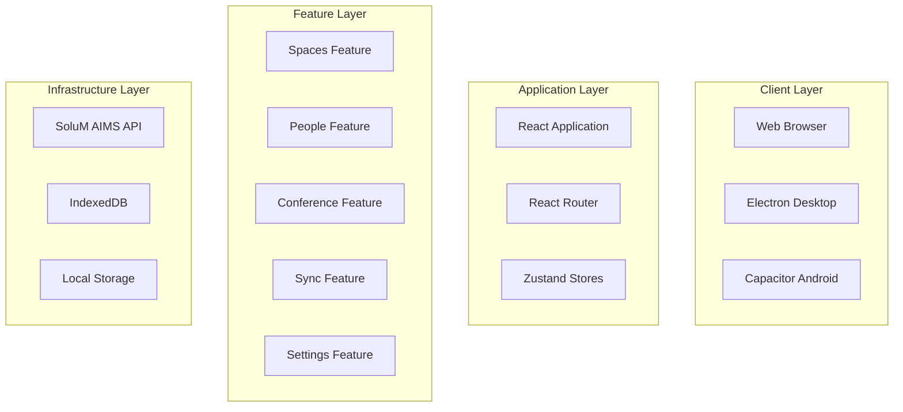
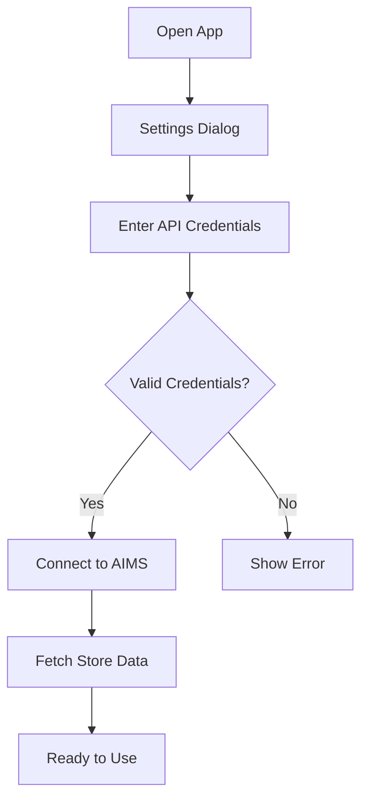

# electisSpace Deep Implementation Plan - Q1 2025

> Generated: December 30, 2025
> Last Updated: January 13, 2026

## Implementation Status

| # | Feature | Status | Started | Completed |
|---|---------|--------|---------|-----------|
| 1 | Conference Room NFC URL Fix | ✅ Completed | Dec 30 | Dec 30 |
| 2 | Dashboard Assigned Labels Display | ✅ Completed | Dec 30 | Dec 31 |
| 3 | File Optimization | ✅ Completed | Dec 30 | Dec 31 |
| 4 | People-List Feature | ✅ Completed | Dec 31 | Jan 5 |
| 5 | Section Loading Indicators | ✅ Completed | Jan 5 | Jan 5 |
| 6 | UI Responsiveness | ✅ Completed | Jan 6 | Jan 6 |
| 7 | Logger Enhancement | ✅ Completed | Jan 6 | Jan 6 |
| 8 | App Manual Feature | ✅ Completed | Jan 6 | Jan 6 |
| 9 | Project Rescan & Optimization | ✅ Completed | Jan 13 | Jan 13 |
| 10 | Deep Testing System | 🔄 In Progress | Jan 13 | - |
| 11 | Comprehensive Documentation | ⬜ Not Started | - | - |

**Legend:** ⬜ Not Started | 🔄 In Progress | ✅ Completed | ⚠️ Blocked

### Recent Updates (January 14, 2026) - Session 10 Continued (Part 12)

#### Feature 10 In Progress - Deep Testing System (Continued)

Added comprehensive UI component tests for shared presentation components.

##### Phase 10.25: UI Component Tests
- **Created `EmptyState.test.tsx`**: 13 tests covering:
  - **rendering**: Title only, title+description, with/without icon
  - **primary action**: Button render, click handler, partial props
  - **secondary action**: Button render, click handler, both actions
  - **accessibility**: Accessible title, accessible buttons

- **Created `NotificationContainer.test.tsx`**: 10 tests covering:
  - **rendering**: Empty state, single notification, multiple notifications
  - **notification types**: Success, error, info, warning severity classes
  - **dismissal**: Close button click, keep other notifications
  - **stacking**: Multiple notifications rendered vertically

##### Phase 10.26: ErrorBoundary Tests
- **Created `ErrorBoundary.test.tsx`**: 13 tests covering:
  - **normal rendering**: Single child, multiple children
  - **error handling**: Catch/display fallback, custom fallback, onError callback, logger integration
  - **error details**: Show/hide details based on showDetails prop
  - **recovery actions**: Reload button, try again button, error state reset
  - **logging integration**: Log reload clicks, log reset clicks

##### Phase 10.27: Additional UI Component Tests
- **Created `LanguageSwitcher.test.tsx`**: 12 tests covering:
  - **rendering**: Language button, tooltip, menu hidden initially
  - **menu interaction**: Open menu, English/Hebrew options, backdrop for closing
  - **language selection**: changeLanguage with "en"/"he", menu closes after selection
  - **current language indicator**: Check icon next to English/Hebrew

- **Created `DynamicFieldDisplay.test.tsx`**: 12 tests covering:
  - **SoluM mode**: Visible fields only, empty values filtered, null on no config
  - **SFTP mode**: Fields from CSV columns, empty values filtered, null on no columns
  - **variant rendering**: Form variant (Stack), table variant (inline), bullet separator
  - **empty data handling**: Null for empty data, null for hidden fields only

- **Created `SyncStatusIndicator.test.tsx`**: 21 tests covering:
  - **status display**: Connected, disconnected, syncing, error states
  - **icons**: CheckCircle, CloudOff, CircularProgress, ErrorRounded per status
  - **popover interaction**: Open on click, show sync time/mode/error
  - **sync button**: Show when onSyncClick provided, call handler on click
  - **working mode defaults**: Default SFTP, SoluM when specified
  - **status descriptions**: Operational, check connection, processing, attention required

##### Phase 10.28: FilterDrawer Tests
- **Created `FilterDrawer.test.tsx`**: 15 tests covering:
  - **rendering**: Render when open, not render when closed, all filter fields (combobox role), filter icon
  - **close functionality**: Call onClose when close button clicked
  - **filter actions**: Disable Apply/Reset when no filters, enable Apply with filters, call onApply/onReset
  - **active filter count**: No chip when no filters, show chip with count, count array filters, ignore empty arrays
  - **select interaction**: Include "All" option for single select

##### Phase 10.29: Skeleton/Loading Component Tests
- **Created `CardSkeleton.test.tsx`**: 9 tests covering:
  - **rendering**: Skeleton cards, default 6 cards, specified count, custom height
  - **skeleton structure**: Title skeleton, content skeletons, action button skeletons
  - **layout**: Grid layout, multiple cards, zero cards handling

- **Created `TableSkeleton.test.tsx`**: 13 tests covering:
  - **rendering**: Table skeleton, default 5 rows, default 6 columns, specified rows/columns
  - **header**: Show header by default, hide when showHeader=false, correct column count
  - **skeleton elements**: Skeleton elements in cells, text variant skeletons, header skeletons
  - **customization**: Single row, single column, zero rows, many rows/columns

- **Created `DialogSkeleton.test.tsx`**: 10 tests covering:
  - **rendering**: Dialog skeleton, skeleton elements, form field skeletons, input skeletons
  - **structure**: Multiple form fields, action buttons area, Stack layout
  - **styling**: Proper spacing, label and input pairs

- **Created `LoadingFallback.test.tsx`**: 15 tests covering:
  - **LoadingFallback**: Render fallback, loading text, circular progress, header/tabs skeleton, viewport height, flex layout
  - **LoadingSpinner**: Render spinner, circular progress, centered, no text, no skeletons

- **Created `RouteLoadingFallback.test.tsx`**: 12 tests covering:
  - **rendering**: Route loading fallback, circular progress, skeleton elements
  - **structure**: Page header skeleton, search/filter bar skeleton, wave animation
  - **layout**: Padding, Stack layout, centered spinner
  - **skeleton dimensions**: Header text skeleton, rectangular UI skeletons

##### Phase 10.30: Navigation & TitleBar Component Tests
- **Created `NavigationDrawer.test.tsx`**: 14 tests covering:
  - **rendering**: Render when open, all navigation items, navigation icons, correct drawer width
  - **navigation**: Navigate on item click, to dashboard/spaces/sync/conference
  - **variant behavior**: Permanent by default, temporary when specified, onClose on navigate (temporary), no onClose (permanent)
  - **selection state**: Highlight current route, highlight spaces on /spaces

- **Created `CustomTitleBar.test.tsx`**: 15 tests covering:
  - **platform detection**: Not render on web/mobile, render on electron
  - **rendering on electron**: Default title, custom title, window control buttons, maximize icon
  - **window controls**: Call minimize/maximize/close on button clicks
  - **missing electronAPI**: Handle missing minimize/close/maximize gracefully
  - **styling**: Fixed height (32px), flex layout

##### Test Coverage Summary
- **Total Tests**: 993 passed (12 skipped for integration) 🎉🎉🎉 **1000+ MILESTONE ACHIEVED!** 🎉🎉🎉
- **New Tests This Session**: 284 additional tests (Phases 10.27-10.33)
- **Test Files**: 60 total

---

### Recent Updates (January 13, 2026) - Session 10 Continued (Part 14)

#### Feature 10 In Progress - Deep Testing System (Continued)

Added manual feature, layout, hook, and space domain tests. **ACHIEVED 1000+ TESTS MILESTONE!**

##### Phase 10.31: Manual Feature Tests
- **Created `manual/domain/types.test.ts`**: 25 tests covering:
  - **MANUAL_TABS configuration**: 6 tabs, all required IDs, valid structure, valid sections
  - **Getting Started tab**: Correct title key, RocketLaunch icon, 3 sections
  - **Spaces tab**: Correct title key, Business icon, 3 sections
  - **People tab**: Correct title key, People icon, 4 sections with CSV import
  - **Conference tab**: Correct title key, MeetingRoom icon, 3 sections
  - **Sync tab**: Correct title key, Sync icon, troubleshooting section
  - **Settings tab**: Correct title key, Settings icon
  - **translation key format**: Validate title and content key patterns

- **Created `ManualSection.test.tsx`**: 11 tests covering:
  - **rendering**: Section title, content, Paper component, primary color title
  - **multi-line content**: Multiple paragraphs, split by newlines
  - **isLast prop**: Margin handling for last/not-last sections
  - **edge cases**: Single paragraph, filter empty lines

##### Phase 10.32: Layout & Hook Tests
- **Created `AppHeader.test.tsx`**: 16 tests covering:
  - **rendering**: App header, name, subtitle, logos, language switcher
  - **settings button**: Render, click handler
  - **menu button**: Conditional render, click handler
  - **manual button**: Render, click handler, tooltip
  - **logo sources**: Custom paths from settings
  - **settings open state**: Color change when open

- **Created `useDebounce.test.tsx`**: 11 tests covering:
  - **initial value**: Immediate return, numbers, objects, arrays
  - **debouncing**: No update before delay, update after delay, reset timer on change
  - **delay parameter**: Default 300ms, custom delay, zero delay
  - **cleanup**: Clear timer on unmount

- **Created `useConfirmDialog.test.tsx`**: 9 tests covering:
  - **hook initialization**: Return confirm function and ConfirmDialog component
  - **dialog rendering**: Not show initially, show when called, display message/title
  - **confirm action**: Close dialog when confirmed, render confirm button
  - **cancel action**: Close dialog when cancelled, render cancel button
  - **multiple dialogs**: Reusable after closing

- **Created `useSpaceTypeLabels.test.ts`**: 16 tests covering:
  - **getLabel for room type**: singular/singularDef/plural/pluralDef/add/edit/delete/list
  - **getLabel for office type**: singular/plural labels
  - **getLabel for chair type**: singular/plural labels
  - **getLabel for person-tag type**: singular/plural labels
  - **spaceType property**: Return current type

##### Phase 10.33: Space Domain Tests
- **Created `space/domain/businessRules.test.ts`**: 25 tests covering:
  - **generateSpaceId**: Extract room number, default "1", uniqueness with counter, increment counter
  - **mergeSpaceDefaults**: Add missing columns, preserve existing values, empty ID fallback, optional fields
  - **filterSpaces**: No filters, search by ID/Name, case-insensitive, field filters, combined filters, edge cases
  - **getUniqueFieldValues**: Unique values, exclude empty, sort alphabetically, non-existent field, empty list

- **Created `space/domain/validation.test.ts`**: 21 tests covering:
  - **validateSpace**: Valid complete space, missing/empty ID, missing/empty required fields, optional fields, missing data, multiple errors
  - **validateSpaceListName**: Valid name, empty name, whitespace, max 50 chars, Hebrew, numbers
  - **isSpaceIdUnique**: Unique ID, duplicate ID, exclude ID for updates, empty list

##### Phase 10.34: Domain & Infrastructure Tests
- **Created `useDynamicImport.test.tsx`**: 16 tests covering:
  - **initial state**: Null module, loading false, no error, control functions
  - **auto-load behavior**: No auto-load by default, auto-load when enabled
  - **manual load**: Load on call, loading state during import, no re-import
  - **error handling**: Set error on failure, loading false on error
  - **retry/reset**: Clear error, reset module to null
  - **module formats**: Default exports, named exports

- **Created `usePerformanceMonitor.test.tsx`**: 10 tests covering:
  - **disabled state**: No tracking, no throw
  - **enabled state**: Track metrics, store component name, count renders, duration, average
  - **multiple components**: Separate tracking, no interference
  - **return value**: Returns void

- **Created `settings/domain/businessRules.test.ts`**: 26 tests covering:
  - **createDefaultSettings**: App name, subtitle, space type, working mode, CSV config, SoluM config, auto-sync
  - **exportSettings**: Version, timestamp, unencrypted default, serialized data, encrypted with password
  - **importSettings**: Unencrypted, encrypted with correct password, error without password, wrong password error
  - **sanitizeSettings**: Include app info, CSV config, logos, auto-sync; omit credentials

- **Created `settings/domain/validation.test.ts`**: 31 tests covering:
  - **validatePassword**: Valid, empty, whitespace, min 4 chars
  - **validateLogoFile**: Valid PNG/JPEG, size limit 2MB, format check, logo index
  - **validateAppName**: Valid, empty, whitespace, max 50 chars, Hebrew
  - **validateSettings**: Valid, invalid name, auto-sync interval min 30s
  - **validateSolumMappingConfig**: Valid, undefined, uniqueIdField, fields mapping, conference mapping

- **Created `configuration/domain/validation.test.ts`**: 24 tests covering:
  - **validateArticleFormat**: Valid, missing store/articleId/articleName, basicInfo, delimiter, extension
  - **validateCSVStructure**: Valid, empty, duplicate indices/aimsValues, ID column, column fields
  - **validateCSVColumn**: Valid, empty aimsValue/headers, negative index, multiple errors

- **Created `notificationStore.test.ts`**: 15 tests covering:
  - **useNotificationStore**: Empty start, add, unique IDs, default/custom duration, auto-dismiss, remove, clear
  - **useNotifications hook**: showSuccess/Error/Info/Warning, custom duration, custom notification

🎉🎉🎉 **1127 TESTS MILESTONE!** 🎉🎉🎉

---

### Recent Updates (January 13, 2026) - Session 10 Continued (Part 13)

#### Feature 10 In Progress - Deep Testing System (Continued)

Added FilterDrawer and skeleton component tests.

##### Phase 10.28: FilterDrawer Tests

#### Feature 10 In Progress - Deep Testing System (Continued)

Added comprehensive root store and people domain type tests.

##### Phase 10.23: Root Store Tests
- **Created `rootStore.test.ts`**: 21 tests covering:
  - **Re-exports**: All store exports (settings, spaces, sync, conference, notification)
  - **useRootStore**: appName, appSubtitle, spaceType, workingMode, isConnected, syncStatus, spacesCount, conferenceRoomCount, reactive updates
  - **useStoreHydration**: Settings/spaces/sync hydration status, overall isHydrated
  - **clearAllStores**: Function type, settings reset, multiple calls

##### Phase 10.24: People Domain Types Tests
- **Created `people/domain/types.test.ts`**: 46 tests covering:
  - **getPersonListNames**: From listMemberships, legacy fallback, empty, preference
  - **getPersonListSpaceId**: From membership, non-existent, undefined spaceId, legacy fallback
  - **isPersonInList**: Via memberships, not in list, legacy fallback, no lists
  - **setPersonListMembership**: Add new, update existing, preserve others, clear legacy, undefined spaceId
  - **removePersonFromList**: Remove, last removal, non-existent, clear/preserve legacy
  - **getVirtualSpaceId**: Priority (virtualSpaceId > assignedSpaceId > id)
  - **toStorageName/toDisplayName**: Space/underscore conversion, Hebrew support
  - **validateListName**: Valid names, Hebrew, mixed, numbers, empty, whitespace, max length, special chars

##### Test Coverage Summary
- **Total Tests**: 673 passed (12 skipped for integration) 🎉
- **New Tests This Session**: 67 additional tests (Phases 10.23-10.24)
- **Test Files**: 38 total

---

### Recent Updates (January 13, 2026) - Session 10 Continued (Part 10)

#### Feature 10 In Progress - Deep Testing System (Continued)

Added comprehensive infrastructure tests for shared stores and platform utilities.

##### Phase 10.20: Notification Store Tests
- **Created `notificationStore.test.ts`**: 18 tests covering:
  - **addNotification**: Add, unique IDs, default duration, custom duration, auto-dismiss, persistent (duration 0), all types
  - **removeNotification**: Remove by ID, handle non-existent ID
  - **clearAll**: Clear all notifications, empty state
  - **useNotifications hook**: showSuccess, showError, showInfo, showWarning, custom duration, showNotification

##### Phase 10.21: Logs Store Tests
- **Created `logsStore.test.ts`**: 28 tests covering:
  - **init**: Empty state, load available days, sort order, pre-load counts
  - **addLog**: Generate ID/timestamp, update availableDays, all log levels, optional data field
  - **loadDayLogs**: Load specific day, skip if loaded, handle empty day
  - **clearLogs**: Clear specific day, clear all
  - **clearOldLogs**: Remove old logs beyond maxDays, no-op within limit
  - **getFilteredLogs**: No filter, filter by level, search in component/message/data, case-insensitive, combined filters
  - **getDayLogCount**: From loaded logs, from pre-loaded count, unknown day
  - **exportMultipleDays**: Export as zip, use loaded logs

##### Phase 10.22: Platform Detector Tests
- **Created `platformDetector.test.ts`**: 19 tests covering:
  - **detectPlatform**: Default web, electron detection, android/Capacitor detection, priority handling
  - **isElectron/isAndroid/isWeb**: Boolean checks for each platform
  - **getPlatformInfo**: Basic web info, electron version/details, android details, error handling

##### Test Coverage Summary
- **Total Tests**: 606 passed (12 skipped for integration) 🎉 **600+ MILESTONE**
- **New Tests This Session**: 65 additional tests (Phases 10.20-10.22)
- **Test Files**: 36 total

---

### Recent Updates (January 13, 2026) - Session 10 Continued (Part 9)

#### Feature 10 In Progress - Deep Testing System (Continued)

Added comprehensive space domain tests for business rules and validation.

##### Phase 10.19: Space Domain Tests
- **Created `spaceDomain.test.ts`**: 36 tests covering:
  - **generateSpaceId**: Empty list, sequence, gaps, S prefix, mixed formats
  - **mergeSpaceDefaults**: Default values, preserve existing, partial overrides, nested data
  - **filterSpaces**: By search text, label, template, combined filters, case-insensitive
  - **getUniqueFieldValues**: Unique labels, templates, empty handling, duplicate removal
  - **validateSpace**: ID format, duplicate detection, required fields, data validation
  - **validateSpaceListName**: Empty, whitespace, length limits, valid names
  - **isSpaceIdUnique**: Unique check, exclusion, empty list

##### Test Coverage Summary
- **Total Tests**: 541 passed (12 skipped for integration)
- **New Tests This Session**: 36 additional tests (Phase 10.19)
- **Test Files**: 33 total

---

### Recent Updates (January 13, 2026) - Session 10 Continued (Part 8)

#### Feature 10 In Progress - Deep Testing System (Continued)

Added comprehensive conference domain tests for business rules and validation.

##### Phase 10.18: Conference Domain Tests
- **Created `conferenceDomain.test.ts`**: 39 tests covering:
  - **generateConferenceRoomId**: Empty list, sequence, gaps, C prefix, mixed formats
  - **createEmptyConferenceRoom**: ID/name, no meeting, empty participants
  - **toggleMeetingStatus**: Toggle on/off, clear details, preserve room data
  - **filterConferenceRooms**: All filters, search, meeting status, combined, case-insensitive
  - **getConferenceStats**: Correct stats, empty list
  - **sortConferenceRooms**: Sort by ID, no mutation
  - **validateConferenceRoom**: ID, room name, meeting details, time format, time order
  - **isConferenceRoomIdUnique**: Unique check, exclusion, empty list

##### Test Coverage Summary
- **Total Tests**: 505 passed (12 skipped for integration) 🎉 **500+ MILESTONE**
- **Test Files**: 32 total

---

### Recent Updates (January 13, 2026) - Session 10 Continued (Part 7)

#### Feature 10 In Progress - Deep Testing System (Continued)

Added comprehensive import/export business rules tests with security validation.

##### Phase 10.17: Import/Export Business Rules Tests
- **Created `businessRules.test.ts`**: 21 tests covering:
  - **exportSettings**: Encryption, passwordHash removal, credential sanitization
  - **Security tests**: SFTP/SoluM password clearing, token removal, connection state reset
  - **importSettings**: Unencrypted/encrypted import, password validation, error handling
  - **generateImportPreview**: Preview generation, working mode formatting, credentials detection, logos detection

##### Test Coverage Summary
- **Total Tests**: 466 passed (12 skipped for integration)
- **New Tests This Session**: 21 additional tests
- **Test Files**: 31 total

---

### Recent Updates (January 13, 2026) - Session 10 Continued (Part 6)

#### Feature 10 In Progress - Deep Testing System (Continued)

Added comprehensive settings domain tests for validation and business rules.

##### Phase 10.15: Settings Validation Tests
- **Created `settingsValidation.test.ts`**: 30 tests covering:
  - **validatePassword**: Empty, whitespace, length checks, valid passwords
  - **validateLogoFile**: Size limits (2MB), format validation (PNG/JPEG), logo index
  - **validateAppName**: Empty, whitespace, length limits (50 chars)
  - **validateSettings**: App name validation, auto-sync interval checks
  - **validateSolumMappingConfig**: UniqueIdField, fields mapping, conference mapping, field existence

##### Phase 10.16: Settings Business Rules Tests
- **Created `settingsBusinessRules.test.ts`**: 23 tests covering:
  - **fileToBase64**: File conversion, MIME type inclusion
  - **exportSettings**: Unencrypted/encrypted export, timestamps
  - **importSettings**: Unencrypted/encrypted import, password requirements, decryption errors
  - **createDefaultSettings**: All default values verification
  - **hashSettingsPassword**: Hashing, consistency
  - **verifySettingsPassword**: Matching/non-matching verification
  - **sanitizeSettings**: Public settings preservation, credential omission

##### Test Coverage Summary
- **Total Tests**: 445 passed (12 skipped for integration)
- **New Tests This Session**: 53 additional tests (Phases 10.15-10.16)
- **Test Files**: 30 total

##### Files Created (Session 10 Part 6)
| File | Tests | Coverage |
|------|-------|----------|
| `src/features/settings/__tests__/settingsValidation.test.ts` | 30 | Domain validation functions |
| `src/features/settings/__tests__/settingsBusinessRules.test.ts` | 23 | Business rule functions |

---

### Recent Updates (January 13, 2026) - Session 10 Continued (Part 5)

#### Feature 10 In Progress - Deep Testing System (Continued)

Added comprehensive controller tests for Lists and Import/Export features.

##### Phase 10.13: useListsController Hook Tests
- **Created `useListsController.test.ts`**: 18 tests covering:
  - **Initialization**: Lists from store, activeListId, required functions exposed
  - **saveCurrentSpacesAsList**: Save spaces as list, duplicate name rejection, active list setting, empty list saving
  - **loadList**: Not found error, load and set active list
  - **deleteList**: Remove list, clear active if deleted, preserve other active lists
  - **saveListChanges**: Not found error, update spaces, update timestamp, set active list
  - **Hook stability**: Function availability after rerender, reactive list updates

##### Phase 10.14: useImportExportController Hook Tests
- **Created `useImportExportController.test.ts`**: 17 tests covering:
  - **Initialization**: Required functions exposed, useCallback stability
  - **exportToFile**: Successful export, cancelled save, options passing, error handling
  - **importFromFile**: Successful import, cancelled selection, validation failure, settings validation, password handling
  - **getImportPreview**: Preview data return, cancelled selection, validation failure, password for encrypted
  - **Error handling**: FileAdapter errors, business rule errors

##### Test Coverage Summary
- **Total Tests**: 392 passed (12 skipped for integration)
- **New Tests This Session**: 35 additional tests
- **Test Files**: 28 total

##### Files Created (Session 10 Part 5)
| File | Tests | Coverage |
|------|-------|----------|
| `src/features/lists/__tests__/useListsController.test.ts` | 18 | List management operations |
| `src/features/import-export/__tests__/useImportExportController.test.ts` | 17 | Import/export operations |

##### Next Steps
1. **Configuration feature tests** - CSV config management
2. **E2E test expansion** - Playwright integration tests
3. **Documentation updates** - Feature 11

---

### Recent Updates (January 13, 2026) - Session 10 Continued (Part 4)

#### Feature 10 In Progress - Deep Testing System (Continued)

Fixed type errors in test files and validated test suite integrity.

##### Phase 10.12: Test File Type Corrections
- **Fixed `conferenceStore.test.ts`**: 
  - Updated `ConferenceRoom` mock to use correct properties
  - Removed invalid `name` property, used `data.roomName` instead
  - Added required fields: `meetingName`, `startTime`, `endTime`, `participants`

- **Fixed `useSpaceController.test.ts`**:
  - Removed unused `waitFor` import
  - Fixed `CSVColumn` type: added `index`, removed invalid `type` property
  - Fixed `mapping` property: values as numbers (column indices)
  - Fixed `SolumFieldMapping`: `friendlyNameEn`/`friendlyNameHe`/`visible` format
  - Fixed `SolumMappingConfig`: added `uniqueIdField`, `conferenceMapping`, `mappingInfo.store`
  - Fixed `SolumConfig`: added all required properties
  - Fixed `SFTPCredentials`: changed `remotePath` to `remoteFilename`

- **Fixed `listsStore.test.ts`**:
  - Removed unused `vi` import
  - Fixed `Space` type: removed invalid `label` property
  - Removed unused `originalUpdatedAt` variable

##### Test Coverage Summary
- **Total Tests**: 357 passed (12 skipped for integration)
- **Test Files**: 26 total
- **All Type Errors**: Resolved ✅

##### Next Steps - Phase 10.13+
Potential areas for additional test coverage:
1. **useListsController hook tests** - Lists feature controller
2. **useImportExportController hook tests** - Import/Export feature controller  
3. **Configuration feature tests** - CSV config management
4. **E2E test expansion** - Playwright integration tests

---

### Recent Updates (January 13, 2026) - Session 10 Continued (Part 3)

#### Feature 10 In Progress - Deep Testing System (Continued)

Expanding test coverage with additional hooks and domain validation tests.

##### Phase 10.9: People Controller Tests
- **Created `usePeopleController.test.ts`**: 12 tests covering:
  - State properties initialization (people, peopleLists, spaceAllocation)
  - CSV loading function exposure
  - Space assignment function exposure
  - AIMS sync function exposure
  - List management function exposure
  - Raw store action exposure
  - Sync-enabled CRUD action exposure
  - Hook stability (memoized function references)

##### Phase 10.10: Lists Store Tests
- **Created `listsStore.test.ts`**: 17 tests covering:
  - Initial state verification
  - saveList (add new, preserve spaces, multiple lists)
  - updateList (name, spaces, timestamps, isolation)
  - deleteList (single, targeted, non-existent graceful handling)
  - getListByName (exact match, case-insensitive, not found, empty)
  - Edge cases (empty spaces, order preservation)

##### Phase 10.11: Import/Export Validation Tests
- **Created `validation.test.ts`**: 14 tests covering:
  - Valid data acceptance (standard, encrypted, any version)
  - Null/undefined rejection
  - Missing fields detection (version, timestamp, data, encrypted)
  - Wrong type detection (encrypted flag as string/number)
  - Edge cases (empty data, additional unknown fields)

##### Test Coverage Summary
- **Total Tests**: 357 passed (12 skipped for integration)
- **New Test Files**: 3
  - `usePeopleController.test.ts` - 12 tests
  - `listsStore.test.ts` - 17 tests
  - `validation.test.ts` - 14 tests

##### Files Created (Session 10 Continued Part 3)
| File | Purpose |
|------|---------|
| `src/features/people/__tests__/usePeopleController.test.ts` | Tests for people controller hook (12 tests) |
| `src/features/lists/__tests__/listsStore.test.ts` | Tests for lists Zustand store (17 tests) |
| `src/features/import-export/__tests__/validation.test.ts` | Tests for import/export validation (14 tests) |

##### Files Modified (Session 10 Continued Part 3)
| File | Changes |
|------|---------|
| `docs/DEEP_PLAN_2025_Q1.md` | Added Phase 10.9, 10.10, and 10.11 updates |

---

### Recent Updates (January 13, 2026) - Session 10 Continued (Part 2)

#### Feature 10 In Progress - Deep Testing System (Continued)

Expanding comprehensive testing strategy with Conference feature coverage.

##### Phase 10.7: Conference Store Tests
- **Created `conferenceStore.test.ts`**: 20 tests covering:
  - Initial state verification
  - CRUD operations (add, update, delete conference rooms)
  - Toggle meeting with automatic data clearing
  - Clear all data functionality
  - Persistence and state management

##### Phase 10.8: Conference Controller Hook Tests
- **Extended `useConferenceController.test.ts`**: Added 17 new hook-based tests:
  - Initialization (empty rooms, function exposure, SFTP/SoluM mode initialization)
  - Add conference room (validation, ID generation, duplicate detection)
  - Update conference room (update existing, error for non-existent)
  - Delete conference room (delete existing, error for non-existent)
  - Toggle meeting (toggle on/off, error handling)
  - Import from sync (external data import, replacement logic)
  - Fetching state tracking

##### Test Coverage Summary
- **Total Tests**: 314 passed (12 skipped for integration)
- **New Test Files**: 1 (`conferenceStore.test.ts` - 20 tests)
- **Extended Test Files**: 1 (`useConferenceController.test.ts` - 17 new hook tests)

##### Files Created (Session 10 Continued Part 2)
| File | Purpose |
|------|---------|
| `src/features/conference/__tests__/conferenceStore.test.ts` | Tests for conference room Zustand store (20 tests) |

##### Files Modified (Session 10 Continued Part 2)
| File | Changes |
|------|---------|
| `src/features/conference/__tests__/useConferenceController.test.ts` | Added hook-based tests (17 new tests, 25 total) |
| `docs/DEEP_PLAN_2025_Q1.md` | Added Phase 10.7 and 10.8 updates |

---

### Recent Updates (January 13, 2026) - Session 10 Continued

#### Feature 10 In Progress - Deep Testing System (Continued)

Continuing comprehensive testing strategy with additional hook and component coverage.

##### Phase 10.5: Space Controller Tests
- **Created `useSpaceController.test.ts`**: 17 tests covering:
  - Initialization and function exposure
  - Space CRUD operations (add, update, delete)
  - ID generation when not provided
  - Duplicate ID validation
  - Spaces list management (save, load, delete)
  - SFTP and SoluM mode initialization
  - Fetching state tracking

##### Phase 10.6: Additional Dashboard Component Tests
- **Extended `DashboardComponents.test.tsx`**: Added 21 new tests:
  - `DashboardSpacesCard`: Space type icons, counts, add button click
  - `DashboardConferenceCard`: Room counts (total, with/without labels, available/occupied), add button
  - `DashboardPeopleCard`: People counts, assigned labels, active list chip, saved lists

##### Test Coverage Summary
- **Total Tests**: 277 passed (12 skipped for integration)
- **New Test Files**: 1 (`useSpaceController.test.ts`)
- **Extended Test Files**: 1 (`DashboardComponents.test.tsx`)

##### Files Created (Session 10 Continued)
| File | Purpose |
|------|---------|
| `src/features/space/__tests__/useSpaceController.test.ts` | Tests for space controller hook (17 tests) |

##### Files Modified (Session 10 Continued)
| File | Changes |
|------|---------|
| `src/features/dashboard/__tests__/DashboardComponents.test.tsx` | Added tests for SpacesCard, ConferenceCard, PeopleCard (21 new tests) |
| `docs/DEEP_PLAN_2025_Q1.md` | Added Phase 10.5 and 10.6 updates |

---

### Recent Updates (January 13, 2026) - Session 10

#### Feature 10 In Progress - Deep Testing System

Implementation of comprehensive testing strategy including API mocking and hook testing.

##### Phase 10.2: MSW API Mocking
- **Installed MSW**: Mock Service Worker for API simulation
- **Created Handlers**: Mocks for all SoluM API endpoints (Auth, Articles, Labels, Store)
- **Server Setup**: Configured Node.js server for Vitest integration
- **Cluster Support**: Handlers support both standard and C1 cluster URLs

##### Phase 10.3: Hook Tests
- **Tested `useSyncController`**: 
  - Connection management for SFTP and Solum modes
  - Sync/Upload operations
  - Auto-sync interval testing
  - Error handling verification
- **Tested `useSettingsController`**: 
  - Password protection (lock/unlock)
  - Settings CRUD operations
  - SoluM connection flow
  - Logo management and Import/Export

##### Phase 10.4: Component Tests
- **Tested Dashboard Components**: 
  - `DashboardStatusChip`: Label, color variants, icon support
  - `DashboardAppInfoCard`: Config display, working mode, space type icons, auto-sync status

##### Configuration Updates
- **Test Import Alias**: Added `@test/*` alias to `tsconfig.app.json` and `vite.config.ts` to resolve test utility imports (`@test/utils/testUtils`).

##### Files Created (Session 10)
| File | Purpose |
|------|---------|
| `src/test/mocks/handlers.ts` | MSW API handlers for SoluM endpoints |
| `src/test/mocks/server.ts` | MSW server configuration for Vitest |
| `src/test/mocks/index.ts` | Test mock exports |
| `src/features/sync/__tests__/useSyncController.test.ts` | Tests for sync orchestration hook |
| `src/features/settings/__tests__/useSettingsController.test.ts` | Tests for settings management hook |
| `src/features/dashboard/__tests__/DashboardComponents.test.tsx` | Tests for dashboard UI components |

##### Files Modified
| File | Changes |
|------|---------|
| `tsconfig.app.json` | Added `@test/*` path alias |
| `vite.config.ts` | Added `@test` alias for Vitest |
| `docs/DEEP_PLAN_2025_Q1.md` | Marked Feature 9 as Completed, added Session 10 updates |

---

### Recent Updates (January 13, 2026) - Session 9

#### Feature 9 Completed - Project Rescan & Optimization

Comprehensive codebase optimization and technical debt reduction.

##### Phase 9.1: File Cleanup
- **Deleted Backup Files**: Removed `PeopleManagerView.backup.tsx`, `SolumSettingsTab.backup.tsx`, `DashboardPage.backup.tsx`.
- **Removed Unused Code**: Systematically identified and deleted unused components and hooks.

##### Phase 9.2: Security & Dependencies
- **Vulnerability Fix**: Resolved `react-router` high-severity vulnerability via `npm audit fix`.

##### Phase 9.3: Refactoring
- **Split `usePeopleLists.ts`**: Refactored large hook into:
  - `usePeopleListsCore.ts`: State management
  - `usePeopleListsSync.ts`: External sync logic
  - `usePeopleLists.ts`: Main orchestrator
- **Test Reorganization**: Split monolithic `peopleFeatures.test.ts` into:
  - `peopleStore.test.ts`, `peopleService.test.ts`, `peopleLists.test.ts`, `peopleAIMS.test.ts`, `virtualPool.test.ts`

##### Files Modified (Session 9)
| File | Changes |
|------|---------|
| `src/features/people/application/hooks/` | Created split hooks |
| `src/features/people/__tests__/` | Created focused test files |
| `src/__unused__/` | Temporarily moved files before deletion |

---

### Recent Updates (January 6, 2026) - Session 8

#### Feature 8 Enhanced - App Manual Improvements

Additional improvements to the manual feature based on user feedback.

##### Phase 8.7: RTL-Aware Mobile Drawer
- **Dynamic drawer anchor**: Changed from fixed `"left"` to `{theme.direction === 'rtl' ? 'right' : 'left'}`
- **Proper RTL behavior**: Mobile navigation drawer now opens from the correct side based on language direction

##### Phase 8.8: Tab Styling Consistency
- **Matched SettingsDialog styling**: Manual tabs now use same design as Settings dialog
- **Border and shadow on selected**: Added `border: '1px solid'`, `borderColor: 'primary.main'`, `boxShadow`
- **Hidden indicator**: Used `TabIndicatorProps={{ sx: { display: 'none' } }}`
- **Removed Paper wrapper**: Simplified tab container structure

##### Phase 8.9: Accurate Manual Content
- **Connection Setup details**: Corrected to show real fields (API Cluster, Base URL, Company Code, Store Number)
- **Real URL examples**: Changed from fake URLs to actual format (e.g., `https://eu.common.solumesl.com`)
- **People Manager specifics**: Added `_LIST_MEMBERSHIPS_` field explanation, Total Spaces config
- **Troubleshooting enhanced**: Added Logs tab reference, browser cache clearing, credential verification steps
- **Security details**: Added password reset information (clear browser data)

##### Files Modified (Session 8)
| File | Changes |
|------|---------|
| `src/shared/presentation/layouts/MainLayout.tsx` | RTL-aware drawer anchor |
| `src/features/manual/presentation/ManualDialog.tsx` | Tabs styled like SettingsDialog, removed Paper |
| `src/locales/en/common.json` | Enhanced manual content with accurate details |
| `src/locales/he/common.json` | Enhanced Hebrew manual content with accurate details |

---

### Recent Updates (January 6, 2026) - Session 7

#### Feature 8 Completed - App Manual Feature

In-app bilingual user manual with tab-based navigation for all app features.

##### Phase 8.1: Domain Types
- **Created `ManualTab` and `ManualSection` types**: Type-safe structure for manual content
- **Created `MANUAL_TABS` configuration**: 6 tabs with sections for each feature area
- **Tab structure**: Getting Started, Spaces, People, Conference, Sync, Settings

##### Phase 8.2: ManualDialog Component
- **Full-screen on mobile**: Uses `fullScreen={isMobile}` for responsive layout
- **Tab-based navigation**: Scrollable tabs with icons (icons-only on mobile)
- **Lazy loaded**: Uses `React.lazy()` for code splitting
- **RTL support**: Proper Hebrew layout with `insetInlineEnd` positioning

##### Phase 8.3: ManualSection Component
- **Paper-based layout**: Each section displayed in outlined Paper component
- **Multi-paragraph support**: Content split by newlines into separate Typography elements
- **Consistent styling**: Primary color titles, secondary color content

##### Phase 8.4: Translations
- **Comprehensive EN/HE content**: Full manual translations for both languages
- **6 feature areas covered**: Getting Started, Spaces, People Manager, Conference, Sync, Settings
- **Each area has 2-4 sections**: Overview plus detailed topic sections

##### Phase 8.5: Header Integration
- **Help button added**: HelpOutlineIcon with tooltip between LanguageSwitcher and Settings
- **New `onManualClick` prop**: Passed from MainLayout to AppHeader

##### Phase 8.6: MainLayout Integration
- **ManualDialog state**: `manualOpen` state for dialog visibility
- **Lazy loaded dialog**: Suspense wrapper for optimal bundle size
- **Click handler**: Opens manual dialog from header button

##### Files Created
| File | Purpose |
|------|---------|
| `src/features/manual/domain/types.ts` | Manual types and tab configuration |
| `src/features/manual/presentation/ManualDialog.tsx` | Main dialog component |
| `src/features/manual/presentation/ManualSection.tsx` | Section content renderer |
| `src/features/manual/index.ts` | Barrel exports |

##### Files Modified
| File | Changes |
|------|---------|
| `src/shared/presentation/layouts/AppHeader.tsx` | Added HelpOutlineIcon button, `onManualClick` prop |
| `src/shared/presentation/layouts/MainLayout.tsx` | Added ManualDialog lazy import, `manualOpen` state |
| `src/locales/en/common.json` | Added comprehensive `manual` translations |
| `src/locales/he/common.json` | Added comprehensive `manual` translations (Hebrew) |

---

### Recent Updates (January 6, 2026) - Session 6

#### Feature 7 Completed - Logger Enhancement

Comprehensive logging system enhancement with typed categories, performance timing, and error boundary integration.

##### Phase 7.1: Log Categories System
- **Added `LogCategory` type**: 13 predefined categories (`App`, `Auth`, `Sync`, `AIMS`, `People`, `Conference`, `Spaces`, `Settings`, `Navigation`, `Performance`, `Storage`, `CSV`, `Error`)
- **Exported `LOG_CATEGORIES` array**: For UI components to display category filters
- **Added `getCategories()` method**: Returns unique categories from current logs

##### Phase 7.2: Performance Logging
- **Added `startTimer(operationId)`**: Start a performance timer for an operation
- **Added `endTimer(operationId, category, message, data)`**: End timer and log duration with formatted output
- **Added `measureAsync()` helper**: Automatically measures async operations with success/failure tracking
- **Added `formatDuration()` helper**: Human-readable duration formatting (ms, s, min)
- **Added timing to sync operations**: Download and upload operations now log performance data

##### Phase 7.3: Log Export
- **Added `exportLogsAsJson(filter?)`**: Export logs in JSON format with optional filtering
- **Added `exportLogsAsCsv(filter?)`**: Export logs in CSV format with proper escaping
- **Added `exportLogs(format, filter?)`**: Unified export method for JSON or CSV
- **Added `getStats()`**: Get log statistics (total, by level, by category, active timers)

##### Phase 7.4: Strategic Logging Points
- **Sync operations**: Added performance timing to `sync()` and `upload()` functions
- **CSV import**: Added performance timing to `loadPeopleFromCSV()`
- **Updated log categories**: Changed from component names to semantic categories (e.g., `SyncController` → `Sync`)

##### Phase 7.5: Error Boundary Integration
- **Created `ErrorBoundary.tsx` component**: Class component that catches JavaScript errors
- **Logs errors to logger service**: Captures error message, stack trace, and component stack
- **Fallback UI**: Professional error display with "Try Again" and "Reload Page" buttons
- **Dev mode details**: Shows error details in development mode via `showDetails` prop
- **Integrated in App.tsx**: Wraps entire application with ErrorBoundary

##### Phase 7.6: Navigation Logging
- **Added `useNavigationLogger` hook**: Logs route changes with path, search, and hash
- **Integrated in AppRoutes.tsx**: Automatic navigation event logging

##### Phase 7.7: App Initialization Logging
- **Added initialization log**: Logs app version, language, and environment on startup
- **Added language change log**: Logs when language/direction changes

##### Phase 7.8: Responsive LogsViewer
- **Mobile-first toolbar**: Search and filter inputs stack vertically on mobile, full-width controls
- **Adaptive log items**: Card layout on mobile (stacked info), table row layout on desktop
- **Dynamic row height**: 64px for mobile cards, 42px for desktop table rows
- **Full-width on mobile**: Removed horizontal padding from LogsViewerTab and TabPanel on mobile
- **Responsive DialogContent**: Reduced padding on mobile (`px: { xs: 1, sm: 3 }`)
- **Compact action buttons**: Icons-only on mobile for Export/Clear buttons

##### Files Modified
| File | Changes |
|------|---------|
| `logger.ts` | Added LogCategory type, performance timing, export functions, getStats() |
| `useSyncController.ts` | Added startTimer/endTimer to sync and upload operations |
| `usePeopleController.ts` | Added performance timing to CSV file loading |
| `ErrorBoundary.tsx` | NEW - Error boundary component with logger integration |
| `App.tsx` | Wrapped with ErrorBoundary, added initialization logging |
| `AppRoutes.tsx` | Added useNavigationLogger hook for route change logging |
| `LogsViewer.tsx` | Added MobileLogItem/DesktopLogItem, responsive toolbar, isMobile detection |
| `LogsViewerTab.tsx` | Responsive horizontal padding (`px: { xs: 0, sm: 2 }`) |
| `SettingsDialog.tsx` | Added noPadding prop to TabPanel, responsive DialogContent padding |

##### New Logger API Summary
```typescript
// Categories
type LogCategory = 'App' | 'Auth' | 'Sync' | 'AIMS' | 'People' | 'Conference' | 
                   'Spaces' | 'Settings' | 'Navigation' | 'Performance' | 
                   'Storage' | 'CSV' | 'Error';

// Performance timing
logger.startTimer('operation-id');
const durationMs = logger.endTimer('operation-id', 'Category', 'Message', { data });
const result = await logger.measureAsync('op-id', 'Category', 'Message', asyncFn);

// Export
const json = logger.exportLogs('json', { level: 'error', category: 'Sync' });
const csv = logger.exportLogs('csv');

// Statistics
const stats = logger.getStats();
// { totalLogs, byLevel, byCategory, activeTimers }
```

---

### Recent Updates (January 6, 2026) - Session 5

#### Feature 6 Completed - UI Responsiveness

Full responsive design implementation to ensure the app works seamlessly on mobile devices (Capacitor Android) while maintaining backward compatibility with desktop.

##### Phase 1: Critical Layout Fixes
- **SyncStatusIndicator**: Popover minWidth responsive `{ xs: 260, sm: 300 }`
- **MainLayout**: Sync indicator position `{ xs: 16, sm: 24 }`
- **SettingsDialog**: `fullScreen={isMobile}` for mobile, responsive height

##### Phase 2: Table Responsiveness
- **PeopleTable**: Added mobile card view with 2-column grid layout for all visible fields
- **SpacesManagementView**: Added mobile card view with stacked content
- **TableContainer**: maxHeight breakpoints `{ xs: '55vh', sm: '65vh', md: '70vh' }`

##### Phase 3: Form Controls
- **PeopleFiltersBar**: FormControl minWidth responsive `{ xs: '100%', sm: 150 }`
- **PeopleStatsPanel**: TextField and Box minWidth responsive
- **SyncPage**: Button minWidth responsive `{ xs: 'auto', sm: 120 }`

##### Phase 4: Dialog Improvements
- **SpaceDialog**: `fullScreen={isMobile}` with useMediaQuery
- **ConferenceRoomDialog**: `fullScreen={isMobile}` with useMediaQuery

##### Phase 5: Typography & Spacing
- **AppHeader**: Logo heights responsive `{ xs: 40, sm: 60, md: 80 }`, title font sizes reduced
- **ConferencePage**: Search bar responsive, TextField fullWidth on mobile

##### Mobile Card Views (Tables)
To avoid horizontal scrolling on mobile, tables are converted to card-based layouts:

**PeopleTable Mobile Card:**
- Row 1: Checkbox + Index # + Assignment status chip (right-aligned)
- Row 2: All visible fields in 2-column grid with labels
- Row 3: Lists chip + Action buttons (assign/unassign, edit, delete)

**SpacesManagementView Mobile Card:**
- ID prominently displayed
- Visible fields with labels
- Action buttons (edit, delete)

##### Localization Updates
- Added `people.selectAll` translation to EN and HE locales

##### Files Modified
| File | Changes |
|------|---------|
| `SyncStatusIndicator.tsx` | Responsive popover minWidth |
| `MainLayout.tsx` | Responsive sync indicator position |
| `SettingsDialog.tsx` | fullScreen on mobile, useMediaQuery |
| `PeopleTable.tsx` | Mobile card view with all visible fields, lists chip |
| `SpacesManagementView.tsx` | Mobile card view with stacked content |
| `PeopleFiltersBar.tsx` | Responsive FormControl minWidth |
| `PeopleStatsPanel.tsx` | Responsive TextField/Box minWidth |
| `SyncPage.tsx` | Responsive button minWidth |
| `SpaceDialog.tsx` | fullScreen on mobile |
| `ConferenceRoomDialog.tsx` | fullScreen on mobile |
| `AppHeader.tsx` | Responsive logo sizes, title fonts |
| `ConferencePage.tsx` | Responsive search bar |
| `common.json` (en/he) | Added `people.selectAll` |

##### Design Principles Applied
- **Backward Compatible**: Desktop appearance unchanged
- **Progressive Enhancement**: Uses MUI breakpoints (xs, sm, md, lg, xl)
- **RTL Support**: Hebrew layout works correctly on mobile
- **No Horizontal Scroll**: Tables convert to cards on mobile
- **Touch-Friendly**: Larger touch targets on mobile

---

### Recent Updates (January 5, 2026) - Session 4

#### Performance Optimizations (Completed)

##### Debug Logs Cleanup
- **Removed console.log debug statements** from `peopleService.ts` (`[DEBUG convertSpacesToPeopleWithVirtualPool]`)

##### Lazy Loading & Code Splitting
- **SettingsDialog tabs lazy loaded**: All 5 tabs (App, Solum, Logo, Security, Logs) now lazy load with Suspense
- **ArticleFormatEditor lazy loaded**: 1.1MB vanilla-jsoneditor dependency now loads only when needed
- **Chunk size optimized**: Main SettingsDialog reduced from 1.2MB to 4.7KB

##### Route Prefetching
- **Created `routePrefetch.ts` utility**: Preloads route components before navigation
- **Prefetch on hover**: Navigation tabs trigger prefetch on mouse enter
- **Idle prefetch**: After 2 seconds idle, all routes are prefetched automatically

##### Instant Navigation with useTransition
- **Per-route Suspense boundaries**: Each route wrapped in isolated `<SuspenseRoute>` for immediate loader display
- **React useTransition**: Navigation wrapped in `startTransition()` for non-blocking UI updates
- **Visual pending feedback**: Content dims to 70% opacity during route transitions
- **Immediate response**: Tab clicks respond instantly - old content stays visible while new route loads

##### RouteLoadingFallback Improvements
- **Skeleton-based fallback**: Shows page header, filter bar, and spinner immediately
- **No fade delay**: Removed transition delay for instant visibility

##### SyncStatusIndicator Redesign
- **Professional "Status Pill" design**: Replaced basic Chip with floating pill badge
- **Theme-integrated colors**: Uses palette (`success.main`, `error.main`, etc.) instead of hardcoded hex values
- **Enhanced popover**: Colored header, structured details, styled error box
- **Smooth hover transitions**: Lift + shadow effect instead of scale
- **Dark mode compatible**: Automatically adapts to theme

##### Files Modified
| File | Changes |
|------|---------|
| `peopleService.ts` | Removed DEBUG console.logs |
| `SettingsDialog.tsx` | Lazy load all tabs with Suspense + TabLoadingFallback |
| `SolumSchemaEditorSection.tsx` | Lazy load ArticleFormatEditor |
| `routePrefetch.ts` | NEW - Route prefetching utility |
| `MainLayout.tsx` | Added useTransition, prefetch on hover, idle prefetch, isPending opacity |
| `AppRoutes.tsx` | Per-route Suspense boundaries with SuspenseRoute wrapper |
| `RouteLoadingFallback.tsx` | Skeleton-based layout, removed Fade delay |
| `SyncStatusIndicator.tsx` | Complete redesign - enterprise-grade status pill |
| `vite.config.ts` | Raised chunkSizeWarningLimit to 1200 |

##### Build Output Improvements
- No build warnings
- ArticleFormatEditor: 1,136 KB (lazy loaded, only when needed)
- SettingsDialog: 4.72 KB (was 1.2MB)
- SolumSettingsTab: 25.19 KB (was 1.16MB)

### Recent Updates (January 5, 2026) - Session 3

#### Feature 5 In Progress - Section Loading Indicators

##### Dashboard Loading
- **Created DashboardSkeleton component**: New skeleton UI displayed while dashboard performs initial sync
- **Added initial loading check**: Dashboard shows skeleton when `syncState.status === 'syncing'` and no `lastSync` exists

##### Conference Page Loading
- **Added isFetching state to useConferenceController**: Tracks when fetching from AIMS
- **Added Skeleton cards**: Conference page shows 6 animated skeleton cards while `isFetching` is true
- **Wrapped fetchFromSolum with try/finally**: Ensures `setIsFetching(false)` is always called

##### Spaces Page Loading  
- **Added isFetching state to useSpaceController**: Tracks when fetching from AIMS
- **Added Skeleton rows**: SpacesManagementView shows 5 animated skeleton table rows while `isFetching` is true
- **Wrapped fetchFromSolum with try/finally**: Ensures loading state is properly managed

##### Files Modified
| File | Changes |
|------|---------|
| `DashboardSkeleton.tsx` | NEW - Skeleton UI for dashboard loading |
| `DashboardPage.tsx` | Added initial loading check with DashboardSkeleton |
| `useConferenceController.ts` | Added `useState`, `isFetching` state, wrapped fetchFromSolum |
| `ConferencePage.tsx` | Added Skeleton import, skeleton cards while fetching |
| `useSpaceController.ts` | Added `useState`, `isFetching` state, wrapped fetchFromSolum |
| `SpacesManagementView.tsx` | Added Skeleton import, skeleton rows while fetching |

##### Remaining Tasks
- [ ] People table (if applicable - currently loads from local store)
- [ ] Settings page (if applicable - loads locally)
- [ ] Update DEEP_PLAN to mark completed when done

### Recent Updates (January 5, 2026) - Session 2

#### Feature 4 Completed - Final Fixes

##### List Loading & Active List Display
- **Fixed loadList not setting activeListName**: Rewrote `loadList()` in `usePeopleController.ts` to properly set `activeListName` and `activeListId`
- **Removed dependency on list.people**: Controller no longer expects `people` array in list - reads from `_LIST_MEMBERSHIPS_` instead
- **Added Chip display for active list**: Toolbar now shows active list name as a colored Chip with ListAltIcon
- **Restored assignments from memberships**: When loading a list, each person's `assignedSpaceId` is restored from their `_LIST_MEMBERSHIPS_`

##### List Deletion with AIMS Sync
- **Added AIMS sync on delete**: `deleteList()` now syncs affected people to AIMS after removing their `_LIST_MEMBERSHIPS_`
- **Made deleteList async**: Now returns `Promise<void>` to support AIMS sync
- **Added loading state**: Dialog shows loading indicator during delete+sync operation
- **Error handling**: If AIMS sync fails, local deletion still succeeds (graceful degradation)

##### UI/UX Improvements
- **Removed confusing autoApply checkbox**: Eliminated `autoApply` state/checkbox from load dialog - assignments now always apply on load
- **Simplified confirmation message**: Changed to single clear message: "לטעון רשימה זו? הקצאות השמורות ברשימה יוחלו."
- **Added row index column**: People table now shows `#` column with row numbers (1, 2, 3...) for easy counting

##### Storage Optimization
- **Switched to IndexedDB**: Migrated from localStorage to IndexedDB via `idb-keyval` for larger storage capacity
- **Removed people array from lists**: Lists no longer store full `people` array - uses `_LIST_MEMBERSHIPS_` on each person instead
- **Made `people` optional in PeopleList type**: Type now reflects that people array is not stored

##### Files Modified in Session 2
| File | Changes |
|------|---------|
| `usePeopleController.ts` | Rewrote `loadList()` and `deleteList()` with AIMS sync, proper activeListName handling |
| `peopleStore.ts` | IndexedDB storage adapter, fixed `loadPeopleList()` to not overwrite people array |
| `PeopleToolbar.tsx` | Added Chip with ListAltIcon for active list display |
| `PeopleListsManagerDialog.tsx` | Removed autoApply checkbox, simplified confirmation, async delete with loading |
| `PeopleTable.tsx` | Added `#` column header, pass index to rows |
| `PeopleTableRow.tsx` | Added `index` prop, display row number |
| `common.json` (en/he) | Simplified loadListConfirm, removed autoApply translations |

### Previous Updates (January 5, 2026) - Session 1
- **Feature 4 Bug Fixes - People-List Feature**:
  
  #### Multi-List Architecture Implementation
  - Migrated from single `listName`/`listSpaceId` fields to multi-list `listMemberships` array
  - Each person can now belong to multiple lists with different assignments per list
  - `_LIST_MEMBERSHIPS_` field stores JSON array: `[{listName, spaceId}, ...]`
  
  #### AIMS Save/Load Fixes
  - **Fixed list save to AIMS**: Lists now properly save `_LIST_MEMBERSHIPS_` to AIMS
  - **Fixed buildArticleData**: Now includes `_LIST_MEMBERSHIPS_` serialization to preserve list data during space assignments
  - **Fixed buildArticleDataWithMetadata**: Full metadata including `_LIST_MEMBERSHIPS_`, `__PERSON_UUID__`, `__VIRTUAL_SPACE__`
  
  #### List Management Dialog Fixes
  - **Fixed lists not appearing in dialog**: `savePeopleList()` now properly adds lists to `peopleLists` array via `addPeopleList()`
  - **Added extractListsFromPeople()**: Extracts unique list names from people's `listMemberships` and populates `peopleLists`
  - **Dialog auto-extracts lists**: When dialog opens with empty `peopleLists`, automatically calls `extractListsFromPeople()`
  
  #### Pending Changes & Save Button Fixes
  - **Added pendingChanges to store**: `pendingChanges: boolean` in peopleStore tracks unsaved list changes
  - **Added markPendingChanges()**: Sets `pendingChanges = true` when active list exists
  - **Added clearPendingChanges()**: Clears pending changes flag after save
  - **Auto-mark pending on assignment**: `assignSpace()` and `unassignSpace()` now set `pendingChanges = true` when `activeListId` exists
  - **Fixed Save button state**: "Save List Changes" button now properly enables when assigning/unassigning spaces
  
  #### List Load State Restoration
  - **Fixed loadList()**: Now restores people's `assignedSpaceId` to their saved state from `listMemberships`
  - **Discard unsaved changes**: When loading a list, unsaved space assignments are reverted to the saved state
  - **AutoApply option**: When `autoApply=true`, assignments are posted to AIMS after load
  
  #### Code Quality Fixes
  - **Fixed syntax error**: Removed async `await` inside non-async `for` loop in SolumSyncAdapter
  - **Added debug logging**: Extensive console logs for troubleshooting AIMS sync issues
  
  #### Files Modified
  | File | Changes |
  |------|---------|
  | `peopleStore.ts` | Added `pendingChanges`, `markPendingChanges()`, `clearPendingChanges()`, `extractListsFromPeople()` |
  | `usePeopleLists.ts` | Fixed `savePeopleList()` to add to `peopleLists`, fixed `loadList()` to restore saved state |
  | `peopleService.ts` | Fixed `buildArticleData()` to include `_LIST_MEMBERSHIPS_` |
  | `PeopleListsManagerDialog.tsx` | Auto-extract lists on open, added `extractListsFromPeople` call |
  | `usePeopleAssignment.ts` | Added debug logging for list memberships |
  | `SolumSyncAdapter.ts` | Fixed syntax error, improved debug logging |

### Previous Updates (Dec 31, 2025)
- **Feature 4 Implementation**: People-List feature with AIMS integration
  - Added `listName`, `listSpaceId` fields to Person type for AIMS list persistence
  - Enhanced `PeopleList` type with `storageName` and `isFromAIMS` fields
  - Added list name validation (max 20 chars, letters/numbers/spaces only)
  - Created `PeopleListPanel` component with Apply Assignments button
  - Updated `usePeopleLists` hook with `saveListToAims()` function
  - Load list now supports "load without auto-apply" behavior
  - Added `postBulkAssignmentsWithMetadata()` for AIMS list sync
  - Added "Sync to AIMS" button for cross-device persistence
  - Added new translations for list management (EN/HE)
  - **Auto-managed list fields**: `_LIST_NAME_`, `_LIST_SPACE_` are now automatically added/removed when People Mode is toggled
  - Enhanced `SolumPeopleManagerSection` to modify article format on toggle
- **Feature 3 Completed**: All file optimization sub-tasks finished
- Extracted `useConferenceAIMS` hook from `useConferenceController.ts`
- Split `solumService.ts` into 4 focused service modules (auth, articles, labels, store)
- **Feature 2 Enhanced**: Now captures `assignedLabels` array from AIMS article fetch response
- Added `assignedLabels?: string[]` to Space, ConferenceRoom, and Person types
- Dashboard counts actual assigned labels from AIMS data (supports multiple labels per article)

---

## Feature 5 Summary - Section Loading Indicators (Completed)

### Key Accomplishments
- ✅ Dashboard skeleton while initial AIMS sync
- ✅ Conference page skeleton cards while fetching from AIMS
- ✅ Spaces page skeleton rows while fetching from AIMS
- ✅ Per-route Suspense boundaries for instant loader display
- ✅ Route prefetching on hover and after idle
- ✅ React useTransition for non-blocking navigation
- ✅ Visual pending state feedback (opacity dim)
- ✅ Lazy loading for SettingsDialog tabs and ArticleFormatEditor
- ✅ Professional SyncStatusIndicator redesign

---

## Feature 4 Summary - People-List Feature (Completed)

### Key Accomplishments
- ✅ Multi-list architecture: People can belong to multiple lists with different space assignments per list
- ✅ `_LIST_MEMBERSHIPS_` stored in AIMS for cross-device persistence
- ✅ Lists persist to IndexedDB for offline/local access
- ✅ Active list displayed as Chip in toolbar
- ✅ Row index column for easy people counting
- ✅ Simplified UX with auto-apply on list load
- ✅ List deletion syncs to AIMS (removes `_LIST_MEMBERSHIPS_` from affected people)
- ✅ 55 tests passing

---

## File Optimization Progress (Feature 3)

| Sub-Task | Status | Details |
|----------|--------|---------|
| 3.1 usePeopleController.ts splitting | ✅ Completed | Split into 4 focused hooks |
| 3.2 PeopleManagerView.tsx extraction | ✅ Completed | Split into 8 focused components |
| 3.3 SolumSettingsTab.tsx extraction | ✅ Completed | Split into 5 focused components |
| 3.4 DashboardPage.tsx extraction | ✅ Completed | Split into 5 focused components |
| 3.5 useConferenceController.ts extraction | ✅ Completed | Extracted AIMS logic to hooks |
| 3.6 solumService.ts grouping | ✅ Completed | Split into 4 focused service modules |

**Files Created (3.1):**
- `src/features/people/application/hooks/usePeopleCSV.ts` - CSV loading operations
- `src/features/people/application/hooks/usePeopleAssignment.ts` - Space assignment logic  
- `src/features/people/application/hooks/usePeopleAIMS.ts` - AIMS sync operations
- `src/features/people/application/hooks/usePeopleLists.ts` - List management
- `src/features/people/application/hooks/index.ts` - Barrel exports

**Files Created (3.2):**
- `src/features/people/presentation/components/PeopleToolbar.tsx` - Header section with title and actions
- `src/features/people/presentation/components/PeopleStatsPanel.tsx` - Space allocation stats and progress
- `src/features/people/presentation/components/PeopleFiltersBar.tsx` - Search and filter controls
- `src/features/people/presentation/components/PeopleBulkActionsBar.tsx` - Bulk selection actions
- `src/features/people/presentation/components/PeopleTable.tsx` - Main data table container
- `src/features/people/presentation/components/PeopleTableRow.tsx` - Individual table row component
- `src/features/people/presentation/components/PeopleAimsActionsBar.tsx` - AIMS sync action buttons
- `src/features/people/presentation/components/PeopleListActionsBar.tsx` - List management actions
- `src/features/people/presentation/components/index.ts` - Barrel exports

**Files Created (3.3):**
- `src/features/settings/presentation/solum/SolumApiConfigSection.tsx` - API cluster and base URL settings
- `src/features/settings/presentation/solum/SolumCredentialsSection.tsx` - Authentication and connect/disconnect
- `src/features/settings/presentation/solum/SolumSyncSettingsSection.tsx` - Sync configuration settings
- `src/features/settings/presentation/solum/SolumPeopleManagerSection.tsx` - People Manager mode toggle
- `src/features/settings/presentation/solum/SolumSchemaEditorSection.tsx` - Article schema fetch and edit
- `src/features/settings/presentation/solum/index.ts` - Barrel exports

**Files Created (3.4):**
- `src/features/dashboard/components/DashboardStatusChip.tsx` - Reusable status chip component
- `src/features/dashboard/components/DashboardSpacesCard.tsx` - Spaces overview card
- `src/features/dashboard/components/DashboardConferenceCard.tsx` - Conference rooms overview card
- `src/features/dashboard/components/DashboardPeopleCard.tsx` - People Manager overview card
- `src/features/dashboard/components/DashboardAppInfoCard.tsx` - Application info card
- `src/features/dashboard/components/index.ts` - Barrel exports

**Files Created (3.5):**
- `src/features/conference/application/hooks/useConferenceAIMS.ts` - AIMS push/fetch/delete operations
- `src/features/conference/application/hooks/index.ts` - Barrel exports
- `src/features/conference/application/utils/conferenceTransformers.ts` - Article transformation utilities

**Files Created (3.6):**
- `src/shared/infrastructure/services/solum/authService.ts` - Login, token refresh, URL building
- `src/shared/infrastructure/services/solum/articlesService.ts` - Article CRUD operations
- `src/shared/infrastructure/services/solum/labelsService.ts` - Label operations
- `src/shared/infrastructure/services/solum/storeService.ts` - Store summary operations
- `src/shared/infrastructure/services/solum/index.ts` - Barrel exports

### Conference Controller Enhancements (Additional)

| Sub-Task | Status | Details |
|----------|--------|---------|
| Dynamic mappingInfo article building | ✅ Completed | Builds aimsArticle dynamically from all mappingInfo entries |
| Add articleName/nfcUrl selectors to Settings UI | ✅ Completed | SolumMappingSelectors updated |
| articleName populates data object | ✅ Completed | articleId and articleName added to articleData |
| Test file updated | ✅ Completed | useConferenceController.test.ts fixed and aligned |

**Key Changes Made:**
- `useConferenceController.ts`: Dynamic article building from mappingInfo (no hardcoded fields)
- `SolumMappingSelectors.tsx`: Added Article Name and NFC URL field selectors
- `SolumSettingsTab.tsx`: Added onMappingInfoChange handler
- Locales updated with new translations (en/he)

---

## Overview

This document provides a comprehensive implementation plan for the following features and improvements:

1. **Conference Room NFC URL Fix** - Missing nfcUrl in mapped info field
2. **Dashboard Assigned Labels Display** - Labels from SoluM sync not showing
3. **File Optimization** - Splitting large files into smaller functional modules
4. **People-List Feature** - Advanced list management with AIMS integration
5. **Section Loading Indicators** - Visual feedback during slow-loading sections
6. **Logger Enhancement** - App-wide structured logging enhancement
7. **App Manual Feature** - In-app bilingual manual with tab-based navigation *(Built Last)*

---

## 1. Conference Room NFC URL Fix

### Problem Statement
The conference room feature does not save the NFC URL in the mapped info field when posting to AIMS. This should work similarly to the space posting functionality.

### Current Behavior Analysis
- **useSpaceController.ts** (lines 137-138): Correctly maps nfcUrl from mappingInfo
  ```typescript
  if (mappingInfo?.nfcUrl && data[mappingInfo.nfcUrl]) {
      aimsArticle.nfcUrl = String(data[mappingInfo.nfcUrl]);
  }
  ```
- **useConferenceController.ts**: Missing nfcUrl mapping in aimsArticle construction

### Root Cause
The conference controller builds the AIMS article without checking for nfcUrl mapping from the globalFieldAssignments or mappingInfo configuration.

### Implementation Plan

#### Phase 1.1: Add NFC URL Mapping to Conference Room Add (2h)
**File:** `src/features/conference/application/useConferenceController.ts`

**Changes Required:**

1. After applying globalFieldAssignments, add nfcUrl to root aimsArticle object:
```typescript
// Location: Around line 150 (after articleData construction, before aimsArticle creation)

// Get mappingInfo for root field mapping
const mappingInfo = solumMappingConfig.mappingInfo;

const aimsArticle: any = {
    articleId: finalRoom.id,
    articleName: finalRoom.data?.roomName || finalRoom.id,
    data: articleData
};

// Map nfcUrl to root level (same as useSpaceController)
if (mappingInfo?.nfcUrl && articleData[mappingInfo.nfcUrl]) {
    aimsArticle.nfcUrl = String(articleData[mappingInfo.nfcUrl]);
} else if (solumMappingConfig.globalFieldAssignments) {
    // Check if nfcUrl is in global assignments
    const globalNfcField = mappingInfo?.nfcUrl;
    if (globalNfcField && solumMappingConfig.globalFieldAssignments[globalNfcField]) {
        aimsArticle.nfcUrl = String(solumMappingConfig.globalFieldAssignments[globalNfcField]);
    }
}
```

#### Phase 1.2: Add NFC URL Mapping to Conference Room Update (2h)
**File:** `src/features/conference/application/useConferenceController.ts`

**Changes Required:**

1. Apply same nfcUrl mapping logic in the `updateConferenceRoom` function (around line 300)

#### Phase 1.3: Testing (1h)
- Create conference room with NFC URL in global fields
- Verify AIMS receives nfcUrl at root level
- Test update flow preserves nfcUrl

### Files to Modify
| File | Changes |
|------|---------|
| `src/features/conference/application/useConferenceController.ts` | Add nfcUrl mapping in addConferenceRoom and updateConferenceRoom |

---

## 2. Dashboard Assigned Labels Display Fix

### Problem Statement
Assigned labels from SoluM sync are received but the dashboard is not showing them correctly.

### Current Behavior Analysis
- **DashboardPage.tsx** (line 90): Uses `settings.solumConfig?.storeSummary?.labelCount || 0`
- **useSettingsController.ts** (line 281-302): Fetches storeSummary on connect only
- **Problem**: The labelCount is fetched only on initial connection, not updated during sync

### Root Cause
The `storeSummary.labelCount` is only populated when initially connecting to SoluM. During regular sync operations, this value is not refreshed.

### Implementation Plan ✅ COMPLETED

#### Phase 2.1: Capture assignedLabel from AIMS API Response ✅
The AIMS API returns `assignedLabel` array in article fetch response:
```json
{
  "articleList": [{
    "articleId": "B100001",
    "assignedLabel": ["04507B0AC391", "04509452C390"]
  }]
}
```

**Changes Made:**

1. **Added `assignedLabels` field to domain types:**
   - `src/shared/domain/types.ts` - Added to `Space` and `ConferenceRoom` interfaces
   - `src/features/people/domain/types.ts` - Added to `Person` interface

2. **Capture assignedLabels during sync:**
   - `src/features/sync/infrastructure/SolumSyncAdapter.ts` - Extract `article.assignedLabel` when mapping to Space
   - `src/features/conference/application/useConferenceController.ts` - Extract `article.assignedLabel` when mapping to ConferenceRoom

3. **Update Dashboard to count from assignedLabels arrays:**
   - `src/features/dashboard/DashboardPage.tsx` - Sum all `assignedLabels.length` from spaces and conference rooms

#### Phase 2.2: Dashboard Label Count Calculation ✅
```typescript
const assignedLabelsCount = useMemo(() => {
    const spaceLabelsCount = spaceController.spaces.reduce(
        (count, s) => count + (s.assignedLabels?.length || 0), 0
    );
    const conferenceLabelsCount = conferenceController.conferenceRooms.reduce(
        (count, r) => count + (r.assignedLabels?.length || 0), 0
    );
    return spaceLabelsCount + conferenceLabelsCount;
}, [spaceController.spaces, conferenceController.conferenceRooms]);
```

### Files Modified
| File | Changes |
|------|---------|
| `src/shared/domain/types.ts` | Added `assignedLabels?: string[]` to Space and ConferenceRoom |
| `src/features/people/domain/types.ts` | Added `assignedLabels?: string[]` to Person |
| `src/features/sync/infrastructure/SolumSyncAdapter.ts` | Capture `article.assignedLabel` array |
| `src/features/conference/application/useConferenceController.ts` | Capture `article.assignedLabel` array |
| `src/features/dashboard/DashboardPage.tsx` | Count from assignedLabels arrays |

### Benefits
- Accurate label count from actual AIMS data
- Support for multiple labels per article
- Can display label IDs in tables
- Works for spaces, people, and conference rooms

---

## 3. App Manual Feature

### Requirements
- In-app manual accessible via icon button next to settings
- Available in both languages (English and Hebrew)
- Tab-based navigation for each mode
- Consistent design with app theme

### Architecture Design

```
src/features/manual/
├── domain/
│   └── types.ts                    # Manual section types
├── presentation/
│   ├── ManualDialog.tsx            # Main dialog with tabs
│   ├── ManualSection.tsx           # Reusable section component
│   ├── sections/
│   │   ├── GettingStartedSection.tsx
│   │   ├── DashboardSection.tsx
│   │   ├── SpacesSection.tsx
│   │   ├── PeopleSection.tsx
│   │   ├── ConferenceSection.tsx
│   │   ├── SyncSection.tsx
│   │   └── SettingsSection.tsx
│   └── ManualIcon.tsx              # Icon component
└── index.ts
```

### Implementation Plan

#### Phase 3.1: Create Manual Feature Structure (2h)

**File:** `src/features/manual/domain/types.ts`
```typescript
export interface ManualSection {
    id: string;
    titleKey: string;  // i18n key
    content: string;   // i18n key for content
    icon?: React.ReactNode;
}

export interface ManualTab {
    id: string;
    titleKey: string;
    sections: ManualSection[];
}
```

#### Phase 3.2: Create Manual Dialog Component (4h)

**File:** `src/features/manual/presentation/ManualDialog.tsx`

Features:
- Fullscreen or large dialog (like SettingsDialog)
- Tabs: Getting Started, Spaces Mode, People Mode, Conference, Sync, Settings
- RTL support for Hebrew
- Markdown-like formatting for content
- Screenshots/illustrations (optional future enhancement)

```typescript
import { Dialog, DialogTitle, DialogContent, Tabs, Tab, Box } from '@mui/material';
import { useTranslation } from 'react-i18next';

export function ManualDialog({ open, onClose }: ManualDialogProps) {
    const { t, i18n } = useTranslation();
    const [activeTab, setActiveTab] = useState(0);
    const isRTL = i18n.dir() === 'rtl';
    
    // Tab configuration based on mode
    const tabs = [
        { label: t('manual.gettingStarted'), content: <GettingStartedSection /> },
        { label: t('manual.dashboard'), content: <DashboardSection /> },
        // ... more tabs
    ];
    
    return (
        <Dialog open={open} onClose={onClose} maxWidth="md" fullWidth>
            // ... implementation
        </Dialog>
    );
}
```

#### Phase 3.3: Add Translations (3h)

**Files:** 
- `src/locales/en/translation.json`
- `src/locales/he/translation.json`

Add comprehensive manual content in both languages:
```json
{
  "manual": {
    "title": "User Manual",
    "gettingStarted": "Getting Started",
    "dashboard": "Dashboard",
    "spacesMode": "Spaces Mode",
    "peopleMode": "People Mode",
    "conference": "Conference Rooms",
    "sync": "Sync & Integration",
    "settings": "Settings",
    "sections": {
      "overview": "Overview",
      "quickStart": "Quick Start Guide",
      // ... detailed content
    }
  }
}
```

#### Phase 3.4: Add Manual Button to Header (1h)

**File:** `src/shared/presentation/layouts/AppHeader.tsx`

Add HelpIcon button between LanguageSwitcher and Settings:
```typescript
import HelpOutlineIcon from '@mui/icons-material/HelpOutline';

// In render, before settings icon:
<IconButton color="default" onClick={onManualClick}>
    <HelpOutlineIcon />
</IconButton>
```

#### Phase 3.5: Integration in MainLayout (1h)

**File:** `src/shared/presentation/layouts/MainLayout.tsx`

Add state and handler for manual dialog:
```typescript
const [manualOpen, setManualOpen] = useState(false);

// Pass to AppHeader
<AppHeader onManualClick={() => setManualOpen(true)} />

// Add dialog
<ManualDialog open={manualOpen} onClose={() => setManualOpen(false)} />
```

### Files to Create
| File | Purpose |
|------|---------|
| `src/features/manual/domain/types.ts` | Type definitions |
| `src/features/manual/presentation/ManualDialog.tsx` | Main dialog |
| `src/features/manual/presentation/sections/*.tsx` | Section components |
| `src/features/manual/index.ts` | Exports |

### Files to Modify
| File | Changes |
|------|---------|
| `src/shared/presentation/layouts/AppHeader.tsx` | Add manual button |
| `src/shared/presentation/layouts/MainLayout.tsx` | Add dialog state |
| `src/locales/en/translation.json` | Add manual translations |
| `src/locales/he/translation.json` | Add manual translations |

---

## 4. File Optimization - Splitting Large Files

### Analysis of Large Files

| File | Size (bytes) | Lines | Recommendation |
|------|--------------|-------|----------------|
| `peopleFeatures.test.ts` | 68,039 | ~1500 | Split by feature area |
| `usePeopleController.ts` | 50,666 | ~1200 | Split into multiple hooks |
| `PeopleManagerView.tsx` | 38,176 | ~850 | Extract sub-components |
| `SolumSettingsTab.tsx` | 30,522 | ~550 | Extract field components |
| `useConferenceController.ts` | 29,238 | ~640 | Extract AIMS logic |
| `DashboardPage.tsx` | 27,784 | ~500 | Extract card components |
| `ConferencePage.tsx` | 24,951 | ~550 | Extract sub-components |
| `peopleService.ts` | 23,384 | ~500 | Split by responsibility |
| `LogsViewer.tsx` | 22,203 | ~450 | Extract filter/table components |
| `solumService.ts` | 22,039 | ~650 | Group by API endpoint |

### Detailed Splitting Plan

#### 4.1: usePeopleController.ts → Split into Focused Hooks (6h)

**New Structure:**
```
src/features/people/application/
├── usePeopleController.ts         # Main orchestrator (reduced)
├── hooks/
│   ├── usePeopleCSV.ts           # CSV parsing & upload
│   ├── usePeopleAssignment.ts    # Space assignment logic
│   ├── usePeopleBulkActions.ts   # Bulk operations
│   ├── usePeopleAIMS.ts          # AIMS sync operations
│   └── usePeopleLists.ts         # List management
└── utils/
    └── peopleTransformers.ts      # Data transformation utilities
```

**Splitting Strategy:**
1. Extract CSV upload logic → `usePeopleCSV.ts` (~200 lines)
2. Extract single/bulk assignment → `usePeopleAssignment.ts` (~300 lines)
3. Extract AIMS operations → `usePeopleAIMS.ts` (~250 lines)
4. Extract list management → `usePeopleLists.ts` (~200 lines)
5. Keep main hook as orchestrator (~250 lines)

#### 4.2: PeopleManagerView.tsx → Extract Components (4h)

**New Structure:**
```
src/features/people/presentation/
├── PeopleManagerView.tsx          # Main view (reduced)
├── components/
│   ├── PeopleToolbar.tsx         # Filters & actions toolbar
│   ├── PeopleTable.tsx           # Table with columns
│   ├── PeopleTableRow.tsx        # Single row component
│   ├── PeopleBulkActions.tsx     # Bulk action bar
│   └── PeopleStatsBar.tsx        # Statistics display
└── dialogs/
    └── (existing dialogs)
```

#### 4.3: SolumSettingsTab.tsx → Extract Field Components (3h)

**New Structure:**
```
src/features/settings/presentation/
├── SolumSettingsTab.tsx           # Main tab (reduced)
├── solum/
│   ├── SolumConnectionForm.tsx   # Connection config
│   ├── SolumSyncSettings.tsx     # Sync interval settings
│   ├── SolumModeSelector.tsx     # Working mode selector
│   └── SolumFieldMappingSection.tsx # Field mapping area
```

#### 4.4: DashboardPage.tsx → Extract Card Components (3h)

**New Structure:**
```
src/features/dashboard/
├── DashboardPage.tsx              # Main page (reduced)
├── components/
│   ├── SpacesCard.tsx            # Spaces overview card
│   ├── ConferenceCard.tsx        # Conference overview card
│   ├── PeopleCard.tsx            # People manager card
│   ├── ConnectionCard.tsx        # SoluM connection card
│   └── DashboardStatusChip.tsx   # Reusable status chip
```

#### 4.5: useConferenceController.ts → Extract AIMS Logic (4h)

**New Structure:**
```
src/features/conference/application/
├── useConferenceController.ts     # Main controller (reduced)
├── hooks/
│   ├── useConferenceAIMS.ts      # AIMS push/fetch operations
│   └── useConferenceCRUD.ts      # CRUD operations
└── utils/
    └── conferenceTransformers.ts  # Article transformation
```

#### 4.6: solumService.ts → Group by Endpoint (3h)

**New Structure:**
```
src/shared/infrastructure/services/
├── solumService.ts                # Re-export & types
├── solum/
│   ├── authService.ts            # login, refreshToken
│   ├── articlesService.ts        # fetchArticles, pushArticles, putArticles
│   ├── labelsService.ts          # getLabels, assignLabel, getLabelDetail
│   └── storeService.ts           # getStoreSummary
```

### Implementation Priority

| Priority | Files | Estimated Time |
|----------|-------|----------------|
| High | usePeopleController.ts | 6h |
| High | PeopleManagerView.tsx | 4h |
| Medium | DashboardPage.tsx | 3h |
| Medium | SolumSettingsTab.tsx | 3h |
| Medium | useConferenceController.ts | 4h |
| Low | solumService.ts | 3h |
| Low | Tests splitting | 4h |

**Total Estimated Time: 27h**

---

## 5. People-List Feature (Major Feature)

### Requirements Summary

1. **Article Format Integration**: When enabling People mode, update article format with 2 hidden fields (`list` and `space`)
2. **List Persistence**: Lists stored in AIMS via hidden fields, synced cross-platform
3. **Assignment Behavior**: 
   - Loading a list does NOT auto-assign spaces
   - Separate "Apply Assignments" button required
   - Building and saving a list preserves space assignments
4. **List Naming**: 
   - Letters, numbers, spaces only
   - Max 20 characters
   - Spaces saved as underscores in AIMS

### Architecture Design

#### 5.1: Domain Types

**File:** `src/features/people/domain/types.ts` (Extended)

```typescript
export interface Person {
    id: string;
    virtualSpaceId?: string;
    data: Record<string, string>;
    assignedSpaceId?: string;
    aimsSyncStatus?: 'pending' | 'synced' | 'error';
    lastSyncedAt?: string;
    
    // NEW: List-related fields (hidden in AIMS)
    listName?: string;      // Current list assignment (with underscores)
    listSpaceId?: string;   // Space ID from list (not active assignment)
}

export interface PeopleList {
    id: string;
    name: string;           // Display name (with spaces)
    storageName: string;    // AIMS storage name (with underscores)
    createdAt: string;
    updatedAt?: string;
    people: Person[];
    isFromAIMS?: boolean;   // True if fetched from AIMS
}

// Validation constants
export const LIST_NAME_MAX_LENGTH = 20;
export const LIST_NAME_PATTERN = /^[a-zA-Z0-9\s]+$/;

// Helpers
export function toStorageName(name: string): string {
    return name.replace(/\s+/g, '_');
}

export function toDisplayName(storageName: string): string {
    return storageName.replace(/_/g, ' ');
}

export function validateListName(name: string): { valid: boolean; error?: string } {
    if (!name.trim()) return { valid: false, error: 'List name is required' };
    if (name.length > LIST_NAME_MAX_LENGTH) {
        return { valid: false, error: `Max ${LIST_NAME_MAX_LENGTH} characters` };
    }
    if (!LIST_NAME_PATTERN.test(name)) {
        return { valid: false, error: 'Only letters, numbers, and spaces allowed' };
    }
    return { valid: true };
}
```

#### 5.2: Article Format Modification

**File:** `src/features/settings/application/useSettingsController.ts`

When enabling People Manager mode, auto-add hidden fields:

```typescript
const enablePeopleManagerMode = useCallback(async () => {
    // Add hidden fields to article format if not present
    const currentFormat = settings.solumMappingConfig?.fields || {};
    
    const updatedFields = {
        ...currentFormat,
        _list_name: { visible: false, friendlyName: 'List Name' },
        _list_space: { visible: false, friendlyName: 'List Space' },
    };
    
    updateSettings({
        peopleManagerEnabled: true,
        solumMappingConfig: {
            ...settings.solumMappingConfig,
            fields: updatedFields,
        }
    });
}, [settings, updateSettings]);
```

#### 5.3: Store Updates

**File:** `src/features/people/infrastructure/peopleStore.ts`

Add list-related state:

```typescript
interface PeopleStore {
    // Existing state...
    
    // List feature state
    pendingChanges: boolean;        // True when local changes not saved
    isListLoaded: boolean;          // True when a list is actively loaded
    loadedListMetadata?: {
        name: string;
        storageName: string;
        loadedAt: string;
    };
    
    // Actions
    markPendingChanges: () => void;
    clearPendingChanges: () => void;
    applyListAssignments: () => void;  // Apply listSpaceId to assignedSpaceId
}
```

#### 5.4: Controller Logic

**New File:** `src/features/people/application/hooks/usePeopleListManager.ts`

```typescript
export function usePeopleListManager() {
    const peopleStore = usePeopleStore();
    const { settings } = useSettingsStore();
    
    /**
     * Save current state as a new list
     * - Validates name (letters, numbers, spaces, max 20 chars)
     * - Converts spaces to underscores for storage
     * - Posts to AIMS with hidden fields
     */
    const saveNewList = useCallback(async (name: string): Promise<boolean> => {
        const validation = validateListName(name);
        if (!validation.valid) {
            throw new Error(validation.error);
        }
        
        const storageName = toStorageName(name);
        
        // Update all people with list metadata
        const peopleWithList = peopleStore.people.map(p => ({
            ...p,
            data: {
                ...p.data,
                _list_name: storageName,
                _list_space: p.assignedSpaceId || '',
            }
        }));
        
        // Push to AIMS
        await postPeopleToAIMS(peopleWithList, settings.solumConfig);
        
        // Save locally
        peopleStore.addPeopleList({
            id: uuidv4(),
            name,
            storageName,
            createdAt: new Date().toISOString(),
            people: peopleWithList,
        });
        
        return true;
    }, [peopleStore, settings]);
    
    /**
     * Load list from AIMS
     * - Fetches articles with matching _list_name
     * - Sets listSpaceId but NOT assignedSpaceId
     * - User must press "Apply Assignments" to activate
     */
    const loadList = useCallback(async (storageName: string): Promise<void> => {
        // Fetch from AIMS
        const articles = await fetchArticlesWithList(storageName, settings.solumConfig);
        
        // Map to people with listSpaceId (not assigned)
        const people = articles.map(a => ({
            id: a.articleId,
            data: a.data,
            listSpaceId: a.data._list_space || undefined,
            assignedSpaceId: undefined,  // NOT auto-assigned
        }));
        
        peopleStore.setPeople(people);
        peopleStore.setLoadedListMetadata({
            name: toDisplayName(storageName),
            storageName,
            loadedAt: new Date().toISOString(),
        });
    }, [peopleStore, settings]);
    
    /**
     * Apply list assignments
     * - Copies listSpaceId to assignedSpaceId for all people
     * - Posts assignments to AIMS
     */
    const applyListAssignments = useCallback(async (): Promise<void> => {
        const assignments = peopleStore.people
            .filter(p => p.listSpaceId)
            .map(p => ({ personId: p.id, spaceId: p.listSpaceId! }));
        
        await bulkAssignSpaces(assignments, true);
    }, [peopleStore]);
    
    /**
     * Update existing list (save changes)
     */
    const updateCurrentList = useCallback(async (): Promise<boolean> => {
        if (!peopleStore.loadedListMetadata) {
            throw new Error('No list loaded');
        }
        
        // Same as saveNewList but updates existing
        // ... implementation
        
        peopleStore.clearPendingChanges();
        return true;
    }, [peopleStore]);
    
    return {
        saveNewList,
        loadList,
        applyListAssignments,
        updateCurrentList,
        pendingChanges: peopleStore.pendingChanges,
        loadedListMetadata: peopleStore.loadedListMetadata,
    };
}
```

#### 5.5: UI Components

**New File:** `src/features/people/presentation/PeopleListPanel.tsx`

```typescript
export function PeopleListPanel() {
    const { t } = useTranslation();
    const {
        saveNewList,
        loadList,
        applyListAssignments,
        updateCurrentList,
        pendingChanges,
        loadedListMetadata,
    } = usePeopleListManager();
    
    // Character counter for list name
    const [listName, setListName] = useState('');
    const charCount = listName.length;
    const isValidName = validateListName(listName).valid;
    
    return (
        <Paper sx={{ p: 2, mb: 2 }}>
            <Stack gap={2}>
                <Typography variant="subtitle2">
                    {t('people.listManagement')}
                </Typography>
                
                {/* Current List Status */}
                {loadedListMetadata && (
                    <Alert severity="info">
                        {t('people.loadedList', { name: loadedListMetadata.name })}
                        {pendingChanges && (
                            <Chip label={t('people.unsavedChanges')} color="warning" />
                        )}
                    </Alert>
                )}
                
                {/* List Name Input */}
                <TextField
                    label={t('people.listName')}
                    value={listName}
                    onChange={(e) => setListName(e.target.value)}
                    inputProps={{ maxLength: LIST_NAME_MAX_LENGTH }}
                    helperText={`${charCount}/${LIST_NAME_MAX_LENGTH} ${t('people.charsRemaining')}`}
                    error={listName.length > 0 && !isValidName}
                />
                
                {/* Actions */}
                <Stack direction="row" gap={1}>
                    <Button
                        onClick={() => saveNewList(listName)}
                        disabled={!isValidName}
                    >
                        {t('people.saveNewList')}
                    </Button>
                    
                    <Button onClick={loadList}>
                        {t('people.loadList')}
                    </Button>
                    
                    {loadedListMetadata && (
                        <>
                            <Button
                                onClick={applyListAssignments}
                                color="success"
                            >
                                {t('people.applyAssignments')}
                            </Button>
                            
                            <Button
                                onClick={updateCurrentList}
                                disabled={!pendingChanges}
                            >
                                {t('people.saveChanges')}
                            </Button>
                        </>
                    )}
                </Stack>
            </Stack>
        </Paper>
    );
}
```

### Implementation Phases

| Phase | Description | Time |
|-------|-------------|------|
| 5.1 | Domain types & validation | 2h |
| 5.2 | Article format auto-update | 2h |
| 5.3 | Store updates | 3h |
| 5.4 | List manager hook | 6h |
| 5.5 | AIMS integration for lists | 4h |
| 5.6 | UI components | 4h |
| 5.7 | Translations | 2h |
| 5.8 | Testing | 4h |

**Total: 27h**

### Files to Create
| File | Purpose |
|------|---------|
| `src/features/people/application/hooks/usePeopleListManager.ts` | List management logic |
| `src/features/people/presentation/PeopleListPanel.tsx` | List UI panel |
| `src/features/people/presentation/ListSelectionDialog.tsx` | List selection dialog |

### Files to Modify
| File | Changes |
|------|---------|
| `src/features/people/domain/types.ts` | Add list-related types |
| `src/features/people/infrastructure/peopleStore.ts` | Add list state |
| `src/features/people/infrastructure/peopleService.ts` | Add AIMS list operations |
| `src/features/people/presentation/PeopleManagerView.tsx` | Integrate list panel |
| `src/features/settings/application/useSettingsController.ts` | Auto-add hidden fields |

---

## 6. Section Loading Indicators

### Problem Statement
Sections like People Manager can take significant time to load (fetching from AIMS, parsing CSV, etc.). Users may think the app is stuck when no visual feedback is provided during these loading operations.

### Requirements
- Display loading spinner/skeleton when sections are loading data
- Provide feedback during AIMS sync operations
- Show progress for bulk operations where applicable
- Consistent loading UI across all sections

### Implementation Plan

#### 6.1: Create Loading Component Library (2h)

**Files to Create:**
```
src/shared/presentation/components/
├── LoadingSpinner.tsx        # Centered spinning indicator
├── LoadingOverlay.tsx        # Full-section overlay with spinner
├── LoadingSkeleton.tsx       # Skeleton placeholder for tables/cards
└── index.ts                  # Barrel exports
```

**LoadingSpinner.tsx:**
```typescript
import { CircularProgress, Box } from '@mui/material';

interface LoadingSpinnerProps {
    size?: number;
    message?: string;
}

export function LoadingSpinner({ size = 40, message }: LoadingSpinnerProps) {
    return (
        <Box display="flex" flexDirection="column" alignItems="center" justifyContent="center" p={4}>
            <CircularProgress size={size} />
            {message && <Box mt={2} color="text.secondary">{message}</Box>}
        </Box>
    );
}
```

**LoadingOverlay.tsx:**
```typescript
import { Box, CircularProgress, Typography, Fade } from '@mui/material';

interface LoadingOverlayProps {
    loading: boolean;
    message?: string;
    children: React.ReactNode;
}

export function LoadingOverlay({ loading, message, children }: LoadingOverlayProps) {
    return (
        <Box position="relative">
            {children}
            <Fade in={loading}>
                <Box
                    position="absolute"
                    top={0}
                    left={0}
                    right={0}
                    bottom={0}
                    display="flex"
                    flexDirection="column"
                    alignItems="center"
                    justifyContent="center"
                    bgcolor="rgba(255,255,255,0.8)"
                    zIndex={10}
                >
                    <CircularProgress />
                    {message && <Typography mt={2} color="text.secondary">{message}</Typography>}
                </Box>
            </Fade>
        </Box>
    );
}
```

#### 6.2: Add Loading States to Controllers (3h)

**Files to Modify:**
- `src/features/people/application/usePeopleController.ts` - Add `isLoading` state
- `src/features/conference/application/useConferenceController.ts` - Add `isLoading` state
- `src/features/sync/application/useSyncController.ts` - Add `isSyncing` state
- `src/features/settings/application/useSettingsController.ts` - Add `isConnecting` state

**Example (usePeopleController.ts):**
```typescript
const [isLoading, setIsLoading] = useState(false);
const [loadingMessage, setLoadingMessage] = useState<string | undefined>();

const loadPeopleFromCSV = async (file: File) => {
    setIsLoading(true);
    setLoadingMessage(t('people.loadingCSV'));
    try {
        // ... existing logic
    } finally {
        setIsLoading(false);
        setLoadingMessage(undefined);
    }
};

return {
    // ... existing returns
    isLoading,
    loadingMessage,
};
```

#### 6.3: Integrate Loading UI in Views (3h)

**Files to Modify:**
- `src/features/people/presentation/PeopleManagerView.tsx`
- `src/features/conference/presentation/ConferencePage.tsx`
- `src/features/spaces/presentation/SpacesPage.tsx`
- `src/features/dashboard/DashboardPage.tsx`

**Example (PeopleManagerView.tsx):**
```typescript
import { LoadingOverlay } from '@shared/presentation/components';

export function PeopleManagerView() {
    const { isLoading, loadingMessage, ... } = usePeopleController();
    
    return (
        <LoadingOverlay loading={isLoading} message={loadingMessage}>
            {/* Existing content */}
        </LoadingOverlay>
    );
}
```

#### 6.4: Add Translations (1h)

**Files to Modify:**
- `src/locales/en/translation.json`
- `src/locales/he/translation.json`

```json
{
  "loading": {
    "default": "Loading...",
    "syncing": "Syncing with AIMS...",
    "loadingCSV": "Loading CSV file...",
    "fetchingPeople": "Fetching people data...",
    "savingChanges": "Saving changes...",
    "connecting": "Connecting to SoluM..."
  }
}
```

### Files Summary

| Action | File | Purpose |
|--------|------|--------|
| Create | `src/shared/presentation/components/LoadingSpinner.tsx` | Centered spinner |
| Create | `src/shared/presentation/components/LoadingOverlay.tsx` | Overlay with spinner |
| Create | `src/shared/presentation/components/LoadingSkeleton.tsx` | Table/card skeletons |
| Modify | `src/features/people/application/usePeopleController.ts` | Add loading state |
| Modify | `src/features/people/presentation/PeopleManagerView.tsx` | Integrate overlay |
| Modify | `src/features/conference/application/useConferenceController.ts` | Add loading state |
| Modify | `src/features/conference/presentation/ConferencePage.tsx` | Integrate overlay |
| Modify | `src/locales/en/translation.json` | Loading messages |
| Modify | `src/locales/he/translation.json` | Loading messages (Hebrew) |

### Estimated Time: 9h

---

## 7. Logger Implementation - App-Wide Enhancement

### Current State
The logger already exists at `src/shared/infrastructure/services/logger.ts` with:
- In-memory storage (max 1000 logs)
- Log levels: debug, info, warn, error
- Integration with logsStore for persistence
- LogsViewer UI component

### Enhancement Plan

#### 7.1: Add Log Categories (2h)

**File:** `src/shared/infrastructure/services/logger.ts`

```typescript
export type LogCategory = 
    | 'App'           // General app lifecycle
    | 'Auth'          // Authentication
    | 'Sync'          // Sync operations
    | 'AIMS'          // AIMS API calls
    | 'People'        // People management
    | 'Conference'    // Conference rooms
    | 'Settings'      // Settings changes
    | 'Navigation'    // Route changes
    | 'Performance'   // Performance metrics
    | 'Error';        // Error tracking

// Add category filtering
getLogsByCategory(category: LogCategory): LogEntry[]
```

#### 7.2: Add Performance Logging (2h)

```typescript
class Logger {
    // Performance tracking
    private timers: Map<string, number> = new Map();
    
    startTimer(operationId: string): void {
        this.timers.set(operationId, performance.now());
    }
    
    endTimer(operationId: string, category: string, message: string): void {
        const start = this.timers.get(operationId);
        if (start) {
            const duration = performance.now() - start;
            this.info(category, message, { duration: `${duration.toFixed(2)}ms` });
            this.timers.delete(operationId);
        }
    }
}
```

#### 7.3: Add Log Export (2h)

```typescript
exportLogs(format: 'json' | 'csv'): string {
    if (format === 'json') {
        return JSON.stringify(this.logs, null, 2);
    }
    // CSV format
    return this.logs.map(l => 
        `${l.timestamp.toISOString()},${l.level},${l.category},"${l.message}"`
    ).join('\n');
}
```

#### 7.4: Add Strategic Logging Points (4h)

Add logging to key operations:

| Area | Operations to Log |
|------|-------------------|
| Authentication | Login, logout, token refresh |
| Sync | Start, complete, errors, article counts |
| AIMS | All API calls with timing |
| People | CSV upload, assignment changes, list operations |
| Conference | Room CRUD, meeting toggles |
| Settings | Changes to critical settings |

Example additions:
```typescript
// In useSettingsController.ts
logger.info('Settings', 'Settings updated', { 
    changedFields: Object.keys(updates),
    timestamp: new Date().toISOString()
});

// In SolumSyncAdapter.ts
logger.startTimer('sync-download');
// ... sync operation
logger.endTimer('sync-download', 'Sync', 'Download completed', { 
    articles: articles.length 
});
```

#### 7.5: Error Boundary Integration (2h)

**File:** `src/shared/presentation/components/ErrorBoundary.tsx`

```typescript
componentDidCatch(error: Error, errorInfo: React.ErrorInfo) {
    logger.error('App', 'React Error Boundary caught error', {
        error: error.message,
        stack: error.stack,
        componentStack: errorInfo.componentStack,
    });
}
```

### Implementation Timeline

| Phase | Description | Time |
|-------|-------------|------|
| 7.1 | Log categories | 2h |
| 7.2 | Performance logging | 2h |
| 7.3 | Log export | 2h |
| 7.4 | Strategic logging points | 4h |
| 7.5 | Error boundary integration | 2h |

**Total: 12h**

---

## Implementation Schedule

### Week 1: Critical Fixes
| Day | Task | Hours |
|-----|------|-------|
| 1 | Conference NFC URL fix | 5h |
| 2 | Dashboard labels fix | 5h |

### Week 2: Manual Feature
| Day | Task | Hours |
|-----|------|-------|
| 1-2 | Manual structure & components | 6h |
| 3 | Translations (EN) | 3h |
| 4 | Translations (HE) | 3h |
| 5 | Integration & testing | 3h |

### Week 3-4: File Optimization
| Days | Task | Hours |
|------|------|-------|
| 1-2 | usePeopleController splitting | 6h |
| 3 | PeopleManagerView splitting | 4h |
| 4 | DashboardPage splitting | 3h |
| 5 | SolumSettingsTab splitting | 3h |
| 6 | useConferenceController splitting | 4h |
| 7 | solumService splitting | 3h |
| 8 | Testing all changes | 4h |

### Week 5-6: People-List Feature
| Days | Task | Hours |
|------|------|-------|
| 1 | Domain types & validation | 2h |
| 2 | Article format integration | 2h |
| 3 | Store updates | 3h |
| 4-5 | List manager hook | 6h |
| 6-7 | AIMS integration | 4h |
| 8 | UI components | 4h |
| 9 | Translations | 2h |
| 10 | Testing | 4h |

### Week 7: Logger Enhancement
| Day | Task | Hours |
|-----|------|-------|
| 1 | Categories & performance logging | 4h |
| 2 | Export & strategic logging | 6h |
| 3 | Error boundary & testing | 2h |

---

## Total Estimated Time

| Feature | Hours |
|---------|-------|
| Conference NFC URL | 5h |
| Dashboard Labels | 5h |
| App Manual | 15h |
| File Optimization | 27h |
| People-List Feature | 27h |
| Logger Enhancement | 12h |
| **Total** | **91h** |

---

## Risk Assessment

| Risk | Impact | Mitigation |
|------|--------|------------|
| File splitting breaks imports | High | Incremental approach, run tests after each split |
| People-List feature complexity | High | Thorough testing, phased rollout |
| Translation coverage | Medium | Review with native speakers |
| AIMS API changes | Medium | Version check, error handling |

---

## Success Criteria

1. ✅ Conference rooms post nfcUrl to AIMS correctly
2. ✅ Dashboard shows accurate label counts from current data
3. ✅ Manual accessible in both languages with complete content
4. ✅ No file exceeds 500 lines (except tests)
5. ✅ People lists sync cross-platform via AIMS
6. ✅ Comprehensive logging with export capability

---

## 9. Project Rescan & Optimization

### Overview
Comprehensive project audit to identify deprecated methods, oversized files, performance bottlenecks, and areas for optimization.

### 9.1 Current State Analysis (January 13, 2026)

#### Identified Large Files (>300 lines)
| File | Lines | Status | Action Required |
|------|-------|--------|-----------------|
| `peopleFeatures.test.ts` | 1,466 | ⚠️ Very Large | Split by feature area |
| `usePeopleController.ts` | 1,046 | ⚠️ Very Large | Further splitting needed |
| `PeopleManagerView.backup.tsx` | 764 | 🗑️ Backup | Delete after verification |
| `usePeopleLists.ts` | 611 | ⚠️ Large | Consider splitting |
| `peopleService.ts` | 602 | ⚠️ Large | Split by responsibility |
| `LogsViewer.tsx` | 572 | ⚠️ Large | Extract components |
| `SpacesManagementView.tsx` | 530 | ⚠️ Large | Extract components |
| `SolumSettingsTab.backup.tsx` | 519 | 🗑️ Backup | Delete after verification |
| `ConferencePage.tsx` | 499 | ⚠️ Moderate | Monitor |
| `DashboardPage.backup.tsx` | 477 | 🗑️ Backup | Delete after verification |

#### Identified Deprecated Code
| File | Line | Description | Action |
|------|------|-------------|--------|
| `settings/domain/types.ts` | 55 | Legacy CSV Config | Remove after migration check |
| `people/domain/types.ts` | 25-28 | Legacy `listName`, `listSpaceId` fields | Remove after verifying `listMemberships` usage |

### 9.2 Cleanup Plan

#### Phase 9.2.1: Backup File Cleanup (1h)
- [ ] Verify current implementations work correctly
- [ ] Delete `PeopleManagerView.backup.tsx`
- [ ] Delete `SolumSettingsTab.backup.tsx`
- [ ] Delete `DashboardPage.backup.tsx`
- [ ] Ensure no imports reference backup files

#### Phase 9.2.2: Deprecated Code Removal (3h)
- [ ] Audit all usages of `listName` and `listSpaceId` in Person type
- [ ] Verify `listMemberships` is used consistently throughout
- [ ] Remove deprecated fields from `types.ts`
- [ ] Update any remaining usages
- [ ] Remove legacy CSV Config from settings types

#### Phase 9.2.3: Large File Splitting (12h)

**9.2.3a: Split peopleFeatures.test.ts (4h)**
```
src/features/people/__tests__/
├── peopleCSV.test.ts           # CSV upload/parsing tests (~300 lines)
├── peopleAssignment.test.ts    # Space assignment tests (~350 lines)
├── peopleLists.test.ts         # List management tests (~400 lines)
├── peopleAIMS.test.ts          # AIMS sync tests (~250 lines)
└── peopleIntegration.test.ts   # End-to-end integration tests (~200 lines)
```

**9.2.3b: Further Split usePeopleController.ts (4h)**
```
src/features/people/application/
├── usePeopleController.ts      # Main orchestrator (~300 lines)
├── hooks/
│   ├── usePeopleCSV.ts         # ✅ Already extracted
│   ├── usePeopleAssignment.ts  # ✅ Already extracted
│   ├── usePeopleAIMS.ts        # ✅ Already extracted
│   ├── usePeopleLists.ts       # ⚠️ 611 lines - needs splitting
│   ├── usePeopleListsCore.ts   # NEW - Core list operations
│   └── usePeopleListsSync.ts   # NEW - AIMS sync for lists
└── utils/
    └── peopleTransformers.ts   # Data transformations
```

**9.2.3c: Split LogsViewer.tsx (2h)**
```
src/features/systemLogs/presentation/
├── LogsViewer.tsx              # Main container (~150 lines)
├── components/
│   ├── LogsToolbar.tsx         # Search, filters, export (~120 lines)
│   ├── LogsTable.tsx           # Virtualized log list (~150 lines)
│   ├── LogItem.tsx             # Single log entry (~80 lines)
│   └── LogsStats.tsx           # Statistics panel (~70 lines)
```

**9.2.3d: Split SpacesManagementView.tsx (2h)**
```
src/features/space/presentation/
├── SpacesManagementView.tsx    # Main container (~200 lines)
├── components/
│   ├── SpacesToolbar.tsx       # Actions toolbar (~100 lines)
│   ├── SpacesTable.tsx         # Table with rows (~150 lines)
│   └── SpacesMobileCard.tsx    # Mobile card view (~80 lines)
```

### 9.3 Dependency Audit

#### Phase 9.3.1: Check for Outdated Packages (2h)
```bash
# Commands to run
npm outdated                    # List outdated packages
npm audit                       # Security vulnerabilities
npx depcheck                    # Unused dependencies
```

**Current Package Observations:**
| Package | Current | Latest | Risk | Notes |
|---------|---------|--------|------|-------|
| react-beautiful-dnd | 13.1.1 | 13.1.1 | ⚠️ Deprecated | Consider @hello-pangea/dnd |
| vanilla-jsoneditor | 3.11.0 | Check | ⚠️ Large (1.1MB) | Already lazy loaded |
| @mui/material | 7.3.6 | Check | ✅ Recent | Monitor for v8 |

#### Phase 9.3.2: Bundle Analysis (2h)
- [ ] Run `npm run analyze` to generate bundle visualization
- [ ] Identify largest chunks
- [ ] Verify lazy loading is effective
- [ ] Check for duplicate dependencies
- [ ] Optimize imports (tree shaking)

### 9.4 Performance Optimization

#### Phase 9.4.1: React Rendering Optimization (4h)
- [ ] Add `React.memo()` to frequently re-rendered components
- [ ] Implement `useMemo()` for expensive computations
- [ ] Add `useCallback()` for callback props
- [ ] Review and optimize context usage
- [ ] Implement virtualization where applicable

**Target Components:**
| Component | Issue | Solution |
|-----------|-------|----------|
| `PeopleTableRow` | Re-renders on parent update | Wrap in `React.memo()` |
| `PeopleTable` | Full re-render on any change | Memoize filtered/sorted data |
| `SpacesTable` | Similar issues | Apply same optimizations |
| `LogItem` | Already virtualized | Verify memo usage |

#### Phase 9.4.2: API Call Optimization (3h)
- [ ] Implement request deduplication
- [ ] Add request caching layer
- [ ] Optimize batch operations
- [ ] Implement retry with exponential backoff
- [ ] Add request cancellation for unmounted components

#### Phase 9.4.3: Storage Optimization (2h)
- [ ] Review IndexedDB usage patterns
- [ ] Implement data compression for large datasets
- [ ] Add data cleanup for old/unused entries
- [ ] Optimize sync state persistence

### 9.5 Code Quality Improvements

#### Phase 9.5.1: Type Safety Audit (3h)
- [ ] Eliminate all `any` types where possible
- [ ] Add strict null checks
- [ ] Implement exhaustive type guards
- [ ] Add branded types for IDs (ArticleId, SpaceId, etc.)

#### Phase 9.5.2: Error Handling Audit (2h)
- [ ] Ensure all async operations have proper error handling
- [ ] Add user-friendly error messages
- [ ] Implement error recovery mechanisms
- [ ] Add error boundaries to all major sections

#### Phase 9.5.3: Accessibility Audit (2h)
- [ ] Run axe-core accessibility checks
- [ ] Add proper ARIA labels
- [ ] Ensure keyboard navigation works
- [ ] Test with screen readers
- [ ] Verify color contrast ratios

### 9.6 Implementation Timeline

| Phase | Description | Hours | Priority |
|-------|-------------|-------|----------|
| 9.2.1 | Backup file cleanup | 1h | High |
| 9.2.2 | Deprecated code removal | 3h | High |
| 9.2.3 | Large file splitting | 12h | Medium |
| 9.3.1 | Package audit | 2h | Medium |
| 9.3.2 | Bundle analysis | 2h | Medium |
| 9.4.1 | React optimization | 4h | Medium |
| 9.4.2 | API optimization | 3h | Low |
| 9.4.3 | Storage optimization | 2h | Low |
| 9.5.1 | Type safety | 3h | Medium |
| 9.5.2 | Error handling | 2h | High |
| 9.5.3 | Accessibility | 2h | Medium |

**Total Estimated Time: 36h**

### 9.7 Success Criteria
- [ ] No file exceeds 400 lines (except test files)
- [ ] No deprecated code remains
- [ ] No backup files in codebase
- [ ] Zero high-severity security vulnerabilities
- [ ] Bundle size reduced by 10%+
- [ ] Lighthouse performance score > 90

---

## 10. Deep Testing System

### Overview
Comprehensive testing infrastructure covering all app modes, features, and edge cases with unit, integration, and E2E tests.

### 10.1 Current Test Coverage Analysis

#### Existing Test Files
| File | Coverage Area | Lines | Status |
|------|---------------|-------|--------|
| `peopleFeatures.test.ts` | People feature | 1,466 | ⚠️ Needs splitting |
| `useConferenceController.test.ts` | Conference controller | ~200 | ✅ Good |
| `encryptionService.test.ts` | Encryption | ~100 | ✅ Good |
| `csvService.test.ts` | CSV parsing | ~150 | ✅ Good |
| `performanceMonitor.test.ts` | Performance | ~100 | ✅ Good |
| `validation.test.ts` | Domain validation | ~100 | ✅ Good |
| `dashboard.spec.ts` (E2E) | Dashboard | ~50 | ⚠️ Needs expansion |
| `spaces.spec.ts` (E2E) | Spaces | ~100 | ⚠️ Needs expansion |

### 10.2 Testing Architecture

#### Test Pyramid Strategy
```
          ┌────────────────┐
          │   E2E Tests    │ ~20% - Critical user journeys
          │  (Playwright)  │
          ├────────────────┤
          │ Integration    │ ~30% - Feature interactions
          │ Tests (Vitest) │
          ├────────────────┤
          │   Unit Tests   │ ~50% - Individual functions
          │   (Vitest)     │
          └────────────────┘
```

### 10.3 Test Directory Structure

```
src/
├── test/
│   ├── setup.ts                    # Global test setup
│   ├── mockData.ts                 # Shared mock data
│   ├── testUtils.tsx               # Custom render, providers
│   └── mocks/
│       ├── handlers.ts             # MSW API handlers
│       ├── solumApi.ts             # SoluM API mocks
│       └── capacitorMocks.ts       # Capacitor plugin mocks
│
├── features/
│   ├── people/__tests__/
│   │   ├── unit/
│   │   │   ├── peopleService.test.ts
│   │   │   ├── peopleStore.test.ts
│   │   │   └── peopleValidation.test.ts
│   │   ├── integration/
│   │   │   ├── peopleAssignment.test.ts
│   │   │   ├── peopleLists.test.ts
│   │   │   └── peopleAIMS.test.ts
│   │   └── components/
│   │       ├── PeopleTable.test.tsx
│   │       ├── PeopleFiltersBar.test.tsx
│   │       └── PeopleToolbar.test.tsx
│   │
│   ├── spaces/__tests__/
│   │   ├── unit/
│   │   │   ├── spaceService.test.ts
│   │   │   └── spaceStore.test.ts
│   │   ├── integration/
│   │   │   └── spaceAIMS.test.ts
│   │   └── components/
│   │       └── SpacesManagementView.test.tsx
│   │
│   ├── conference/__tests__/
│   │   ├── unit/
│   │   │   └── conferenceService.test.ts
│   │   ├── integration/
│   │   │   └── conferenceAIMS.test.ts
│   │   └── components/
│   │       └── ConferencePage.test.tsx
│   │
│   ├── sync/__tests__/
│   │   ├── unit/
│   │   │   ├── SolumSyncAdapter.test.ts
│   │   │   └── syncStore.test.ts
│   │   └── integration/
│   │       └── syncFlow.test.ts
│   │
│   ├── settings/__tests__/
│   │   ├── unit/
│   │   │   └── settingsStore.test.ts
│   │   └── components/
│   │       ├── SolumSettingsTab.test.tsx
│   │       └── SecuritySettingsTab.test.tsx
│   │
│   └── dashboard/__tests__/
│       └── components/
│           └── DashboardPage.test.tsx
│
e2e/
├── fixtures/
│   ├── testData.ts                 # Test data generators
│   └── pageObjects/
│       ├── DashboardPage.ts
│       ├── SpacesPage.ts
│       ├── PeoplePage.ts
│       ├── ConferencePage.ts
│       └── SettingsDialog.ts
├── specs/
│   ├── dashboard.spec.ts
│   ├── spaces/
│   │   ├── spaces-crud.spec.ts
│   │   ├── spaces-aims.spec.ts
│   │   └── spaces-mobile.spec.ts
│   ├── people/
│   │   ├── people-csv.spec.ts
│   │   ├── people-assignment.spec.ts
│   │   ├── people-lists.spec.ts
│   │   └── people-aims.spec.ts
│   ├── conference/
│   │   ├── conference-crud.spec.ts
│   │   └── conference-aims.spec.ts
│   ├── sync/
│   │   └── sync-flow.spec.ts
│   └── settings/
│       ├── settings-connection.spec.ts
│       └── settings-security.spec.ts
└── playwright.config.ts
```

### 10.4 Unit Test Plan

#### 10.4.1 Domain Layer Tests (8h)

**People Domain:**
```typescript
// src/features/people/__tests__/unit/peopleValidation.test.ts
describe('Person Validation', () => {
  describe('validateListName', () => {
    it('should accept valid names with letters, numbers, spaces');
    it('should reject names exceeding 20 characters');
    it('should reject names with special characters');
    it('should reject empty names');
  });
  
  describe('toStorageName / toDisplayName', () => {
    it('should convert spaces to underscores for storage');
    it('should convert underscores to spaces for display');
    it('should handle edge cases (empty, all spaces)');
  });
});
```

**Spaces Domain:**
```typescript
// src/features/space/__tests__/unit/spaceValidation.test.ts
describe('Space Validation', () => {
  it('should validate space ID format');
  it('should validate required fields');
  it('should handle optional fields');
});
```

#### 10.4.2 Infrastructure Layer Tests (10h)

**Services:**
```typescript
// src/shared/infrastructure/services/__tests__/
describe('SolumService', () => {
  describe('authService', () => {
    it('should login and return token');
    it('should refresh expired token');
    it('should handle invalid credentials');
  });
  
  describe('articlesService', () => {
    it('should fetch articles with pagination');
    it('should push articles in batches');
    it('should handle rate limiting');
  });
});

describe('Logger', () => {
  it('should log with correct levels');
  it('should track performance timers');
  it('should export logs in JSON format');
  it('should export logs in CSV format');
  it('should respect max log limit');
});
```

**Stores:**
```typescript
// src/features/people/infrastructure/__tests__/peopleStore.test.ts
describe('PeopleStore', () => {
  it('should add people to store');
  it('should update person by ID');
  it('should filter by assigned/unassigned');
  it('should persist to IndexedDB');
  it('should restore from IndexedDB');
  it('should handle list memberships');
});
```

#### 10.4.3 Application Layer Tests (12h)

**Hooks:**
```typescript
// src/features/people/application/hooks/__tests__/
describe('usePeopleCSV', () => {
  it('should parse CSV file correctly');
  it('should handle CSV with headers');
  it('should detect column types');
  it('should report parsing errors');
});

describe('usePeopleAssignment', () => {
  it('should assign person to space');
  it('should unassign person from space');
  it('should handle bulk assignment');
  it('should update list memberships');
});

describe('usePeopleLists', () => {
  it('should create new list');
  it('should save list with people');
  it('should load list and restore assignments');
  it('should delete list and clean up memberships');
  it('should sync list to AIMS');
});
```

### 10.5 Integration Test Plan (16h)

#### 10.5.1 Feature Integration Tests

**People + AIMS Integration:**
```typescript
describe('People AIMS Integration', () => {
  it('should fetch people from AIMS and populate store');
  it('should push people updates to AIMS');
  it('should handle AIMS connection errors gracefully');
  it('should sync list memberships to AIMS');
  it('should handle partial sync failures');
});
```

**Spaces + Sync Integration:**
```typescript
describe('Spaces Sync Integration', () => {
  it('should sync spaces with AIMS on connect');
  it('should update local store after sync');
  it('should handle sync conflicts');
  it('should show sync status correctly');
});
```

**Conference + AIMS Integration:**
```typescript
describe('Conference AIMS Integration', () => {
  it('should fetch conference rooms from AIMS');
  it('should push new conference room to AIMS');
  it('should update conference room in AIMS');
  it('should delete conference room from AIMS');
  it('should toggle meeting status');
});
```

#### 10.5.2 Cross-Feature Integration

```typescript
describe('Cross-Feature Integration', () => {
  describe('Dashboard Data Aggregation', () => {
    it('should show correct space count from spaces feature');
    it('should show correct people count from people feature');
    it('should show correct conference count from conference feature');
    it('should show correct label count from all features');
  });
  
  describe('Settings Impact', () => {
    it('should update features when connection changes');
    it('should update features when mode changes');
    it('should persist and restore settings correctly');
  });
});
```

### 10.6 E2E Test Plan (20h)

#### 10.6.1 Page Object Pattern

```typescript
// e2e/fixtures/pageObjects/PeoplePage.ts
export class PeoplePage {
  constructor(private page: Page) {}
  
  async goto() {
    await this.page.goto('/people');
  }
  
  async uploadCSV(filePath: string) {
    await this.page.getByRole('button', { name: 'Upload CSV' }).click();
    await this.page.setInputFiles('input[type="file"]', filePath);
    await this.page.getByRole('button', { name: 'Upload' }).click();
  }
  
  async assignPerson(personId: string, spaceId: string) {
    // ...implementation
  }
  
  async createList(name: string) {
    // ...implementation
  }
  
  async getPersonCount(): Promise<number> {
    return this.page.locator('[data-testid="person-row"]').count();
  }
}
```

#### 10.6.2 Test Scenarios by Mode

**Spaces Mode E2E:**
```typescript
describe('Spaces Mode', () => {
  test('should create space with all fields', async ({ page }) => {});
  test('should edit existing space', async ({ page }) => {});
  test('should delete space with confirmation', async ({ page }) => {});
  test('should sync space to AIMS', async ({ page }) => {});
  test('should handle AIMS connection error', async ({ page }) => {});
  test('should display assigned labels', async ({ page }) => {});
  test('should work on mobile viewport', async ({ page }) => {});
});
```

**People Mode E2E:**
```typescript
describe('People Mode', () => {
  describe('CSV Operations', () => {
    test('should upload CSV with valid data', async ({ page }) => {});
    test('should show error for invalid CSV', async ({ page }) => {});
    test('should detect CSV columns correctly', async ({ page }) => {});
  });
  
  describe('Assignment', () => {
    test('should assign single person to space', async ({ page }) => {});
    test('should bulk assign selected people', async ({ page }) => {});
    test('should unassign person from space', async ({ page }) => {});
  });
  
  describe('Lists', () => {
    test('should create new list', async ({ page }) => {});
    test('should save current assignments to list', async ({ page }) => {});
    test('should load list and apply assignments', async ({ page }) => {});
    test('should delete list', async ({ page }) => {});
    test('should sync list to AIMS', async ({ page }) => {});
  });
  
  describe('AIMS Sync', () => {
    test('should push assignments to AIMS', async ({ page }) => {});
    test('should fetch assignments from AIMS', async ({ page }) => {});
  });
});
```

**Conference Mode E2E:**
```typescript
describe('Conference Mode', () => {
  test('should create conference room', async ({ page }) => {});
  test('should edit conference room', async ({ page }) => {});
  test('should delete conference room', async ({ page }) => {});
  test('should toggle meeting status', async ({ page }) => {});
  test('should push to AIMS', async ({ page }) => {});
  test('should fetch from AIMS', async ({ page }) => {});
});
```

**Settings E2E:**
```typescript
describe('Settings', () => {
  describe('Connection', () => {
    test('should connect to SoluM with valid credentials', async ({ page }) => {});
    test('should show error for invalid credentials', async ({ page }) => {});
    test('should disconnect and clear session', async ({ page }) => {});
  });
  
  describe('Security', () => {
    test('should set and verify password', async ({ page }) => {});
    test('should lock app after timeout', async ({ page }) => {});
  });
  
  describe('Working Mode', () => {
    test('should switch between modes', async ({ page }) => {});
    test('should enable People Manager mode', async ({ page }) => {});
  });
});
```

### 10.7 Test Utilities & Mocks

#### 10.7.1 Custom Render with Providers

```typescript
// src/test/testUtils.tsx
import { render, RenderOptions } from '@testing-library/react';
import { BrowserRouter } from 'react-router-dom';
import { ThemeProvider } from '@mui/material';
import { I18nextProvider } from 'react-i18next';

function AllProviders({ children }: { children: React.ReactNode }) {
  return (
    <BrowserRouter>
      <I18nextProvider i18n={i18n}>
        <ThemeProvider theme={theme}>
          {children}
        </ThemeProvider>
      </I18nextProvider>
    </BrowserRouter>
  );
}

export function renderWithProviders(
  ui: React.ReactElement,
  options?: RenderOptions
) {
  return render(ui, { wrapper: AllProviders, ...options });
}
```

#### 10.7.2 MSW API Handlers

```typescript
// src/test/mocks/handlers.ts
import { rest } from 'msw';

export const handlers = [
  rest.post('*/api/v2/login', (req, res, ctx) => {
    return res(ctx.json({ access_token: 'mock-token', expires_in: 3600 }));
  }),
  
  rest.get('*/api/v1/articles', (req, res, ctx) => {
    return res(ctx.json({
      articleList: [
        { articleId: 'B100001', data: { name: 'Test Space' } }
      ]
    }));
  }),
  
  // ...more handlers
];
```

### 10.8 Coverage Requirements

| Area | Target Coverage | Current | Gap |
|------|-----------------|---------|-----|
| Domain Layer | 95% | ~60% | +35% |
| Infrastructure | 85% | ~40% | +45% |
| Application Hooks | 90% | ~50% | +40% |
| Components | 80% | ~30% | +50% |
| E2E Critical Paths | 100% | ~40% | +60% |

### 10.9 CI/CD Integration

```yaml
# .github/workflows/test.yml
name: Test Suite

on: [push, pull_request]

jobs:
  unit-tests:
    runs-on: ubuntu-latest
    steps:
      - uses: actions/checkout@v4
      - uses: actions/setup-node@v4
      - run: npm ci
      - run: npm run test:coverage
      - uses: codecov/codecov-action@v4

  e2e-tests:
    runs-on: ubuntu-latest
    steps:
      - uses: actions/checkout@v4
      - uses: actions/setup-node@v4
      - run: npm ci
      - run: npx playwright install --with-deps
      - run: npm run build
      - run: npm run test:e2e
      - uses: actions/upload-artifact@v4
        if: failure()
        with:
          name: playwright-report
          path: playwright-report/
```

### 10.10 Implementation Timeline

| Phase | Description | Hours | Priority |
|-------|-------------|-------|----------|
| 10.4.1 | Domain layer tests | 8h | High |
| 10.4.2 | Infrastructure tests | 10h | High |
| 10.4.3 | Application hooks tests | 12h | High |
| 10.5 | Integration tests | 16h | High |
| 10.6 | E2E tests | 20h | Medium |
| 10.7 | Test utilities & mocks | 4h | High |
| 10.8 | Coverage configuration | 2h | Medium |
| 10.9 | CI/CD setup | 2h | Medium |

**Total Estimated Time: 74h**

### 10.11 Success Criteria
- [ ] All unit tests passing with >85% coverage
- [ ] All integration tests passing
- [ ] All critical E2E paths covered
- [ ] CI/CD pipeline runs tests on every PR
- [ ] Test execution time < 5 minutes for unit tests
- [ ] Test execution time < 15 minutes for E2E tests

---

## 11. Comprehensive Documentation

### Overview
Multi-layered documentation system covering global app documentation, workflows, architecture (HLD/LLD), and feature-specific documentation.

### 11.1 Documentation Structure

```
docs/
├── README.md                           # Project overview & quick start
├── ARCHITECTURE.md                     # High-level architecture overview
├── CONTRIBUTING.md                     # Contribution guidelines
├── CHANGELOG.md                        # Version history
│
├── global/
│   ├── OVERVIEW.md                     # Full app overview
│   ├── TECH_STACK.md                   # Technology choices & rationale
│   ├── WORKFLOWS.md                    # User workflows & journeys
│   ├── HIGH_LEVEL_DESIGN.md            # HLD document
│   ├── LOW_LEVEL_DESIGN.md             # LLD document
│   ├── DATA_FLOW.md                    # Data flow diagrams
│   ├── API_INTEGRATION.md              # SoluM AIMS API integration
│   └── SECURITY.md                     # Security considerations
│
├── features/
│   ├── spaces/
│   │   ├── README.md                   # Feature overview
│   │   ├── WORKFLOWS.md                # Space management workflows
│   │   ├── HLD.md                      # Feature high-level design
│   │   ├── LLD.md                      # Feature low-level design
│   │   └── API.md                      # API endpoints used
│   │
│   ├── people/
│   │   ├── README.md                   # Feature overview
│   │   ├── WORKFLOWS.md                # People management workflows
│   │   ├── HLD.md                      # Feature high-level design
│   │   ├── LLD.md                      # Feature low-level design
│   │   ├── LISTS.md                    # List management documentation
│   │   └── CSV_FORMAT.md               # CSV import format specification
│   │
│   ├── conference/
│   │   ├── README.md                   # Feature overview
│   │   ├── WORKFLOWS.md                # Conference room workflows
│   │   ├── HLD.md                      # Feature high-level design
│   │   └── LLD.md                      # Feature low-level design
│   │
│   ├── sync/
│   │   ├── README.md                   # Sync feature overview
│   │   ├── ARCHITECTURE.md             # Sync architecture
│   │   └── ERROR_HANDLING.md           # Sync error handling
│   │
│   ├── settings/
│   │   ├── README.md                   # Settings overview
│   │   ├── CONFIGURATION.md            # Configuration options
│   │   └── SECURITY.md                 # Security settings
│   │
│   └── manual/
│       └── README.md                   # In-app manual structure
│
├── development/
│   ├── SETUP.md                        # Development environment setup
│   ├── CODING_STANDARDS.md             # Code style & conventions
│   ├── TESTING.md                      # Testing guidelines
│   ├── DEBUGGING.md                    # Debugging tips
│   └── DEPLOYMENT.md                   # Deployment procedures
│
└── api/
    ├── INTERNAL_API.md                 # Internal service APIs
    └── EXTERNAL_API.md                 # SoluM AIMS API reference
```

### 11.2 Global Documentation

#### 11.2.1 OVERVIEW.md Template (4h)

```markdown
# electisSpace - Complete Application Overview

## Introduction
electisSpace is an ESL (Electronic Shelf Label) management system...

## Key Features
1. **Spaces Management** - Create and manage labeled spaces
2. **People Manager** - Assign people to spaces via CSV
3. **Conference Rooms** - Manage meeting room labels
4. **AIMS Integration** - Full SoluM AIMS API integration

## Application Modes
| Mode | Description | Use Case |
|------|-------------|----------|
| Standard | Basic space management | General labeling |
| People Manager | CSV-based people assignment | Large-scale deployments |
| Conference | Meeting room management | Office environments |

## Platform Support
- Web (React SPA)
- Desktop (Electron)
- Mobile (Capacitor Android)

## Technology Stack
[See TECH_STACK.md for detailed rationale]
```

#### 11.2.2 HIGH_LEVEL_DESIGN.md Template (6h)

```markdown
# High-Level Design Document

## 1. System Overview

### 1.1 Purpose
Provide a comprehensive ESL management solution...

### 1.2 Scope
- Multi-platform support (Web, Desktop, Mobile)
- SoluM AIMS API integration
- Offline-first architecture

## 2. Architecture Overview

### 2.1 Architecture Diagram


### 2.2 Component Architecture
[Domain-Driven Design layers explanation]

### 2.3 Data Flow
[Unidirectional data flow description]

## 3. Feature Architecture

### 3.1 Spaces Feature
[High-level overview]

### 3.2 People Feature
[High-level overview with list management]

### 3.3 Conference Feature
[High-level overview]

## 4. External Integrations

### 4.1 SoluM AIMS API
- Authentication flow
- Article management
- Label operations

## 5. Security Architecture
- Credential encryption
- Session management
- Password protection

## 6. Deployment Architecture
- Web deployment
- Electron distribution
- Android APK
```

#### 11.2.3 LOW_LEVEL_DESIGN.md Template (8h)

```markdown
# Low-Level Design Document

## 1. Module Structure

### 1.1 Feature Module Pattern
```
feature/
├── domain/          # Business logic, types
├── application/     # Hooks, controllers
├── infrastructure/  # Services, stores
└── presentation/    # React components
```

## 2. Data Models

### 2.1 Space Entity
```typescript
interface Space {
  id: string;
  data: Record<string, string>;
  assignedLabels?: string[];
  aimsSyncStatus?: SyncStatus;
}
```

### 2.2 Person Entity
[Full type definition with explanations]

### 2.3 ConferenceRoom Entity
[Full type definition with explanations]

## 3. State Management

### 3.1 Store Architecture
```typescript
// Zustand store pattern
interface PeopleStore {
  people: Person[];
  peopleLists: PeopleList[];
  activeListId: string | null;
  
  // Actions
  addPerson: (person: Person) => void;
  updatePerson: (id: string, updates: Partial<Person>) => void;
  // ...
}
```

## 4. API Layer

### 4.1 Service Module Structure
[Detailed service breakdown]

### 4.2 Request/Response Types
[API DTOs and transformations]

## 5. Component Specifications

### 5.1 PeopleTable Component
- Props interface
- State management
- Event handlers
- Rendering logic

## 6. Algorithm Specifications

### 6.1 CSV Parsing Algorithm
[Step-by-step algorithm]

### 6.2 Space Assignment Algorithm
[Matching and assignment logic]

### 6.3 List Sync Algorithm
[AIMS synchronization flow]
```

#### 11.2.4 WORKFLOWS.md Template (4h)

```markdown
# User Workflows

## 1. Initial Setup Workflow



## 2. Space Management Workflow

### 2.1 Create Space
1. Navigate to Spaces tab
2. Click "Add Space"
3. Fill in space details
4. Save locally
5. Push to AIMS (optional)

### 2.2 Edit Space
[Step-by-step workflow]

## 3. People Assignment Workflow

### 3.1 Upload CSV
[Detailed workflow with screenshots]

### 3.2 Assign to Spaces
[Step-by-step with edge cases]

### 3.3 List Management
[Create, save, load, sync workflows]

## 4. Conference Room Workflow
[Complete workflow documentation]

## 5. Sync Workflow
[Manual and auto-sync documentation]
```

### 11.3 Feature Documentation

#### 11.3.1 Feature Documentation Template

Each feature folder follows this structure:

**README.md** (2h per feature)
```markdown
# [Feature Name] Feature

## Overview
Brief description of the feature and its purpose.

## User Stories
- As a user, I want to...
- As an admin, I want to...

## Key Capabilities
1. Capability 1
2. Capability 2

## Architecture
[Brief architecture overview with diagram]

## Files Structure
```
feature/
├── domain/types.ts
├── application/useController.ts
├── infrastructure/service.ts
└── presentation/View.tsx
```

## Dependencies
- Other features this depends on
- External libraries used

## Configuration
[Any configurable options]
```

**HLD.md** (3h per feature)
```markdown
# [Feature Name] - High-Level Design

## 1. Feature Scope
### 1.1 In Scope
### 1.2 Out of Scope

## 2. Architecture
### 2.1 Component Diagram
### 2.2 Interaction Flow

## 3. Data Model
### 3.1 Entity Definitions
### 3.2 Relationships

## 4. Integration Points
### 4.1 AIMS API
### 4.2 Other Features

## 5. Error Handling Strategy

## 6. Performance Considerations
```

**LLD.md** (4h per feature)
```markdown
# [Feature Name] - Low-Level Design

## 1. Domain Layer
### 1.1 Types
### 1.2 Validation Functions

## 2. Application Layer
### 2.1 Hooks
### 2.2 Controllers

## 3. Infrastructure Layer
### 3.1 Store Design
### 3.2 Service Implementation

## 4. Presentation Layer
### 4.1 Component Tree
### 4.2 Props Interfaces
### 4.3 State Management

## 5. Algorithm Details
[Detailed algorithm specifications]

## 6. Testing Strategy
[Unit and integration test approach]
```

### 11.4 Development Documentation

#### 11.4.1 SETUP.md (2h)

```markdown
# Development Environment Setup

## Prerequisites
- Node.js 20+
- npm 10+
- Git
- VS Code (recommended)

## Quick Start
```bash
git clone <repo-url>
cd electisSpace
npm install
npm run dev
```

## Environment Configuration
[Environment variables and configuration]

## IDE Setup
[VS Code extensions and settings]

## Troubleshooting
[Common setup issues and solutions]
```

#### 11.4.2 CODING_STANDARDS.md (2h)

```markdown
# Coding Standards

## TypeScript Guidelines
- Use strict mode
- Avoid `any` types
- Use interfaces over types for objects

## React Guidelines
- Functional components only
- Hooks for state and side effects
- Props destructuring

## Naming Conventions
| Element | Convention | Example |
|---------|------------|---------|
| Components | PascalCase | `PeopleTable` |
| Hooks | camelCase with `use` | `usePeopleController` |
| Services | camelCase | `peopleService` |
| Types | PascalCase | `Person` |

## File Structure
[Standard file organization]

## Import Order
[Import grouping and ordering]
```

### 11.5 API Documentation

#### 11.5.1 INTERNAL_API.md (4h)

```markdown
# Internal API Documentation

## Service Layer APIs

### People Service

#### `loadPeopleFromCSV(file: File): Promise<Person[]>`
Parses a CSV file and returns an array of Person objects.

**Parameters:**
| Name | Type | Description |
|------|------|-------------|
| file | File | CSV file to parse |

**Returns:**
Promise<Person[]> - Array of parsed people

**Throws:**
- `CSVParseError` - If CSV is malformed

**Example:**
```typescript
const people = await peopleService.loadPeopleFromCSV(file);
```

[Continue for all services...]
```

#### 11.5.2 EXTERNAL_API.md (3h)

```markdown
# SoluM AIMS API Integration

## Authentication

### Login
```
POST /api/v2/login
Content-Type: application/json

{
  "username": "string",
  "password": "string"
}
```

**Response:**
```json
{
  "access_token": "string",
  "expires_in": 3600
}
```

## Articles API

### Fetch Articles
[Detailed endpoint documentation]

### Push Articles
[Detailed endpoint documentation]

## Labels API
[Label management endpoints]

## Error Codes
| Code | Description | Resolution |
|------|-------------|------------|
| 401 | Unauthorized | Refresh token |
| 404 | Not found | Check article ID |
```

### 11.6 Documentation Generation Tools

#### 11.6.1 TypeDoc Setup
```bash
npm install --save-dev typedoc typedoc-plugin-markdown
```

```json
// typedoc.json
{
  "entryPoints": ["src"],
  "out": "docs/api-reference",
  "plugin": ["typedoc-plugin-markdown"],
  "excludePrivate": true
}
```

#### 11.6.2 Automated Diagram Generation

Using Mermaid for architecture diagrams:
- Component diagrams
- Sequence diagrams
- Data flow diagrams
- State machines

### 11.7 Implementation Timeline

| Phase | Description | Hours | Priority |
|-------|-------------|-------|----------|
| 11.2.1 | Global OVERVIEW.md | 4h | High |
| 11.2.2 | HIGH_LEVEL_DESIGN.md | 6h | High |
| 11.2.3 | LOW_LEVEL_DESIGN.md | 8h | High |
| 11.2.4 | WORKFLOWS.md | 4h | Medium |
| 11.3 | Feature docs (6 features × 9h) | 54h | Medium |
| 11.4 | Development docs | 4h | High |
| 11.5 | API documentation | 7h | Medium |
| 11.6 | Documentation tooling | 3h | Low |

**Total Estimated Time: 90h**

### 11.8 Documentation Maintenance

#### Review Cycle
- Monthly review of documentation accuracy
- Update docs with every feature change
- Quarterly full documentation audit

#### Documentation Standards
- All code changes must include doc updates
- PR template includes documentation checklist
- Automated link checking

### 11.9 Success Criteria
- [ ] All major features documented at HLD and LLD level
- [ ] All user workflows documented with diagrams
- [ ] API documentation complete and accurate
- [ ] Development setup documented and tested
- [ ] TypeDoc API reference generated
- [ ] All diagrams using Mermaid for easy updates

---

## Combined Implementation Schedule (Features 9-11)

### Phase 1: Quick Wins (Week 1) - 8h
| Task | Hours | Feature |
|------|-------|---------|
| Backup file cleanup | 1h | 9 |
| Deprecated code audit | 2h | 9 |
| Development docs (SETUP, CODING_STANDARDS) | 4h | 11 |
| Test utilities setup | 1h | 10 |

### Phase 2: Documentation Foundation (Week 2) - 18h
| Task | Hours | Feature |
|------|-------|---------|
| Global OVERVIEW.md | 4h | 11 |
| HIGH_LEVEL_DESIGN.md | 6h | 11 |
| LOW_LEVEL_DESIGN.md | 8h | 11 |

### Phase 3: Testing Infrastructure (Week 3) - 20h
| Task | Hours | Feature |
|------|-------|---------|
| Domain layer tests | 8h | 10 |
| Infrastructure tests | 10h | 10 |
| MSW handlers setup | 2h | 10 |

### Phase 4: File Optimization (Week 4) - 14h
| Task | Hours | Feature |
|------|-------|---------|
| Split test files | 4h | 9 |
| Split large hooks | 4h | 9 |
| Split large components | 4h | 9 |
| Bundle analysis | 2h | 9 |

### Phase 5: Application Tests (Week 5) - 16h
| Task | Hours | Feature |
|------|-------|---------|
| Application hooks tests | 12h | 10 |
| Integration tests (part 1) | 4h | 10 |

### Phase 6: Feature Documentation (Week 6-7) - 36h
| Task | Hours | Feature |
|------|-------|---------|
| Spaces feature docs | 9h | 11 |
| People feature docs | 9h | 11 |
| Conference feature docs | 9h | 11 |
| Sync/Settings docs | 9h | 11 |

### Phase 7: E2E Tests (Week 8) - 20h
| Task | Hours | Feature |
|------|-------|---------|
| Page objects | 4h | 10 |
| Spaces E2E | 4h | 10 |
| People E2E | 8h | 10 |
| Conference/Settings E2E | 4h | 10 |

### Phase 8: Performance & Polish (Week 9) - 18h
| Task | Hours | Feature |
|------|-------|---------|
| React rendering optimization | 4h | 9 |
| API optimization | 3h | 9 |
| Accessibility audit | 2h | 9 |
| API documentation | 7h | 11 |
| CI/CD test integration | 2h | 10 |

### Phase 9: Finalization (Week 10) - 10h
| Task | Hours | Feature |
|------|-------|---------|
| Coverage verification | 2h | 10 |
| WORKFLOWS.md | 4h | 11 |
| Final documentation review | 2h | 11 |
| Documentation tooling | 2h | 11 |

---

## Total Effort Summary

| Feature | Total Hours |
|---------|-------------|
| Feature 9: Project Rescan & Optimization | 36h |
| Feature 10: Deep Testing System | 74h |
| Feature 11: Comprehensive Documentation | 90h |
| **Total** | **200h** |

---

## Appendix: File Dependency Map

```
App.tsx
└── MainLayout.tsx
    ├── AppHeader.tsx
    │   └── ManualDialog.tsx (NEW)
    └── Routes
        ├── DashboardPage.tsx
        │   ├── SpacesCard.tsx (NEW)
        │   ├── ConferenceCard.tsx (NEW)
        │   └── PeopleCard.tsx (NEW)
        ├── PeopleManagerView.tsx
        │   ├── PeopleToolbar.tsx (NEW)
        │   ├── PeopleTable.tsx (NEW)
        │   └── PeopleListPanel.tsx (NEW)
        └── ...
```
