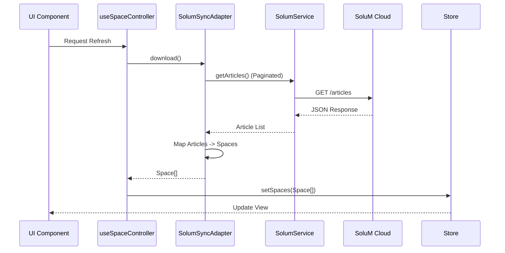
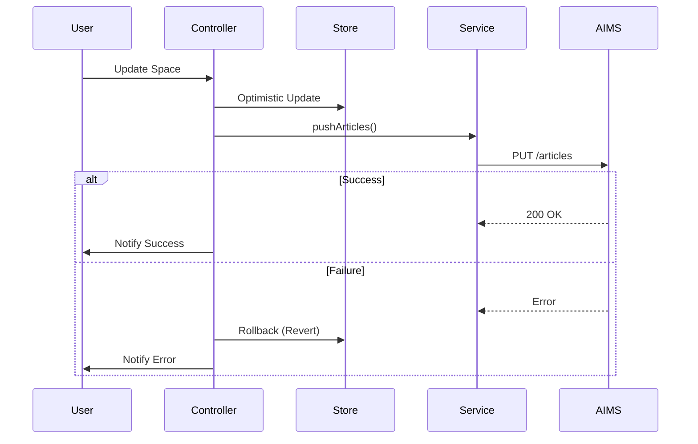

# Data Flow & Persistence

> **Detailed look at how data moves through `electisSpace`.**

## Data Persistence Strategy

| Data Type | Storage Mechanism | Reason |
|-----------|-------------------|--------|
| **Settings** | `localStorage` | Small, synchronous access needed, survives restart. |
| **Auth Tokens** | `localStorage` | Persist session across reloads. |
| **Spaces/People** | `IndexedDB` | Large datasets (10k+ items), async access. |
| **Logs** | `IndexedDB` | High volume, queryable history. |

## Sync Architecture

The core of the data flow is the **Sync Adapter Pattern**.

### 1. SoluM API Mode (Default)

**Read Flow (One-way Sync from AIMS)**


**Write Flow (Immediate Push)**


### 2. SFTP Mode (Legacy/CSVs)

**Write Flow (File Upload)**
1.  User updates a Space.
2.  `SFTPSyncAdapter` fetches **all** spaces from the Store.
3.  Converts all spaces to a single CSV string (using `PapaParse`).
4.  Uploads the CSV file to the SFTP server.

## Data Models

### Space Entity (Internal)
```typescript
interface Space {
  id: string;              // Primary Key (Article ID)
  labelCode?: string;      // Assigned ESL Label MAC
  templateName?: string;   // Visual Template
  data: Record<string, any>; // Dynamic data fields
}
```

### SoluM Article (External)
```json
{
  "articleId": "101",
  "articleName": "Room 101",
  "nfcUrl": "http://...",
  "data": {
    "customField1": "value"
  }
}
```
*Note: The Adapter handles the translation between `Space.data` and SoluM `article.data` based on `SolumMappingConfig`.*
