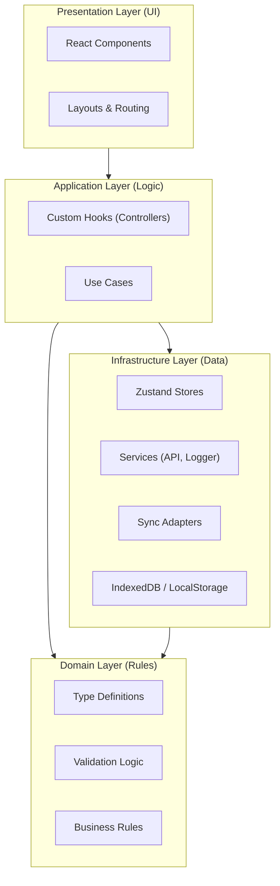

# High-Level Design (HLD)

> **Architectural overview of `electisSpace`.**

## System Architecture

The application follows a **Vertical Slice Architecture** combined with **Domain-Driven Design (DDD)** principles within the frontend.

## Component Architecture

### The Controller Pattern
We separate UI from Logic using the **Controller Pattern** (implemented via Custom Hooks).

- **View (`SpaceView.tsx`)**: Pure UI. Renders data, accepts user input.
- **Controller (`useSpaceController.ts`)**: Handles business logic.
    - Validates input using **Domain** rules.
    - Updates local **Store**.
    - Triggers **Sync** operations.
    - Returns data and handlers to the View.

### State Management Strategy
We use **Zustand** for global state.

- **Ephemereal State**: `useState` inside components (e.g., form inputs, dialog open state).
- **Global State**: `zustand` stores (e.g., list of spaces, user settings).
- **Server State**: Managed via custom `SyncAdapters` (fetching/pushing to AIMS/SFTP).

## Offline/Online Strategy

The app is **Offline First**.
1.  **Read**: UI always reads from the local Zustand Store (which hydrates from IndexedDB).
2.  **Write**: User updates local Store immediately (Optimistic UI).
3.  **Sync**: The `SyncSystem` pushes changes to the backend (SoluM/SFTP) in the background. If offline, changes remain local until reconnected/retried (Implementation detail: Currently manual/interval sync).

## Module Boundaries

Features are isolated in `src/features/`.
- **Shared Kernel**: `src/shared/` contains code used by multiple features (e.g., generic Types, Logger, SoluM Service).
- **Feature Isolation**: A feature should not import deep into another feature. Interaction happens via public interfaces (exported hooks/stores).
