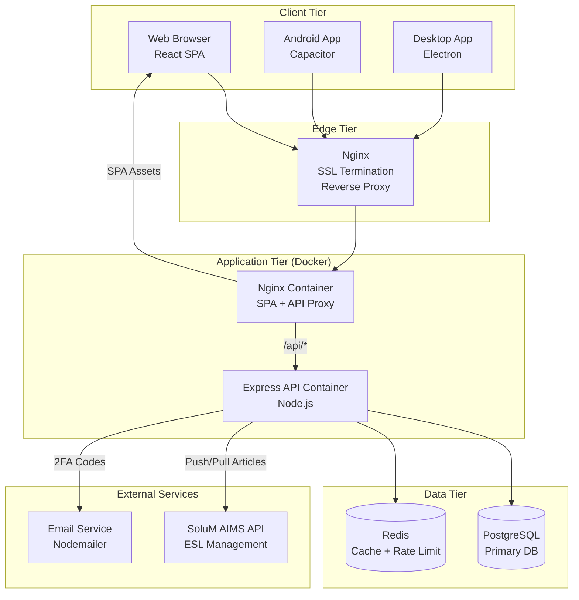

# Chapter 1 — System Overview & Philosophy

### 1.1 Business Context

electisSpace is a B2B SaaS platform for Electronic Shelf Label (ESL) management via the SoluM AIMS platform. It serves organizations that manage physical spaces (rooms, desks, chairs), people assignments, and conference rooms, all synchronized to physical e-ink labels through the SoluM AIMS API.

The platform supports two primary working modes:

- **Spaces Mode** — Manages physical spaces (desks, rooms, chairs) with labels displaying space-related data.
- **People Manager Mode** — Manages people assignments to numbered slots, with labels displaying person-related data.

### 1.2 Core Tech Stack

| Layer | Technology | Version |
|-------|-----------|---------|
| Frontend Framework | React | 19.2 |
| Language | TypeScript | 5.9 |
| Build Tool | Vite (rolldown-vite) | 7.2 |
| UI Library | MUI (Material UI) | 7.3 |
| State Management | Zustand | 5.0 |
| Routing | React Router | 7.10 |
| Backend Runtime | Node.js | >= 20.0 |
| Backend Framework | Express | 4.21 |
| ORM | Prisma | 7.0 |
| Database | PostgreSQL | — |
| Cache | Redis | 7 (Alpine) |
| Job Queue | Custom (Prisma-backed) | — |
| Mobile | Capacitor (Android) | 7.4 |
| Desktop | Electron | 39.x |
| Containerization | Docker (multi-stage) | — |
| Reverse Proxy | Nginx | Alpine |

### 1.3 High-Level Architecture



### 1.4 Design Principles

1. **Server-as-Source-of-Truth** — The server database is authoritative. AIMS is kept in sync, not the other way around.
2. **Feature-Based Architecture** — Both client and server are organized by business domain (spaces, people, conference, auth, sync, etc.), not by technical layer.
3. **Clean Architecture Layers** (client) — Each feature follows `domain/ -> application/ -> infrastructure/ -> presentation/`.
4. **Multi-Tenant by Design** — Company -> Store hierarchy with fine-grained role-based access control.
5. **Graceful Degradation** — Redis failures are non-fatal (cache misses, no-op writes). AIMS sync failures are retried with exponential backoff.
6. **Singleton Services** — Key server services (SSE Manager, AIMS Gateway, Sync Queue) use the singleton pattern for consistent state.

### 1.5 Repository Structure

```
electisSpace/
  ├── src/                      # Frontend (React SPA)
  │   ├── features/             # Feature modules (auth, space, people, conference, ...)
  │   ├── shared/               # Shared code (services, stores, components, hooks)
  │   ├── locales/              # i18n translations (en, he)
  │   ├── i18n/                 # i18n configuration
  │   ├── App.tsx               # Root component
  │   ├── AppRoutes.tsx         # Route definitions
  │   └── theme.ts              # MUI theme configuration
  ├── server/                   # Backend (Express API)
  │   ├── src/
  │   │   ├── features/         # Feature modules (same domain split)
  │   │   ├── shared/           # Middleware, services, infrastructure
  │   │   ├── config/           # Environment, database, Redis config
  │   │   ├── app.ts            # Express app setup
  │   │   └── server.ts         # Entry point, lifecycle, background jobs
  │   ├── prisma/               # Prisma schema and migrations
  │   └── Dockerfile            # Server container build
  ├── client/                   # Client container config
  │   ├── Dockerfile            # SPA + Nginx build
  │   └── nginx.conf            # Internal Nginx config
  ├── electron/                 # Electron desktop wrapper
  ├── android/                  # Capacitor Android project
  ├── deploy/                   # Deployment configs and env files
  ├── docker-compose.app.yml    # Application containers
  ├── docker-compose.infra.yml  # Infrastructure containers (Redis, Loki, Promtail, Grafana)
  ├── infra/                    # Observability config (loki, promtail, grafana)
  ├── e2e/                      # Playwright E2E tests
  └── docs/                     # Documentation
```
