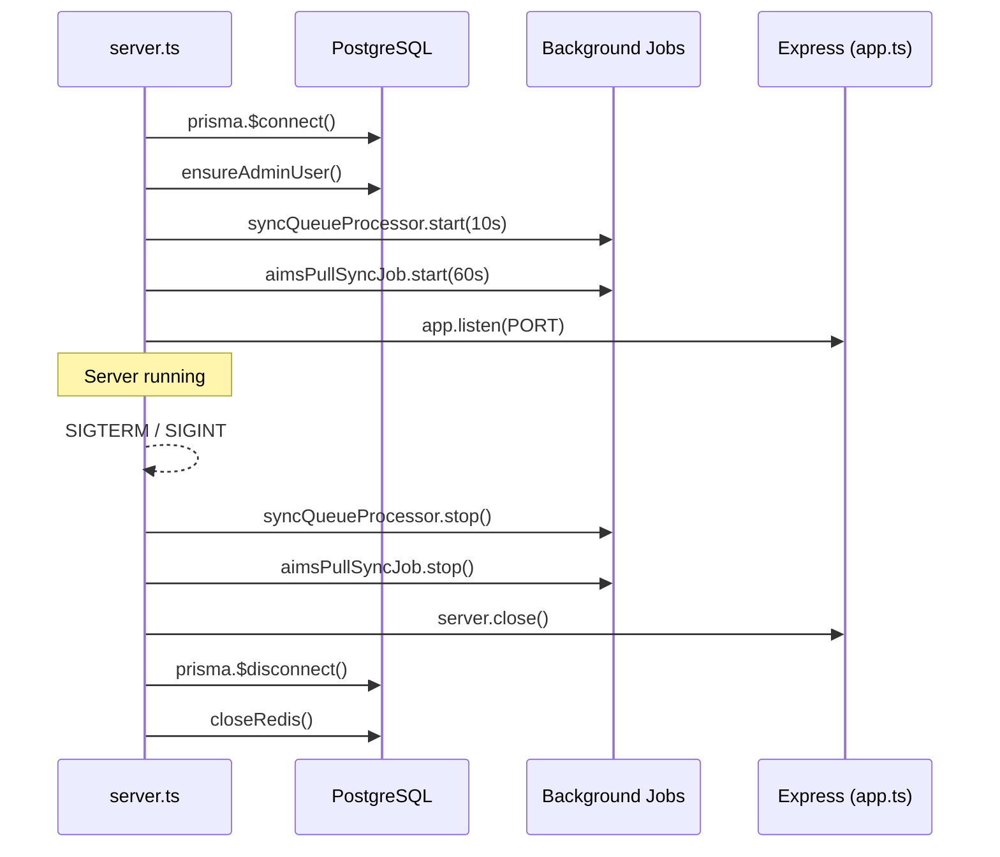
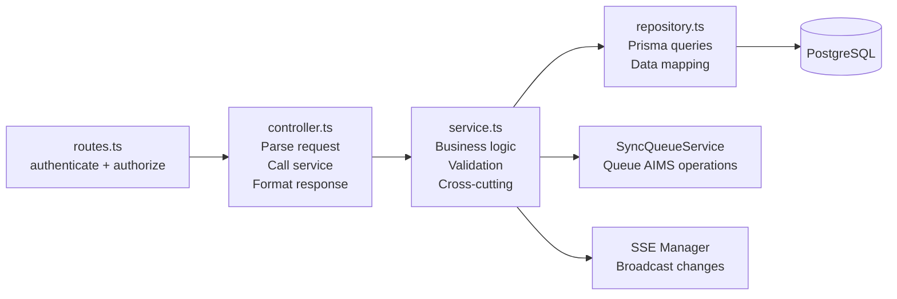
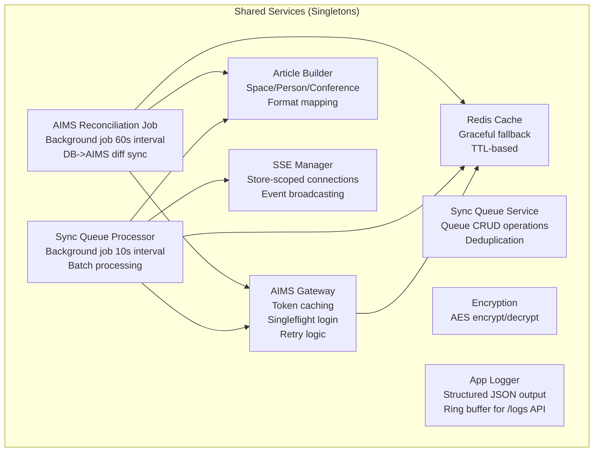

# Chapter 3 — Server Architecture

### 3.1 Server Entry Point & Lifecycle



The server starts by connecting to PostgreSQL, ensuring the admin user exists (from env vars), starting two background jobs, and then listening for HTTP connections. Graceful shutdown reverses this order with a 10-second force-kill timeout.

### 3.2 Express Middleware Pipeline

```mermaid
graph LR
    REQ[Incoming Request] --> TRUSTPROXY[Trust Proxy]
    TRUSTPROXY --> REQID[Request ID]
    REQID --> HELMET[Helmet<br/>CSP + Security]
    HELMET --> CORS[CORS]
    CORS --> BODYPARSE[Body Parser<br/>JSON 10MB limit]
    BODYPARSE --> COOKIE[Cookie Parser]
    COOKIE --> COMPRESS[Compression<br/>SSE excluded]
    COMPRESS --> MORGAN[Morgan Logger<br/>JSON via appLogger]
    MORGAN --> RATELIMIT[Rate Limiter<br/>100/min]
    RATELIMIT --> ROUTES[API Routes]
    ROUTES --> NOTFOUND[404 Handler]
    NOTFOUND --> ERROR[Error Handler]
```



Key middleware decisions:
- **Compression** explicitly excludes `text/event-stream` responses to avoid SSE buffering.
- **Rate limiting** applies globally at 100 requests per minute per IP, with additional per-endpoint limiters on auth routes.
- **Request IDs** are generated and logged for cross-service correlation.
- **Morgan** outputs structured JSON via `appLogger` (not plain text), enabling Loki-based HTTP request analysis.

### 3.3 Feature Module Pattern (Server)

Each server feature follows a consistent five-file pattern:

```
server/src/features/{feature}/
  ├── routes.ts       # Route definitions with middleware
  ├── controller.ts   # HTTP request/response handling
  ├── service.ts      # Business logic
  ├── repository.ts   # Data access (Prisma queries)
  ├── types.ts        # TypeScript interfaces
  └── index.ts        # Barrel exports
```



### 3.4 API Route Map

All routes are versioned under `/api/v1/`:

| Prefix | Feature | Auth | Key Endpoints |
|--------|---------|------|--------------|
| `/auth` | Authentication | Partial | `POST /login`, `POST /verify-2fa`, `POST /refresh`, `GET /me` |
| `/users` | User Management | Yes | CRUD, role assignment |
| `/companies` | Company Management | Yes | CRUD, AIMS credential config |
| `/` (root) | Store Management | Yes | CRUD on stores, context switching |
| `/spaces` | Space Management | Yes | CRUD, label assignment, force sync |
| `/people` | People Management | Yes | CRUD, import, assignment |
| `/conference` | Conference Rooms | Yes | CRUD, meeting toggle |
| `/settings` | Settings | Yes | Read/update company & store settings |
| `/labels` | Label Management | Yes | List, link/unlink, blink, image push |
| `/sync` | Synchronization | Yes | Pull, push, full sync, queue management |
| `/people-lists` | People Lists | Yes | CRUD, membership management |
| `/spaces-lists` | Spaces Lists | Yes | CRUD, snapshot content |
| `/logs` | Server Logs | PLATFORM_ADMIN | In-memory log buffer, stats, clear |
| `/admin` | Platform Admin | PLATFORM_ADMIN | User management, system operations |
| `/health` | Health Check | No | Server status |
| `/stores/:storeId/events` | SSE | Yes | Real-time event stream |

### 3.5 Shared Infrastructure Services



#### AIMS Gateway (`aimsGateway.ts`)

The gateway manages all communication with the SoluM AIMS API:

- **Credential Management** — Retrieves and decrypts AIMS credentials from the Company record.
- **Token Caching** — In-memory token cache per company with 5-minute expiry buffer.
- **Singleflight Pattern** — Prevents concurrent duplicate login requests for the same company.
- **Retry Logic** — Exponential backoff with jitter for transient failures (429, 5xx).
- **Article Format Caching** — Three-tier cache: in-memory (30min) -> DB (Company.settings) -> AIMS live fetch.
- **Batch Operations** — Handles batching (max 500 articles per AIMS POST request).
- **Auto-retry on Auth Errors** — Invalidates cached token and retries once on 401/403.

#### Sync Queue Processor (`SyncQueueProcessor.ts`)

Runs every 10 seconds as a background job:

1. Atomically claims pending items older than 5 seconds (prevents double-processing).
2. Groups items by store for batch efficiency.
3. Builds AIMS articles using the Article Builder.
4. Pushes/deletes articles via the AIMS Gateway.
5. Updates entity sync status (PENDING -> SYNCED or FAILED).
6. Retries failed items with exponential backoff (1s base, 60s max, 5 max attempts).
7. Broadcasts SSE events to notify connected clients.

#### AIMS Reconciliation Job (`AimsPullSyncJob.ts`)

Runs every 60 seconds as a background job (15-second initial delay):

1. Identifies all active stores with configured AIMS credentials.
2. Builds the expected article set from the database (mode-aware: spaces vs. people).
3. Fetches current articles from AIMS.
4. Diffs expected vs. actual: pushes missing/changed, deletes extras.
5. Syncs `assignedLabels` from AIMS article info endpoint back to the DB.
6. Performs post-sync validation (informational logging only).

#### SSE Manager (`SseManager.ts`)

Manages Server-Sent Events connections per store:

- **Connection Limits** — 500 total, 50 per store.
- **Store-Scoped Broadcasting** — Events are sent only to clients connected to the affected store.
- **Originator Exclusion** — The client that triggered a change can be excluded from the broadcast.
- **Keep-Alive** — 30-second ping to prevent connection timeout.
- **Event Types**: `people:changed`, `list:loaded`, `list:freed`, `list:updated`, `conference:changed`.

#### App Logger (`appLogger.ts`)

A structured JSON logging service that replaces all `console.*` calls across the server runtime:

- **Structured Output** — Emits one JSON object per line to stdout/stderr for Promtail ingestion into Grafana Loki.
- **Log Levels** — `debug`, `info`, `warn`, `error` — configurable via `LOG_LEVEL` env var.
- **Component Tagging** — Every log entry includes a `component` field (e.g., `AimsGateway`, `SyncQueue`, `SSE`) for filtering.
- **Ring Buffer** — Retains the last 2,000 entries in memory, exposed via the `/logs` API for live admin dashboards.
- **Context-Aware Children** — `appLogger.withContext({ requestId, userId, storeId })` returns a child logger that enriches every entry with request context.
- **Performance Timers** — `startTimer()` / `endTimer()` and `measureAsync()` for structured duration tracking.
- **Stats API** — `getStats()` returns aggregated counts by level and component.

All server features, jobs, and middleware use `appLogger` exclusively — `console.*` is reserved only for pre-boot bootstrap code (server.ts, env.ts, redis.ts).

### 3.6 Configuration & Environment

Environment variables are validated at startup using Zod schemas (`config/env.ts`). The server fails fast on invalid configuration.

Key configuration categories:

| Category | Variables | Notes |
|----------|----------|-------|
| Server | `NODE_ENV`, `PORT`, `API_VERSION` | Defaults: development, 3000, v1 |
| Database | `DATABASE_URL`, `DB_POOL_MAX` | PostgreSQL connection string |
| Redis | `REDIS_URL` | Default: localhost:6379 |
| JWT | `JWT_ACCESS_SECRET`, `JWT_REFRESH_SECRET`, expiry times | 32+ char secrets |
| Encryption | `ENCRYPTION_KEY` | 32+ chars, for AIMS password encryption |
| CORS | `CORS_ORIGINS` | Comma-separated origins |
| Rate Limiting | Global + auth-specific configs | Separate limits for login, 2FA, password reset |
| Admin | `ADMIN_EMAIL`, `ADMIN_PASSWORD` | Auto-created on startup |

Docker-aware loading: if `DATABASE_URL` is already set as an OS env var (Docker), `.env` files are loaded without overriding Docker-injected variables.
