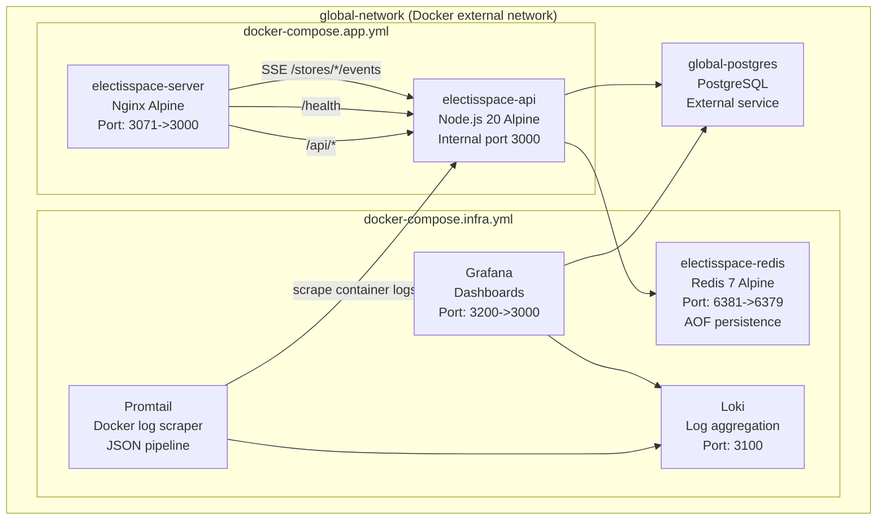
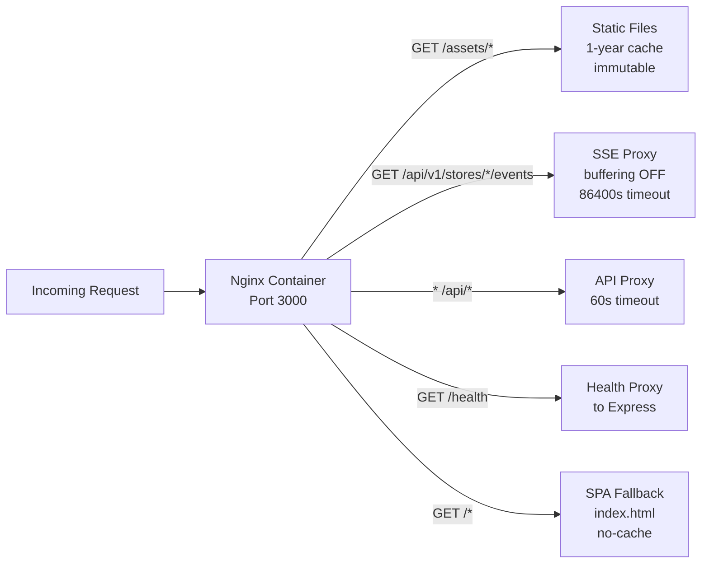
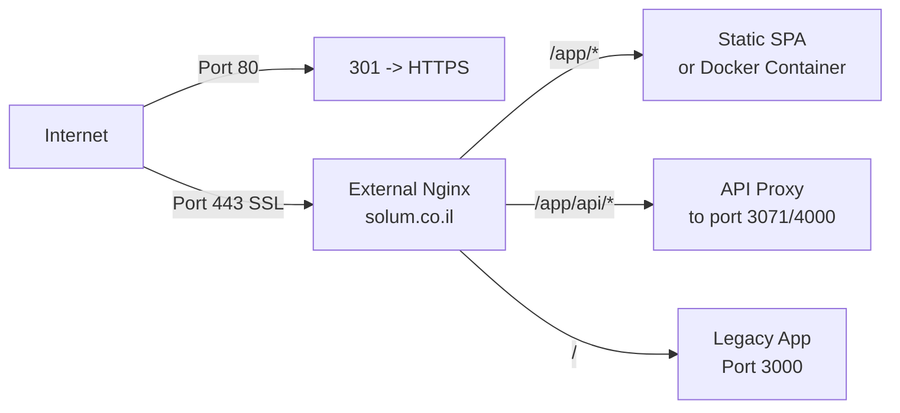
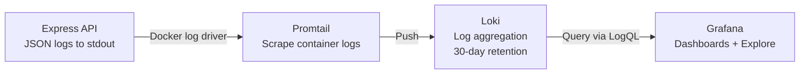
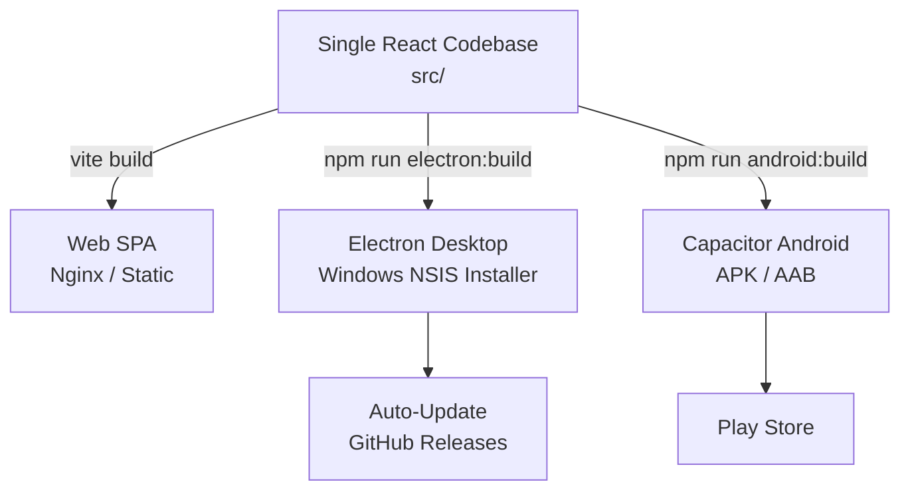

# Chapter 6 — Infrastructure & Deployment

### 6.1 Container Architecture



### 6.2 Container Build Strategy

Both containers use multi-stage Docker builds for minimal production images:

**Client Container (Nginx)**:
```
Stage 1: node:20-alpine
  - npm ci (install dependencies)
  - npm run build (Vite build with VITE_BASE_PATH arg)

Stage 2: nginx:alpine
  - Copy custom nginx.conf
  - Copy built SPA from Stage 1
  - Serve on port 3000
```

**Server Container (Node.js)**:
```
Stage 1: node:20-alpine (builder)
  - npm ci (all dependencies)
  - npx prisma generate
  - npm run build (TypeScript compilation)

Stage 2: node:20-alpine (production)
  - npm ci --only=production
  - Copy Prisma client from Stage 1
  - Copy compiled JS from Stage 1
  - Run as non-root 'nodejs' user (UID 1001)
  - dumb-init for proper signal handling
```

### 6.3 Nginx Configuration (Internal)

The internal Nginx container (`client/nginx.conf`) serves dual roles:



Critical SSE configuration:
- Regex location `~ ^/api/v1/stores/.+/events$` matches SSE endpoints **before** the generic `/api/` block.
- `proxy_buffering off` and `chunked_transfer_encoding off` prevent Nginx from buffering the event stream.
- `proxy_read_timeout 86400s` (24 hours) allows long-lived SSE connections.
- `Connection ''` header (empty) ensures HTTP/1.1 keep-alive without `Connection: upgrade`.

### 6.4 Nginx Configuration (External / SSL)

The external Nginx (host-level) provides SSL termination:



Key SSL/proxy settings:
- HTTP/2 enabled.
- `proxy_buffering off` for SSE endpoints.
- `proxy_read_timeout 86400s` for SSE.
- `client_max_body_size 10m` for file uploads.

### 6.5 Deployment Topology

```mermaid
graph TB
    subgraph "Ubuntu Production Server"
        subgraph "Docker Engine"
            REDIS_C[Redis Container]
            CLIENT_C[Nginx+SPA Container]
            API_C[Express API Container]
        end

        NGINX_H[Nginx Host Service<br/>SSL Termination]
        PG_H[PostgreSQL<br/>Global Service]

        NGINX_H -->|:3071| CLIENT_C
        CLIENT_C --> API_C
        API_C --> PG_H
        API_C --> REDIS_C
    end

    subgraph "Windows Deployment (Alternative)"
        PM2[PM2 Process Manager]
        NGINX_W[Nginx (Windows)]
        PG_W[PostgreSQL (Local)]

        NGINX_W -->|:4000| PM2
        PM2 --> PG_W
    end
```

Two deployment modes are supported:

1. **Docker (Ubuntu)** -- Production deployment using `docker-compose.infra.yml` + `docker-compose.app.yml` on an external `global-network`.
2. **PM2 (Windows)** -- Alternative deployment using PM2 (`ecosystem.config.cjs`) for the Node.js server with a host-level Nginx for the SPA.

### 6.6 Build & Deployment Commands

```bash
# Infrastructure (one-time setup)
docker compose -f docker-compose.infra.yml up -d

# Application build and deploy
docker compose -f docker-compose.infra.yml -f docker-compose.app.yml build
docker compose -f docker-compose.infra.yml -f docker-compose.app.yml up -d

# Database migrations
docker exec electisspace-api npx prisma migrate deploy

# View logs
docker logs electisspace-api --tail=100 -f
docker logs electisspace-server --tail=100 -f
```

### 6.7 Health Checks

| Service | Endpoint | Interval | Start Period |
|---------|---------|----------|-------------|
| Redis | `redis-cli ping` | 10s | -- |
| Express API | `GET /health` | 30s | 40s |
| Nginx Client | `GET /` | 30s | 10s |
| Loki | `GET /ready` | 30s | 30s |
| Grafana | `GET /api/health` | 30s | 30s |

### 6.8 Observability Stack (Loki + Promtail + Grafana)



The server emits **structured JSON** log lines (via `appLogger`) to stdout/stderr. Docker captures these as container logs, and Promtail scrapes them:

1. **Promtail** (`infra/promtail-config.yml`) -- Scrapes Docker container logs via `/var/lib/docker/containers`. Uses a JSON parsing pipeline stage to extract structured fields (`level`, `component`, `service`, `message`).
2. **Loki** (`infra/loki-config.yml`) -- Single-process mode with 30-day retention. Stores index and chunks in `/loki/data`.
3. **Grafana** (`infra/grafana-datasources.yml`) -- Auto-provisioned with Loki as the default datasource. Accessible on port 3200.

In addition to the Loki pipeline, the server exposes an in-memory log API (`GET /api/v1/logs`) that serves the last 2,000 log entries directly from the `appLogger` ring buffer — useful for quick diagnostics without Grafana.

### 6.9 Multi-Platform Support



- **Web**: Standard SPA served by Nginx.
- **Electron**: Wraps the SPA in a Chromium window with native features (file system, auto-update via GitHub releases, custom title bar).
- **Capacitor**: Wraps the SPA in a WebView for Android with native plugins (file system, network, preferences).
