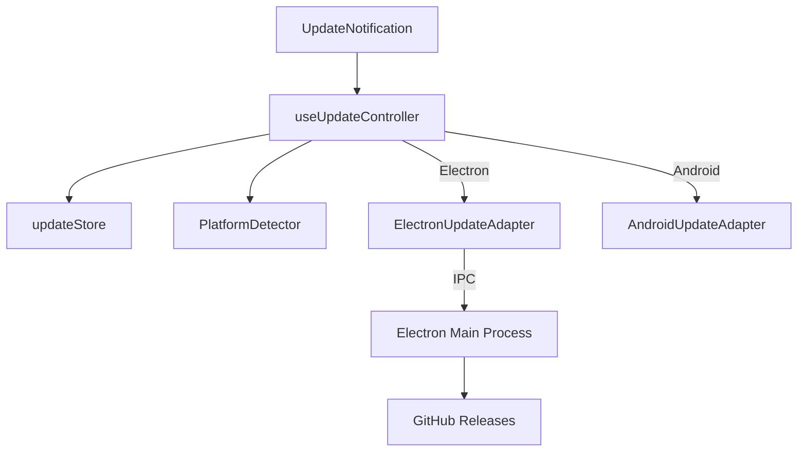

# Feature Deep Dive: Auto-Update

> **Status**: Production Ready (Windows/Electron) / Planned (Android/Capacitor)
> **Controller**: `useUpdateController.ts`
> **Infrastructure**: `electron-updater` (Windows), `Capacitor OTA` (Android)

## 1. Overview

The Auto-Update feature ensures clients are always running the latest version. It abstracts the platform differences (Windows vs Android) behind a unified `UpdateController`.

## 2. Architecture

### 2.1 Strategy by Platform
1.  **Windows (Electron)**:
    - Uses `electron-updater`.
    - Updates are published to **GitHub Releases**.
    - Supports background download + "Restart to Install".
2.  **Android (Capacitor)**:
    - Uses **GitHub API** to check for new APKs.
    - Prompts user to download/install the new APK.
3.  **Web**:
    - Checks GitHub API.
    - Notifies user to refresh/clear cache.

## 3. Workflow (Electron)

1.  **Check**: `checkForUpdates()` triggers `autoUpdater.checkForUpdates()` in Main process.
2.  **Discovery**: `autoUpdater` checks `latest.yml` on GitHub.
3.  **Notification**: If new version > current version, Main sends `update-available` to Renderer.
4.  **Download**:
    - If `policy: 'auto'`, download starts automatically.
    - Main sends `download-progress` events.
5.  **Install**:
    - Main sends `update-downloaded`.
    - Controller calls `quitAndInstall()`.

## 4. Components

- **`useUpdateController`**: The brain. Handles version comparison, skipping versions, and orchestration.
- **`UpdateNotification`**: Toast component that shows "Update Available" or Progress bar.
- **`UpdateSettings`**: UI to toggling auto-check.

## 5. Security & Signing
- **Windows**: The NSIS installer is signed (Self-Signed for internal, or EV for public). Use `electron-builder` config in `package.json`.
- **GitHub**: We use private/public repos. Tokens must be managed carefully if private.
