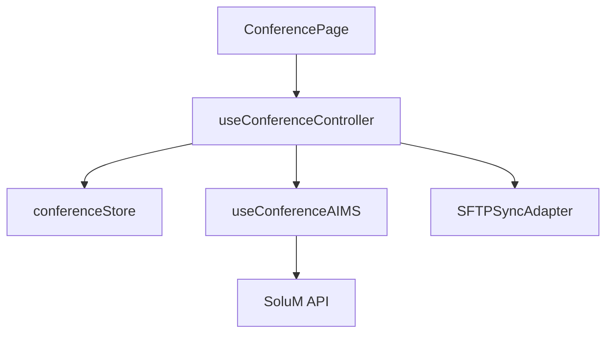

# Feature Deep Dive: Conference Rooms

> **Status**: Production Ready
> **Controller**: `useConferenceController.ts`
> **Store**: `conferenceStore.ts`
> **Key Hook**: `useConferenceAIMS.ts`

## 1. Overview

The Conference Room feature manages meeting spaces that display "Occupied/Available" status on electronic shelf labels. It supports two modes of operation:
1.  **Meeting Mode**: Displays meeting Name, Time, and Participants.
2.  **Toggle Mode**: Simple "Occupied/Free" toggle (often used with 2-page labels).

## 2. Architecture



### 2.1 Data Model (`ConferenceRoom`)
Unlike `Space` (which is a generic key-value bag), `ConferenceRoom` is a structured entity:

```typescript
interface ConferenceRoom {
    id: string;          // Must start with 'C' (e.g., "C101") internally
    hasMeeting: boolean; // Primary status flag
    meetingName: string;
    startTime: string;   // ISO or HH:mm
    endTime: string;
    participants: string[];
    labelCode?: string;
}
```

## 3. Storage & State

### 3.1 Local Persistence
- **Store**: `useConferenceStore` (Zustand)
- **Persistence**: `idb-keyval` (IndexedDB)
- **Reason**: We persist rooms locally so the UI works offline.

### 3.2 State Logic
- **Toggling**: When `toggleMeeting(id)` is called:
    - If turning **OFF**: Clears `meetingName`, `startTime`, `endTime`, `participants`.
    - If turning **ON**: Sets `hasMeeting = true` (leaves fields empty for user input).

---

## 4. Workflows

### 4.1 AIMS Integration (SoluM API)
In this mode, the app acts as a **Controller** for the labels.

**Fetch Logic (`fetchFromSolum`)**:
1.  Downloads *ALL* articles.
2.  **Filter**: Keeps only articles where `articleId` starts with `C` (case-insensitive) or `type='conference'`.
3.  **Map**: Converts SoluM `data` fields to `ConferenceRoom` struct using `solumMappingConfig`.

**Update Logic**:
- Uses `useConferenceAIMS` hook.
- `pushToAIMS`: Upserts the article with the new status.
- `flipLabelPage`: Special command to trigger physical page turn on the label (User-facing feature: "Flip to Page 2").

### 4.2 SFTP Integration (Files)
In this mode, the app acts as a **CSV Editor**.

**"Upload on Change" Pattern**:
Unlike the Sync Engine which allows bulk operations, Conference changes in SFTP mode are **atomic and immediate**.
1.  User adds/updates a room.
2.  Controller updates Local Store.
3.  **IMMEDIATELY** triggers `uploadToSFTP()`.
    - Generates full CSV (Spaces + Rooms).
    - Overwrites server file.
4.  **Rollback**: If upload fails, the Local Store change is reverted to ensure consistency.

---

## 5. Edge Cases

### 5.1 ID Conflicts
- The system enforces unique IDs.
- If a user tries to create `C101` when `C101` exists, the controller throws generic "ID already exists".

### 5.2 Concurrent Edits
- **SoluM**: Last write wins. The `pushToAIMS` simply overwrites the article data.
- **SFTP**: Risky. If two users edit different rooms simultaneously, the "Upload on Change" might overwrite the other's work (since it uploads the full CSV). *Recommendation: Use SoluM API for multi-user environments.*
