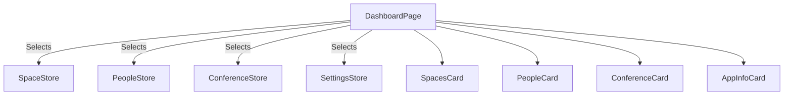

# Feature Deep Dive: Dashboard

> **Status**: Production Stable
> **Component**: `DashboardPage.tsx`
> **Role**: Aggregator

## 1. Overview

The Dashboard is the landing page of the application. It does not manage its own state; instead, it aggregates data from all other stores (`Space`, `people`, `conference`) to provide a high-level overview.

## 2. Architecture

### 2.1 Aggregation Logic
The Dashboard calculates stats on-the-fly during render (or via `useMemo` for expensive ops).

- **Available Spaces**: `spaces.length`
- **Assigned Labels**:
  - Iterates over `spaces` AND `conferenceRooms`.
  - Sums `assignedLabels.length` (array of bound ESLs).
  - *Why?* A single space can have multiple labels bound to it in SoluM.

### 2.2 Mode Switching
The dashboard morphs based on `settings.peopleManagerEnabled`.

| Mode | Left Card | Data Source |
| :--- | :--- | :--- |
| **Standard** | **Spaces Overview** | `spacesStore` (Total Spaces, Label Coverage) |
| **People Manager** | **People Overview** | `peopleStore` (Assigned People, Unassigned, Active List) |

## 3. Performance
Since the dashboard subscribes to multiple stores, it could re-render frequently.
- **Optimization**: We use granular selectors or `useMemo` where appropriate.
- **Lazy Loading**: The "Add Space/Conference" dialogs are lazy-loaded (`React.lazy`) to reduce initial bundle size.

## 4. Components

- **`DashboardSpacesCard`**: Quick stats for physical spaces.
- **`DashboardPeopleCard`**: Stats for people/desks (Assignment %).
- **`DashboardConferenceCard`**: Meeting room occupancy stats.
- **`DashboardAppInfoCard`**: Technical status (Sync Interval, Connection Mode, Last Sync Time).
