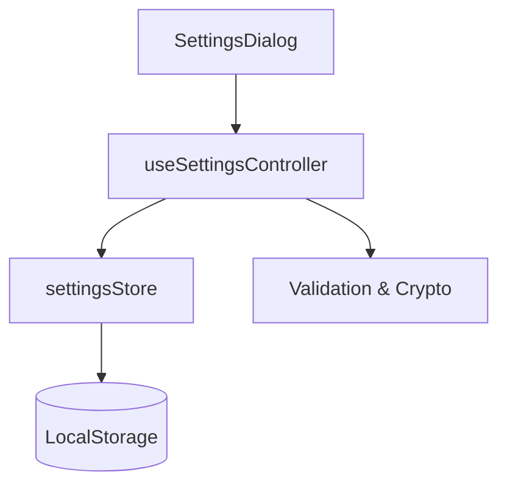

# Feature Deep Dive: Settings & Configuration

> **Status**: Production Stable
> **Controller**: `useSettingsController.ts`
> **Store**: `settingsStore.ts`
> **Persistence**: LocalStorage

## 1. Overview

The Settings feature is the control center of the application. It manages global configuration, authentication credentials, and the active Working Mode (`SoluM API` vs `SFTP`).

## 2. Architecture

### 2.1 Persistence Strategy
Unlike operational data (Spaces/People) which uses IndexedDB, Settings are stored in **LocalStorage** for synchronous access during app boot.

- **Store Name**: `settings-store`
- **Persisted**: All `SettingsData`, `passwordHash`.
- **Transient**: `isLocked` (Resets on reload).

## 3. Security Model

### 3.1 App Lock
The application supports a PIN/Password lock to prevent unauthorized configuration changes.
- **Storage**: Passwords are **Hashed** before storage (SHA-256 via `subtle.crypto` or simplistic hash depending on implementation).
- **Admin Override**: A hardcoded `VITE_ADMIN_PASSWORD` (env var) allows emergency access if the user forgets their PIN.

### 3.2 Credentials Storage
> **Warning**: Credentials (SFTP Password, SoluM Tokens) are currently stored in **LocalStorage**.
- While LocalStorage is sandboxed to the domain, physical access to the unlocked machine could reveal these credentials via DevTools.

## 4. Workflows

### 4.1 Mode Switching (Destructive)
Switching between `SoluM API` and `SFTP` is a fundamental architectural change, not just a toggle.

**The "Disconnect" Protocol**:
When a user disconnects from SoluM or changes modes, the `useSettingsController` triggers a **Deep Clean**:
1.  Clears Tokens/Credentials for the old mode.
2.  **WIPES ALL DATA STORES**:
    - `spacesStore.clearAllData()`
    - `peopleStore.clearAllData()`
    - `conferenceStore.clearAllData()`
    
> **Why?** Data from SoluM API (mapped from Articles) is structurally incompatible with data from SFTP (mapped from CSV columns). Mixing them would cause corruption. The app enforces a "Fresh Start" on mode switch.

### 4.2 Import/Export
- **Export**: Serializes `SettingsData` to a JSON file. Can be optionally encrypted with a password.
- **Import**: Decrypts (if needed) and hydrates the store.

## 5. Components

- **`SettingsDialog`**: The main container.
- **`SolumSettingsTab`**: Connection & Mapping UI.
- **`SFTPSettingsTab`**: Credential & CSV Column Mapping UI.
- **`GeneralSettingsTab`**: Appearance & Logos.
