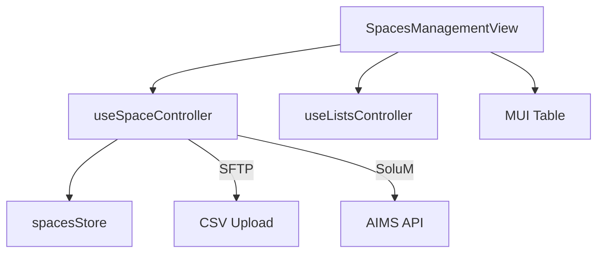

# Feature Deep Dive: Standard Spaces

> **Status**: Production Stable
> **Component**: `SpacesManagementView.tsx`
> **Controller**: `useSpaceController.ts`

## 1. Overview

"Spaces" are the fundamental unit of the application. A Space represents a physical location (Desk, Room, Shelf) that can be labeled with an ESL.

In **Standard Mode** (People Manager Disabled), this feature provides a CRUD interface for managing these spaces directly.

## 2. Architecture

### 2.1 Dynamic Table Columns
The Spaces Table is not hardcoded. Its columns are generated dynamically based on the active Mapping Configuration.

- **SoluM Mode**: Columns = `solumMappingConfig.fields` (where `visible: true`).
- **SFTP Mode**: Columns = `sftpCsvConfig.columns` (where `required: true`).

This allows the UI to adapt to any customer's data schema without code changes.

### 2.2 List Management Integration
The view integrates with the **Lists System** (`useListsController`), allowing users to:
- **Save List**: Snapshot the current set of Spaces into a named list.
- **Load List**: Restore a previous snapshot.
- **Recover ID**: Auto-recovers `activeListId` if `activeListName` persists but ID is lost (e.g., after clear).

## 3. Workflows

### 3.1 Filtering & Sorting
Filtering happens client-side (since we hold full state).
1.  **Type Filter**: In SFTP mode, we automatically exclude IDs starting with 'C' (Conference Rooms).
2.  **Search**: Fuzzy match against `ID` OR any `Data Value`.
3.  **Sort**: Alphanumeric sort (smart enough to sort `Desk 1, Desk 2, Desk 10` correctly).

### 3.2 CRUD Actions
- **Add/Edit**: Opens `SpaceDialog`.
    - Validation checks against the *current* Config schema.
- **Delete**: Requires confirmation. In SFTP mode, immediately triggers `uploadToSFTP()` (Destructive).

## 4. Components

- **`SpacesManagementView`**: The main container.
- **`SpaceDialog`**: Dynamic form renderer based on config.
- **`ListsManagerDialog`**: UI for saved lists.
