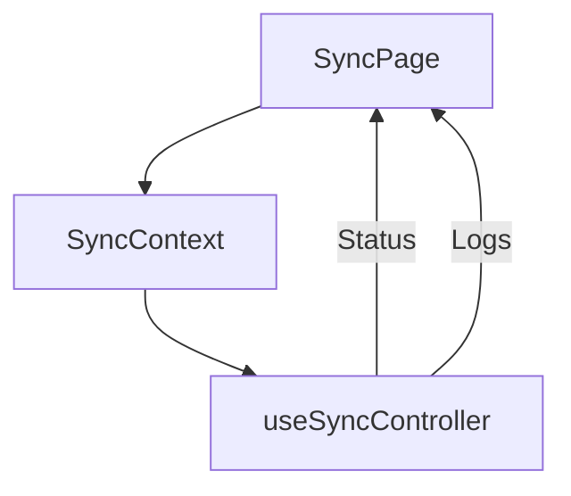

# Feature Deep Dive: Sync System UI

> **Status**: Production Stable
> **Component**: `SyncPage.tsx`
> **Underlying Engine**: `MECHANICS_SYNC.md`

## 1. Overview

While the *Sync Engine* runs typically in the background, the **Sync Page** provides a foreground interface for administrators to monitor status, trigger manual syncs, and view logs.

## 2. Architecture

### 2.1 The Sync Context
To avoid prop drilling sync status to every component (Header, Dashboard, SyncPage), we use a React Context (`SyncContext`).
- **Provider**: Wraps the entire App.
- **Value**: Exposes `syncState` (Idle, Syncing, Error) and `sync()` trigger.

## 3. Workflows

### 3.1 Manual Sync
1.  User clicks "Sync Now".
2.  `SyncPage` calls `sync()`.
3.  **UI Feedback**:
    - Disables button.
    - Shows CircularProgress.
    - Updates textual status ("Downloading...", "Uploading...").

### 3.2 Log Viewer
The page displays a real-time log of the sync session.
- **Source**: `logger` service (InMemory buffer or IDB).
- **Format**: Timestamp - Level - Message.

## 4. Components

- **`SyncPage`**: Main view.
- **`SyncStatusChip`**: Small indicator used in Header/Dashboard (Green/Red dot).

---
*See [MECHANICS_SYNC](../mechanics/MECHANICS_SYNC.md) for the internal logic.*
