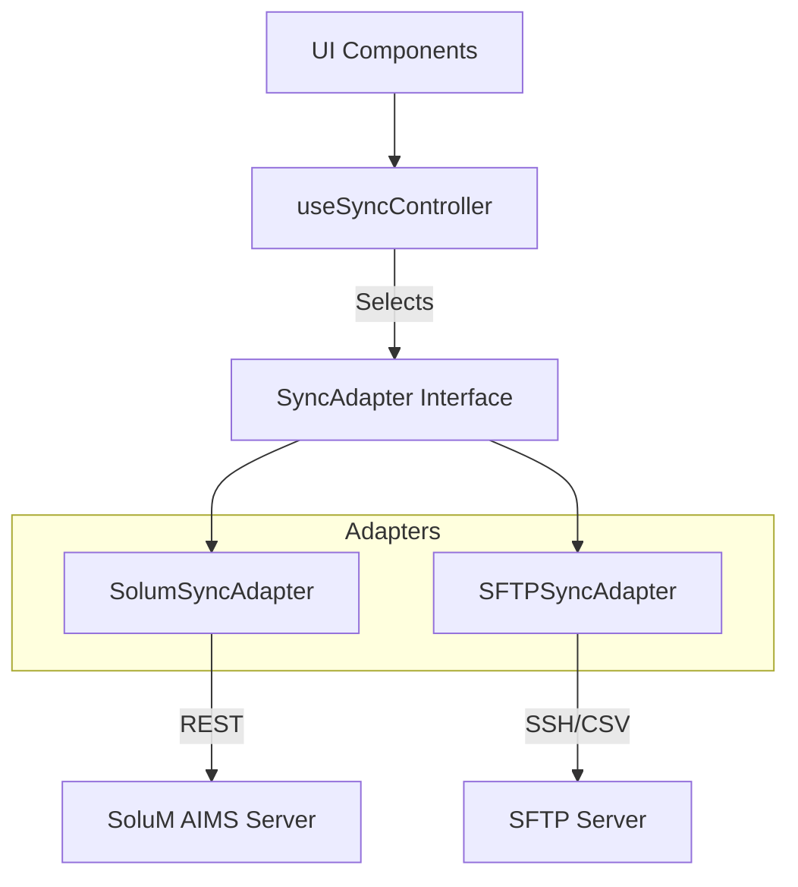

# Core Mechanics: Synchronization Engine

> **Module**: `src/features/sync`
> **Primary Controller**: `useSyncController`
> **Status**: Production Critical

## 1. Overview

The Synchronization Engine is the heartbeat of `electisSpace`. It is responsible for bidirectional data transfer between the local application (Zustand Stores) and the external source of truth (SoluM AIMS Server _or_ SFTP Server).

It supports two mutually exclusive **Working Modes**:
1.  **SoluM API Mode**: Direct REST API integration with AIMS.
2.  **SFTP Mode**: File-based integration via CSV upload/download.

## 2. Architecture



### 2.1 The `SyncAdapter` Interface
To switch modes seamlessly, we use the Adapter Pattern. Both adapters implement:

```typescript
interface SyncAdapter {
    connect(): Promise<void>;
    disconnect(): Promise<void>;
    
    // Core Data Operations
    download(): Promise<Space[]>;
    upload(spaces: Space[]): Promise<void>;
    
    // Advanced Operations
    safeUpload(spaces: Space[]): Promise<void>; // Fetch-Merge-Push
    
    getStatus(): SyncState;
}
```

---

## 3. SoluM API Mode (`SolumSyncAdapter`)

Direct integration with the SoluM AIMS REST API. This is the preferred mode for real-time updates.

### 3.1 Authentication & Token Management
- **Login**: Uses `POST /common/api/v2/login/company/user`.
- **Token Handling**:
    - Stores `accessToken` and `refreshToken`.
    - **Refresh Loop**: Before every request, `getValidToken()` checks expiry.
    - If `< 5 minutes` remain, it calls `refreshToken()`.
    - If refresh fails, it attempts a fresh `login()`.

### 3.2 The "Safe Upload" Protocol (Critical)
To prevent overwriting data when multiple users edit the same system, we implement a **Fetch-Merge-Push** strategy instead of a blind overwrite.

**Algorithm:**
1.  **Fetch**: Download *ALL* remote articles from AIMS (Paginated).
2.  **Map**: Convert local `Space` objects to Partial Articles.
3.  **Merge**:
    - Find matching remote article.
    - Overlay local changes ON TOP of remote data.
    - **Preserve**: Fields that exist remotely but not locally are *kept* (not deleted).
4.  **Push**: Send the merged objects back to AIMS (`PUT /articles`).

> **Why?** AIMS treats `PUT` as a complete replacement. If we send a partial object, AIMS deletes the missing fields. Safe Upload prevents this data loss.

### 3.3 Virtual Pools (People Integration)
The Sync Adapter is aware of "Virtual Spaces" (People Mode).
- **Mapping**: `POOL-XXXX` IDs are treated as valid Articles.
- **Metadata**: Preserves `__PERSON_UUID__` and `_LIST_MEMBERSHIPS_` JSON strings inside the `data` object to ensure cross-device consistency.

---

## 4. SFTP Mode (`SFTPSyncAdapter`)

File-based legacy integration.

### 4.1 CSV Transformation
- **Read**: Downloads `electis_space.csv` (or configured name).
- **Parse**: Uses `CSVService` with "Enhanced Config".
- **Prefix Detection**: IDs starting with `C` (e.g., `C101`) are automatically detected as **Conference Rooms**.

### 4.2 State Reconstruction
Since CSVs are stateless snapshots:
1.  **Download**: Reads the full CSV -> Replaces local State.
2.  **Upload**: Generates full CSV from local State -> Overwrites remote file.

> **Warning**: SFTP Mode does *not* support partial updates. It is a "Last Write Wins" system.

---

## 5. Controller Logic (`useSyncController`)

The controller manages the lifecycle of the Sync engine.

### 5.1 Auto-Sync
- **Timer**: A `setInterval` loop triggers `sync()` every N seconds.
- **Safety**:
    - Checks `isConnected` before running.
    - If a sync is already in progress (`status === 'syncing'`), it skips the cycle.
    - Clears timer immediately on Unmount or Mode Switch.

### 5.2 Mode Switching
When `settings.workingMode` changes:
1.  `disconnect()` the old adapter.
2.  `adapterRef.current = null`.
3.  Next action triggers `getAdapter()`, which instantiates the new class (Factory Pattern).

---

## 6. Error Handling

| Scenario | Behavior | Recovery |
| :--- | :--- | :--- |
| **Token Expired** | `401 Unauthorized` | Auto-refresh token and retry request. |
| **Network Down** | `Fetch Error` | Sets `status='error'`, retries on next Auto-Sync. |
| **Bad CSV** | `Parse Error` | Logs error, aborts state update (Data safety). |
| **Concurrency** | `Safe Upload` | Merges remote changes to minimize conflict. |
