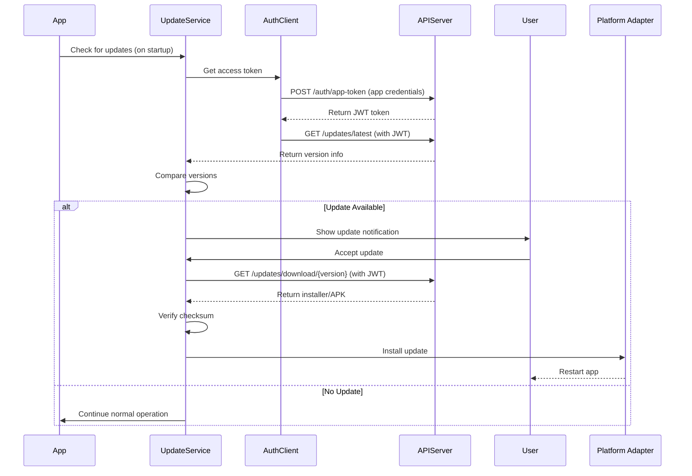

# App Update Feature Plan: GitHub-Based Auto-Update

## Executive Summary

This document outlines the implementation of an auto-update feature for the Conference Manager application using **GitHub Releases** as the distribution mechanism. The solution provides unified update management for both **Electron (Windows)** and **Capacitor (Android)** platforms.

**Key Objectives:**
- Automatic update checking and notification
- Seamless installation for both Windows and Android
- Version management using semantic versioning
- Rollback capability for failed updates
- Minimal user friction during updates
- Secure update distribution via GitHub

---

## System Overview

### Update Architecture

```
┌─────────────────────────────────────────────────────────────┐
│                    Update Feature Architecture               │
└─────────────────────────────────────────────────────────────┘

┌─────────────────────┐          ┌──────────────────────────┐
│  Private GitHub     │          │   Node.js API Server     │
│   Repository        │          │                          │
│                     │──────────▶│  - Auth Service          │
│  - .exe installer   │  Webhook │  - Version API           │
│  - .apk package     │          │  - Download API          │
│  - release notes    │          │  - Release Management    │
└─────────────────────┘          └──────────┬───────────────┘
                                            │
                                            │ Authenticated
                                            ▼
                                 ┌──────────────────────────┐
                                 │   Application Client     │
                                 │                          │
                                 │  - Update Checker        │
                                 │  - Auth Client           │
                                 │  - Version Comparer      │
                                 │  - Download Manager      │
                                 │  - Install Coordinator   │
                                 └──────────┬───────────────┘
                                            │
                                            ▼
                                 ┌──────────────────────┐
                                 │  Platform Adapters   │
                                 │                      │
                                 │  - Electron Updater  │
                                 │  - Android Updater   │
                                 └──────────────────────┘
```

### Update Flow



---

## Technical Requirements

### Platform-Specific Requirements

#### Electron (Windows)

**Update Method:** `electron-updater` package
- Uses NSIS installer format (`.exe`)
- Supports automatic download and installation
- Background update downloads
- Restart prompt after download

**Dependencies:**
```json
{
  "electron-updater": "^6.1.7",
  "electron-log": "^5.0.0"
}
```

**Configuration:**
- Auto-update enabled by default
- Check for updates every 4 hours
- Download updates in background
- Notify user when ready to install

#### Capacitor (Android)

**Update Method:** In-app browser or external browser to Google Play / GitHub releases
- Download APK from GitHub releases
- Prompt user to install (requires manual installation)
- OR deep link to Google Play Store if published

**Dependencies:**
```json
{
  "@capacitor/browser": "^5.0.0",
  "@capacitor/filesystem": "^5.0.0",
  "@capacitor/app": "^5.0.0"
}
```

**Configuration:**
- Check for updates on app launch
- Show update dialog with download link
- Support direct APK download (sideloading)
- Support Google Play Store link (if published)

---

## Feature Design

### Core Components

Following the **vertical slice architecture**, the update feature will be implemented as:

```
features/update/
├── domain/
│   ├── types.ts              # Version, UpdateInfo, UpdateStatus
│   ├── validation.ts         # Version comparison logic
│   └── businessRules.ts      # Update policies
├── application/
│   ├── useUpdateController.ts   # Main update orchestration
│   └── useUpdateChecker.ts      # Background update checker
├── infrastructure/
│   ├── updateStore.ts           # Update state management
│   ├── GitHubUpdateAdapter.ts   # GitHub API integration
│   ├── ElectronUpdateAdapter.ts # Electron-specific updates
│   └── AndroidUpdateAdapter.ts  # Android-specific updates
└── presentation/
    ├── UpdateNotification.tsx   # Update available notification
    ├── UpdateDialog.tsx         # Update details and actions
    ├── UpdateProgress.tsx       # Download progress
    └── ReleaseNotes.tsx         # Display release notes
```

### Data Models

#### `features/update/domain/types.ts`

```typescript
/**
 * Version information from GitHub release
 */
export interface VersionInfo {
  version: string;           // Semantic version (e.g., "2.1.0")
  releaseDate: string;       // ISO date string
  releaseNotes: string;      // Markdown release notes
  downloadUrl: string;       // URL to installer/APK
  checksum: string;          // SHA256 checksum
  minimumVersion?: string;   // Minimum version required
  forceUpdate: boolean;      // Force update (critical bug fix)
}

/**
 * Update status
 */
export type UpdateStatus = 
  | 'checking'
  | 'available'
  | 'downloading'
  | 'downloaded'
  | 'installing'
  | 'error'
  | 'up-to-date';

/**
 * Update configuration
 */
export interface UpdateConfig {
  enabled: boolean;
  autoDownload: boolean;
  checkInterval: number;     // Hours between checks
  githubRepo: string;        // e.g., "AvivElectis/conference-manager"
  platform: 'electron' | 'android' | 'web';
}

/**
 * Update adapter interface
 */
export interface UpdateAdapter {
  checkForUpdates(): Promise<VersionInfo | null>;
  downloadUpdate(versionInfo: VersionInfo): Promise<void>;
  installUpdate(): Promise<void>;
  getUpdateStatus(): UpdateStatus;
}
```

---

## Implementation Details

### Phase 1: Shared Infrastructure

#### Update Domain Layer

**File:** `features/update/domain/validation.ts`

```typescript
/**
 * Compare two semantic versions
 * @returns 1 if v1 > v2, -1 if v1 < v2, 0 if equal
 */
export function compareVersions(v1: string, v2: string): number {
  const parts1 = v1.split('.').map(Number);
  const parts2 = v2.split('.').map(Number);
  
  for (let i = 0; i < 3; i++) {
    if (parts1[i] > parts2[i]) return 1;
    if (parts1[i] < parts2[i]) return -1;
  }
  return 0;
}

/**
 * Check if update is required
 */
export function isUpdateAvailable(
  currentVersion: string,
  latestVersion: string
): boolean {
  return compareVersions(latestVersion, currentVersion) > 0;
}

/**
 * Validate version format (semantic versioning)
 */
export function isValidVersion(version: string): boolean {
  return /^\d+\.\d+\.\d+$/.test(version);
}
```

**File:** `features/update/domain/businessRules.ts`

```typescript
/**
 * Determine if update should be forced
 */
export function shouldForceUpdate(
  currentVersion: string,
  minimumVersion: string | undefined
): boolean {
  if (!minimumVersion) return false;
  return compareVersions(currentVersion, minimumVersion) < 0;
}

/**
 * Calculate next update check time
 */
export function getNextCheckTime(
  lastCheckTime: Date,
  intervalHours: number
): Date {
  return new Date(lastCheckTime.getTime() + intervalHours * 60 * 60 * 1000);
}
```

---

### Phase 2: GitHub Update Adapter

**File:** `features/update/infrastructure/GitHubUpdateAdapter.ts`

```typescript
import { logger } from '@shared/infrastructure/services/logger';
import type { VersionInfo } from '../domain/types';

export class GitHubUpdateAdapter {
  private readonly repoOwner: string;
  private readonly repoName: string;
  private readonly platform: 'electron' | 'android';

  constructor(repo: string, platform: 'electron' | 'android') {
    const [owner, name] = repo.split('/');
    this.repoOwner = owner;
    this.repoName = name;
    this.platform = platform;
  }

  /**
   * Fetch latest version info from GitHub releases
   */
  async fetchLatestVersion(): Promise<VersionInfo | null> {
    try {
      const url = `https://api.github.com/repos/${this.repoOwner}/${this.repoName}/releases/latest`;
      
      logger.info('Checking for updates', { url });
      
      const response = await fetch(url);
      if (!response.ok) {
        throw new Error(`GitHub API error: ${response.status}`);
      }

      const release = await response.json();
      
      // Find correct asset for platform
      const assetName = this.platform === 'electron' 
        ? 'Conference-Manager-Setup.exe'
        : 'conference-manager.apk';
      
      const asset = release.assets.find((a: any) => 
        a.name === assetName
      );

      if (!asset) {
        logger.warn('No asset found for platform', { platform: this.platform });
        return null;
      }

      // Parse version from tag (e.g., "v2.1.0" -> "2.1.0")
      const version = release.tag_name.replace(/^v/, '');

      const versionInfo: VersionInfo = {
        version,
        releaseDate: release.published_at,
        releaseNotes: release.body || '',
        downloadUrl: asset.browser_download_url,
        checksum: '', // TODO: Add checksum to release assets
        forceUpdate: release.name?.includes('[CRITICAL]') || false,
      };

      logger.info('Latest version found', { version });
      return versionInfo;

    } catch (error) {
      logger.error('Failed to check for updates', { error });
      return null;
    }
  }
}
```

---

### Phase 3: Electron Update Adapter

**File:** `features/update/infrastructure/ElectronUpdateAdapter.ts`

```typescript
import { autoUpdater } from 'electron-updater';
import log from 'electron-log';
import type { UpdateAdapter, VersionInfo, UpdateStatus } from '../domain/types';

export class ElectronUpdateAdapter implements UpdateAdapter {
  private status: UpdateStatus = 'up-to-date';
  private currentVersionInfo: VersionInfo | null = null;

  constructor(private readonly githubRepo: string) {
    // Configure electron-updater
    autoUpdater.logger = log;
    autoUpdater.setFeedURL({
      provider: 'github',
      owner: githubRepo.split('/')[0],
      repo: githubRepo.split('/')[1],
    });

    // Setup event listeners
    autoUpdater.on('checking-for-update', () => {
      this.status = 'checking';
    });

    autoUpdater.on('update-available', (info) => {
      this.status = 'available';
      log.info('Update available:', info.version);
    });

    autoUpdater.on('update-not-available', () => {
      this.status = 'up-to-date';
    });

    autoUpdater.on('download-progress', (progress) => {
      this.status = 'downloading';
      log.info('Download progress:', progress.percent);
    });

    autoUpdater.on('update-downloaded', () => {
      this.status = 'downloaded';
      log.info('Update downloaded, ready to install');
    });

    autoUpdater.on('error', (error) => {
      this.status = 'error';
      log.error('Update error:', error);
    });
  }

  async checkForUpdates(): Promise<VersionInfo | null> {
    try {
      const result = await autoUpdater.checkForUpdates();
      
      if (result?.updateInfo) {
        this.currentVersionInfo = {
          version: result.updateInfo.version,
          releaseDate: result.updateInfo.releaseDate,
          releaseNotes: result.updateInfo.releaseNotes || '',
          downloadUrl: '', // Handled by electron-updater
          checksum: '',
          forceUpdate: false,
        };
        return this.currentVersionInfo;
      }
      
      return null;
    } catch (error) {
      log.error('Check for updates failed:', error);
      return null;
    }
  }

  async downloadUpdate(versionInfo: VersionInfo): Promise<void> {
    // electron-updater handles download automatically
    await autoUpdater.downloadUpdate();
  }

  async installUpdate(): Promise<void> {
    // Quit and install the update
    autoUpdater.quitAndInstall(false, true);
  }

  getUpdateStatus(): UpdateStatus {
    return this.status;
  }
}
```

---

### Phase 4: Android Update Adapter

**File:** `features/update/infrastructure/AndroidUpdateAdapter.ts`

```typescript
import { Browser } from '@capacitor/browser';
import { Filesystem, Directory } from '@capacitor/filesystem';
import { App } from '@capacitor/app';
import type { UpdateAdapter, VersionInfo, UpdateStatus } from '../domain/types';
import { logger } from '@shared/infrastructure/services/logger';

export class AndroidUpdateAdapter implements UpdateAdapter {
  private status: UpdateStatus = 'up-to-date';
  private currentVersionInfo: VersionInfo | null = null;

  constructor(
    private readonly githubRepo: string,
    private readonly usePlayStore: boolean = false
  ) {}

  async checkForUpdates(): Promise<VersionInfo | null> {
    try {
      this.status = 'checking';
      
      const url = `https://api.github.com/repos/${this.githubRepo}/releases/latest`;
      const response = await fetch(url);
      
      if (!response.ok) {
        throw new Error(`GitHub API error: ${response.status}`);
      }

      const release = await response.json();
      const asset = release.assets.find((a: any) => 
        a.name.endsWith('.apk')
      );

      if (!asset) {
        this.status = 'up-to-date';
        return null;
      }

      const appInfo = await App.getInfo();
      const currentVersion = appInfo.version;
      const latestVersion = release.tag_name.replace(/^v/, '');

      if (this.compareVersions(latestVersion, currentVersion) > 0) {
        this.currentVersionInfo = {
          version: latestVersion,
          releaseDate: release.published_at,
          releaseNotes: release.body || '',
          downloadUrl: asset.browser_download_url,
          checksum: '',
          forceUpdate: release.name?.includes('[CRITICAL]') || false,
        };
        this.status = 'available';
        return this.currentVersionInfo;
      }

      this.status = 'up-to-date';
      return null;

    } catch (error) {
      this.status = 'error';
      logger.error('Android update check failed', { error });
      return null;
    }
  }

  async downloadUpdate(versionInfo: VersionInfo): Promise<void> {
    try {
      this.status = 'downloading';

      if (this.usePlayStore) {
        // Open Google Play Store
        await Browser.open({ 
          url: `market://details?id=com.avivelect.conferencemanager` 
        });
      } else {
        // Open browser to download APK
        await Browser.open({ url: versionInfo.downloadUrl });
      }

      this.status = 'downloaded';
      logger.info('Update download initiated', { version: versionInfo.version });

    } catch (error) {
      this.status = 'error';
      logger.error('Android update download failed', { error });
      throw error;
    }
  }

  async installUpdate(): Promise<void> {
    // Android requires manual installation by user
    // App will show instructions to install the downloaded APK
    logger.info('User must manually install APK');
  }

  getUpdateStatus(): UpdateStatus {
    return this.status;
  }

  private compareVersions(v1: string, v2: string): number {
    const parts1 = v1.split('.').map(Number);
    const parts2 = v2.split('.').map(Number);
    
    for (let i = 0; i < 3; i++) {
      if (parts1[i] > parts2[i]) return 1;
      if (parts1[i] < parts2[i]) return -1;
    }
    return 0;
  }
}
```

---

### Phase 5: Update Controller

**File:** `features/update/application/useUpdateController.ts`

```typescript
import { useState, useEffect, useCallback } from 'react';
import { useUpdateStore } from '../infrastructure/updateStore';
import { ElectronUpdateAdapter } from '../infrastructure/ElectronUpdateAdapter';
import { AndroidUpdateAdapter } from '../infrastructure/AndroidUpdateAdapter';
import type { UpdateAdapter, VersionInfo, UpdateStatus } from '../domain/types';
import { logger } from '@shared/infrastructure/services/logger';

export function useUpdateController() {
  const [isLoading, setIsLoading] = useState(false);
  const [error, setError] = useState<string | null>(null);
  
  const {
    updateConfig,
    latestVersion,
    updateStatus,
    setLatestVersion,
    setUpdateStatus,
    setLastCheckTime,
  } = useUpdateStore();

  // Get platform-specific adapter
  const getAdapter = useCallback((): UpdateAdapter => {
    const isElectron = window.electron !== undefined;
    
    if (isElectron) {
      return new ElectronUpdateAdapter(updateConfig.githubRepo);
    } else {
      return new AndroidUpdateAdapter(updateConfig.githubRepo, false);
    }
  }, [updateConfig.githubRepo]);

  /**
   * Check for available updates
   */
  const checkForUpdates = useCallback(async (): Promise<void> => {
    if (!updateConfig.enabled) {
      logger.info('Update checking is disabled');
      return;
    }

    try {
      setIsLoading(true);
      setError(null);
      setUpdateStatus('checking');

      const adapter = getAdapter();
      const versionInfo = await adapter.checkForUpdates();

      setLastCheckTime(new Date());

      if (versionInfo) {
        setLatestVersion(versionInfo);
        setUpdateStatus('available');
        logger.info('Update available', { version: versionInfo.version });
      } else {
        setUpdateStatus('up-to-date');
        logger.info('App is up to date');
      }

    } catch (err) {
      const message = err instanceof Error ? err.message : 'Unknown error';
      setError(message);
      setUpdateStatus('error');
      logger.error('Update check failed', { error: err });
    } finally {
      setIsLoading(false);
    }
  }, [updateConfig, getAdapter, setLatestVersion, setUpdateStatus, setLastCheckTime]);

  /**
   * Download and install update
   */
  const downloadAndInstall = useCallback(async (): Promise<void> => {
    if (!latestVersion) {
      logger.warn('No version info available for download');
      return;
    }

    try {
      setIsLoading(true);
      setError(null);
      setUpdateStatus('downloading');

      const adapter = getAdapter();
      await adapter.downloadUpdate(latestVersion);
      
      setUpdateStatus('downloaded');

      // Auto-install for Electron
      const isElectron = window.electron !== undefined;
      if (isElectron) {
        setUpdateStatus('installing');
        await adapter.installUpdate();
      }

    } catch (err) {
      const message = err instanceof Error ? err.message : 'Unknown error';
      setError(message);
      setUpdateStatus('error');
      logger.error('Update download/install failed', { error: err });
    } finally {
      setIsLoading(false);
    }
  }, [latestVersion, getAdapter, setUpdateStatus]);

  /**
   * Dismiss update notification
   */
  const dismissUpdate = useCallback(() => {
    setUpdateStatus('up-to-date');
    setLatestVersion(null);
  }, [setUpdateStatus, setLatestVersion]);

  // Auto-check on mount if enabled
  useEffect(() => {
    if (updateConfig.enabled) {
      checkForUpdates();
    }
  }, []);

  // Periodic update checks
  useEffect(() => {
    if (!updateConfig.enabled || updateConfig.checkInterval <= 0) {
      return;
    }

    const intervalMs = updateConfig.checkInterval * 60 * 60 * 1000;
    const interval = setInterval(() => {
      checkForUpdates();
    }, intervalMs);

    return () => clearInterval(interval);
  }, [updateConfig, checkForUpdates]);

  return {
    checkForUpdates,
    downloadAndInstall,
    dismissUpdate,
    latestVersion,
    updateStatus,
    isLoading,
    error,
  };
}
```

---

### Phase 6: Update Store

**File:** `features/update/infrastructure/updateStore.ts`

```typescript
import { create } from 'zustand';
import { persist } from 'zustand/middleware';
import type { VersionInfo, UpdateStatus, UpdateConfig } from '../domain/types';

interface UpdateStore {
  // State
  updateConfig: UpdateConfig;
  latestVersion: VersionInfo | null;
  updateStatus: UpdateStatus;
  lastCheckTime: Date | null;

  // Actions
  setUpdateConfig: (config: Partial<UpdateConfig>) => void;
  setLatestVersion: (version: VersionInfo | null) => void;
  setUpdateStatus: (status: UpdateStatus) => void;
  setLastCheckTime: (time: Date) => void;
}

export const useUpdateStore = create<UpdateStore>()(
  persist(
    (set) => ({
      // Initial state
      updateConfig: {
        enabled: true,
        autoDownload: false,
        checkInterval: 4, // hours
        githubRepo: 'AvivElectis/conference-manager',
        platform: 'electron',
      },
      latestVersion: null,
      updateStatus: 'up-to-date',
      lastCheckTime: null,

      // Actions
      setUpdateConfig: (config) =>
        set((state) => ({
          updateConfig: { ...state.updateConfig, ...config },
        })),
      
      setLatestVersion: (version) =>
        set({ latestVersion: version }),
      
      setUpdateStatus: (status) =>
        set({ updateStatus: status }),
      
      setLastCheckTime: (time) =>
        set({ lastCheckTime: time }),
    }),
    {
      name: 'update-store',
      partialize: (state) => ({
        updateConfig: state.updateConfig,
        lastCheckTime: state.lastCheckTime,
      }),
    }
  )
);
```

---

### Phase 7: UI Components

**File:** `features/update/presentation/UpdateNotification.tsx`

```typescript
import React from 'react';
import { Snackbar, Alert, Button, Box } from '@mui/material';
import { useUpdateController } from '../application/useUpdateController';

export const UpdateNotification: React.FC = () => {
  const { latestVersion, updateStatus, downloadAndInstall, dismissUpdate } = 
    useUpdateController();

  const isVisible = updateStatus === 'available' && latestVersion !== null;

  return (
    <Snackbar
      open={isVisible}
      anchorOrigin={{ vertical: 'bottom', horizontal: 'right' }}
    >
      <Alert
        severity="info"
        action={
          <Box sx={{ display: 'flex', gap: 1 }}>
            <Button color="inherit" size="small" onClick={downloadAndInstall}>
              Update Now
            </Button>
            <Button color="inherit" size="small" onClick={dismissUpdate}>
              Later
            </Button>
          </Box>
        }
      >
        New version {latestVersion?.version} is available!
      </Alert>
    </Snackbar>
  );
};
```

**File:** `features/update/presentation/UpdateDialog.tsx`

```typescript
import React from 'react';
import {
  Dialog,
  DialogTitle,
  DialogContent,
  DialogActions,
  Button,
  Typography,
  LinearProgress,
  Box,
} from '@mui/material';
import { useUpdateController } from '../application/useUpdateController';
import { ReleaseNotes } from './ReleaseNotes';

interface UpdateDialogProps {
  open: boolean;
  onClose: () => void;
}

export const UpdateDialog: React.FC<UpdateDialogProps> = ({ open, onClose }) => {
  const { 
    latestVersion, 
    updateStatus, 
    downloadAndInstall, 
    isLoading 
  } = useUpdateController();

  if (!latestVersion) return null;

  const isDownloading = updateStatus === 'downloading';
  const isDownloaded = updateStatus === 'downloaded';

  return (
    <Dialog open={open} onClose={onClose} maxWidth="md" fullWidth>
      <DialogTitle>
        Update Available: Version {latestVersion.version}
      </DialogTitle>
      
      <DialogContent>
        <Typography variant="body2" color="text.secondary" gutterBottom>
          Released: {new Date(latestVersion.releaseDate).toLocaleDateString()}
        </Typography>

        {isDownloading && (
          <Box sx={{ mb: 2 }}>
            <LinearProgress />
            <Typography variant="caption">Downloading update...</Typography>
          </Box>
        )}

        {isDownloaded && (
          <Alert severity="success" sx={{ mb: 2 }}>
            Update downloaded! Click "Install Now" to restart and update.
          </Alert>
        )}

        <ReleaseNotes notes={latestVersion.releaseNotes} />
      </DialogContent>

      <DialogActions>
        <Button onClick={onClose} disabled={isLoading}>
          Later
        </Button>
        <Button 
          onClick={downloadAndInstall} 
          variant="contained"
          disabled={isLoading}
        >
          {isDownloaded ? 'Install Now' : 'Download & Install'}
        </Button>
      </DialogActions>
    </Dialog>
  );
};
```

---

## GitHub Release Workflow

### Automated Release Process

**File:** `.github/workflows/release.yml`

```yaml
name: Build and Release

on:
  push:
    tags:
      - 'v*.*.*'

jobs:
  build-windows:
    runs-on: windows-latest
    steps:
      - uses: actions/checkout@v3
      
      - name: Setup Node.js
        uses: actions/setup-node@v3
        with:
          node-version: '18'
      
      - name: Install dependencies
        run: npm ci
      
      - name: Build Electron App
        run: npm run build:electron
      
      - name: Upload Windows Installer
        uses: actions/upload-artifact@v3
        with:
          name: windows-installer
          path: dist/Conference-Manager-Setup-*.exe

  build-android:
    runs-on: ubuntu-latest
    steps:
      - uses: actions/checkout@v3
      
      - name: Setup Node.js
        uses: actions/setup-node@v3
        with:
          node-version: '18'
      
      - name: Setup Android SDK
        uses: android-actions/setup-android@v2
      
      - name: Install dependencies
        run: npm ci
      
      - name: Build Android App
        run: |
          npm run build
          npx cap sync android
          cd android
          ./gradlew assembleRelease
      
      - name: Upload APK
        uses: actions/upload-artifact@v3
        with:
          name: android-apk
          path: android/app/build/outputs/apk/release/*.apk

  create-release:
    needs: [build-windows, build-android]
    runs-on: ubuntu-latest
    steps:
      - uses: actions/checkout@v3
      
      - name: Download Windows Installer
        uses: actions/download-artifact@v3
        with:
          name: windows-installer
          path: ./artifacts
      
      - name: Download Android APK
        uses: actions/download-artifact@v3
        with:
          name: android-apk
          path: ./artifacts
      
      - name: Create Release
        uses: softprops/action-gh-release@v1
        with:
          files: |
            ./artifacts/*.exe
            ./artifacts/*.apk
          body_path: CHANGELOG.md
          draft: false
          prerelease: false
        env:
          GITHUB_TOKEN: ${{ secrets.GITHUB_TOKEN }}
```

---

## Settings Integration

### Update Settings in Settings Feature

Add update configuration to the Settings dialog:

**File:** `features/settings/presentation/UpdateSettings.tsx`

```typescript
import React from 'react';
import {
  Box,
  FormControlLabel,
  Switch,
  TextField,
  Typography,
} from '@mui/material';
import { useUpdateStore } from '@features/update/infrastructure/updateStore';

export const UpdateSettings: React.FC = () => {
  const { updateConfig, setUpdateConfig } = useUpdateStore();

  return (
    <Box>
      <Typography variant="h6" gutterBottom>
        Update Settings
      </Typography>

      <FormControlLabel
        control={
          <Switch
            checked={updateConfig.enabled}
            onChange={(e) => setUpdateConfig({ enabled: e.target.checked })}
          />
        }
        label="Enable automatic update checks"
      />

      <FormControlLabel
        control={
          <Switch
            checked={updateConfig.autoDownload}
            onChange={(e) => setUpdateConfig({ autoDownload: e.target.checked })}
          />
        }
        label="Automatically download updates"
      />

      <TextField
        label="Check interval (hours)"
        type="number"
        value={updateConfig.checkInterval}
        onChange={(e) => 
          setUpdateConfig({ checkInterval: parseInt(e.target.value, 10) })
        }
        fullWidth
        margin="normal"
      />

      <TextField
        label="GitHub Repository"
        value={updateConfig.githubRepo}
        onChange={(e) => setUpdateConfig({ githubRepo: e.target.value })}
        fullWidth
        margin="normal"
        helperText="Format: owner/repo"
      />
    </Box>
  );
};
```

---

## Verification Plan

### Automated Tests

1. **Unit Tests**
   - Version comparison logic
   - Version validation
   - Update policy rules

2. **Integration Tests**
   - GitHub API mocking
   - Update flow simulation
   - Platform adapter switching

### Manual Testing

#### Windows (Electron)

1. **No Update Available**
   - Launch app
   - Verify "up to date" in logs
   - No notification shown

2. **Update Available**
   - Create new GitHub release with higher version
   - Launch app
   - Verify update notification appears
   - Click "Update Now"
   - Verify download starts
   - Verify install prompt appears
   - Accept install
   - Verify app restarts with new version

3. **Forced Update**
   - Create release with [CRITICAL] tag
   - Launch older version
   - Verify forced update dialog (no "Later" button)

#### Android (Capacitor)

1. **No Update Available**
   - Launch app
   - Verify no update dialog

2. **Update Available**
   - Create new GitHub release with APK
   - Launch app
   - Verify update notification
   - Click "Download"
   - Verify browser opens to download link
   - Download APK
   - Install manually
   - Verify new version runs

---

## Security Considerations

### Checksum Verification

Add SHA256 checksum validation:

1. Generate checksums during build
2. Include in GitHub release description
3. Verify before installation

### HTTPS Only

- All GitHub API calls use HTTPS
- Downloads use verified GitHub CDN

### Code Signing

- **Windows:** Sign .exe with code signing certificate
- **Android:** Sign APK with release keystore

---

## Rollback Strategy

### Version Rollback

If update fails:

1. Keep previous version installer/APK in local cache
2. Provide "Rollback" option in settings
3. Reinstall previous version
4. Log rollback event

### Emergency Disable

Settings option to disable updates temporarily if issues occur.

---

## Success Criteria

- ✅ Electron app auto-updates from GitHub releases
- ✅ Android app detects and downloads updates
- ✅ Version comparison works correctly
- ✅ Release notes display properly
- ✅ Settings allow update configuration
- ✅ Zero user data loss during updates
- ✅ Rollback capability functional
- ✅ Forced updates work for critical fixes
- ✅ Update status persists across restarts

---

## Next Steps

1. Review and approve this plan
2. Create `features/update/` directory structure
3. Implement domain layer (types, validation, business rules)
4. Implement infrastructure layer (adapters, store)
5. Implement application layer (controllers)
6. Implement presentation layer (UI components)
7. Add update settings to Settings feature
8. Setup GitHub Actions workflow
9. Test with staging releases
10. Document user-facing update process
