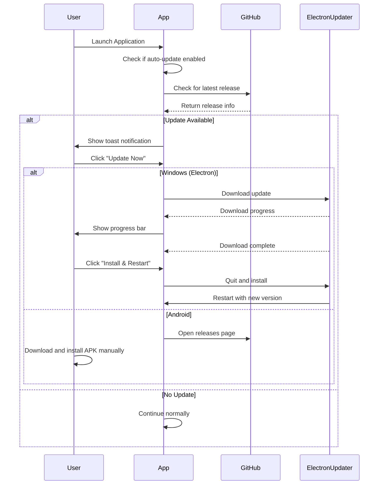

# Auto-Update System - Complete Guide

**Version:** 1.0  
**Last Updated:** December 23, 2024  
**Status:** Production Ready

---

## Table of Contents

1. [Overview](#overview)
2. [How It Works](#how-it-works)
3. [Architecture](#architecture)
4. [Release Management](#release-management)
5. [User Experience](#user-experience)
6. [Developer Guide](#developer-guide)
7. [Troubleshooting](#troubleshooting)

---

## Overview

The electisSpace application includes a fully automated update system that delivers new versions to users seamlessly across Windows (Electron) and Android (Capacitor) platforms.

### Key Features

- ✅ **Automatic Update Detection** - Checks for updates on startup and periodically
- ✅ **User-Controlled Updates** - Users decide when to install
- ✅ **Platform-Specific** - Optimized for Windows (auto-install) and Android (manual APK)
- ✅ **Bilingual Support** - Full EN/HE translations
- ✅ **GitHub-Powered** - Uses GitHub Releases as the distribution backend

### Supported Platforms

| Platform | Update Method | Auto-Install |
|----------|---------------|--------------|
| **Windows (Electron)** | electron-updater | ✅ Yes |
| **Android (Capacitor)** | GitHub Releases API | ❌ Manual APK |
| **Web** | GitHub Releases Link | ❌ Manual Download |

---

## How It Works

### Update Flow Diagram



### Version Comparison

The system uses **semantic versioning** (semver) to compare versions:

```
v1.2.3
│ │ │
│ │ └─ Patch (bug fixes)
│ └─── Minor (new features, backward compatible)
└───── Major (breaking changes)
```

**Examples:**
- `1.0.0` → `1.0.1` = Patch update (auto-suggest)
- `1.0.0` → `1.1.0` = Minor update (auto-suggest)
- `1.0.0` → `2.0.0` = Major update (notify with warnings)

### Update Checking

**Automatic Checks:**
- On application startup (if enabled)
- Every 24 hours by default (configurable 12-168 hours)

**Manual Checks:**
- Settings → App Settings → Update Settings → "Check for Updates"

**Skip Version:**
- Users can permanently skip a version
- Skipped versions won't trigger notifications again

---

## Architecture

### Component Hierarchy

```
src/features/update/
├── domain/
│   ├── types.ts                    # Core types (UpdateInfo, UpdateState)
│   └── versionComparison.ts        # Semver comparison logic
├── infrastructure/
│   ├── updateStore.ts              # Zustand state management
│   └── adapters/
│       ├── ElectronUpdateAdapter   # electron-updater wrapper
│       ├── AndroidUpdateAdapter    # GitHub API for Android
│       └── GitHubUpdateAdapter     # Generic GitHub releases
├── application/
│   └── useUpdateController.ts      # Main update logic hook
└── presentation/
    ├── UpdateNotification.tsx      # Toast notification
    ├── UpdateDialog.tsx            # Release details modal
    └── UpdateProgress.tsx          # Download progress
```

### State Management

**UpdateStore (Zustand):**
```typescript
{
  available: boolean,           // Update is available
  checking: boolean,            // Currently checking
  downloading: boolean,         // Currently downloading
  installing: boolean,          // Currently installing
  progress: number,             // Download progress (0-100)
  error: string | null,         // Error message
  updateInfo: UpdateInfo | null,// Release details
  skippedVersion: string | null,// User-skipped version
  settings: {
    enabled: boolean,           // Auto-update enabled
    policy: 'auto'|'notify',    // Update policy
    checkInterval: number,      // Hours between checks
    lastCheckTime: number       // Last check timestamp
  }
}
```

### Platform Detection

```typescript
function detectPlatform(): 'electron' | 'android' | 'web' {
  if (window.electron) return 'electron';
  if (window.Capacitor?.isNativePlatform()) return 'android';
  return 'web';
}
```

---

## Release Management

### Creating a New Release

#### Step 1: Update Version

Edit `package.json`:
```json
{
  "version": "1.0.0"  // Change to new version
}
```

#### Step 2: Commit Changes

```bash
git add package.json
git commit -m "chore: bump version to 1.0.0"
git push origin main
```

#### Step 3: Create and Push Tag

```bash
# Create annotated tag
git tag -a v1.0.0 -m "Release v1.0.0"

# Push tag to GitHub
git push origin v1.0.0
```

#### Step 4: GitHub Actions Builds

The workflow automatically:
1. ✅ Builds Windows installer (`.exe`)
2. ✅ Builds Android APK (`.apk`)
3. ✅ Creates GitHub Release
4. ✅ Uploads all artifacts
5. ✅ Generates `latest.yml` for auto-updater

#### Step 5: Verify Release

1. Go to `https://github.com/AvivElectis/electisSpace/releases`
2. Confirm release exists
3. Download and test artifacts

### Pre-Release Versions

For beta/alpha releases, include suffix in tag:

```bash
# Beta release
git tag -a v1.0.0-beta.1 -m "Beta release"

# Alpha release  
git tag -a v1.0.0-alpha.1 -m "Alpha release"

# Release candidate
git tag -a v1.0.0-rc.1 -m "Release candidate"
```

GitHub will automatically mark these as **pre-releases**.

### Hotfix Releases

For urgent bug fixes:

```bash
# Example: 1.0.0 → 1.0.1 (patch)
git tag -a v1.0.1 -m "Hotfix: Critical bug fix"
git push origin v1.0.1
```

Users will receive update notification immediately on next check.

---

## User Experience

### First-Time User

1. Downloads installer from GitHub Releases
2. Installs application
3. App checks for updates on startup (none available - just installed)

### Existing User - Update Available

#### Notification Toast (Bottom-Right)

```
┌─────────────────────────────────────┐
│ 🔔 Update Available                 │
│                                     │
│ Version 1.0.1 is available          │
│ Bug fixes and improvements...       │
│                                     │
│ [Update Now] [View Details]         │
│ [Later] [Skip This Version]         │
└─────────────────────────────────────┘
```

**Actions:**
- **Update Now** → Start download immediately
- **View Details** → Open modal with full release notes
- **Later** → Dismiss (will show again on next startup)
- **Skip This Version** → Never show this version again

#### Update Dialog (Modal)

```
┌─────────────────────────────────────┐
│ Update Available      [v1.0.1]      │
├─────────────────────────────────────┤
│ What's New                          │
│ ┌─────────────────────────────────┐ │
│ │ • Fixed critical login bug      │ │
│ │ • Improved performance          │ │
│ │ • Updated Hebrew translations   │ │
│ └─────────────────────────────────┘ │
│                                     │
│ Release Date: Dec 23, 2024          │
│ Size: 85.2 MB                       │
│                                     │
│ ℹ️ The update will be downloaded    │
│   and installed. The application    │
│   will restart automatically.       │
│                                     │
│           [Cancel] [Update Now]     │
└─────────────────────────────────────┘
```

#### Download Progress (Windows Only)

```
┌─────────────────────────────────────┐
│ Downloading Update...               │
├─────────────────────────────────────┤
│ Downloading Update...          45%  │
│ ████████████░░░░░░░░░░░░░░░         │
│                                     │
│ Download Complete                   │
│ ✅ Ready to install                 │
│                                     │
│    [Install and Restart]            │
└─────────────────────────────────────┘
```

### Settings Configuration

**Location:** Settings → App Settings → Update Settings

```
┌─────────────────────────────────────┐
│ Update Settings                     │
├─────────────────────────────────────┤
│ Current Version:  v1.0.0            │
│                                     │
│ ☑ Auto-Update                       │
│   Enable automatic update checks    │
│                                     │
│ Check Interval (hours):  [24]       │
│   How often to check (12-168 hours) │
│                                     │
│ [Check for Updates]                 │
└─────────────────────────────────────┘
```

---

## Developer Guide

### Testing Updates Locally

#### Simulate Update Available

1. Edit `src/features/update/application/useUpdateController.ts`:
   ```typescript
   const CURRENT_VERSION = '0.0.1'; // Change to old version
   ```

2. Create a GitHub release with version `v1.0.0`

3. Restart app → Should show update notification

#### Test Windows Auto-Update

```bash
# Build installer
npm run electron:build

# Install it
./dist-electron/electisSpace-Setup-0.1.0.exe

# Create new release with v0.2.0
git tag -a v0.2.0 -m "Test update"
git push origin v0.2.0

# Wait for GitHub Action to complete
# Launch installed app → Should detect v0.2.0
```

#### Test Android APK

```bash
# Build APK
npm run android:build

# Install on device
adb install android/app/build/outputs/apk/release/app-release-unsigned.apk

# Create new release
# Open app → Should prompt to download new APK
```

### Customizing Update Behavior

#### Change Check Interval Default

Edit `src/features/update/infrastructure/updateStore.ts`:
```typescript
const defaultSettings: UpdateSettings = {
  enabled: true,
  policy: 'notify',
  checkInterval: 24, // Change this (hours)
  lastCheckTime: 0,
};
```

#### Disable Auto-Update

Users can toggle in Settings, or you can disable globally:
```typescript
const defaultSettings: UpdateSettings = {
  enabled: false, // Disable auto-update
  // ...
};
```

#### Custom Update Server

To use a private server instead of GitHub:

1. Modify `GitHubUpdateAdapter.ts` to point to your API
2. Update `electron/main.js` feed URL
3. Ensure server returns same format as GitHub Releases API

### Adding Changelog

Release notes come from:
1. **Git commit messages** (auto-generated by GitHub)
2. **Manual release notes** (edit release after creation)

For better changelogs, use conventional commits:
```bash
git commit -m "feat: add dark mode"
git commit -m "fix: resolve login issue"
git commit -m "chore: update dependencies"
```

---

## Troubleshooting

### Users Not Receiving Updates

**Check:**
1. ✅ Auto-update enabled in Settings?
2. ✅ GitHub release published (not draft)?
3. ✅ `latest.yml` file exists in release?
4. ✅ User hasn't skipped this version?
5. ✅ Check interval hasn't elapsed yet?

**Solution:**
- Have user click "Check for Updates" manually
- Verify release is public and contains `latest.yml`

### Windows Update Fails to Install

**Common Causes:**
- Antivirus blocking installer
- Insufficient disk space
- App running as administrator

**Solution:**
```
1. Close all instances of app
2. Run installer as administrator
3. Whitelist in antivirus
```

### Android APK Won't Install

**Common Causes:**
- "Install from unknown sources" disabled
- Old APK still installed with different signature

**Solution:**
```
1. Enable "Unknown Sources" in Android settings
2. Uninstall old version first
3. Install new APK
```

### GitHub Action Build Fails

**Check Logs:**
1. Go to Actions tab on GitHub
2. Click failed workflow
3. Expand failed step

**Common Issues:**
- Missing dependencies in `package.json`
- Build errors in web app
- Gradle build failure (Android)

### Update Notification Not Showing

**Debug:**
1. Open DevTools (F12)
2. Check console for errors
3. Verify `useUpdateController` is running
4. Check `updateStore` state in Redux DevTools

---

## Advanced Configuration

### Code Signing (Production)

#### Windows Code Signing

1. Obtain code signing certificate (.pfx file)
2. Add to GitHub Secrets:
   - `CSC_LINK` = Base64 encoded certificate
   - `CSC_KEY_PASSWORD` = Certificate password

3. Update workflow:
   ```yaml
   - name: Build Electron app
     run: npm run electron:build
     env:
       CSC_LINK: ${{ secrets.CSC_LINK }}
       CSC_KEY_PASSWORD: ${{ secrets.CSC_KEY_PASSWORD }}
   ```

#### Android Code Signing

1. Generate keystore:
   ```bash
   keytool -genkey -v -keystore release.keystore -alias electis -keyalg RSA -keysize 2048 -validity 10000
   ```

2. Add `android/key.properties`:
   ```properties
   storePassword=***
   keyPassword=***
   keyAlias=electis
   storeFile=release.keystore
   ```

3. Update `android/app/build.gradle` with signing config

### Custom Update UI

To customize the update UI, edit:
- `UpdateNotification.tsx` - Toast styling
- `UpdateDialog.tsx` - Modal layout
- `UpdateProgress.tsx` - Progress indicators

### Analytics Integration

Track update metrics:
```typescript
// In useUpdateController.ts
const checkForUpdates = async () => {
  // Track check event
  analytics.track('update_check_started');
  
  const updateInfo = await adapter.checkForUpdates();
  
  if (updateInfo) {
    analytics.track('update_available', {
      version: updateInfo.version
    });
  }
};
```

---

## Summary

The auto-update system is fully functional and production-ready:

✅ **For Users:** Seamless updates with clear notifications  
✅ **For Developers:** Simple tag-based releases  
✅ **For Admins:** Rollback capability via version skipping  

**Next Steps:**
1. Create your first release: `git tag -a v1.0.0 -m "Initial release"`
2. Test on both Windows and Android
3. Monitor GitHub Releases for metrics

**Support:**
- GitHub Issues: Report bugs and feature requests
- Pull Requests: Contribute improvements
- Documentation: Keep this guide updated with learnings
