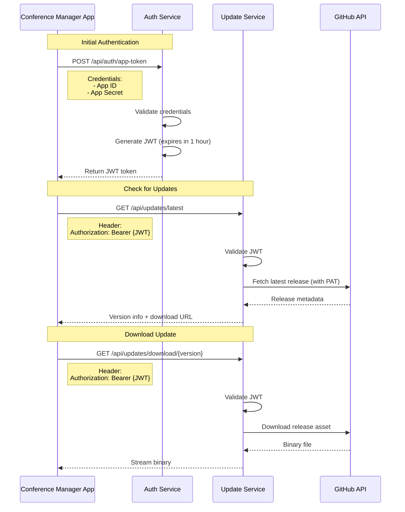

# Update Server Authentication Service Plan

## Executive Summary

This document outlines the authentication service architecture for your **Node.js API server** that will securely distribute application updates from a **private GitHub repository**. This approach eliminates the need for public GitHub releases and gives you full control over update distribution.

**Key Benefits:**
- ✅ Keep GitHub repository private
- ✅ Control who can access updates
- ✅ Track update downloads
- ✅ Implement gradual rollout
- ✅ No GitHub token exposure in client apps

---

## Architecture Overview

### System Components

```
┌─────────────────────────────────────────────────────────────┐
│                    Update Distribution System                │
└─────────────────────────────────────────────────────────────┘

┌───────────────────┐      ┌─────────────────────────────────┐
│  Private GitHub   │      │      Node.js API Server         │
│   Repository      │      │                                 │
│                   │      │  ┌───────────────────────────┐  │
│  - Releases       │──────┼─▶│    Auth Service           │  │
│  - Installers     │Webhook│  │  - App authentication     │  │
│  - Metadata       │      │  │  - JWT token generation   │  │
└───────────────────┘      │  │  - Token validation       │  │
                           │  └───────────────────────────┘  │
                           │                                 │
                           │  ┌───────────────────────────┐  │
                           │  │    Update Service         │  │
                           │  │  - Version management     │  │
                           │  │  - Release metadata       │  │
                           │  │  - Download proxying      │  │
                           │  └───────────────────────────┘  │
                           │                                 │
                           │  ┌───────────────────────────┐  │
                           │  │    Storage Service        │  │
                           │  │  - File storage           │  │
                           │  │  - Checksum verification  │  │
                           │  └───────────────────────────┘  │
                           └─────────────────────────────────┘
                                         │
                                         │ HTTPS + JWT
                                         ▼
                           ┌─────────────────────────────────┐
                           │      Client Applications        │
                           │  - Conference Manager (Windows) │
                           │  - Conference Manager (Android) │
                           └─────────────────────────────────┘
```

---

## Authentication Service Design

### Authentication Strategy: JWT (JSON Web Tokens)

**Why JWT:**
- Stateless (no session storage needed)
- Self-contained (includes all necessary info)
- Industry standard
- Easy to validate
- Supports expiration

### Authentication Flow



---

## API Endpoints

### 1. Authentication Endpoints

#### `POST /api/auth/app-token`

**Purpose:** Authenticate app and get JWT token

**Request:**
```json
{
  "appId": "conference-manager",
  "appSecret": "your-secret-key-here",
  "platform": "electron" | "android"
}
```

**Response (Success):**
```json
{
  "success": true,
  "token": "eyJhbGciOiJIUzI1NiIsInR5cCI6IkpXVCJ9...",
  "expiresIn": 3600,
  "expiresAt": "2025-12-15T10:37:44Z"
}
```

**Response (Error):**
```json
{
  "success": false,
  "error": "Invalid credentials"
}
```

**Security:**
- Rate limiting: 10 requests per minute per IP
- Log all authentication attempts
- Support multiple app credentials for different platforms

---

### 2. Update Check Endpoints

#### `GET /api/updates/latest`

**Purpose:** Get latest version information

**Headers:**
```
Authorization: Bearer {JWT}
Platform: electron | android
```

**Query Parameters:**
```
?currentVersion=2.0.0
```

**Response:**
```json
{
  "latestVersion": "2.1.0",
  "releaseDate": "2025-12-15T08:00:00Z",
  "releaseNotes": "## What's New\n- Bug fixes\n- Performance improvements",
  "downloadUrl": "/api/updates/download/2.1.0",
  "checksum": "sha256:abc123...",
  "fileSize": 52428800,
  "mandatory": false,
  "minimumVersion": "2.0.0"
}
```

---

#### `GET /api/updates/download/{version}`

**Purpose:** Download installer/APK for specific version

**Headers:**
```
Authorization: Bearer {JWT}
Platform: electron | android
```

**Response:**
- Binary stream (application/octet-stream)
- Headers:
  - `Content-Type: application/octet-stream`
  - `Content-Length: {size}`
  - `Content-Disposition: attachment; filename="Conference-Manager-Setup-2.1.0.exe"`
  - `X-Checksum: sha256:abc123...`

**Security:**
- Validate JWT before streaming
- Log download events
- Support resume (Range headers)

---

#### `GET /api/updates/versions`

**Purpose:** List all available versions (optional, for admin)

**Headers:**
```
Authorization: Bearer {JWT}
```

**Response:**
```json
{
  "versions": [
    {
      "version": "2.1.0",
      "releaseDate": "2025-12-15T08:00:00Z",
      "platform": "electron",
      "fileSize": 52428800
    },
    {
      "version": "2.0.0",
      "releaseDate": "2025-12-01T08:00:00Z",
      "platform": "electron",
      "fileSize": 51200000
    }
  ]
}
```

---

## Node.js Implementation

### Technology Stack

**Framework:** Express.js  
**Authentication:** jsonwebtoken (JWT)  
**GitHub Integration:** @octokit/rest  
**Storage:** Local filesystem or cloud (S3/Azure Blob)  
**Database:** MongoDB or PostgreSQL (for logs, metrics)

### Project Structure

```
update-server/
├── src/
│   ├── config/
│   │   ├── index.ts           # Configuration management
│   │   └── secrets.ts         # Secret management
│   ├── middleware/
│   │   ├── auth.ts            # JWT validation middleware
│   │   ├── rateLimit.ts       # Rate limiting
│   │   └── errorHandler.ts    # Global error handler
│   ├── services/
│   │   ├── authService.ts     # Authentication logic
│   │   ├── updateService.ts   # Update management
│   │   ├── githubService.ts   # GitHub API integration
│   │   └── storageService.ts  # File storage
│   ├── routes/
│   │   ├── auth.ts            # /api/auth/* routes
│   │   └── updates.ts         # /api/updates/* routes
│   ├── models/
│   │   ├── AppCredentials.ts  # App credentials model
│   │   ├── DownloadLog.ts     # Download tracking
│   │   └── Release.ts         # Release metadata cache
│   ├── utils/
│   │   ├── logger.ts          # Logging utility
│   │   └── validation.ts      # Input validation
│   └── server.ts              # Express app entry point
├── .env                       # Environment variables
├── package.json
└── tsconfig.json
```

---

### Core Implementation Files

#### `src/config/index.ts`

```typescript
import dotenv from 'dotenv';
dotenv.config();

export const config = {
  port: process.env.PORT || 3000,
  nodeEnv: process.env.NODE_ENV || 'development',
  
  jwt: {
    secret: process.env.JWT_SECRET!,
    expiresIn: '1h',
  },
  
  github: {
    owner: process.env.GITHUB_OWNER!,
    repo: process.env.GITHUB_REPO!,
    token: process.env.GITHUB_TOKEN!, // Personal Access Token
  },
  
  app: {
    credentials: {
      electron: {
        appId: 'conference-manager',
        appSecret: process.env.ELECTRON_APP_SECRET!,
      },
      android: {
        appId: 'conference-manager',
        appSecret: process.env.ANDROID_APP_SECRET!,
      },
    },
  },
  
  storage: {
    type: process.env.STORAGE_TYPE || 'local', // 'local' | 's3' | 'azure'
    localPath: process.env.STORAGE_PATH || './releases',
  },
  
  rateLimit: {
    auth: {
      windowMs: 60 * 1000, // 1 minute
      max: 10, // 10 requests per minute
    },
    updates: {
      windowMs: 60 * 1000,
      max: 100,
    },
  },
};
```

---

#### `src/services/authService.ts`

```typescript
import jwt from 'jsonwebtoken';
import { config } from '../config';

export interface AppCredentials {
  appId: string;
  appSecret: string;
  platform: 'electron' | 'android';
}

export interface JWTPayload {
  appId: string;
  platform: string;
  iat: number;
  exp: number;
}

export class AuthService {
  /**
   * Validate app credentials
   */
  validateCredentials(credentials: AppCredentials): boolean {
    const validCreds = config.app.credentials[credentials.platform];
    
    return (
      validCreds &&
      credentials.appId === validCreds.appId &&
      credentials.appSecret === validCreds.appSecret
    );
  }

  /**
   * Generate JWT token
   */
  generateToken(appId: string, platform: string): string {
    const payload: Partial<JWTPayload> = {
      appId,
      platform,
    };

    return jwt.sign(payload, config.jwt.secret, {
      expiresIn: config.jwt.expiresIn,
    });
  }

  /**
   * Verify JWT token
   */
  verifyToken(token: string): JWTPayload | null {
    try {
      const decoded = jwt.verify(token, config.jwt.secret) as JWTPayload;
      return decoded;
    } catch (error) {
      return null;
    }
  }

  /**
   * Get token expiry time
   */
  getTokenExpiry(token: string): Date | null {
    const decoded = this.verifyToken(token);
    if (!decoded) return null;
    return new Date(decoded.exp * 1000);
  }
}
```

---

#### `src/services/githubService.ts`

```typescript
import { Octokit } from '@octokit/rest';
import { config } from '../config';
import { logger } from '../utils/logger';

export interface GitHubRelease {
  version: string;
  releaseDate: string;
  releaseNotes: string;
  assets: {
    platform: 'electron' | 'android';
    fileName: string;
    downloadUrl: string;
    size: number;
  }[];
}

export class GitHubService {
  private octokit: Octokit;

  constructor() {
    this.octokit = new Octokit({
      auth: config.github.token,
    });
  }

  /**
   * Fetch latest release from private repo
   */
  async getLatestRelease(): Promise<GitHubRelease | null> {
    try {
      const { data: release } = await this.octokit.repos.getLatestRelease({
        owner: config.github.owner,
        repo: config.github.repo,
      });

      const version = release.tag_name.replace(/^v/, '');

      const assets = release.assets.map((asset) => {
        const platform = asset.name.endsWith('.exe') ? 'electron' : 'android';
        return {
          platform,
          fileName: asset.name,
          downloadUrl: asset.url,
          size: asset.size,
        };
      });

      return {
        version,
        releaseDate: release.published_at || release.created_at,
        releaseNotes: release.body || '',
        assets,
      };
    } catch (error) {
      logger.error('Failed to fetch latest release', { error });
      return null;
    }
  }

  /**
   * Download release asset
   */
  async downloadAsset(assetUrl: string): Promise<Buffer> {
    try {
      // Extract asset ID from URL
      const assetId = parseInt(assetUrl.split('/').pop()!, 10);

      const { data } = await this.octokit.repos.getReleaseAsset({
        owner: config.github.owner,
        repo: config.github.repo,
        asset_id: assetId,
        headers: {
          accept: 'application/octet-stream',
        },
      });

      return Buffer.from(data as unknown as ArrayBuffer);
    } catch (error) {
      logger.error('Failed to download asset', { error, assetUrl });
      throw error;
    }
  }
}
```

---

#### `src/middleware/auth.ts`

```typescript
import { Request, Response, NextFunction } from 'express';
import { AuthService } from '../services/authService';

const authService = new AuthService();

declare global {
  namespace Express {
    interface Request {
      user?: {
        appId: string;
        platform: string;
      };
    }
  }
}

export function authenticateJWT(
  req: Request,
  res: Response,
  next: NextFunction
): void {
  const authHeader = req.headers.authorization;

  if (!authHeader || !authHeader.startsWith('Bearer ')) {
    res.status(401).json({ success: false, error: 'No token provided' });
    return;
  }

  const token = authHeader.substring(7);
  const payload = authService.verifyToken(token);

  if (!payload) {
    res.status(401).json({ success: false, error: 'Invalid or expired token' });
    return;
  }

  req.user = {
    appId: payload.appId,
    platform: payload.platform,
  };

  next();
}
```

---

#### `src/routes/auth.ts`

```typescript
import express, { Request, Response } from 'express';
import { AuthService } from '../services/authService';
import { logger } from '../utils/logger';
import rateLimit from 'express-rate-limit';
import { config } from '../config';

const router = express.Router();
const authService = new AuthService();

// Rate limiting for auth endpoint
const authLimiter = rateLimit({
  windowMs: config.rateLimit.auth.windowMs,
  max: config.rateLimit.auth.max,
  message: 'Too many authentication attempts, please try again later',
});

router.post('/app-token', authLimiter, (req: Request, res: Response) => {
  const { appId, appSecret, platform } = req.body;

  // Validate input
  if (!appId || !appSecret || !platform) {
    logger.warn('Auth attempt with missing fields', { ip: req.ip });
    res.status(400).json({
      success: false,
      error: 'Missing required fields',
    });
    return;
  }

  // Validate credentials
  const isValid = authService.validateCredentials({
    appId,
    appSecret,
    platform,
  });

  if (!isValid) {
    logger.warn('Failed auth attempt', { appId, platform, ip: req.ip });
    res.status(401).json({
      success: false,
      error: 'Invalid credentials',
    });
    return;
  }

  // Generate token
  const token = authService.generateToken(appId, platform);
  const expiresAt = authService.getTokenExpiry(token);

  logger.info('Token generated', { appId, platform, ip: req.ip });

  res.json({
    success: true,
    token,
    expiresIn: 3600,
    expiresAt: expiresAt?.toISOString(),
  });
});

export default router;
```

---

#### `src/routes/updates.ts`

```typescript
import express, { Request, Response } from 'express';
import { authenticateJWT } from '../middleware/auth';
import { GitHubService } from '../services/githubService';
import { logger } from '../utils/logger';

const router = express.Router();
const githubService = new GitHubService();

// All routes require authentication
router.use(authenticateJWT);

/**
 * GET /api/updates/latest
 */
router.get('/latest', async (req: Request, res: Response) => {
  try {
    const platform = req.user!.platform as 'electron' | 'android';
    const currentVersion = req.query.currentVersion as string;

    logger.info('Update check', { platform, currentVersion, ip: req.ip });

    const release = await githubService.getLatestRelease();

    if (!release) {
      res.status(404).json({
        success: false,
        error: 'No releases available',
      });
      return;
    }

    // Find asset for this platform
    const asset = release.assets.find((a) => a.platform === platform);

    if (!asset) {
      res.status(404).json({
        success: false,
        error: `No release available for platform: ${platform}`,
      });
      return;
    }

    res.json({
      latestVersion: release.version,
      releaseDate: release.releaseDate,
      releaseNotes: release.releaseNotes,
      downloadUrl: `/api/updates/download/${release.version}`,
      checksum: '', // TODO: Add checksum calculation
      fileSize: asset.size,
      mandatory: false,
      minimumVersion: '2.0.0',
    });
  } catch (error) {
    logger.error('Error checking for updates', { error });
    res.status(500).json({
      success: false,
      error: 'Internal server error',
    });
  }
});

/**
 * GET /api/updates/download/:version
 */
router.get('/download/:version', async (req: Request, res: Response) => {
  try {
    const { version } = req.params;
    const platform = req.user!.platform as 'electron' | 'android';

    logger.info('Update download', { version, platform, ip: req.ip });

    const release = await githubService.getLatestRelease();

    if (!release || release.version !== version) {
      res.status(404).json({
        success: false,
        error: 'Version not found',
      });
      return;
    }

    const asset = release.assets.find((a) => a.platform === platform);

    if (!asset) {
      res.status(404).json({
        success: false,
        error: 'Asset not found for platform',
      });
      return;
    }

    // Download from GitHub and stream to client
    const buffer = await githubService.downloadAsset(asset.downloadUrl);

    res.setHeader('Content-Type', 'application/octet-stream');
    res.setHeader('Content-Length', buffer.length);
    res.setHeader(
      'Content-Disposition',
      `attachment; filename="${asset.fileName}"`
    );

    res.send(buffer);

    logger.info('Update downloaded', { version, platform, size: buffer.length });
  } catch (error) {
    logger.error('Error downloading update', { error });
    res.status(500).json({
      success: false,
      error: 'Failed to download update',
    });
  }
});

export default router;
```

---

## Security Measures

### 1. API Key Management

**App Secrets (Client Side):**
- Hard-code in client app (obfuscated)
- Different secrets for Electron vs Android
- Rotate periodically (every 6 months)

**Environment Variables (Server Side):**
```env
JWT_SECRET=your-super-secret-jwt-key-here-min-32-chars
GITHUB_TOKEN=ghp_your_github_personal_access_token
ELECTRON_APP_SECRET=electron-specific-secret-key
ANDROID_APP_SECRET=android-specific-secret-key
```

### 2. Rate Limiting

**Per Endpoint:**
- `/api/auth/app-token`: 10 requests/minute per IP
- `/api/updates/latest`: 100 requests/minute per IP
- `/api/updates/download`: 10 downloads/hour per IP

### 3. HTTPS Only

- Force HTTPS in production
- Use Let's Encrypt for SSL certificates
- HSTS headers enabled

### 4. Logging & Monitoring

**Log All:**
- Authentication attempts (success/failure)
- Update checks
- Downloads (version, platform, IP)
- Errors

**Alerts:**
- Excessive failed auth attempts
- Unusual download patterns
- Server errors

### 5. GitHub Token Permissions

**Minimal Permissions:**
- `repo` scope for private repository access
- Create as fine-grained token (not classic PAT)
- Set expiration and rotate before expiry

---

## Deployment Strategy

### Option 1: Self-Hosted (Your Server)

**Requirements:**
- Node.js 18+ installed
- PM2 for process management
- Nginx as reverse proxy
- SSL certificate

**Steps:**
1. Clone repository to server
2. Install dependencies: `npm install`
3. Build TypeScript: `npm run build`
4. Configure environment variables
5. Start with PM2: `pm2 start dist/server.js --name update-server`
6. Configure Nginx reverse proxy
7. Setup SSL with certbot

**Nginx Config:**
```nginx
server {
    listen 80;
    server_name updates.yourcompany.com;
    return 301 https://$server_name$request_uri;
}

server {
    listen 443 ssl http2;
    server_name updates.yourcompany.com;

    ssl_certificate /etc/letsencrypt/live/updates.yourcompany.com/fullchain.pem;
    ssl_certificate_key /etc/letsencrypt/live/updates.yourcompany.com/privkey.pem;

    location /api/ {
        proxy_pass http://localhost:3000;
        proxy_http_version 1.1;
        proxy_set_header Upgrade $http_upgrade;
        proxy_set_header Connection 'upgrade';
        proxy_set_header Host $host;
        proxy_cache_bypass $http_upgrade;
        proxy_set_header X-Real-IP $remote_addr;
        proxy_set_header X-Forwarded-For $proxy_add_x_forwarded_for;
    }
}
```

### Option 2: Cloud Hosting

**Recommended Platforms:**
- **Heroku:** Easy deployment, auto-scaling
- **DigitalOcean App Platform:** Simple, affordable
- **AWS Elastic Beanstalk:** Scalable, integrated
- **Azure App Service:** Enterprise-grade

---

## Client Integration

Update the client app to use your authentication server:

### `features/update/infrastructure/AuthenticatedUpdateAdapter.ts`

```typescript
export class AuthenticatedUpdateAdapter implements UpdateAdapter {
  private apiBaseUrl: string;
  private appId: string;
  private appSecret: string;
  private platform: 'electron' | 'android';
  private token: string | null = null;
  private tokenExpiry: Date | null = null;

  constructor(apiBaseUrl: string, platform: 'electron' | 'android') {
    this.apiBaseUrl = apiBaseUrl;
    this.platform = platform;
    
    // Hard-coded credentials (obfuscated in production)
    this.appId = 'conference-manager';
    this.appSecret = platform === 'electron' 
      ? 'ELECTRON_SECRET_HERE' 
      : 'ANDROID_SECRET_HERE';
  }

  /**
   * Get valid access token
   */
  private async getToken(): Promise<string> {
    // Check if token is still valid
    if (this.token && this.tokenExpiry && this.tokenExpiry > new Date()) {
      return this.token;
    }

    // Request new token
    const response = await fetch(`${this.apiBaseUrl}/api/auth/app-token`, {
      method: 'POST',
      headers: { 'Content-Type': 'application/json' },
      body: JSON.stringify({
        appId: this.appId,
        appSecret: this.appSecret,
        platform: this.platform,
      }),
    });

    const data = await response.json();

    if (!data.success) {
      throw new Error('Authentication failed');
    }

    this.token = data.token;
    this.tokenExpiry = new Date(data.expiresAt);

    return this.token;
  }

  /**
   * Check for updates
   */
  async checkForUpdates(): Promise<VersionInfo | null> {
    const token = await this.getToken();
    const currentVersion = '2.0.0'; // Get from app

    const response = await fetch(
      `${this.apiBaseUrl}/api/updates/latest?currentVersion=${currentVersion}`,
      {
        headers: {
          'Authorization': `Bearer ${token}`,
          'Platform': this.platform,
        },
      }
    );

    if (!response.ok) return null;

    const data = await response.json();
    
    return {
      version: data.latestVersion,
      releaseDate: data.releaseDate,
      releaseNotes: data.releaseNotes,
      downloadUrl: `${this.apiBaseUrl}${data.downloadUrl}`,
      checksum: data.checksum,
      forceUpdate: data.mandatory,
    };
  }

  /**
   * Download update
   */
  async downloadUpdate(versionInfo: VersionInfo): Promise<void> {
    const token = await this.getToken();

    const response = await fetch(versionInfo.downloadUrl, {
      headers: {
        'Authorization': `Bearer ${token}`,
        'Platform': this.platform,
      },
    });

    if (!response.ok) {
      throw new Error('Download failed');
    }

    // Handle based on platform
    if (this.platform === 'electron') {
      // Save to temp directory and install
      const buffer = await response.arrayBuffer();
      // ... installation logic
    } else {
      // Android: Open browser to download
      window.open(versionInfo.downloadUrl);
    }
  }
}
```

---

## Testing Strategy

### 1. Unit Tests
- Auth service (token generation/validation)
- GitHub service (release fetching)
- Middleware (JWT validation)

### 2. Integration Tests
- Full auth flow
- Update check flow
- Download flow

### 3. Load Testing
- Simulate 1000 concurrent update checks
- Test rate limiting effectiveness

### 4. Security Testing
- Attempt invalid credentials
- Attempt expired tokens
- Test rate limit bypass

---

## Monitoring & Analytics

### Metrics to Track
- Total authentication requests
- Successful vs failed auth attempts
- Update checks by platform
- Download counts by version
- Average download time
- Error rates

### Tools
- **Application Logs:** Winston or Pino
- **Monitoring:** PM2 monitoring or New Relic
- **Analytics:** Custom dashboard or Grafana

---

## Cost Estimation

### Self-Hosted Option
- **VPS (DigitalOcean/Linode):** $10-20/month
- **Domain + SSL:** Free (Let's Encrypt)
- **Total:** $10-20/month

### Cloud Option (Heroku)
- **Basic Plan:** $7/month
- **Domain:** Included
- **SSL:** Free (auto-SSL)
- **Total:** $7/month

---

## Next Steps

1. **Setup Node.js project** with TypeScript
2. **Implement auth service** with JWT
3. **Implement GitHub integration** with Octokit
4. **Create API endpoints** for auth and updates
5. **Deploy to server** (self-hosted or cloud)
6. **Update client app** to use authenticated API
7. **Test end-to-end** update flow
8. **Monitor and iterate**

---

## Summary

This authentication service provides:
- ✅ Secure update distribution from private GitHub repo
- ✅ JWT-based authentication
- ✅ Platform-specific credentials
- ✅ Rate limiting and security measures
- ✅ Simple client integration
- ✅ Low cost to operate

The server acts as a secure proxy between your private GitHub releases and client applications, giving you full control over update distribution.
