# electisSpace Server - Flow Charts

## Document Purpose
Visual representations of key system workflows using Mermaid diagrams.

---

## 1. Authentication Flows

### 1.1 Login Flow

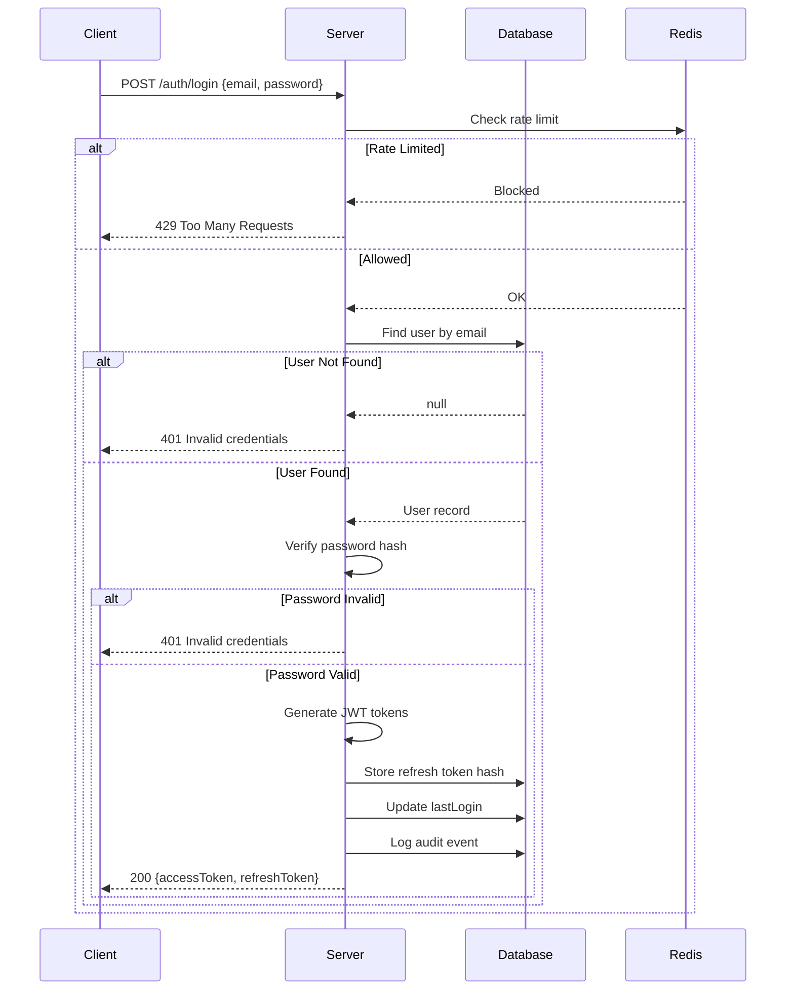

### 1.2 Token Refresh Flow

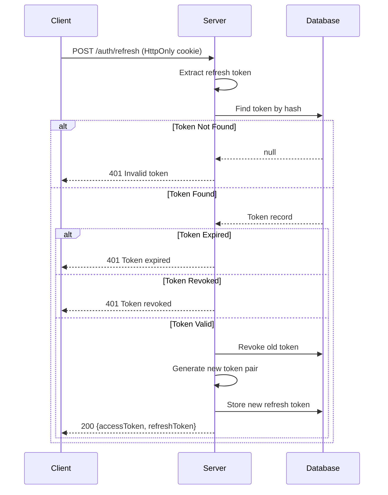

---

## 2. CRUD Operation Flows

### 2.1 Create Space Flow

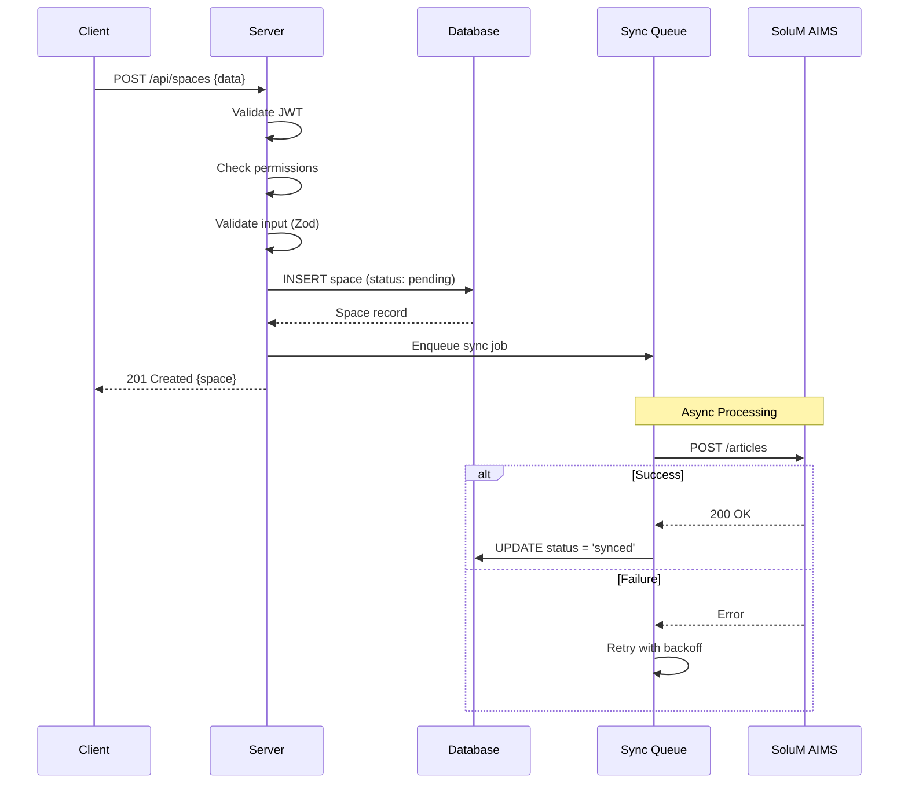

### 2.2 Assign Person to Space Flow

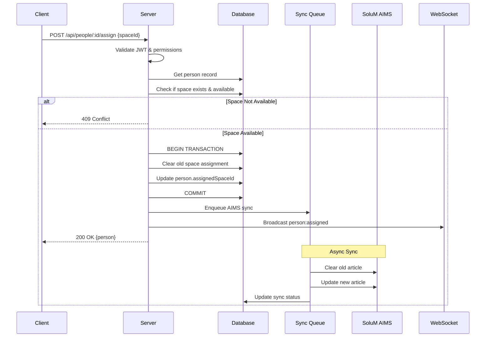

---

## 3. Sync Engine Flows

### 3.1 Full Sync Flow

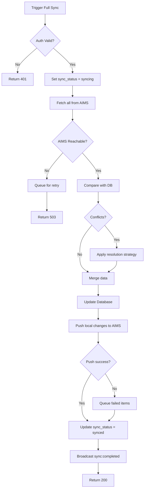

### 3.2 Sync Queue Processing

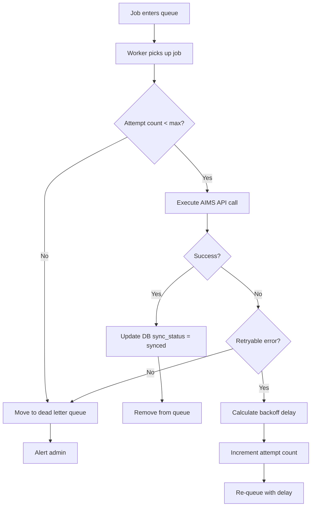

---

## 4. Health Check Flows

### 4.1 Readiness Check Flow

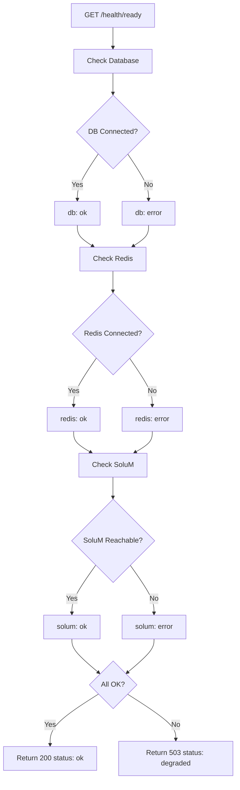

### 4.2 SoluM Alive Signal Flow

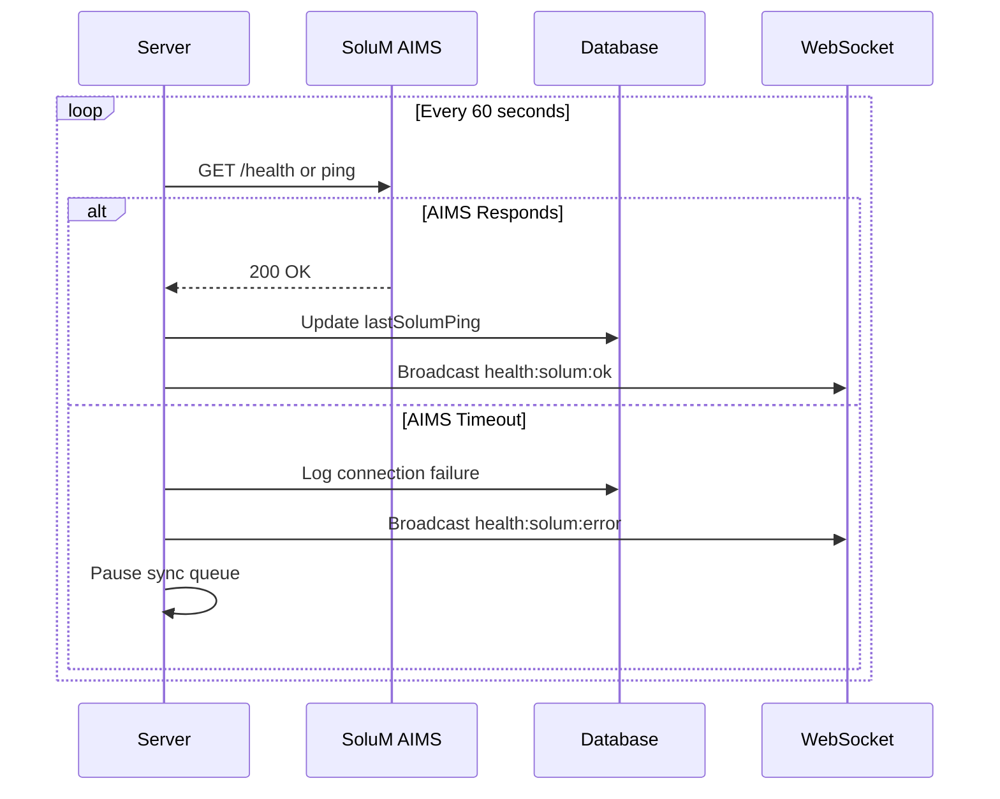

---

## 5. User Management Flows

### 5.1 Create User Flow

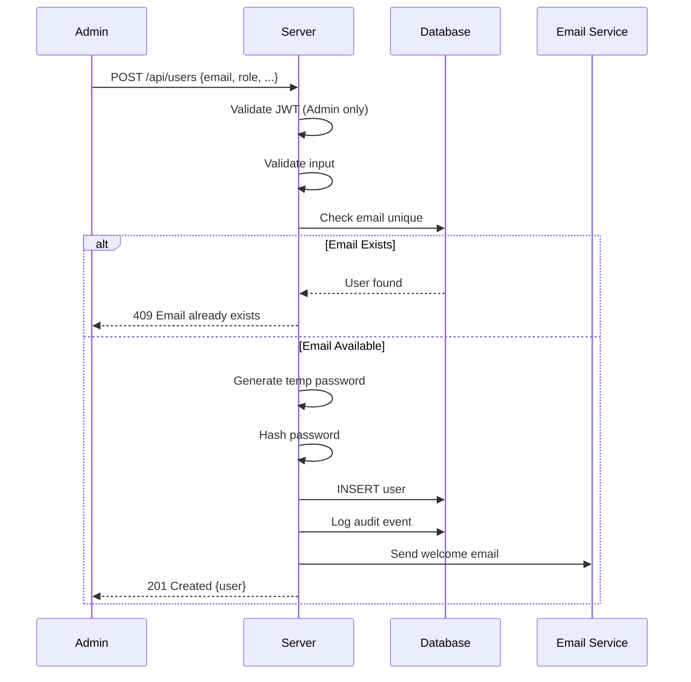

### 5.2 Change Password Flow

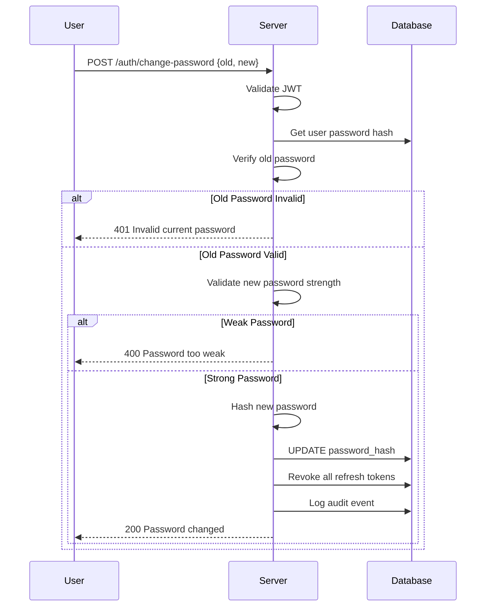

---

## 6. Conference Room Flows

### 6.1 Toggle Meeting Status Flow

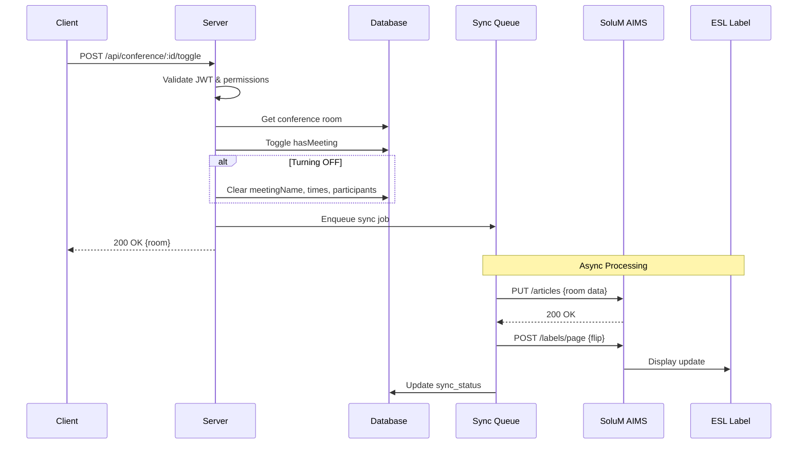

---

## 7. Multi-Tenant Data Flow

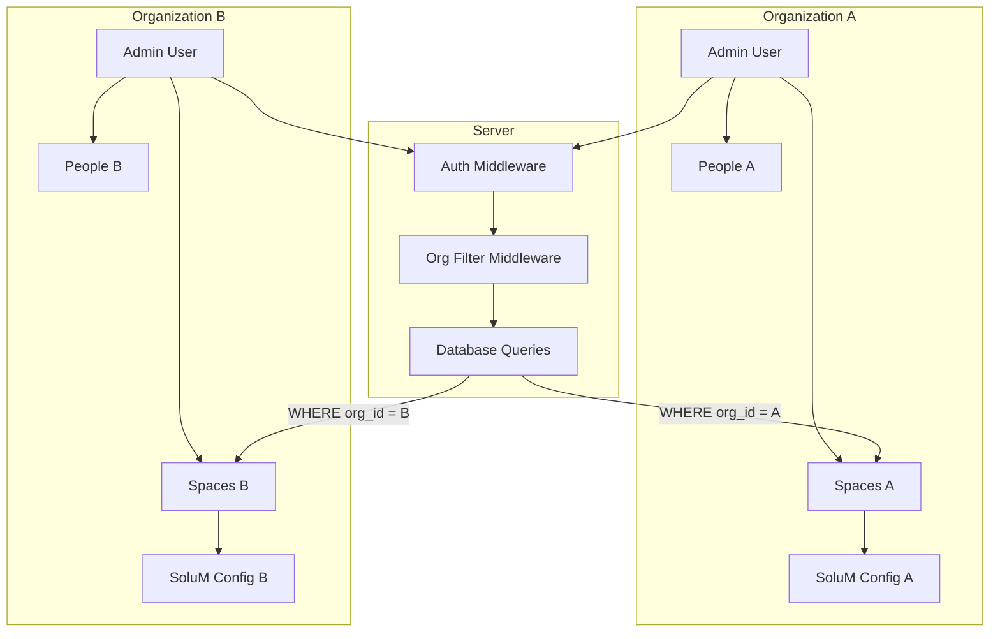

---

## 8. Error Handling Flow

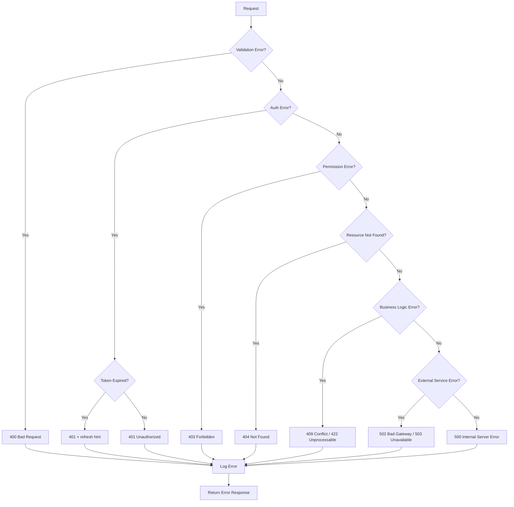
