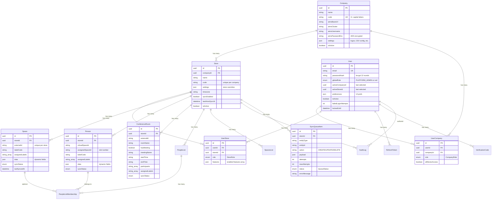

# Chapter 2 — Data Architecture

### 2.1 Entity-Relationship Model

### 2.2 Multi-Tenancy Model

The system implements a two-level multi-tenancy hierarchy:

**Company** is the top-level tenant. Each company:
- Has its own AIMS API credentials (base URL, cluster, username, encrypted password).
- Stores company-wide settings as JSON (logos, CSV import config, SoluM field mappings, people manager config).
- Can have multiple Stores.

**Store** is the operational unit within a company:
- Maps to a SoluM AIMS store number.
- Has store-specific settings that can override company defaults.
- All domain entities (spaces, people, conference rooms) are scoped to a store.
- Has its own sync queue and sync state.

**User access** is managed through two junction tables:
- `UserCompany` — grants company-level access with a `CompanyRole` and an `allStoresAccess` flag.
- `UserStore` — grants store-level access with a `StoreRole` and a feature-permissions JSON array.

### 2.3 Dynamic Data Pattern

Spaces, People, and Conference Rooms use a **dynamic data** pattern via a `data Json` column. This allows each company to define its own custom fields (e.g., department, floor, extension) without schema changes. The field definitions and display mappings are stored in the company's `settings` JSON.

When syncing to AIMS, the `data` JSON fields are mapped to AIMS article data fields using the company's `solumArticleFormat` (fetched from AIMS) and `solumMappingConfig` (user-configured).

### 2.4 Sync Status State Machine

### 2.5 Queue Status State Machine

### 2.6 Key Database Indexes

| Table | Index | Purpose |
|-------|-------|---------|
| `stores` | `(companyId)` | Fast store lookup by company |
| `stores` | `(companyId, code)` UNIQUE | Unique store code per company |
| `spaces` | `(storeId, externalId)` UNIQUE | Unique space per store |
| `spaces` | `(storeId)`, `(labelCode)` | Query performance |
| `people` | `(storeId)`, `(assignedSpaceId)`, `(externalId)`, `(virtualSpaceId)` | Multi-path lookup |
| `sync_queue` | `(status, scheduledAt)` | Efficient pending item fetch |
| `audit_logs` | `(entityType, entityId)`, `(createdAt)` | Audit trail queries |
| `refresh_tokens` | `(tokenHash)`, `(userId)` | Fast token validation |
| `verification_codes` | `(userId, type, used)`, `(code)` | 2FA lookup |
