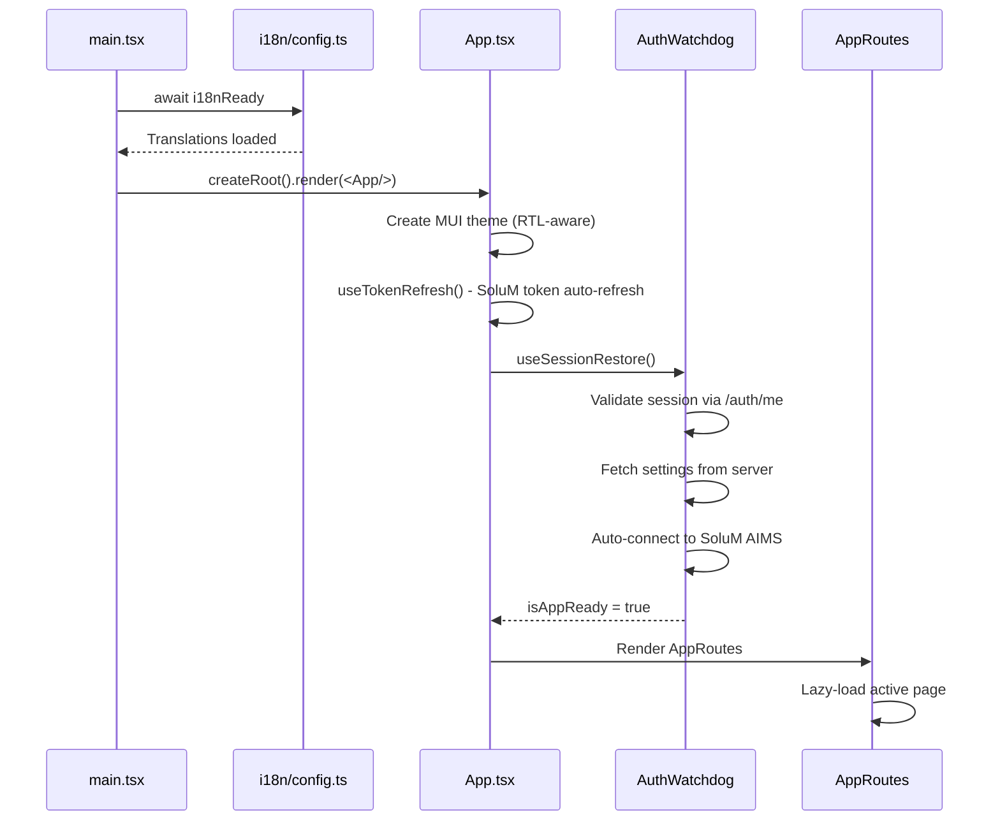
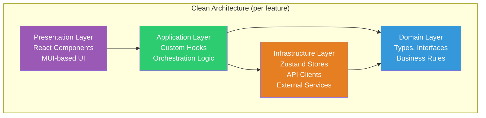
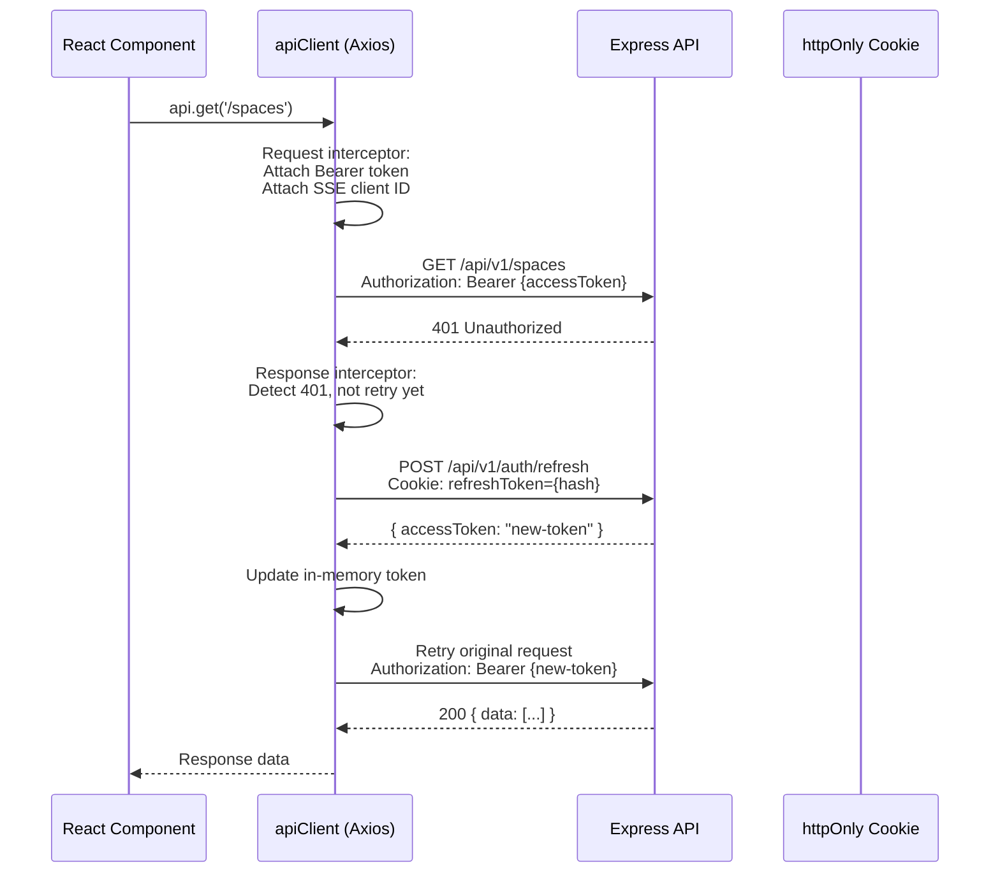
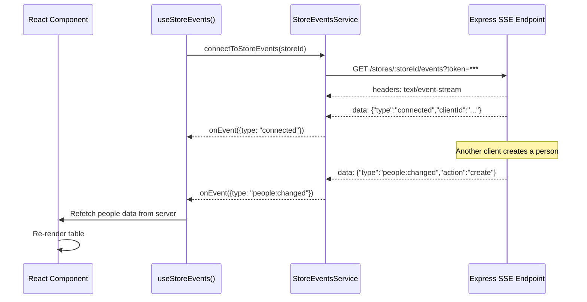

# Chapter 4 — Client Architecture

### 4.1 Application Bootstrap



### 4.2 Feature Module Pattern (Client)

Each client feature follows a Clean Architecture layering:

```
src/features/{feature}/
  ├── domain/              # Types, interfaces, business rules
  │   └── types.ts
  ├── application/         # Hooks, business logic orchestration
  │   ├── useFeatureHook.ts
  │   └── utils/
  ├── infrastructure/      # API clients, stores, external services
  │   ├── featureStore.ts  # Zustand store
  │   └── featureApi.ts    # API client functions
  ├── presentation/        # React components
  │   ├── FeaturePage.tsx
  │   └── components/
  └── __tests__/           # Unit tests
```



### 4.3 Feature Modules

| Feature | Path | Store | Key Responsibilities |
|---------|------|-------|---------------------|
| **auth** | `/features/auth` | `authStore` | Login, 2FA, session, company/store switching |
| **space** | `/features/space` | `spacesStore` | Space CRUD, label assignment, bulk operations |
| **people** | `/features/people` | `peopleStore` | People CRUD, slot assignment, import/export |
| **conference** | `/features/conference` | `conferenceStore` | Room CRUD, meeting toggle |
| **labels** | `/features/labels` | `labelsStore` | Label listing, linking, image push, blink |
| **settings** | `/features/settings` | `settingsStore` | Company/store settings, SoluM config, user management |
| **sync** | `/features/sync` | `syncStore` | Sync status, manual trigger, queue monitoring |
| **lists** | `/features/lists` | `listsStore` | People & spaces lists management |
| **dashboard** | `/features/dashboard` | -- | Overview cards, status widgets, mobile-optimized layout with progress bars and stat tiles |
| **import-export** | `/features/import-export` | -- | CSV import/export for spaces and people |
| **update** | `/features/update` | `updateStore` | Electron auto-update management |
| **configuration** | `/features/configuration` | -- | App configuration wizard |
| **manual** | `/features/manual` | -- | In-app user manual |
| **systemLogs** | `/features/systemLogs` | -- | Client-side log viewer |

### 4.4 State Management Architecture

```mermaid
graph TB
    subgraph "Zustand Stores"
        AUTH[authStore<br/>User, tokens,<br/>company/store context]
        SETTINGS[settingsStore<br/>App settings,<br/>SoluM config]
        SPACES[spacesStore<br/>Spaces data,<br/>selection state]
        PEOPLE[peopleStore<br/>People data,<br/>assignment state]
        CONF[conferenceStore<br/>Conference rooms,<br/>meeting state]
        LABELS[labelsStore<br/>Label data,<br/>filter state]
        SYNC[syncStore<br/>Sync status,<br/>working mode]
        LISTS[listsStore<br/>People/spaces lists]
        NOTIF[notificationStore<br/>Toast notifications]
        LOGS[logsStore<br/>Client-side logs]
    end

    subgraph "Persistence"
        LS[localStorage<br/>via Zustand persist]
    end

    AUTH -->|persist| LS
    SETTINGS -->|persist| LS
    SPACES -->|persist| LS
    SYNC -->|persist| LS

    subgraph "Root Store"
        ROOT[rootStore.ts<br/>Re-exports +<br/>useRootStore() hook]
    end

    ROOT --> SETTINGS
    ROOT --> SPACES
    ROOT --> SYNC
    ROOT --> CONF
    ROOT --> NOTIF
```

Key Zustand patterns used:

- **`persist` middleware** -- Selective state persistence to localStorage (e.g., auth user, settings, spaces).
- **`devtools` middleware** -- Named actions for Redux DevTools debugging.
- **`partialize`** -- Only persists specific state slices (e.g., authStore persists `user` but not `isAuthenticated`).
- **Store isolation** -- Each feature has its own store; no global monolithic store.
- **Cross-store communication** -- Stores import each other directly (e.g., `authStore` calls `settingsStore.fetchSettingsFromServer()` on login).

### 4.5 API Client & Token Management



Security design:
- **Access token** -- Stored in memory only (not localStorage), protecting against XSS.
- **Refresh token** -- Stored in httpOnly cookie by the server, inaccessible to JavaScript.
- **Automatic refresh** -- The Axios response interceptor detects 401 errors, refreshes the token, and queues/retries concurrent failed requests.
- **SSE Client ID** -- Attached as `x-sse-client-id` header so the server can exclude the originator from broadcast events.

### 4.6 Routing & Code Splitting

```mermaid
graph TB
    HR[HashRouter]

    subgraph "Public"
        LOGIN[/login<br/>LoginPage]
    end

    subgraph "Protected (ProtectedRoute)"
        DASH[/<br/>DashboardPage]
        SPACES[/spaces<br/>ProtectedFeature: spaces<br/>SpacesPage]
        CONF[/conference<br/>ProtectedFeature: conference<br/>ConferencePage]
        PEOPLE[/people<br/>ProtectedFeature: people<br/>PeopleManagerView]
        LAB[/labels<br/>ProtectedFeature: labels<br/>LabelsPage]
    end

    HR --> LOGIN
    HR --> DASH
    HR --> SPACES
    HR --> CONF
    HR --> PEOPLE
    HR --> LAB

    style LOGIN fill:#e74c3c,color:#fff
    style DASH fill:#27ae60,color:#fff
    style SPACES fill:#27ae60,color:#fff
    style CONF fill:#27ae60,color:#fff
    style PEOPLE fill:#27ae60,color:#fff
    style LAB fill:#27ae60,color:#fff
```

- **HashRouter** -- Used for Capacitor/Electron compatibility (no server-side routing needed).
- **Lazy Loading** -- All page components are lazy-loaded with `React.lazy()` for code splitting.
- **Suspense Boundaries** -- Each route has its own `<Suspense>` boundary for immediate loader display.
- **ProtectedRoute** -- Redirects unauthenticated users to `/login`.
- **ProtectedFeature** -- Checks the user's `features` JSON from `UserStore` to conditionally render feature pages.

### 4.7 Bundle Optimization

Vite is configured with manual chunk splitting:

| Chunk | Contents |
|-------|----------|
| `react-vendor` | react, react-dom, react-router |
| `mui-vendor` | @mui/*, @emotion/* |
| `form-vendor` | react-hook-form, zod |
| `i18n-vendor` | i18next, react-i18next |
| `utils-vendor` | axios, papaparse, date-fns |

Additional optimizations:
- **Gzip + Brotli** pre-compression via `vite-plugin-compression`.
- **Terser** removes `console.log`, `console.debug`, `console.info` in production (keeps `error` and `warn`).
- **Bundle analyzer** generates `dist/stats.html` for size inspection.
- **Chunk size warning** set to 600KB to detect unexpected growth.

### 4.8 Internationalization (i18n)

```mermaid
graph LR
    DETECT[Language Detection<br/>localStorage -> navigator] --> LOAD[Lazy Load Locale<br/>Only active language]
    LOAD --> INIT[i18next Init<br/>fallback: en]
    INIT --> RENDER[App Renders<br/>useTranslation()]

    SWITCH[Language Switch] --> LAZY[Lazy Load<br/>Other Language Bundle]
    LAZY --> ADD[addResourceBundle]
    ADD --> RERENDER[Re-render with<br/>new translations]

    INIT --> RTL{Language = he?}
    RTL -->|Yes| RTLDIR[document.dir = 'rtl'<br/>RTL MUI Theme]
    RTL -->|No| LTRDIR[document.dir = 'ltr'<br/>LTR MUI Theme]
```

- Supports **English** and **Hebrew** (with full RTL support via `stylis-plugin-rtl`).
- Locale bundles are **lazy-loaded** -- only the active language is loaded at startup.
- The MUI theme is **recreated** when the direction changes (via `useMemo`).

### 4.9 Real-Time Updates (Client)



The SSE connection is per-store and authenticated via query parameter (since `EventSource` does not support custom headers). In development, the SSE client connects directly to the backend (port 3001) to bypass Vite's proxy, which buffers streaming responses.
