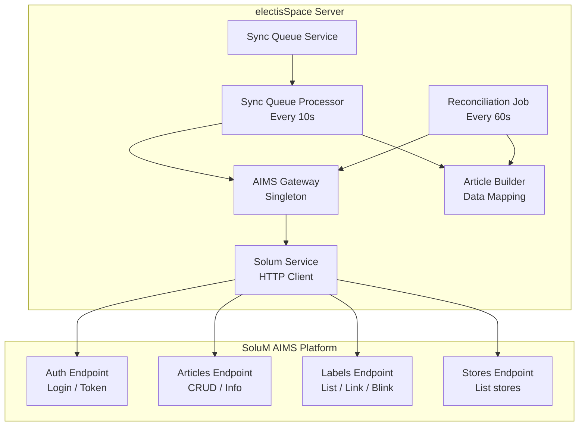
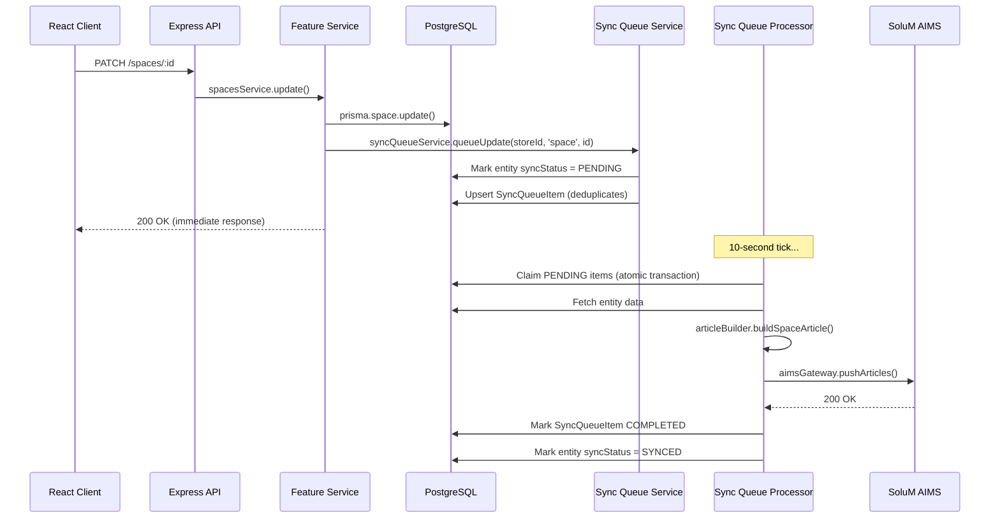
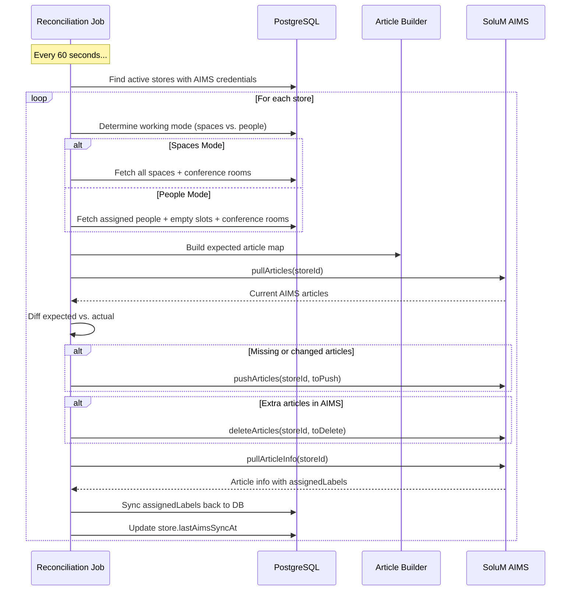
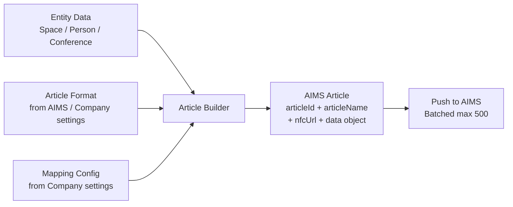

# Chapter 5 — Integration & Synchronization

### 5.1 SoluM AIMS Integration Overview

### 5.2 Push Sync Flow (Entity Changed)

Key design decisions:
- **Asynchronous push** -- Entity updates return immediately; AIMS sync happens in the background.
- **Deduplication** -- If a pending/processing queue item already exists for the same entity, it is updated in-place rather than creating a duplicate.
- **5-second delay** -- Items must be at least 5 seconds old before processing, allowing rapid edits to coalesce into a single AIMS push.

### 5.3 Reconciliation Sync Flow (Periodic)

The reconciliation job ensures eventual consistency even if individual push sync items fail. It is mode-aware:

- **Spaces mode**: Expected articles = all spaces + conference rooms.
- **People mode**: Expected articles = assigned people (keyed by `assignedSpaceId`) + empty slot articles for unoccupied spaces + conference rooms.

### 5.4 Article Building Pipeline

The Article Builder maps entity data to the AIMS article format:

1. **Top-level fields** (`articleId`, `articleName`, `nfcUrl`) use generic AIMS keys.
2. **Data object** contains the company's custom column names from `mappingInfo`.
3. **Global field assignments** (from company settings) inject static values across all articles.
4. **Conference mapping** maps `meetingName`, `meetingTime`, and `participants` to configurable AIMS fields.

### 5.5 Label Operations

Labels are the physical e-ink devices managed through AIMS:

| Operation | Flow |
|-----------|------|
| **Fetch Labels** | Server -> AIMS `/labels` endpoint -> Return to client |
| **Link Label** | Client sends `labelCode` + `articleId` -> Server -> AIMS link endpoint |
| **Unlink Label** | Client sends `labelCode` -> Server -> AIMS unlink endpoint |
| **Blink Label** | Client sends `labelCode` -> Server -> AIMS blink endpoint (flashes LED) |
| **Push Image** | Client sends base64 image -> Server -> AIMS image push endpoint |
| **Dither Preview** | Client sends image params -> Server -> AIMS dither endpoint -> Return preview |

Label-to-entity binding (`assignedLabels` arrays) is synced back from AIMS during the reconciliation job's `syncAssignedLabels` step.
