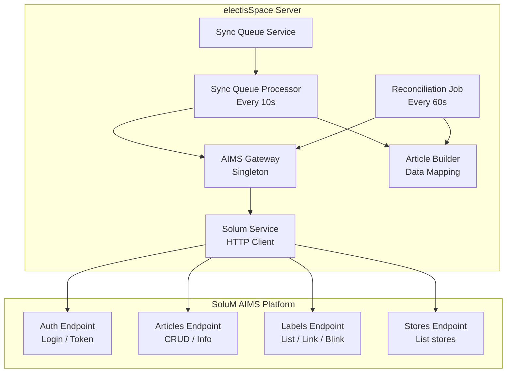
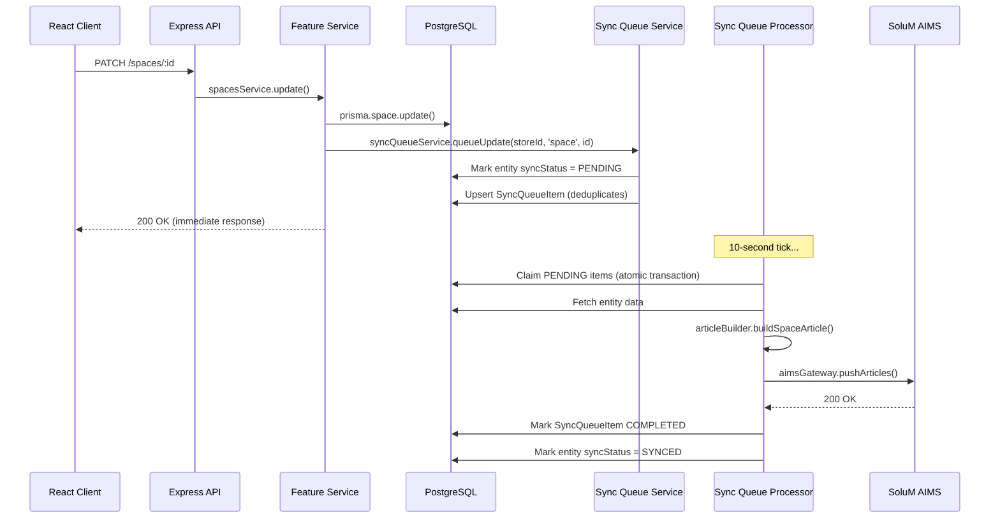
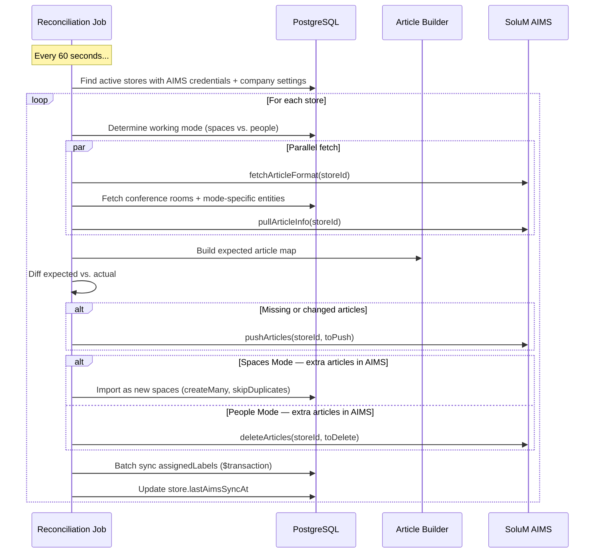
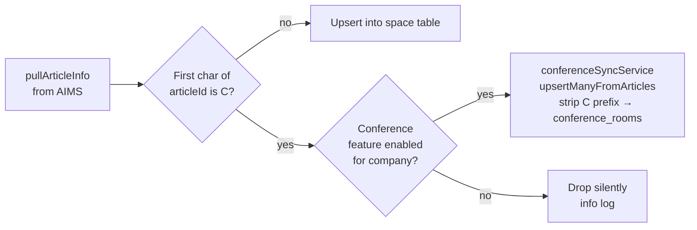
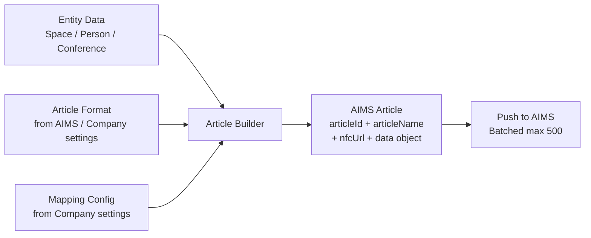

# Chapter 5 — Integration & Synchronization

### 5.1 SoluM AIMS Integration Overview


```mermaid
graph TB
    subgraph "electisSpace Server"
        GW[AIMS Gateway<br/>Singleton]
        SOLUM[Solum Service<br/>HTTP Client]
        AB[Article Builder<br/>Data Mapping]
        SQS[Sync Queue Service]
        SQP[Sync Queue Processor<br/>Every 10s]
        RECON[Reconciliation Job<br/>Every 60s]
    end

    subgraph "SoluM AIMS Platform"
        AUTH_EP[Auth Endpoint<br/>Login / Token]
        ART_EP[Articles Endpoint<br/>CRUD / Info]
        LABEL_EP[Labels Endpoint<br/>List / Link / Blink]
        STORE_EP[Stores Endpoint<br/>List stores]
    end

    GW --> SOLUM
    SOLUM --> AUTH_EP
    SOLUM --> ART_EP
    SOLUM --> LABEL_EP
    SOLUM --> STORE_EP

    SQP --> GW
    SQP --> AB
    RECON --> GW
    RECON --> AB
    SQS --> SQP
```

### 5.2 Push Sync Flow (Entity Changed)


```mermaid
sequenceDiagram
    participant Client as React Client
    participant API as Express API
    participant SVC as Feature Service
    participant DB as PostgreSQL
    participant SQS as Sync Queue Service
    participant SQP as Sync Queue Processor
    participant AIMS as SoluM AIMS

    Client->>API: PATCH /spaces/:id
    API->>SVC: spacesService.update()
    SVC->>DB: prisma.space.update()
    SVC->>SQS: syncQueueService.queueUpdate(storeId, 'space', id)
    SQS->>DB: Mark entity syncStatus = PENDING
    SQS->>DB: Upsert SyncQueueItem (deduplicates)
    SVC-->>Client: 200 OK (immediate response)

    Note over SQP: 10-second tick...
    SQP->>DB: Claim PENDING items (atomic transaction)
    SQP->>DB: Fetch entity data
    SQP->>SQP: articleBuilder.buildSpaceArticle()
    SQP->>AIMS: aimsGateway.pushArticles()
    AIMS-->>SQP: 200 OK
    SQP->>DB: Mark SyncQueueItem COMPLETED
    SQP->>DB: Mark entity syncStatus = SYNCED
```

Key design decisions:
- **Asynchronous push** -- Entity updates return immediately; AIMS sync happens in the background.
- **Deduplication** -- If a pending/processing queue item already exists for the same entity, it is updated in-place rather than creating a duplicate.
- **5-second delay** -- Items must be at least 5 seconds old before processing, allowing rapid edits to coalesce into a single AIMS push.

### 5.3 Reconciliation Sync Flow (Periodic)


```mermaid
sequenceDiagram
    participant Job as Reconciliation Job
    participant DB as PostgreSQL
    participant Builder as Article Builder
    participant AIMS as SoluM AIMS

    Note over Job: Every 60 seconds...

    Job->>DB: Find active stores with AIMS credentials + company settings

    loop For each store
        Job->>DB: Determine working mode (spaces vs. people)

        par Parallel fetch
            Job->>AIMS: fetchArticleFormat(storeId)
            Job->>DB: Fetch conference rooms + mode-specific entities
            Job->>AIMS: pullArticleInfo(storeId)
        end

        Job->>Builder: Build expected article map
        Job->>Job: Diff expected vs. actual

        alt Missing or changed articles
            Job->>AIMS: pushArticles(storeId, toPush)
        end

        alt Spaces Mode — extra articles in AIMS
            Job->>DB: Import as new spaces (createMany, skipDuplicates)
        else People Mode — extra articles in AIMS
            Job->>AIMS: deleteArticles(storeId, toDelete)
        end

        Job->>DB: Batch sync assignedLabels ($transaction)
        Job->>DB: Update store.lastAimsSyncAt
    end
```

The reconciliation job ensures eventual consistency even if individual push sync items fail. It is mode-aware:

- **Spaces mode** (AIMS = source of truth): Expected articles = all spaces + conference rooms. Extra articles in AIMS that are not in the DB are **imported into the DB** as new spaces. Articles are **never deleted from AIMS** during reconciliation — deletion only happens via explicit user action through the SyncQueueProcessor. A race condition guard checks for pending DELETE queue items to avoid re-importing recently deleted spaces.
- **People mode** (DB = source of truth): Expected articles = assigned people (keyed by `assignedSpaceId`) + empty slot articles for unoccupied spaces + conference rooms. Extra articles in AIMS are deleted, with a mass-deletion safety check (refuses if deleting ≥5 articles AND >50% of AIMS total).

#### Pull-from-AIMS Article Classification (`spacesSyncService.pullFromAims`, v2.10.0+)

When a user clicks **Pull from AIMS** on the spaces page, the synchronous endpoint (separate from the periodic reconciliation job above) partitions the returned articles by `articleId` prefix before upserting:


```mermaid
graph LR
    PULL[pullArticleInfo<br/>from AIMS] --> PART{First char of<br/>articleId is C?}
    PART -->|no| SPACES[Upsert into space table]
    PART -->|yes| FLAG{Conference<br/>feature enabled<br/>for company?}
    FLAG -->|yes| CONF[conferenceSyncService<br/>upsertManyFromArticles<br/>strip C prefix → conference_rooms]
    FLAG -->|no| SKIP[Drop silently<br/>info log]
```

- The conference flag is resolved via `extractCompanyFeatures(store.company.settings)` + `extractStoreFeatures(store.settings)` + `resolveEffectiveFeatures(...)` — store override wins, falls back to company default.
- The `C` prefix check is case-insensitive (`articleId[0].toUpperCase() === 'C'`) to match the existing frontend `filterConferenceArticles` helper.
- `conferenceSyncService.upsertManyFromArticles` lives in `server/src/features/conference/syncService.ts`. It strips the `C` prefix to derive the local `externalId`, applies the same CSV-quote unescaping the spaces sync uses, and writes via dedicated `conferenceRepository.syncCreate` / `syncUpdate` methods which mark new rows `syncStatus: 'SYNCED'` (the user-action `create`/`update` methods default to `PENDING`).
- A **pull-time race guard** is applied symmetrically for both spaces and conference: before upsert, the service queries `prisma.syncQueueItem` for non-terminal `DELETE` items (`status IN ('PENDING','PROCESSING')`) and skips any externalId currently in flight. This prevents a pull arriving between a local delete and its AIMS push from re-creating the row. Source of truth is the DB; no in-memory cache.
- The `SyncResult` returned to the client gains an optional `conference: { created, updated, unchanged, skipped }` block when the conference path ran, surfaced in the pull-result toast as `spaces.sync.pullResultWithConference`.
- Pre-existing `C`-prefixed rows that landed in the `space` table from earlier (pre-fix) pulls are intentionally **not** auto-cleaned — users remove them via the **Spaces bulk delete** Select Mode UI introduced in the same release.

### 5.4 Article Building Pipeline


```mermaid
graph LR
    ENTITY[Entity Data<br/>Space / Person / Conference] --> BUILDER[Article Builder]
    FORMAT[Article Format<br/>from AIMS / Company settings] --> BUILDER
    MAPPING[Mapping Config<br/>from Company settings] --> BUILDER
    BUILDER --> ARTICLE[AIMS Article<br/>articleId + articleName<br/>+ nfcUrl + data object]
    ARTICLE --> AIMS[Push to AIMS<br/>Batched max 500]
```

The Article Builder maps entity data to the AIMS article format:

1. **Top-level fields** (`articleId`, `articleName`, `nfcUrl`) use generic AIMS keys.
2. **Data object** contains the company's custom column names from `mappingInfo`.
3. **Global field assignments** (from company settings) inject static values across all articles.
4. **Conference mapping** maps `meetingName`, `meetingTime`, and `participants` to configurable AIMS fields.

### 5.5 AIMS Token Management

AIMS uses Azure AD B2C for authentication. Tokens are managed by `AIMSGateway` with a multi-layer strategy:

```
getToken(companyId)
  ├─ 1. Check in-memory cache (valid if > 5 min before expiry)
  ├─ 2. Singleflight dedup (await in-flight login for same company)
  ├─ 3. Try refresh token (POST /api/v2/token/refresh)
  └─ 4. Fall back to full login (POST /api/v2/token) with retry
```

| Concept | Detail |
|---------|--------|
| **Cache** | `tokenCache` Map keyed by `companyId`, stores `accessToken`, `refreshToken`, `expiresAt` |
| **Expiry buffer** | 5 minutes before actual expiry (`TOKEN_EXPIRY_BUFFER`) |
| **Refresh** | Uses stored `refreshToken` via `/api/v2/token/refresh` before attempting full login |
| **Login retry** | `loginWithRetry()` retries up to 3× on 429/5xx with exponential backoff + jitter |
| **Singleflight** | `inflightLogins` Map prevents concurrent duplicate logins for the same company |
| **Token refresh on 401/403** | All AIMS operations (`withTokenRetry`, `linkLabel`, etc.) invalidate cache and re-authenticate on auth errors |

**Error preservation**: All `solumService` methods use `wrapError()` to preserve the original axios `error.response` when wrapping errors. This ensures `withRetry` can correctly identify HTTP status codes (e.g., 403 vs network error) and skip unnecessary retries.

### 5.6 Label Operations

Labels are the physical e-ink devices managed through AIMS:

| Operation | Flow |
|-----------|------|
| **Fetch Labels** | Server -> AIMS `/labels` endpoint -> Return to client |
| **Link Label** | Client sends `labelCode` + `articleId` -> Server -> AIMS link endpoint |
| **Unlink Label** | Client sends `labelCode` -> Server -> AIMS unlink endpoint |
| **Blink Label** | Client sends `labelCode` -> Server -> AIMS blink endpoint (flashes LED) |
| **Push Image** | Client sends base64 image -> Server -> AIMS image push endpoint |
| **Dither Preview** | Multiple client-side engines or AIMS server-side preview |

#### Image Push Pipeline (`AssignImageDialog`)

The image push flow processes user-uploaded images through a client-side canvas pipeline before sending to AIMS:

```
User selects image file
  → loadImage(file)          — validate non-zero naturalWidth/Height
  → resizeImage(img, w, h)   — validate target dimensions > 0, apply fit mode
  → rotateCanvas(canvas, steps) — optional 90° rotation (steps=1–3)
  → canvasToBase64(canvas)   — PNG base64 (without data URI prefix)
  → store resized canvas in ref (for re-dithering without re-resize)
  → generatePreview(canvas, info, engine):
      Client engine → applyClientDither(canvas, colorType, engine) — instant
      AIMS engine   → labelsApi.getDitherPreview() — network round-trip
  → LabelMockup preview      — shows dithered result
  → pushImage API call:
      Client engine → push dithered image with dithering: false (pre-dithered)
      AIMS engine   → push full-color image with dithering: true (AIMS dithers)
```

**Dithering engines** (`DitherEngine` type in `imageTypes.ts`):

| Engine | Type | Description |
|--------|------|-------------|
| `floyd-steinberg` | Client | Error diffusion, natural organic look (default) |
| `atkinson` | Client | Sharper, diffuses 75% of error to 6 neighbors |
| `ordered` | Client | Bayer 4×4 threshold matrix, deterministic crosshatch |
| `threshold` | Client | Nearest-color only, no pattern |
| `aims` | Server | AIMS server-side dithering via `getDitherPreview` API |

Switching engines only re-runs `generatePreview` using the cached resized canvas — no re-resize needed. AIMS preview requests use `AbortController` to handle rapid engine switching.

Key utilities in `labels/domain/`:

| File | Purpose |
|------|---------|
| `imageUtils.ts` | `loadImage`, `resizeImage` (contain/cover/fill), `rotateCanvas` (90° steps), `canvasToBase64` |
| `ditherUtils.ts` | `ditherImage` (legacy), `applyClientDither` (dispatcher for all 4 client engines) |
| `imageTypes.ts` | `LabelTypeInfo`, `FitMode`, `DitherEngine`, `DITHER_ENGINES` metadata |

All canvas functions validate dimensions before processing to prevent browser `getImageData` errors on zero-size canvases.

Label-to-entity binding (`assignedLabels` arrays) is synced back from AIMS during the reconciliation job's `syncAssignedLabels` step.
