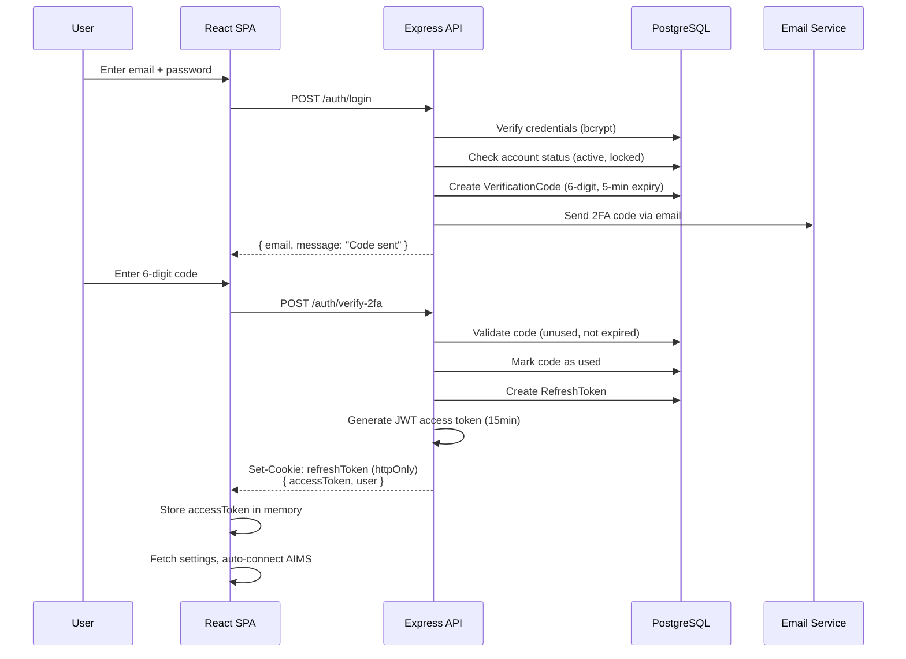
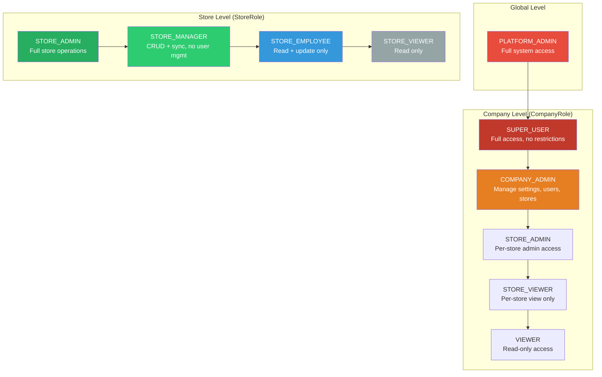
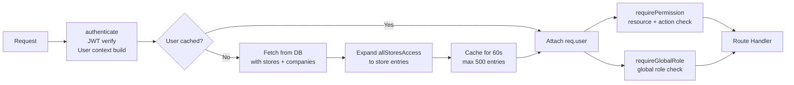

# Chapter 7 — Security, Auth & Access Control

### 7.1 Authentication Flow



### 7.2 Token Architecture

```mermaid
graph TB
    subgraph "Access Token (JWT)"
        AT_STORE[Stored in: Memory only]
        AT_LIFE[Lifetime: 15 minutes]
        AT_USE[Used for: API authorization]
        AT_PAYLOAD[Payload: sub, globalRole,<br/>stores[], companies[]]
    end

    subgraph "Refresh Token"
        RT_STORE[Stored in: httpOnly cookie<br/>+ hashed in DB]
        RT_LIFE[Lifetime: 180 days]
        RT_USE[Used for: Access token renewal]
    end

    subgraph "Verification Code"
        VC_STORE[Stored in: DB]
        VC_LIFE[Lifetime: 5 minutes]
        VC_USE[Used for: 2FA + Password Reset]
        VC_TYPE[Types: LOGIN_2FA, PASSWORD_RESET]
    end
```

Security properties:
- **Access tokens** never touch persistent storage (memory-only), eliminating XSS token theft.
- **Refresh tokens** use httpOnly cookies (invisible to JavaScript) with hashed storage in the database.
- **Verification codes** are single-use, time-limited, and rate-limited per IP+email combination.

### 7.3 Role-Based Access Control (RBAC)



### 7.4 Permission Matrix

The `requirePermission(resource, action)` middleware enforces fine-grained store-level permissions, while `requireGlobalRole(...roles)` enforces global-level role checks (e.g., restricting the `/logs` API to `PLATFORM_ADMIN`):

| Resource | STORE_ADMIN | STORE_MANAGER | STORE_EMPLOYEE | STORE_VIEWER |
|----------|:-----------:|:-------------:|:--------------:|:------------:|
| spaces: create | X | X | | |
| spaces: read | X | X | X | X |
| spaces: update | X | X | X | |
| spaces: delete | X | X | | |
| people: create | X | X | | |
| people: read | X | X | X | X |
| people: update | X | X | X | |
| people: delete | X | X | | |
| people: import | X | X | | |
| people: assign | X | X | | |
| conference: create | X | X | | |
| conference: read | X | X | X | X |
| conference: update | X | X | X | |
| conference: delete | X | X | | |
| conference: toggle | X | X | | |
| settings: read | X | X | | |
| settings: update | X | | | |
| users: CRUD | X | | | |
| audit: read | X | | | |
| sync: trigger | X | X | | |
| sync: view | X | X | X | X |
| labels: view | X | X | X | X |
| labels: manage | X | X | | |

**PLATFORM_ADMIN** bypasses all permission checks.

Users with `allStoresAccess` on their `UserCompany` record receive `STORE_ADMIN`-level permissions across all stores in that company.

### 7.5 Feature-Level Access Control

Beyond role-based permissions, the `UserStore.features` JSON array controls which frontend pages a user can access:

```json
["dashboard", "spaces", "conference", "people"]
```

The `<ProtectedFeature feature="spaces">` component checks this array and renders a redirect if the user lacks the feature permission.

### 7.6 Auth Middleware Pipeline



The auth middleware uses a 60-second in-memory cache (max 500 entries) to reduce database queries. The cache is invalidated when user roles or store assignments change.

SSE endpoints accept the token as a query parameter (`?token=...`) since `EventSource` does not support custom headers.

### 7.7 Rate Limiting Strategy

| Endpoint | Window | Max Requests | Key |
|----------|--------|-------------|-----|
| Global API (`/api/*`) | 60s | 100 | IP |
| Login (`/auth/login`) | 15min | 10 | IP + email |
| 2FA Verify (`/auth/verify-2fa`) | 5min | 5 | IP + email |
| Password Reset | 1hr | 3 | IP + email |

All rate limits are configurable via environment variables.

### 7.8 Security Middleware Stack

| Middleware | Purpose |
|-----------|---------|
| **Helmet** | Sets security headers (CSP, HSTS, X-Frame-Options, etc.) |
| **CORS** | Restricts origins to configured whitelist with credentials |
| **Rate Limiting** | Prevents brute force and DDoS |
| **Request ID** | Unique ID per request for log correlation |
| **bcrypt (12 rounds)** | Password hashing |
| **AES Encryption** | AIMS credentials at rest |
| **httpOnly Cookies** | Refresh token storage (no JS access) |
| **Account Lockout** | `failedLoginAttempts` counter with `lockedUntil` timestamp |
| **Non-root Container** | Server runs as UID 1001 inside Docker |
| **dumb-init** | Proper signal forwarding in containers |

### 7.9 AIMS Credential Security

AIMS API passwords are encrypted at rest using AES encryption:

```
User provides AIMS password (plaintext)
  -> Server encrypts with ENCRYPTION_KEY (AES)
    -> Stored as aimsPasswordEnc in Company record
      -> Decrypted only when making AIMS API calls
```

The `ENCRYPTION_KEY` (32+ characters) is provided via environment variable and never stored in the database.

### 7.10 Audit Logging

All significant operations are recorded in the `audit_logs` table:

| Field | Description |
|-------|------------|
| `action` | Operation type (CREATE, UPDATE, DELETE, etc.) |
| `entityType` | Target entity (space, person, conference, user, etc.) |
| `entityId` | Target entity ID |
| `oldData` | Previous state (JSON) |
| `newData` | New state (JSON) |
| `ipAddress` | Client IP address |
| `userAgent` | Client user agent string |
| `permissionChecked` | Which permission was validated |
| `wasAuthorized` | Whether the operation was authorized |

Audit logs are store-scoped and indexed by `(entityType, entityId)` and `(createdAt)` for efficient querying.
