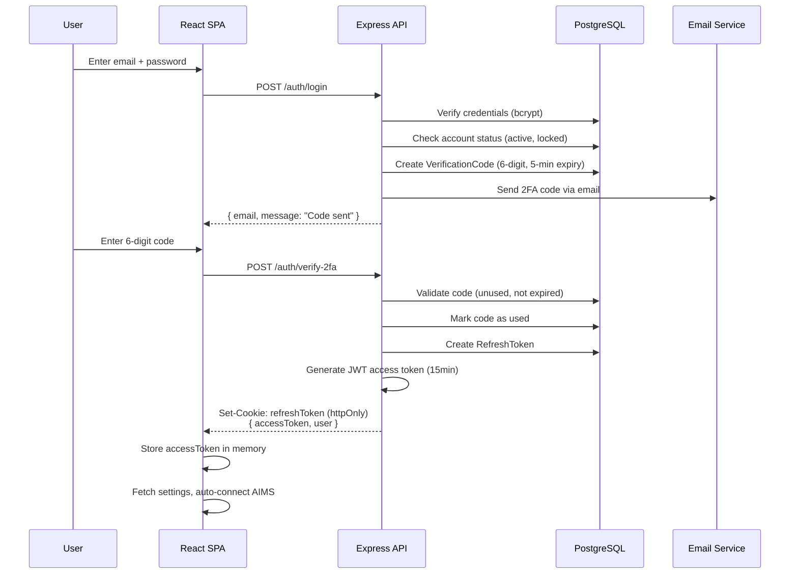
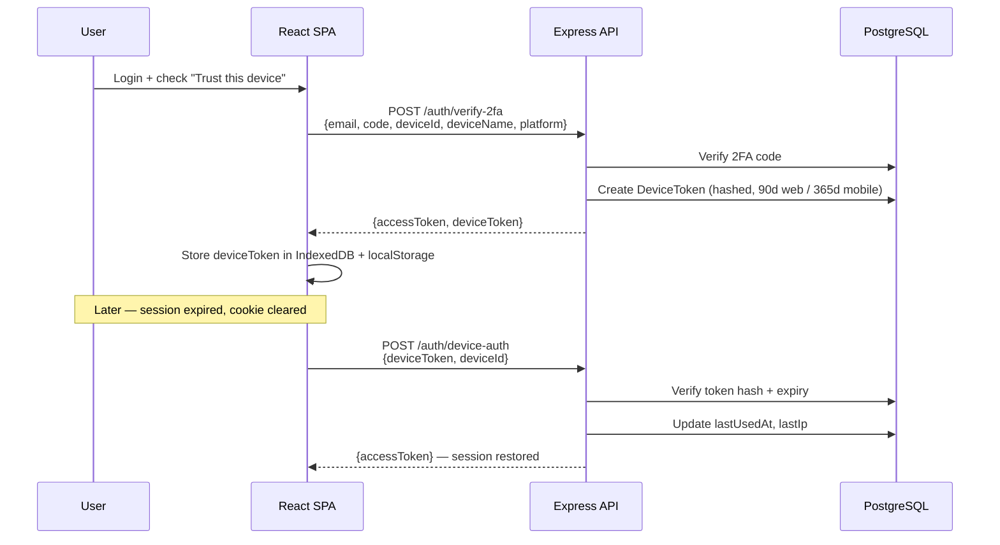
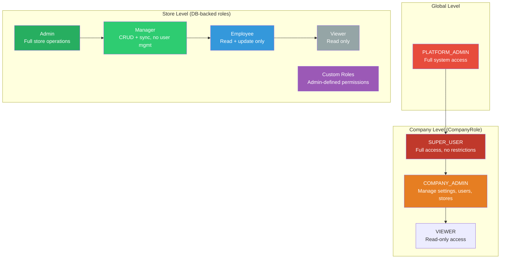
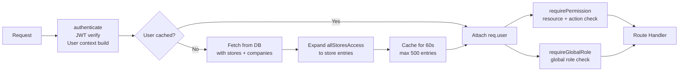

# Chapter 7 — Security, Auth & Access Control

### 7.1 Authentication Flow


```mermaid
sequenceDiagram
    participant User as User
    participant Client as React SPA
    participant Server as Express API
    participant DB as PostgreSQL
    participant Email as Email Service

    User->>Client: Enter email + password
    Client->>Server: POST /auth/login
    Server->>DB: Verify credentials (bcrypt)
    Server->>DB: Check account status (active, locked)
    Server->>DB: Create VerificationCode (6-digit, 5-min expiry)
    Server->>Email: Send 2FA code via email
    Server-->>Client: { email, message: "Code sent" }

    User->>Client: Enter 6-digit code
    Client->>Server: POST /auth/verify-2fa
    Server->>DB: Validate code (unused, not expired)
    Server->>DB: Mark code as used
    Server->>DB: Create RefreshToken
    Server->>Server: Generate JWT access token (15min)
    Server-->>Client: Set-Cookie: refreshToken (httpOnly)<br/>{ accessToken, user }

    Client->>Client: Store accessToken in memory
    Client->>Client: Fetch settings, auto-connect AIMS
```

### 7.2 Token Architecture

```mermaid
graph TB
    subgraph "Access Token (JWT)"
        AT_STORE[Stored in: Memory only]
        AT_LIFE[Lifetime: 15 minutes]
        AT_USE[Used for: API authorization]
        AT_PAYLOAD[Payload: sub, globalRole,<br/>stores[], companies[]]
    end

    subgraph "Refresh Token"
        RT_STORE[Stored in: httpOnly cookie<br/>+ hashed in DB]
        RT_LIFE[Lifetime: 180 days]
        RT_USE[Used for: Access token renewal]
    end

    subgraph "Device Token"
        DT_STORE[Stored in: IndexedDB + localStorage<br/>+ hashed in DB]
        DT_LIFE[Lifetime: 90d web / 365d mobile]
        DT_USE[Used for: Session restore<br/>without 2FA]
        DT_OPT[Opt-in: "Trust this device" checkbox]
    end

    subgraph "Verification Code"
        VC_STORE[Stored in: DB]
        VC_LIFE[Lifetime: 5 minutes]
        VC_USE[Used for: 2FA + Password Reset]
        VC_TYPE[Types: LOGIN_2FA, PASSWORD_RESET]
    end
```

Security properties:
- **Access tokens** never touch persistent storage (memory-only), eliminating XSS token theft.
- **Refresh tokens** use httpOnly cookies (invisible to JavaScript) with hashed storage in the database.
- **Verification codes** are single-use, time-limited, and rate-limited per IP+email combination.

**Token refresh interceptor:** The client axios interceptor auto-refreshes on 401 responses, except for auth-flow endpoints (`/auth/login`, `/auth/verify-2fa`, `/auth/refresh`, `/auth/device-auth`, `/auth/resend-code`, `/auth/forgot-password`, `/auth/reset-password`). All other `/auth/*` endpoints (e.g. `/auth/me`, `/auth/devices`) are treated as regular authenticated endpoints and trigger token refresh normally.

### 7.3 Device-Based Auth Tokens


```mermaid
sequenceDiagram
    participant User as User
    participant Client as React SPA
    participant Server as Express API
    participant DB as PostgreSQL

    User->>Client: Login + check "Trust this device"
    Client->>Server: POST /auth/verify-2fa<br/>{email, code, deviceId, deviceName, platform}
    Server->>DB: Verify 2FA code
    Server->>DB: Create DeviceToken (hashed, 90d web / 365d mobile)
    Server-->>Client: {accessToken, deviceToken}
    Client->>Client: Store deviceToken in IndexedDB + localStorage

    Note over User,Client: Later — session expired, cookie cleared

    Client->>Server: POST /auth/device-auth<br/>{deviceToken, deviceId}
    Server->>DB: Verify token hash + expiry
    Server->>DB: Update lastUsedAt, lastIp
    Server-->>Client: {accessToken} — session restored
```

**Device Token Properties:**
- Stored in `device_tokens` table with bcrypt-hashed token, device metadata, and IP
- Web tokens expire after 90 days; mobile (iOS/Android) after 365 days
- Client stores raw token in IndexedDB (via idb-keyval) with localStorage fallback
- Rate limited: 10 requests per 15 minutes per IP+device combination
- Device name comes from the client: Electron uses `os.hostname()` via IPC; web clients send UA-based names (e.g. "Windows PC — Chrome")
- Server uses client-provided names directly (reverse DNS was removed as it resolved to proxy/container hostnames behind nginx)

**Management UI:**
- "Trust this device" opt-in checkbox on login form (not on 2FA screen)
- Trusted Devices section in Settings → Security & Devices tab
- Device cards show: hostname, platform, OS, IP, connected date, last active, expiry
- Revoking current device triggers immediate logout
- Full RTL support for Hebrew locale

### 7.4 Role-Based Access Control (RBAC)

Store-level roles are now **database-backed** via the `roles` table, replacing the previous hardcoded `StoreRole` enum. This allows platform and company admins to create custom roles with granular permissions.


```mermaid
graph TB
    subgraph "Global Level"
        PA[PLATFORM_ADMIN<br/>Full system access]
    end

    subgraph "Company Level (CompanyRole)"
        SU[SUPER_USER<br/>Full access, no restrictions]
        CA[COMPANY_ADMIN<br/>Manage settings, users, stores]
        CV[VIEWER<br/>Read-only access]
    end

    subgraph "Store Level (DB-backed roles)"
        SA[Admin<br/>Full store operations]
        SM[Manager<br/>CRUD + sync, no user mgmt]
        SE[Employee<br/>Read + update only]
        SV[Viewer<br/>Read only]
        CR[Custom Roles<br/>Admin-defined permissions]
    end

    PA --> SU
    SU --> CA
    CA --> CV
    SA --> SM
    SM --> SE
    SE --> SV

    style PA fill:#e74c3c,color:#fff
    style SU fill:#c0392b,color:#fff
    style CA fill:#e67e22,color:#fff
    style SA fill:#27ae60,color:#fff
    style SM fill:#2ecc71,color:#fff
    style SE fill:#3498db,color:#fff
    style SV fill:#95a5a6,color:#fff
    style CR fill:#9b59b6,color:#fff
```

**Role Scopes:**
- **SYSTEM** roles are built-in defaults (Admin, Manager, Employee, Viewer) — available to all companies, cannot be deleted.
- **COMPANY** roles are custom roles created by company or platform admins — scoped to a specific company.

Each role stores its permissions as a JSONB column:
```json
{
  "spaces": ["view", "create", "edit", "delete"],
  "people": ["view", "create", "edit", "delete", "import", "assign"],
  "conference": ["view", "create", "edit", "delete", "toggle"],
  "settings": ["view", "edit"],
  "users": ["view", "create", "edit", "delete"],
  "audit": ["view"],
  "sync": ["view", "trigger"],
  "labels": ["view", "manage", "link", "unlink"],
  "stores": ["view", "edit", "delete", "manage"],
  "companies": ["view"],
  "aims-management": ["view", "manage"]
}
```

### 7.5 Permission Matrix (Default System Roles)

The `requirePermission(resource, action)` middleware reads permissions from the user's assigned role in the `roles` table, while `requireGlobalRole(...roles)` enforces global-level role checks (e.g., restricting the `/logs` API to `PLATFORM_ADMIN`):

| Resource | Admin | Manager | Employee | Viewer |
|----------|:-----:|:-------:|:--------:|:------:|
| spaces: view | X | X | X | X |
| spaces: create | X | X | | |
| spaces: edit | X | X | X | |
| spaces: delete | X | X | | |
| people: view | X | X | X | X |
| people: create | X | X | | |
| people: edit | X | X | X | |
| people: delete | X | X | | |
| people: import | X | X | | |
| people: assign | X | X | | |
| conference: view | X | X | X | X |
| conference: create | X | X | | |
| conference: edit | X | X | X | |
| conference: delete | X | X | | |
| conference: toggle | X | X | | |
| settings: view | X | X | | |
| settings: edit | X | | | |
| users: CRUD | X | | | |
| audit: view | X | | | |
| sync: view | X | X | X | X |
| sync: trigger | X | X | | |
| labels: view | X | X | X | X |
| labels: manage | X | X | | |
| labels: link/unlink | X | X | | |
| stores: view/manage | X | | | |
| aims-management: view | X | X | | |
| aims-management: manage | X | | | |

**PLATFORM_ADMIN** bypasses all permission checks.

Users with `allStoresAccess` on their `UserCompany` record receive **Admin**-level permissions across all stores in that company.

Custom roles can define any combination of the above permissions, enabling fine-grained access control tailored to organizational needs.

### 7.6 Feature-Level Access Control

Beyond role-based permissions, the `UserStore.features` JSON array controls which frontend pages a user can access:

```json
["dashboard", "spaces", "conference", "people"]
```

The `<ProtectedFeature feature="spaces">` component checks this array and renders a redirect if the user lacks the feature permission.

### 7.7 Auth Middleware Pipeline


```mermaid
graph LR
    REQ[Request] --> AUTH[authenticate<br/>JWT verify<br/>User context build]
    AUTH --> CACHE{User cached?}
    CACHE -->|Yes| ATTACH[Attach req.user]
    CACHE -->|No| DBFETCH[Fetch from DB<br/>with stores + companies]
    DBFETCH --> EXPAND[Expand allStoresAccess<br/>to store entries]
    EXPAND --> SETCACHE[Cache for 60s<br/>max 500 entries]
    SETCACHE --> ATTACH
    ATTACH --> PERM[requirePermission<br/>resource + action check]
    ATTACH --> GLOBAL[requireGlobalRole<br/>global role check]
    PERM --> HANDLER[Route Handler]
    GLOBAL --> HANDLER
```

The auth middleware uses a 60-second in-memory cache (max 500 entries) to reduce database queries. The cache is invalidated when user roles or store assignments change.

SSE endpoints accept the token as a query parameter (`?token=...`) since `EventSource` does not support custom headers.

### 7.8 Rate Limiting Strategy

| Endpoint | Window | Max Requests | Key |
|----------|--------|-------------|-----|
| Global API (`/api/*`) | 60s | 100 | IP |
| Login (`/auth/login`) | 15min | 10 | IP + email |
| 2FA Verify (`/auth/verify-2fa`) | 5min | 5 | IP + email |
| Password Reset | 1hr | 3 | IP + email |
| Device Auth (`/auth/device-auth`) | 15min | 10 | IP + deviceId |

All rate limits are configurable via environment variables.

### 7.9 Security Middleware Stack

| Middleware | Purpose |
|-----------|---------|
| **Helmet** | Sets security headers (CSP, HSTS, X-Frame-Options, etc.) |
| **CORS** | Restricts origins to configured whitelist with credentials |
| **Rate Limiting** | Prevents brute force and DDoS |
| **Request ID** | Unique ID per request for log correlation |
| **bcrypt (12 rounds)** | Password hashing |
| **AES Encryption** | AIMS credentials at rest |
| **httpOnly Cookies** | Refresh token storage (no JS access) |
| **Account Lockout** | `failedLoginAttempts` counter with `lockedUntil` timestamp |
| **Non-root Container** | Server runs as UID 1001 inside Docker |
| **dumb-init** | Proper signal forwarding in containers |

### 7.10 AIMS Credential Security

AIMS API passwords are encrypted at rest using AES encryption:

```
User provides AIMS password (plaintext)
  -> Server encrypts with ENCRYPTION_KEY (AES)
    -> Stored as aimsPasswordEnc in Company record
      -> Decrypted only when making AIMS API calls
```

The `ENCRYPTION_KEY` (32+ characters) is provided via environment variable and never stored in the database.

### 7.11 Audit Logging

All significant operations are recorded in the `audit_logs` table:

| Field | Description |
|-------|------------|
| `action` | Operation type (CREATE, UPDATE, DELETE, etc.) |
| `entityType` | Target entity (space, person, conference, user, etc.) |
| `entityId` | Target entity ID |
| `oldData` | Previous state (JSON) |
| `newData` | New state (JSON) |
| `ipAddress` | Client IP address |
| `userAgent` | Client user agent string |
| `permissionChecked` | Which permission was validated |
| `wasAuthorized` | Whether the operation was authorized |

Audit logs are store-scoped and indexed by `(entityType, entityId)` and `(createdAt)` for efficient querying.
