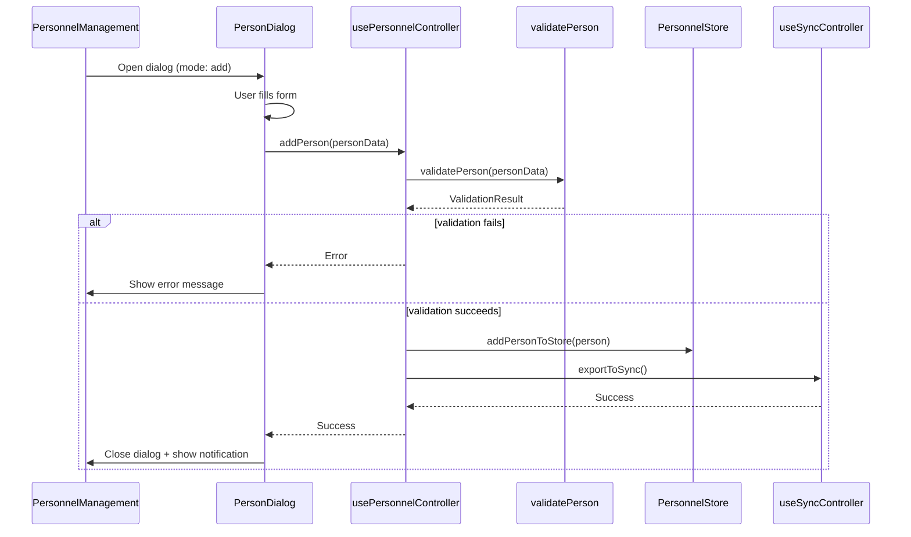
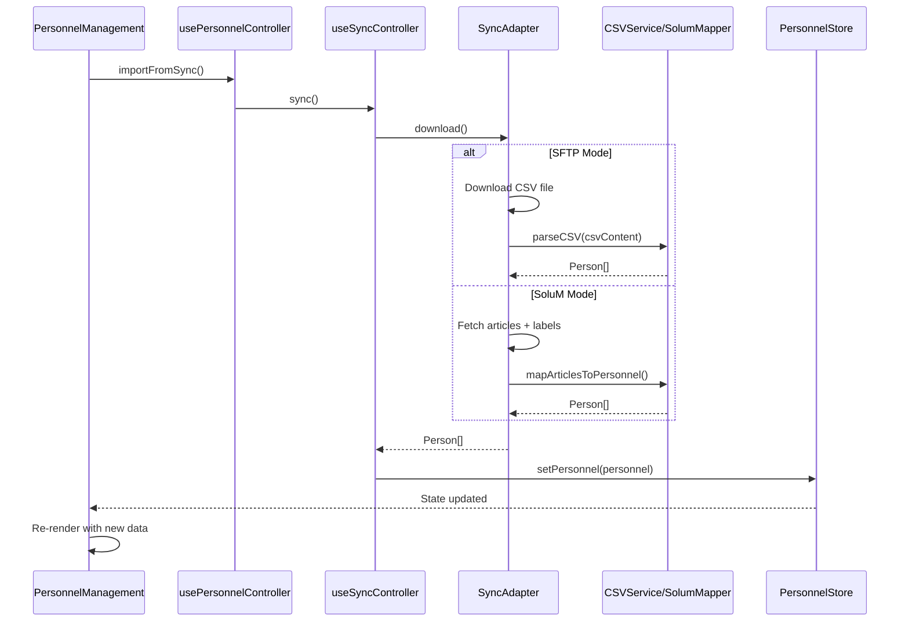
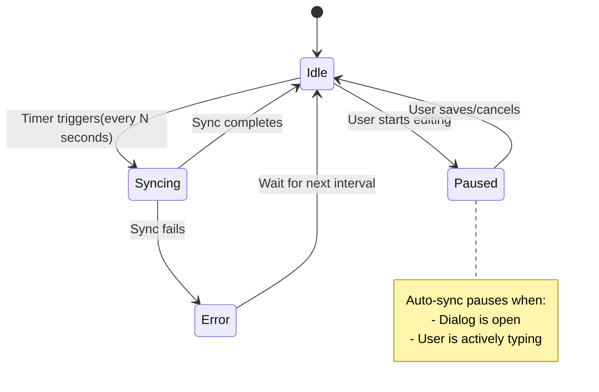
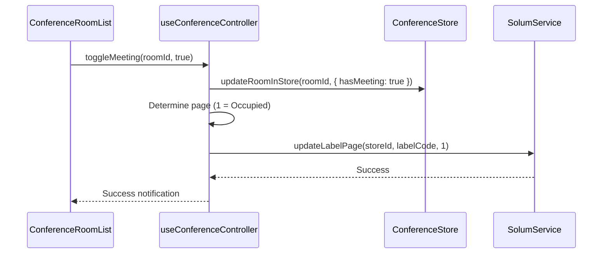
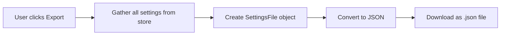
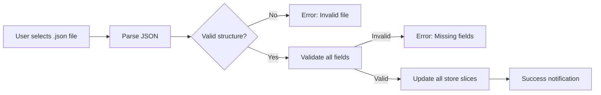
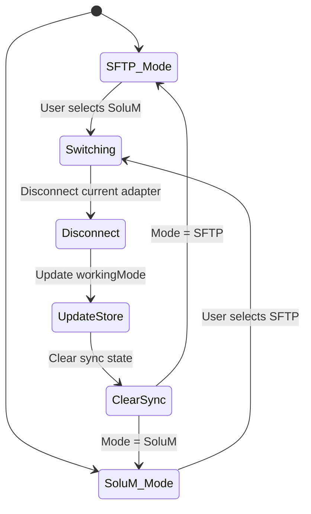
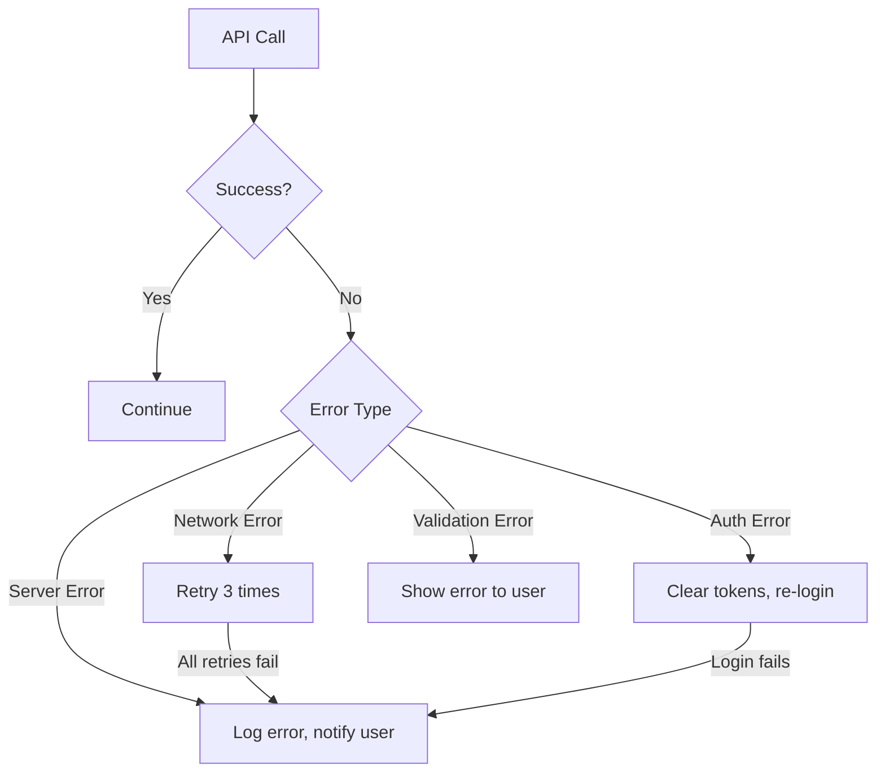
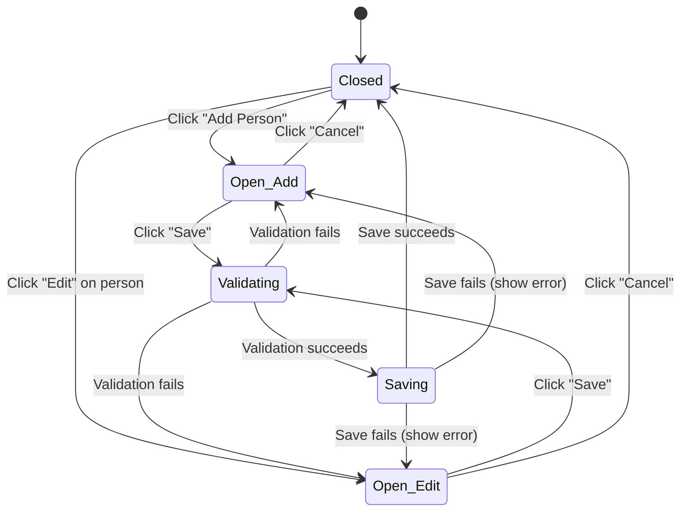

# Workflow Documentation

## Overview

This document describes all major user flows and technical workflows in the DentalMedicalCenter v2 application.

---

## Table of Contents

1. [Personnel Management Workflows](#personnel-management-workflows)
2. [Sync Workflows](#sync-workflows)
3. [Conference Room Workflows](#conference-room-workflows)
4. [Settings Workflows](#settings-workflows)
5. [Data Flow Diagrams](#data-flow-diagrams)

---

## Personnel Management Workflows

### Workflow 1: Add New Person

**User Flow:**
1. User clicks "Add Person" button
2. Dialog opens with empty form
3. User fills in required fields (Room Name + mapped fields)
4. User clicks "Save"
5. System validates data
6. System adds person to store
7. System triggers sync (if auto-save enabled)
8. Success notification displayed
9. Dialog closes

**Component Interaction:**



**Data Flow:**
```
User Input → PersonDialog → usePersonnelController
                              ↓
                         validatePerson
                              ↓
                      mergePersonDefaults (add NFC URL, Store ID)
                              ↓
                         PersonnelStore
                              ↓
                     useSyncController.exportToSync()
                              ↓
                      [SyncAdapter.upload()]
                              ↓
                       External System
```

---

### Workflow 2: Import Personnel from External System

**User Flow:**
1. User clicks "Import" button
2. System connects to external system (based on working mode)
3. System downloads data
4. System parses data to Person[]
5. System updates local store (full replace)
6. Success notification displayed
7. UI refreshes with new data

**Component Interaction:**



---

## Sync Workflows

### Workflow 3: SFTP Sync (Complete Flow)

**Technical Flow:**

```mermaid
flowchart TD
    A[Start Sync] --> B{Connect to SFTP}
    B -->|Success| C[Download CSV File]
    B -->|Failure| X[Error: Connection Failed]
    
    C --> D[Parse CSV with CSVService]
    D -->|Parse Error| Y[Error: Invalid CSV]
    D -->|Success| E[Extract Person[] from parsed data]
    
    E --> F[Update PersonnelStore]
    F --> G[Success Notification]
    
    H[User Saves Data] --> I[Generate CSV from Store]
    I --> J[Upload CSV to SFTP]
    J -->|Success| K[Success Notification]
    J -->|Failure| Z[Error: Upload Failed]
```

**Key Steps:**

1. **Connection**
   - API Call: `POST /sftp/test-connection`
   - Payload: `{ username, password }`
   - Response: `{ success: boolean }`

2. **Download**
   - API Call: `POST /sftp/download`
   - Payload: `{ username, password, filename }`
   - Response: `{ success: boolean, data: string }` (CSV content)

3. **Parsing**
   - Function: `parseCSV(csvContent, csvConfig)`
   - Returns: `AppData { personnel: Person[], store: string }`

4. **Upload**
   - Function: `generateCSV(appData, csvConfig, nfcUrl)`
   - Returns: `string` (CSV content)
   - API Call: `POST /sftp/upload`
   - Payload: `{ username, password, filename, data }`

---

### Workflow 4: SoluM API Sync (Complete Flow)

**Technical Flow:**

```mermaid
flowchart TD
    A[Start Sync] --> B{Token Valid?}
    B -->|No| C[Login to SoluM API]
    B -->|Yes but Expiring| D[Refresh Token]
    B -->|Yes| E[Skip to Fetch]
    
    C --> E
    D --> E
    
    E[Fetch Articles for Store] --> F[Fetch Labels for Store]
    F --> G[Map Articles + Labels to Person[]]
    
    G --> H{Conference Mode Enabled?}
    H -->|Yes| I[Fetch Conference Rooms C##]
    H -->|No| J[Update PersonnelStore Only]
    
    I --> K[Update ConferenceStore]
    K --> J
    J --> L[Success Notification]
    
    M[User Saves Data] --> N[Map Person[] to Articles]
    N --> O[Push Articles to SoluM]
    O --> P{Label Assignments Changed?}
    P -->|Yes| Q[Update Label Assignments]
    P -->|No| R[Skip]
    Q --> S[Success]
    R --> S
```

**Key Steps:**

1. **Authentication**
   - API Call: `POST /solumesl/v2/login`
   - Payload: `{ company, username, password }`
   - Response: `{ access_token, refresh_token, expires_in }`

2. **Token Refresh**
   - Check: If `expiresAt - now < 5 minutes`
   - API Call: `POST /solumesl/v2/login/refresh-token`
   - Payload: `{ refresh_token }`

3. **Fetch Articles**
   - API Call: `POST /solumesl/v2/article/search-articles`
   - Payload: `{ storeCode }`
   - Response: `{ articleList: [ { articleId, articleName, data } ] }`

4. **Fetch Labels**
   - API Call: `POST /solumesl/v2/labels/station-info-total-all`
   - Payload: `{ storeCode }`
   - Response: Label list with assignments

5. **Mapping**
   - Function: `mapArticlesToPersonnel(articles, labels, csvConfig)`
   - Logic: Match article data fields to Person.data using csvConfig.mapping

6. **Push Articles**
   - Function: `mapPersonnelToArticles(personnel, csvConfig)`
   - API Call: `POST /solumesl/v2/article/update-articles`
   - Payload: `{ articles: [ ... ] }`

---

### Workflow 5: Auto-Sync Behavior

**User Experience:**



**Implementation:**
- Hook: `useSyncController`
- Interval: `setInterval(sync, interval * 1000)`
- Pause logic: Check if any dialog is open or form is dirty

---

## Conference Room Workflows

### Workflow 6: Toggle Meeting Status (Simple Conference Mode)

**User Flow:**
1. User toggles "Meeting Active" switch for a room
2. System updates room state (hasMeeting = true/false)
3. System determines page number (0 = Available, 1 = Occupied)
4. System calls SoluM API to update label page
5. Label displays updated status
6. Success notification

**Component Interaction:**



**SoluM API Call:**
```typescript
// API: POST /solumesl/v2/labels/update-label-page
// Payload:
{
  storeCode: "STORE01",
  labelCode: "ESL123456",
  page: 1  // 0 = Available, 1 = Occupied
}
```

---

### Workflow 7: Update Meeting Details (Full Conference Mode)

**User Flow:**
1. User clicks "Edit" on conference room
2. Dialog opens with current meeting details
3. User updates: Meeting name, Time range, Participants
4. User clicks "Save"
5. System validates time range
6. System updates room in store
7. System pushes article update to SoluM (if SoluM mode)
8. Label updates with new details

**Validation:**
- Time format: HH:mm
- End time > Start time
- Meeting name: non-empty if hasMeeting = true

---

## Settings Workflows

### Workflow 8: Export/Import Settings

**Export Flow:**



**Import Flow:**



**SettingsFile Structure:**
```json
{
  "version": "2.0.0",
  "workingMode": "SOLUM_API",
  "appSettings": { ... },
  "solumConfig": { ... },
  "csvConfig": { ... },
  "nfcUrl": "https://...",
  "language": "en",
  "logos": [ "data:image/png;base64,..." ]
}
```

---

### Workflow 9: Switch Working Mode (SFTP ↔ SoluM)

**User Flow:**



**Key Actions:**
1. Disconnect current sync adapter
2. Update `workingMode` in store
3. Clear sync status
4. Re-initialize sync controller with new adapter
5. User must re-configure credentials for new mode
6. User must manually trigger first sync

---

## Data Flow Diagrams

### Workflow 10: Complete Data Flow (SFTP Mode)

```mermaid
flowchart TD
    subgraph External
        SFTP[SFTP Server]
    end
    
    subgraph Frontend
        UI[UI Components]
        Controller[Controllers]
        Store[Zustand Store]
        Adapter[SFTPSyncAdapter]
        CSV[CSVService]
    end
    
    SFTP -->|1. Download CSV| Adapter
    Adapter -->|2. Parse CSV| CSV
    CSV -->|3. Person[]| Store
    Store -->|4. State Update| UI
    
    UI -->|5. User Edits| Controller
    Controller -->|6. Update| Store
    Store -->|7. Generate CSV| CSV
    CSV -->|8. Upload CSV| Adapter
    Adapter -->|9. Upload| SFTP
```

### Complete Data Flow (SoluM Mode)

```mermaid
flowchart TD
    subgraph External
        Solum[SoluM ESL API]
    end
    
    subgraph Frontend
        UI[UI Components]
        Controller[Controllers]
        Store[Zustand Store]
        Adapter[SolumSyncAdapter]
        Mapper[SolumMapper]
    end
    
    Solum -->|1. Fetch Articles + Labels| Adapter
    Adapter -->|2. Map to Person[]| Mapper
    Mapper -->|3. Person[]| Store
    Store -->|4. State Update| UI
    
    UI -->|5. User Edits| Controller
    Controller -->|6. Update| Store
    Store -->|7. Map to Articles| Mapper
    Mapper -->|8. Push Articles| Adapter
    Adapter -->|9. Update| Solum
```

---

## Error Handling Workflows

### Network Error Handling



**Retry Logic:**
- Max retries: 3
- Backoff: Exponential (1s, 2s, 4s)
- Errors that trigger retry: Network timeout, 5xx errors
- Errors that don't retry: 4xx errors (except 401)

---

## State Transitions

### Personnel Dialog State Machine



---

## Summary

This workflow documentation covers:
- **10 major workflows** with step-by-step sequences
- **Mermaid diagrams** showing component interactions
- **State machines** for UI behavior
- **Data flow paths** for both sync modes
- **Error handling** strategies
- **API call specifications** for external integrations

Each workflow provides both user-facing and technical perspectives for implementation.
